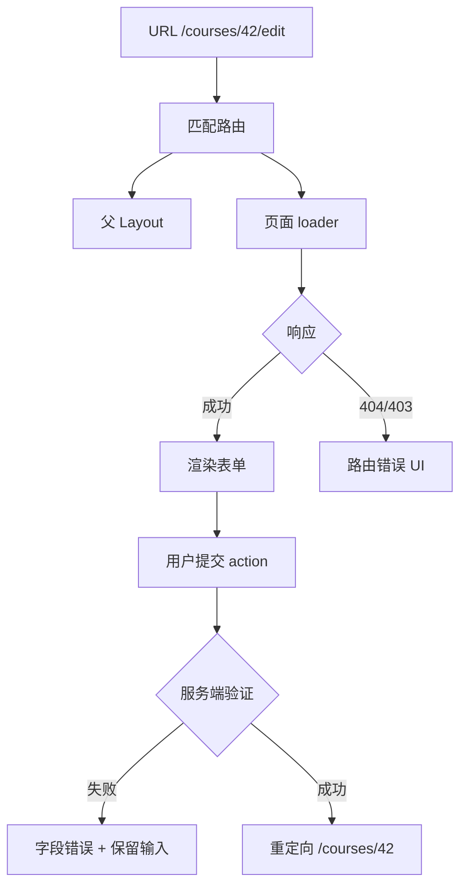

# 路由、Layout、表单、请求、错误边界与懒加载

完整应用不仅渲染组件，还要把 URL 映射为页面树、共享布局、提交用户输入、管理请求状态、隔离渲染错误并按边界加载代码。路由框架通常整合这些能力；具体 API 随框架变化，但数据流和失败状态可以独立理解。

## 1. 页面请求的数据流



## 2. 路由

路由把 URL 的 pathname、search、hash 和 history state 映射为应用状态。动态段 `/courses/:courseId` 提供字符串参数；读取后要校验格式和权限。

```tsx
const routes = [
  {
    path: "/courses",
    element: <CourseLayout />,
    errorElement: <RouteError />,
    children: [
      { index: true, lazy: () => import("./course-list-route") },
      { path: ":courseId", lazy: () => import("./course-detail-route") },
      { path: ":courseId/edit", lazy: () => import("./course-edit-route") },
    ],
  },
];
```

路由表应覆盖索引页、动态参数、404、受保护页面、错误边界和懒加载；数据路由器还会把 loader、action 与对应路由节点绑定。

### 2.1 导航方式

- 普通链接使用 `<a>` 或框架 Link，保留复制、打开新标签和无脚本语义；
- 表单提交后、权限跳转等流程使用命令式导航或 redirect；
- 不要给所有链接绑定 click + pushState；
- 外部链接不能交给仅处理站内 URL 的客户端路由器；
- 返回操作应考虑 history 是否有安全前页，必要时提供确定 fallback。

## 3. Layout 与嵌套路由

Layout 为子页面提供共享导航、面包屑和内容容器，并通过 outlet 渲染匹配子路由：

```tsx
function CourseLayout() {
  return (
    <div className="course-shell">
      <nav aria-label="课程导航">
        <Link to="/courses">全部课程</Link>
        <Link to="/courses/new">新建课程</Link>
      </nav>
      <main id="main-content">
        <Outlet />
      </main>
    </div>
  );
}
```

Layout 不应无条件持有所有页面状态。页面切换时布局可能保留，局部表单 state 可能按路由节点身份保留或重置；需要显式测试。

## 4. URL 参数与 Search Params

路径参数表达资源身份，查询参数表达筛选、分页、排序和可分享视图：

```ts
function parsePage(params: URLSearchParams): number {
  const raw = params.get("page");
  if (raw === null) return 1;
  const page = Number(raw);
  return Number.isSafeInteger(page) && page >= 1 ? page : 1;
}
```

URL 中所有值都是字符串。无效值应有确定策略：返回 400、规范化并 replace、或使用默认值。不要让空字符串、`NaN` 和负分页进入请求。

## 5. 表单

HTML form 本身提供提交、Enter 键、字段命名和渐进增强。框架组件不应丢弃这些能力。

```tsx
interface FieldErrors {
  title?: string;
  duration?: string;
}

function CourseForm({ result }: { result?: { errors: FieldErrors; values: Record<string, string> } }) {
  return (
    <Form method="post" noValidate>
      <div>
        <label htmlFor="title">标题</label>
        <input id="title" name="title" defaultValue={result?.values.title} aria-invalid={!!result?.errors.title} aria-describedby={result?.errors.title ? "title-error" : undefined} />
        {result?.errors.title && <p id="title-error" role="alert">{result.errors.title}</p>}
      </div>
      <button type="submit">保存</button>
    </Form>
  );
}
```

客户端验证改善反馈，服务端 action 必须重新验证、授权并执行数据库约束。失败时保留非敏感输入、定位字段、聚焦错误摘要；密码和 secret 不回填。

### 5.1 受控与非受控

- 受控字段由 state 驱动，适合即时联动和复杂条件；
- 非受控字段由 DOM 保存，提交时读 FormData，适合简单表单；
- file input 不能像普通文本那样设置任意 value；
- 同一字段不要在生命周期中从受控切到非受控。

## 6. 请求状态

请求至少区分 idle、submitting/loading、success、empty、validation error、transport error、unauthorized 和 not found。初次加载与后台刷新可以并存，不能用单个 `isLoading` 覆盖全部语义。

```ts
type MutationState<T> =
  | { status: "idle" }
  | { status: "submitting"; submitted: T }
  | { status: "invalid"; submitted: T; errors: Record<string, string> }
  | { status: "failed"; submitted: T; message: string }
  | { status: "succeeded"; value: T };
```

重复提交可禁用按钮、使用幂等键或由服务端保证幂等。禁用期间仍展示状态；不能只靠前端按钮阻止重复写入。

## 7. 错误边界

React Error Boundary 捕获子树渲染、生命周期和构造期间的错误并显示 fallback。它通常不捕获事件处理器、任意异步回调、服务端渲染错误或边界自身错误。路由器的 errorElement 还可处理 loader/action 抛出的响应。

边界粒度：

- 根边界保证应用不白屏；
- 路由边界保留导航和其他页面；
- 高风险独立区域可局部隔离；
- 不能给每个小组件套边界，失去上下文且增加复杂度。

错误 UI 提供重试、返回安全页面和错误编号。日志包含 route、release、浏览器、用户操作阶段和 stack，但不得收集 token、密码与完整表单。

## 8. 懒加载与 Suspense

```tsx
const SettingsPage = lazy(() => import("./SettingsPage"));

function SettingsRoute() {
  return (
    <Suspense fallback={<PageSkeleton />}>
      <SettingsPage />
    </Suspense>
  );
}
```

动态 import 创建代码分割点，首次进入需要网络请求和执行。懒加载适合路由、大型编辑器、图表等低频区域；首屏核心组件过度拆分会产生请求瀑布。

Suspense fallback 不等同通用请求错误处理。动态 chunk 下载失败仍需 Error Boundary；数据请求是否能 suspend 取决于框架集成。预加载可在 hover、viewport 或预测导航时进行，但要控制流量和移动网络成本。

## 9. 完整案例：编辑课程

loader：

```ts
export async function loader({ params }: LoaderArgs) {
  const id = params.courseId;
  if (!id) throw new Response("缺少课程 ID", { status: 400 });
  const response = await fetch(`/api/courses/${encodeURIComponent(id)}`);
  if (response.status === 404) throw new Response("课程不存在", { status: 404 });
  if (!response.ok) throw new Response("课程加载失败", { status: response.status });
  const body: unknown = await response.json();
  const parsed = parseCourse(body);
  if (!parsed.success) throw new Response("响应结构无效", { status: 502 });
  return parsed.data;
}
```

action：

```ts
export async function action({ request, params }: ActionArgs) {
  const form = await request.formData();
  const values = {
    title: String(form.get("title") ?? ""),
    duration: String(form.get("duration") ?? ""),
  };
  const parsed = parseCourseForm(values);
  if (!parsed.success) return { errors: parsed.errors, values };

  const response = await fetch(`/api/courses/${encodeURIComponent(params.courseId ?? "")}`, {
    method: "PUT",
    headers: { "content-type": "application/json" },
    body: JSON.stringify(parsed.data),
  });
  if (response.status === 409) return { errors: { title: "标题已存在" }, values };
  if (!response.ok) throw new Response("保存失败", { status: response.status });
  return redirect(`/courses/${encodeURIComponent(params.courseId ?? "")}`);
}
```

验证路径：直接访问 URL 能加载；404 显示路由错误；无效表单保留值并显示字段错误；成功后 URL 重定向；快速双击不会创建双写；chunk 离线时显示可重试错误。

失败分支：只在客户端验证会被直接 API 请求绕过；把 409 当网络异常会丢失字段语义；loader 返回未经验证 JSON 会让渲染崩溃；错误边界若没有安全重置 key，重试可能仍停留在错误状态。

## 10. 无障碍与导航

- 页面导航后更新 document title；
- 主标题与 URL 内容一致；
- 客户端导航后把焦点移到主内容或标题，避免屏幕阅读器停在旧链接；
- loading 使用适当 status，不反复播报所有内容；
- 错误摘要链接到字段；
- 骨架屏不能永久隐藏可访问名称；
- modal route 仍需正确对话框焦点管理和返回导航。

## 11. 测试矩阵

| 场景 | 断言 |
|---|---|
| 直接进入嵌套路由 | layout、页面和 title 正确 |
| 参数无效 | 400 或规范化策略一致 |
| 资源不存在 | 404 页面且导航保留 |
| loader 网络失败 | 路由错误边界可重试 |
| 表单字段错误 | 值保留、错误关联、焦点正确 |
| 重复提交 | 仅一次有效写入 |
| chunk 失败 | fallback 结束并显示错误 |
| 浏览器后退 | URL 与页面状态恢复 |

## 12. 练习

实现 `/projects/:projectId/tasks/:taskId/edit`。验收：

1. 两层 layout 和面包屑；
2. 参数、请求 JSON 和表单均运行时校验；
3. 覆盖 400/401/403/404/409/500；
4. 表单支持键盘、错误摘要和取消返回；
5. 路由级懒加载，有 chunk 失败恢复；
6. 提交具备服务端幂等或并发版本检查；
7. 直接访问、刷新、前进后退均正确；
8. E2E 覆盖成功和至少四个失败分支。

## 来源

- [React Router：Routing](https://reactrouter.com/start/framework/routing)（访问日期：2026-07-17）
- [React：lazy](https://react.dev/reference/react/lazy)（访问日期：2026-07-17）
- [React：Suspense](https://react.dev/reference/react/Suspense)（访问日期：2026-07-17）
- [React：Catching Rendering Errors with an Error Boundary](https://react.dev/reference/react/Component#catching-rendering-errors-with-an-error-boundary)（访问日期：2026-07-17）
- [MDN：FormData](https://developer.mozilla.org/docs/Web/API/FormData)（访问日期：2026-07-17）
