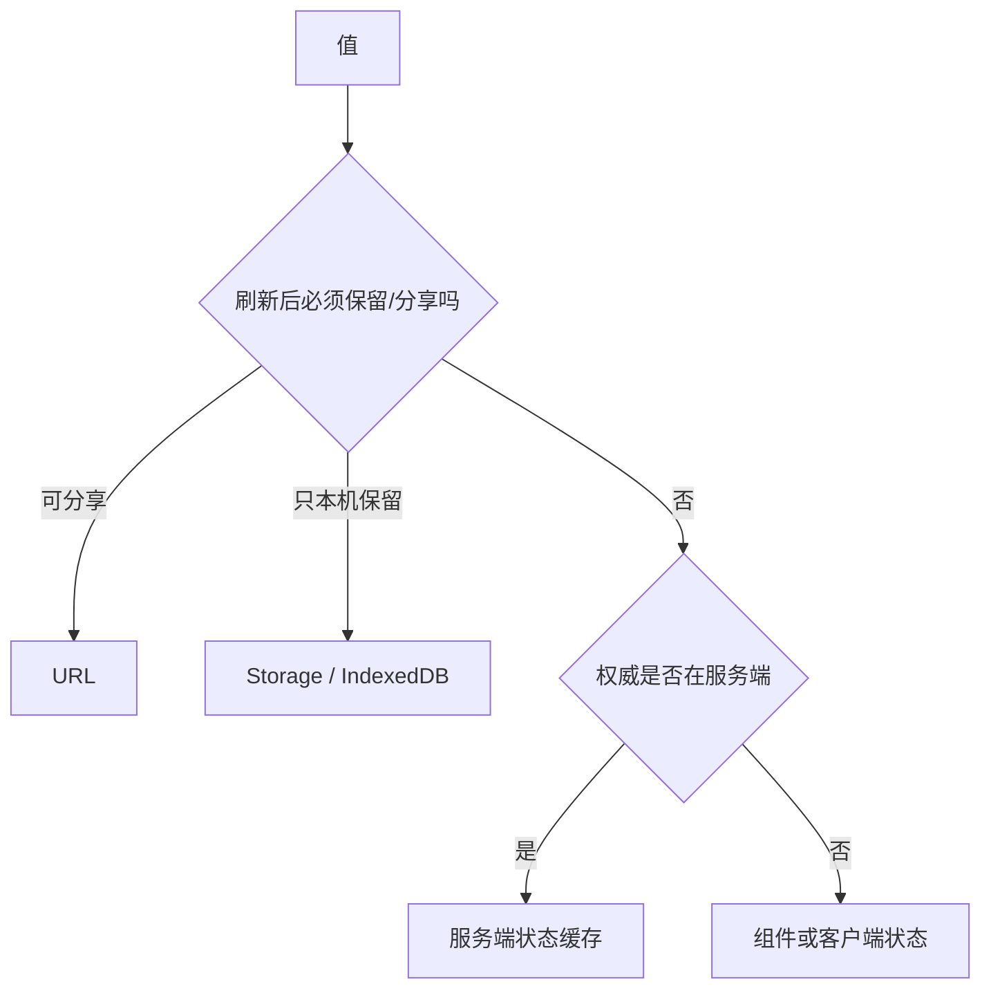

# 客户端、服务端、URL 与持久化状态

状态分类的意义是确定权威来源、生命周期、同步方式和失败策略。把所有值放进同一个全局 store 会混淆缓存、界面草稿、路由和持久化数据，产生重复来源与竞态。

## 1. 四类状态

| 类别 | 权威来源 | 生命周期 | 示例 |
|---|---|---|---|
| 客户端 UI 状态 | 当前应用实例 | 组件或会话 | 对话框、选中项、未提交草稿 |
| 服务端状态 | API/数据库 | 跨设备、可被他人修改 | 用户、订单、库存、权限 |
| URL 状态 | 地址栏/history | 可分享、刷新保留 | 搜索、分页、排序、当前资源 |
| 持久化客户端状态 | Storage/IndexedDB | 浏览器会话或长期 | 主题、离线草稿、最近选择 |



分类不是互斥存储位置。服务端状态可在客户端缓存，但数据库仍是权威；URL 页面参数也可被 router 读入组件。

## 2. 客户端 UI 状态

局部 state 放在需要它的最近共同祖先：

```tsx
function TaskPage() {
  const [selectedId, setSelectedId] = useState<string | null>(null);
  const [deleteTarget, setDeleteTarget] = useState<string | null>(null);
  // tasks 是服务端状态；这里只保存身份，不复制完整对象
}
```

适合局部状态的特征：不需分享、不需刷新恢复、只影响一小棵组件树。提升过高会扩大重渲染和耦合；提升不足则多个兄弟各自持有冲突副本。

Context 适合向深层传递相对稳定的主题、当前账户接口或依赖，不等于通用状态管理器。高频变化的大对象 context 可能让大量消费者更新。

## 3. 服务端状态

服务端状态具有异步、缓存、陈旧、重试、失效、并发和权限特征。请求缓存库通常管理：

- query key 与参数身份；
- loading/error/success 和后台刷新；
- stale time、cache time 与失效；
- 请求去重、取消和重试；
- mutation 后缓存更新；
- SSR dehydration/hydration。

```ts
const courseQuery = queryOptions({
  queryKey: ["course", courseId],
  queryFn: ({ signal }) => fetchCourse(courseId, signal),
  staleTime: 30_000,
});
```

query key 必须包含影响响应的全部参数。遗漏 accountId、locale 或 filters 会串缓存。缓存新鲜度是产品决策，不是固定秒数。

### 3.1 Optimistic Update

乐观更新先改 UI，再提交服务端；失败时回滚或重新获取。适合可逆、冲突低、反馈要求高的动作。付款、权限变更、库存扣减等不能用视觉成功代替服务端确认。

流程：取消相关查询 → 保存旧缓存 → 应用临时值 → 请求 → 失败回滚 → 完成后失效重取。并发 mutation 还需版本号或服务端冲突策略。

## 4. URL 状态

搜索和分页应能复制链接复现：

```ts
interface SearchState {
  query: string;
  page: number;
  sort: "relevance" | "newest";
}

function readSearch(url: URL): SearchState {
  const rawPage = Number(url.searchParams.get("page") ?? "1");
  const rawSort = url.searchParams.get("sort");
  return {
    query: url.searchParams.get("q") ?? "",
    page: Number.isSafeInteger(rawPage) && rawPage > 0 ? rawPage : 1,
    sort: rawSort === "newest" ? "newest" : "relevance",
  };
}
```

更新策略：

- 离散导航如翻页使用 push，保留后退历史；
- 每次键入搜索可 debounce 后 replace，避免历史堆积；
- 默认值可从 URL 省略，但序列化与解析必须一致；
- 参数排序和编码要稳定；
- 敏感信息、token、个人数据不要放 URL，URL 会进入历史、日志和 Referer。

## 5. 持久化客户端状态

### 5.1 localStorage 与 sessionStorage

Storage 只存字符串、同步阻塞主线程、按 origin 隔离。localStorage 跨会话，sessionStorage 通常随标签页会话。

```ts
const ThemeSchema = ["light", "dark", "system"] as const;
type Theme = typeof ThemeSchema[number];

function loadTheme(): Theme {
  try {
    const value = localStorage.getItem("theme");
    return ThemeSchema.includes(value as Theme) ? value as Theme : "system";
  } catch {
    return "system";
  }
}
```

隐私模式、配额、安全策略和禁用存储都可能抛错。Storage 不能保存 secret；XSS 可读取同源 JavaScript 能访问的值。

### 5.2 IndexedDB

IndexedDB 是异步事务型对象数据库，适合离线文档、较大结构化数据和索引查询。它不是服务端备份；用户清理站点数据或配额回收会丢失。数据格式需要版本迁移和损坏恢复。

### 5.3 Cookie

Cookie 随匹配请求发送，适合服务端会话标识。敏感会话 cookie 使用 `HttpOnly`、`Secure`、合适 SameSite 和窄 Domain/Path；客户端偏好不应无意义增加每次请求字节。

## 6. 重复来源的典型错误

```tsx
const [page, setPage] = useState(1);
const [searchParams, setSearchParams] = useSearchParams();
```

若 page 同时存在 state 和 URL，谁先更新会产生竞态。应让 URL 成为唯一来源：

```tsx
const page = parsePage(searchParams);
function goToPage(next: number) {
  setSearchParams((current) => {
    const copy = new URLSearchParams(current);
    copy.set("page", String(next));
    return copy;
  });
}
```

同理，不要把 query cache 的用户对象复制到全局 store；客户端只存当前 userId 或缓存选择器。

## 7. 生命周期与清理矩阵

| 状态 | 创建 | 更新 | 清理/失效 |
|---|---|---|---|
| 组件 state | mount/首次渲染 | 事件、reducer | unmount 或 key 重置 |
| URL | 导航 | push/replace | 新 URL/history |
| query cache | fetch/SSR 注水 | refetch/mutation | stale、GC、显式失效 |
| localStorage | 首次写入 | 同步 setItem | remove/用户清站点 |
| IndexedDB | migration | transaction | delete DB/版本迁移 |

## 8. SSR 与水合边界

服务端不能读取浏览器 localStorage。若首次服务端渲染使用 light、客户端同步读取 dark，会产生 UI 闪烁或 hydration 不匹配。解决方式取决于数据：主题可用 cookie 让服务端读取；纯客户端偏好可在水合后应用并控制闪烁；不要在渲染中无条件访问 window。

服务端 query cache 注水到 HTML 时不能包含其他用户数据或 secret。每个请求隔离 cache，避免跨请求共享。

## 9. 完整案例：可分享任务列表

需求：URL 保存 query/page/status；API 是任务权威；当前选中行只在组件；列宽存 localStorage。

```ts
type TaskFilters = {
  query: string;
  page: number;
  status: "all" | "open" | "done";
};

function taskKey(accountId: string, filters: TaskFilters) {
  return ["tasks", accountId, filters] as const;
}
```

处理过程：

1. 路由 loader 解析并规范化 URL；
2. query key 包含 accountId 和全部 filters；
3. 列表从 query cache 读取，显示初次加载与后台刷新差异；
4. selectedId 是局部 state，翻页后若记录不存在则清空；
5. 完成任务执行乐观更新，失败回滚并播报；
6. 列宽写 localStorage，读取失败回默认；
7. 复制 URL 能在另一浏览器复现筛选，不包含 selectedId 或列宽。

验证：刷新后 URL 筛选保留；后退恢复上一页；账户切换不串缓存；离线 mutation 回滚；存储损坏不白屏；SSR HTML 不泄露其他用户数据。

失败分支：query key 只写 `["tasks"]` 会把不同账户和筛选混用；把 selectedTask 整个对象存 state 会在缓存刷新后显示旧字段；把 token 存 localStorage 扩大 XSS 后果。

## 10. 状态管理器选择

引入全局 store 前先回答：

- 多个远离组件是否共享可变客户端状态？
- reducer + context 是否足够？
- 问题其实是否是服务端缓存或 URL？
- 是否需要时间旅行、持久化、中间件或细粒度订阅？
- SSR 隔离和 hydration 如何实现？

状态库不能替代领域模型。action、selector、normalization 和错误状态仍需设计。

## 11. 常见错误与调试

1. 所有数据进全局 store，权威来源不明。
2. 服务端状态没有 stale、retry 和并发策略。
3. URL 与组件 state 双向 Effect 同步，产生循环。
4. localStorage JSON 不验证版本，升级后崩溃。
5. 乐观成功后不处理服务端冲突。
6. SSR 共享单例 cache，造成跨请求泄露。
7. 将敏感值写 URL 或可被 JS 读取的长期存储。

调试时逐个值标注 owner、source of truth、serializer、invalidator 和 cleanup；查看 Network、History、Application Storage 和 query DevTools；模拟刷新、后退、多标签、离线、401、409、存储损坏。

## 12. 练习

实现可分享的数据表：URL 保存筛选排序分页，服务端缓存数据，局部保存选择，IndexedDB 保存离线草稿。验收：

1. 每个值只有一个权威来源；
2. URL 解析与序列化往返一致；
3. 账户和筛选不会串 cache；
4. mutation 有 409 冲突处理；
5. IndexedDB schema 有版本迁移和失败回退；
6. SSR 无 hydration 警告和跨用户数据；
7. 多标签修改偏好有明确同步策略；
8. E2E 覆盖刷新、后退、离线和损坏数据。

## 来源

- [React：Choosing the State Structure](https://react.dev/learn/choosing-the-state-structure)（访问日期：2026-07-17）
- [MDN：URLSearchParams](https://developer.mozilla.org/docs/Web/API/URLSearchParams)（访问日期：2026-07-17）
- [MDN：Web Storage API](https://developer.mozilla.org/docs/Web/API/Web_Storage_API)（访问日期：2026-07-17）
- [MDN：IndexedDB API](https://developer.mozilla.org/docs/Web/API/IndexedDB_API)（访问日期：2026-07-17）
- [TanStack Query：Important Defaults](https://tanstack.com/query/latest/docs/framework/react/guides/important-defaults)（访问日期：2026-07-17）
