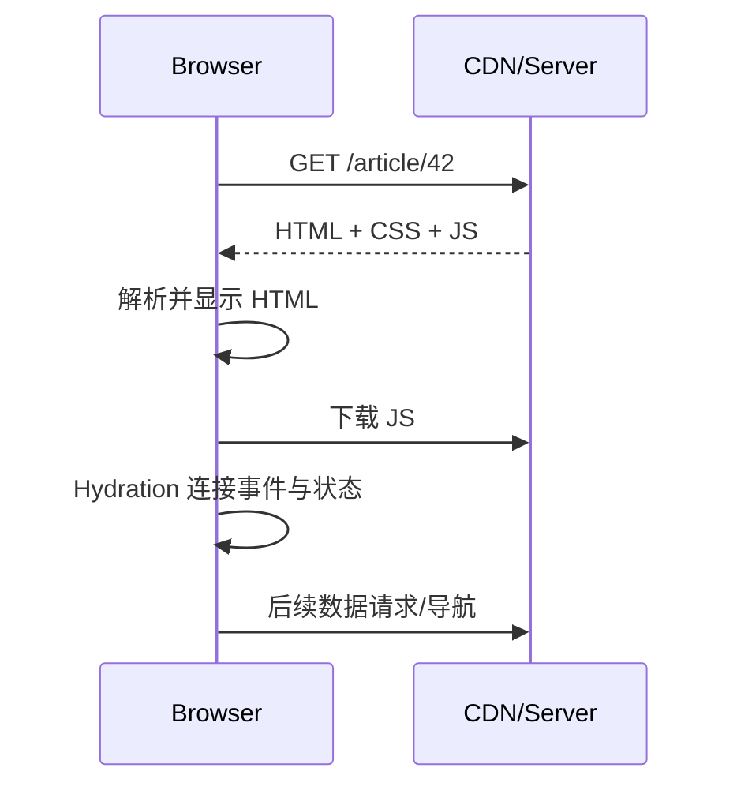
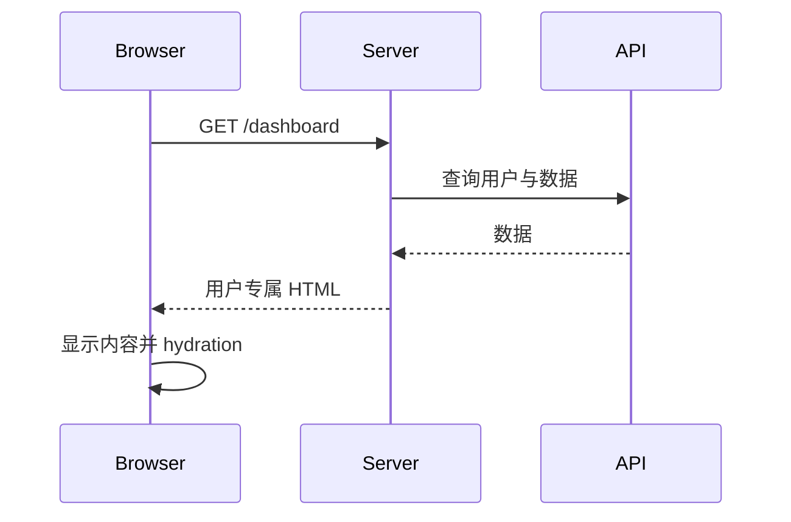
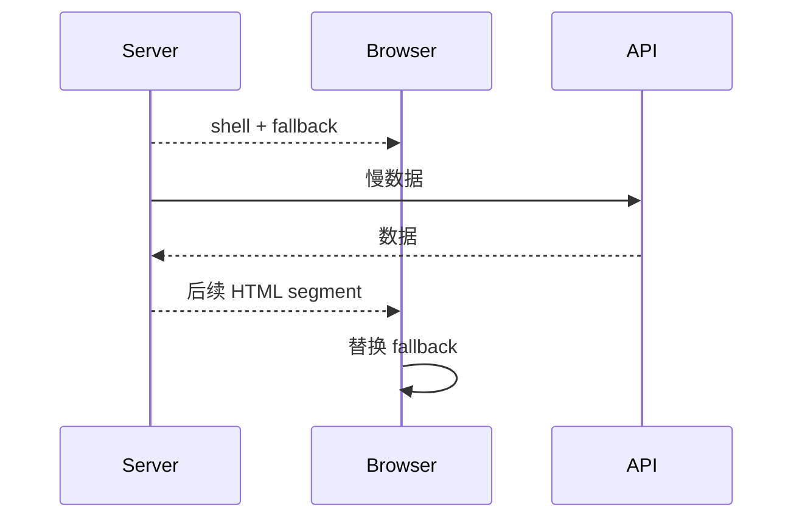

# CSR、SSR、SSG 与 Hydration

渲染策略决定 HTML 在哪里、何时生成，以及请求时需要哪些计算。CSR 在浏览器生成主要界面，SSR 为每次请求在服务端生成 HTML，SSG 在构建或增量阶段预生成 HTML；hydration 把服务端 HTML 与客户端组件逻辑连接成可交互应用。

## 1. 四个概念



SSR/SSG 描述初始 HTML 来源，CSR 描述浏览器渲染，hydration 描述连接。一个应用可以初始 SSG，导航后 CSR；也可以 SSR 外壳并流式输出动态区域。

## 2. CSR

服务器通常返回最小 HTML 和 JavaScript，浏览器执行后请求数据并建立 UI。

优点：静态托管简单；后续交互和导航灵活；服务端不执行每页组件渲染。成本：初始内容依赖 JS、数据请求可能形成瀑布、低性能设备承担解析执行、SEO 与分享元数据需额外处理。

适合强登录后台、离线工具和初始 SEO 不关键的交互应用，但仍应提供快速 shell、错误 UI 和无障碍状态。

## 3. SSR

每个请求读取 URL、会话和数据，在服务端渲染 HTML：



优点：更早提供可读 HTML；服务端可直接访问受保护数据；路由状态与 HTTP status 易一致。成本：服务器 CPU/内存、首字节受数据依赖影响、缓存需按用户隔离、hydration 仍需 JS。

SSR 不保证更快。若服务端串行请求、节点远、HTML 巨大或客户端 JS 不减，TTFB 和交互时间可能更差。

## 4. SSG

构建期为已知路径生成 HTML，可直接从 CDN 返回。

适合文档、营销页、稳定博客。优点是低 TTFB、缓存简单、服务端运行成本低；成本是构建时间、内容新鲜度和大量动态路径。

增量静态再生成可按时间或事件更新部分页面。其语义由框架和部署平台定义，必须明确：触发条件、并发请求、旧页面继续服务还是阻塞、失败回退、全球缓存传播延迟。

## 5. Streaming SSR 与 Suspense

流式 SSR 可先发送外壳，再发送慢区域：



React 19.2 对相近的 Suspense 边界 reveal 做短暂批处理，使服务端和客户端行为更一致，并避免连续闪动。框架启发式和 API 会演进；应用仍要合理设置边界，避免每行一个 boundary。

### 5.1 一次流式请求的责任边界

以课程详情为例：服务器先校验 URL、会话和课程可见性，再并行读取课程主体与相关推荐。课程主体是页面语义核心，必须在确定 200/404 后再提交响应头；相关推荐放入独立边界，失败时不改变课程主体的 HTTP 状态。

```tsx
async function CoursePage({ id }: { id: string }) {
  const course = await getCourse(id);
  if (!course) notFound();
  return (
    <main>
      <CourseHeader course={course} />
      <Suspense fallback={<RecommendationSkeleton />}>
        <Recommendations courseId={id} />
      </Suspense>
    </main>
  );
}
```

边界过高会让一项慢数据阻塞整页；边界过低会产生大量小 chunk、fallback 闪动和复杂错误恢复。边界应对应可独立理解、独立失败和有稳定占位尺寸的页面区域。

## 6. Hydration 的机制

服务端输出 HTML，客户端以相同组件树和初始输入计算结果，框架复用现有节点并连接事件。首次客户端渲染必须与服务端一致。

典型不一致：

- 渲染中使用 `Date.now()`、`Math.random()`；
- 服务端和客户端 locale/timezone 不同；
- 直接读取 window、localStorage 或 viewport；
- 数据在 HTML 和 hydration 之间变化；
- 无效 HTML 导致浏览器修正 DOM；
- 条件渲染依赖仅客户端可知的权限或媒体查询。

修正：传递确定初始值；合法 HTML；用户时区在 hydration 后增强或服务端明确传入；浏览器专属逻辑放 Effect；必要时只让特定组件客户端渲染。忽略 hydration warning 不是修复。

### 6.1 完整不匹配案例

错误代码在服务端使用 UTC，在客户端使用本地时区：

```tsx
function PublishedAt({ timestamp }: { timestamp: string }) {
  return <time>{new Date(timestamp).toLocaleString()}</time>;
}
```

同一个 ISO 时间可能生成两段不同文字。修正方案之一是由服务器传入确定的初始格式和 ISO datetime，客户端水合后再按用户偏好增强：

```tsx
function PublishedAt({ timestamp, initialText }: { timestamp: string; initialText: string }) {
  const [text, setText] = useState(initialText);
  useEffect(() => setText(new Date(timestamp).toLocaleString()), [timestamp]);
  return <time dateTime={timestamp}>{text}</time>;
}
```

这会在水合后变更文字，可能产生视觉变化。若时区是关键业务语义，应让用户设置进入服务端请求，而不是靠客户端事后修正。测试至少固定 `TZ=UTC` 服务端、`Asia/Shanghai` 浏览器，确认没有 hydration warning、`dateTime` 正确且变化符合产品要求。

### 6.2 水合成本

服务端 HTML 可见后，客户端还要下载、解析、编译/执行 JavaScript，恢复组件树、绑定事件并处理排队交互。HTML 很快但 1MB JS 长任务仍会造成页面“看得见却点不动”。观察：总 JS、主线程长任务、hydration duration、INP 和首次输入是否被延迟。

减少成本的方法包括缩小客户端组件边界、移除不必要依赖、路由分块、服务端组件/岛屿和延迟低优先级功能。不能只压缩传输大小；gzip 小的复杂代码仍需解析执行。

## 7. Partial、Selective 与 Islands

- Selective hydration：框架可按可见性或交互优先水合部分树；
- Partial prerender：静态外壳预生成，动态部分请求时恢复；
- Islands：大部分页面是静态 HTML，独立交互岛加载客户端代码；
- Server Components：部分组件只在服务端执行，并把可序列化结果传到客户端边界。

这些名词来自不同框架实现，不能互换。边界影响 bundle、序列化、数据访问、缓存和组件可用 API。

React Server Components 相关包曾有高危漏洞，部署必须跟随框架安全公告更新受影响运行时；使用“纯 React 版本号”不能覆盖所有集成框架依赖。

## 8. 缓存层

渲染缓存可能包括：

1. 浏览器 HTTP cache；
2. CDN 页面/资源 cache；
3. 服务端 full-route cache；
4. 数据请求 cache；
5. 进程内 memoization；
6. 客户端 query cache。

每层明确 key、scope、TTL、invalidator 和私人数据策略。带 Cookie 的用户页面不能误入公共 CDN cache。`Vary`、Cache-Control 和框架默认值需要在实际响应头验证。

### 8.1 个性化与缓存键

假设课程页主体公开，但“学习进度”私有。整页按 Cookie 做 CDN key 会降低命中且容易配置错误；整页公共缓存又会泄露进度。可拆成公开 SSG/SSR 主体与登录后客户端/私有服务端边界。若使用 edge hole-punch 或 partial prerender，必须确认动态片段不会写入公共 HTML cache。

缓存表应写明：

| 对象 | key | scope | TTL | 失效 | 失败回退 |
|---|---|---|---|---|---|
| 课程 HTML | courseId + locale | public | 10 min | 发布事件 | 服务旧版本 |
| 课程数据 | courseId + version | server | 1 min | 内容更新 | 回源数据库 |
| 用户进度 | userId + courseId | private | 0/短 | 学习事件 | 显示未加载，不回退他人数据 |
| 静态 chunk | content hash | public immutable | 1 year | 新 hash | 保留旧资源 |

个性化 cache key 若遗漏 tenantId、locale、权限或实验分组，会产生正确性甚至数据泄露。

## 9. SEO、HTTP 语义与分享

搜索引擎和社交抓取需要可获取 HTML、准确 title/description、canonical、结构化数据和正确 status。SSR 返回“未找到”文字但 HTTP 200 会形成 soft 404；客户端加载后才改 metadata 的分享卡片可能抓不到。

SSG/SSR 可以让元数据随 HTML 返回，但内容质量、链接结构、robots 和重复 URL 仍需设计。动态 query 页面决定 canonical；登录私有页面使用 noindex；结构化数据必须与页面可见内容一致。

验证：使用 curl/禁用 JS读取 HTML 和响应头；测试 200、301、404、500；用社交抓取调试器检查 Open Graph；不要只在浏览器 Elements 看客户端修改后的 head。

## 10. 成本模型

总成本由 CDN 请求、服务端渲染 CPU/内存、数据请求、构建时间、客户端流量和执行组成。

- CSR 将更多计算移到用户设备，服务器简单，但 API 与 JS 仍有成本；
- SSR 每请求消耗计算，缓存命中可显著降低；
- SSG 把计算移到构建，页面量和更新频率决定是否可行；
- Streaming 可改善早期显示，却保持连接和服务端工作更久；
- 多区域 SSR 降低网络延迟，但数据源距离和一致性可能成为瓶颈。

用真实流量估算：`每请求 SSR CPU × 未缓存请求数`、构建页面数 × 平均生成时间、HTML/JS egress、冷启动和缓存命中。不能只比较框架 benchmark。

## 11. 选择矩阵

| 页面 | 推荐起点 | 原因 |
|---|---|---|
| 公共稳定文档 | SSG | 内容可构建、CDN 高命中 |
| 公共商品详情且频繁变化 | SSR/增量静态 | SEO + 新鲜度权衡 |
| 登录后台 | SSR 或 CSR | 权限、部署和交互需求决定 |
| 编辑器 | 初始 SSR/SSG shell + CSR | 强交互，客户端状态多 |
| 个性化首页 | SSR + 私有缓存 | 首屏和身份数据 |
| 实时大盘 | SSR shell + 客户端订阅 | HTML 提供结构，实时值由连接更新 |

不要给整个站点只选一个策略。路由甚至页面区域可以按约束组合。

## 12. 完整案例：课程平台

需求：营销首页、公共课程页、用户学习页、在线编辑器。

- 首页：SSG，每次发布内容触发重建；
- 课程详情：增量静态，课程更新主动失效，未命中时服务端生成；
- 学习页：SSR，按会话读取进度，响应 `private, no-store` 或正确私有缓存；
- 编辑器：SSR 外壳，编辑器 bundle 懒加载，文档和协作在客户端；
- 搜索：URL 驱动，服务端初始结果，后续导航客户端加载。

验证指标：TTFB、FCP、LCP、INP、JS transfer/execute、hydration 时间、cache hit ratio、服务器渲染错误率和成本。分别在冷缓存、热缓存、移动网络和低端 CPU 测试。

### 12.1 构建与请求路径

构建阶段读取已发布首页/课程版本，生成公开页面和路由 manifest；不读取用户进度。请求学习页时，服务端从签名 cookie 得到 userId，授权后并行取课程和进度，响应带 `Cache-Control: private, no-store`，HTML 中只序列化该请求所需最小数据。

客户端水合后，编辑器 chunk 只在进入练习区域时加载；进度 mutation 使用幂等事件 ID。推荐区域慢时流式 fallback，失败只隐藏推荐并记录错误，不影响课程状态。

### 12.2 可观测输出

- 首页 CDN 热命中 TTFB 与回源 TTFB 分开；
- 课程发布到全球缓存可见的延迟；
- 学习页 SSR p50/p95、API trace 和 hydration；
- route chunk 404 与旧版本资源保留率；
- 公开页面 404/500 的真实 HTTP 状态；
- 每千请求服务端计算和 egress 成本。

### 12.3 失败注入

让推荐 API 延迟 5 秒，主内容应先可读；让课程 API 404，响应必须在流开始前确定为 404；把客户端时区改为纽约，不得出现 hydration warning；让 CDN 错误缓存带 Cookie 响应，自动化安全测试必须检测两个账户内容不同且 `Age`/Cache-Control 合理。

失败分支：把学习页 CDN 公共缓存会泄露进度；构建 100 万课程路径使部署过慢；SSR 串行查用户、课程、推荐造成 TTFB 瀑布；编辑器首屏加载全部语言包延迟交互。

## 13. 错误与恢复

- 服务端数据失败：返回准确 HTTP status 和可恢复 HTML；
- 流式边界失败：局部 error boundary，不让整个连接挂起；
- hydration 失败：记录 route、release、服务器/客户端初始数据摘要，不记录敏感值；
- JS 加载失败：静态链接和表单尽量仍可用，提供刷新；
- CDN 陈旧：主动失效与版本化资源；
- 部署不一致：HTML 引用了已删除 chunk 时保留旧静态资源一段时间。

## 14. 常见错误

1. 把 SSR 等同 SEO 自动完成，忽略 metadata、status 和内容质量。
2. 把 SSG 等同永不更新，未设计失效。
3. 认为 HTML 出现即已可交互。
4. 用客户端条件掩盖 hydration mismatch。
5. 服务器全局 cache 混入用户数据。
6. 只测本地高速环境。
7. 按框架名选策略，不按路由数据和缓存约束。

## 15. 调试与练习

调试：禁用 JS 查看服务端 HTML；查看 View Source 与 Elements 差异；记录 Network timing、stream chunk、响应头和 hydration console；人为让数据慢、chunk 404、API 500、时区不同；检查 CDN key。

为内容站设计混合渲染。验收：

1. 至少三类路由使用不同策略并说明数据新鲜度；
2. 私有页面不可公共缓存；
3. hydration 在不同时区和 locale 无警告；
4. 慢数据有流式 fallback 与错误恢复；
5. 发布期间旧 HTML 不引用消失 chunk；
6. 报告移动端冷/热缓存指标；
7. 写出缓存 key、TTL、失效与故障回退表。

## 来源

- [React：hydrateRoot](https://react.dev/reference/react-dom/client/hydrateRoot)（访问日期：2026-07-17）
- [React：Server APIs](https://react.dev/reference/react-dom/server)（访问日期：2026-07-17）
- [React 19.2](https://react.dev/blog/2025/10/01/react-19-2)（访问日期：2026-07-17）
- [web.dev：Rendering on the Web](https://web.dev/articles/rendering-on-the-web)（访问日期：2026-07-17）
- [MDN：Cache-Control](https://developer.mozilla.org/docs/Web/HTTP/Reference/Headers/Cache-Control)（访问日期：2026-07-17）
