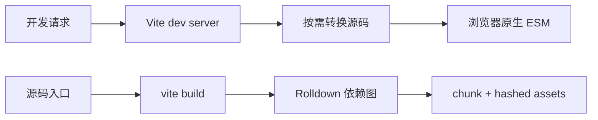

# Vite：开发服务器、模块转换与生产构建

Vite 8 是现代前端开发与构建工具。开发时按浏览器请求转换并提供 ESM 与 HMR；生产时使用 Rolldown 统一打包、分块、压缩并输出带哈希资源。TypeScript 类型检查仍由 `tsc` 或框架专用检查器负责。

## 1. 两条流水线



开发服务器不是生产服务器。`vite preview` 只用于本地检查构建产物，不设计为生产部署。

## 2. 最小项目

```json
{
  "type": "module",
  "scripts": {
    "dev": "vite",
    "typecheck": "tsc --noEmit",
    "build": "vite build",
    "preview": "vite preview"
  },
  "devDependencies": {
    "typescript": "7.0.2",
    "vite": "^8.0.0"
  }
}
```

```html
<div id="app"></div>
<script type="module" src="/src/main.ts"></script>
```

Vite 把 HTML 视为入口和依赖图的一部分。绝对 `/src/main.ts` 相对项目 root 解析。

## 3. 开发阶段

浏览器请求某模块时 Vite 转换 TypeScript/JSX、重写 import 并返回 ESM。依赖预处理用于兼容 CommonJS/多模块依赖和提高加载性能；源码按需转换。

HMR 通过 WebSocket 通知变化并替换受影响模块。是否保留组件 state 由框架 HMR 集成和编辑类型决定，不能依赖 HMR 行为作为生产逻辑。

### 3.1 Dev 与生产差异

- dev 默认面向现代浏览器，保留较新语法；
- production 默认面向 Baseline Widely Available，可用 `build.target` 调整；
- dev 模块图较碎，production 会 bundling；
- dev 有 HMR 和调试代码，production 有压缩、哈希和 tree shaking；
- 只在 dev 运行成功不能证明 production build 可用。

## 4. 配置文件

```ts
import { defineConfig } from "vite";

export default defineConfig(({ mode }) => ({
  base: mode === "production" ? "/lili/" : "/",
  resolve: {
    tsconfigPaths: true,
  },
  build: {
    sourcemap: "hidden",
    manifest: true,
  },
  server: {
    strictPort: true,
  },
}));
```

Vite 8 可用 `resolve.tsconfigPaths` 启用 tsconfig paths。别名仍需与 TypeScript、测试和服务端运行时一致。`base` 决定生成资源 URL，部署在子路径时必须匹配。

## 5. TypeScript 边界

Vite 转换 `.ts/.tsx`，通常不执行完整跨文件类型检查。CI 应单独运行 TypeScript 7：

```bash
pnpm exec tsc --noEmit
pnpm exec vite build
```

Vue/Svelte 等嵌入语言还需 `vue-tsc`、`svelte-check` 等专用检查器；TS7 没有 Compiler API，工具未兼容时使用 TS6 兼容链。

## 6. 环境变量与 mode

Vite 把特定前缀变量暴露给客户端，例如 `import.meta.env.VITE_API_BASE`。所有进入客户端 bundle 的值都可被用户读取，不能放 secret。

```ts
interface ImportMetaEnv {
  readonly VITE_API_BASE: string;
}

const apiBase = new URL(import.meta.env.VITE_API_BASE);
```

`.env`、`.env.local`、`.env.[mode]` 与进程环境有加载优先级。mode 不等于 `NODE_ENV`。配置启动时应验证变量格式；不要在业务深处才发现 URL 缺失。

## 7. 静态资源

- import 资源进入依赖图，获得哈希和 URL 重写；
- `public/` 文件原样复制，以根路径引用，不参与哈希；
- 小资源可能内联，阈值可配；
- CSS import 被处理、提取和分块；
- 动态路径不能用任意字符串让打包器发现所有文件，应使用明确 glob 或清单。

## 8. 代码分割

```ts
const editor = await import("./editor");
editor.mount();
```

动态 import 通常创建异步 chunk。合理边界是路由、低频大型功能和独立语言包。过细会制造网络和执行瀑布；手工 chunk 策略需用产物分析验证。

Vite 8 底层用 Rolldown。定制使用 `build.rolldownOptions`，旧配置迁移时检查 Rollup 兼容差异，不照搬过时字段。

## 9. Tree Shaking

Tree shaking 依赖 ESM 静态结构和副作用信息。它不能删除动态属性访问、未知 CommonJS 行为或被标记为有副作用的模块。库的 package.json `sideEffects` 写错可能删除 CSS 注册或 polyfill。

用构建报告和实际运行确认，不通过源码“看起来未使用”判断。

## 10. 插件

插件可转换虚拟模块、HTML、框架组件和构建钩子。选择插件时检查：Vite 8/Rolldown 兼容、维护、安全、SSR、类型与构建开销。插件运行在构建机，拥有文件和环境访问能力，属于供应链信任边界。

插件顺序和 `enforce: pre/post` 会改变转换。发生语法或 sourcemap 问题时缩小插件集，输出 resolved config 和转换日志。

## 11. 多环境与 SSR

Vite Environment API 允许框架定义 client、SSR、edge、worker 等环境，各有模块解析与执行规则。普通应用优先使用框架支持的配置，不直接假定浏览器模块能在 Node/edge 执行。

客户端代码可用 DOM；SSR 代码不能无条件访问 window。server-only 模块不能进入 client bundle，需通过目录边界和构建检查防止 secret 泄露。

## 12. 完整案例：部署在子路径

目标：应用发布到 `https://example.com/lili/`，路由懒加载，HTML 不长缓存，哈希资源长期缓存。

配置 `base: "/lili/"`，构建后检查 manifest 与 HTML 中资源都以 `/lili/` 开头。服务器规则：

```text
/lili/assets/*  Cache-Control: public, max-age=31536000, immutable
/lili/index.html Cache-Control: no-cache
/lili/*         SPA fallback 到 /lili/index.html
```

旧标签页在新部署后动态加载旧 chunk，若服务器立刻删除旧资源会失败。可保留上一版本资源，或监听 `vite:preloadError` 进行受控刷新：

```ts
window.addEventListener("vite:preloadError", (event) => {
  event.preventDefault();
  window.location.reload();
});
```

刷新前应避免丢失未保存草稿；更稳妥的是部署保留旧哈希资源。

验证：本地用真实子路径 server 访问；直接打开嵌套路由；禁用缓存后检查 chunk；发布两版本模拟旧页面；sourcemap 上传监控但不公开。

## 13. 构建性能与产物审计

- 记录冷/热 dev 启动和 HMR；
- `vite build --profile` 定位插件与转换；
- 分析 chunk 大小、重复依赖和 source map；
- gzip/brotli 只是传输大小，还要看解析执行；
- 设预算但允许有证据的例外；
- CI 使用固定 Node、包管理器和 lockfile。

### 13.1 Source Map 与 CSP

生产 source map 便于错误还原，但可能包含源码和注释。可生成 hidden map 上传监控平台，再从公开静态目录排除。构建后用真实 release ID 关联 map，避免 stack 被还原到错误版本。

Vite dev server 为 HMR 使用的连接和脚本策略不等于生产 CSP。生产环境根据实际产物制定 `script-src`、`style-src` 和连接目标；不要为了让开发配置工作而在生产加入宽泛 `unsafe-eval`。若插件注入 inline script，检查是否支持 nonce/hash，并在浏览器真实响应头下验证。

## 14. 常见错误

1. 把 Vite 的 TS 转换当作类型检查。
2. `vite preview` 直接用于生产。
3. secret 使用 VITE_ 前缀进入客户端。
4. base 与部署子路径不一致，资源 404。
5. SPA fallback 把静态资源 404 也返回 HTML。
6. 新部署删除旧 chunk，长期标签页懒加载失败。
7. 为追求单一大 chunk 取消必要懒加载，或过度分块。
8. 未验证 Vite 8/Rolldown 插件兼容。

## 15. 练习

创建 Vite 8 TypeScript 应用并部署子路径。验收：

1. TS7 strict 与 build 分开运行；
2. 两个路由 chunk 和一个共享 chunk；
3. 环境变量启动时校验且 bundle 无 secret；
4. 资源缓存头正确；
5. 旧版本页面在新部署后仍能加载 chunk；
6. 生成 manifest 和 hidden sourcemap；
7. 记录 bundle、执行和 HMR 指标；
8. CI 从干净 lockfile 可重现构建。

## 来源

- [Vite：Getting Started](https://vite.dev/guide/)（访问日期：2026-07-17）
- [Vite：Why Vite](https://vite.dev/guide/why.html)（访问日期：2026-07-17）
- [Vite 8 Announcement](https://vite.dev/blog/announcing-vite8)（访问日期：2026-07-17）
- [Vite：Building for Production](https://vite.dev/guide/build.html)（访问日期：2026-07-17）
- [Vite：Env Variables and Modes](https://vite.dev/guide/env-and-mode.html)（访问日期：2026-07-17）
