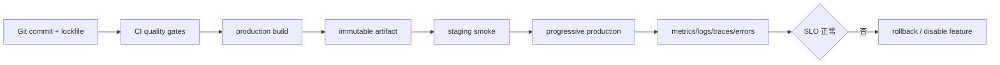

# 环境变量、配置、构建、部署与错误监控

发布链把同一版本源码和锁定依赖转换为 artifact，经验证后部署到环境，并用 release、日志、指标、trace 和 source map 观察结果。配置是部署输入，不能依赖手工修改源码；secret 只存在于受控服务端。

## 1. 从提交到观测



## 2. 配置分类

| 配置 | 示例 | 位置 |
|---|---|---|
| 构建期公开 | public API base、release ID | client bundle，可被任何人读取 |
| 运行时公开 | feature discovery endpoint | HTML/config endpoint，仍非 secret |
| 服务端 secret | DB password、签名 key | secret manager/environment，仅 server |
| 用户/租户设置 | locale、功能权限 | 数据库/API，需授权 |

变量名带 `SECRET` 也不能阻止打包器暴露。凡进入 JS、HTML、source map 或 Network 响应都不再是 secret。

## 3. 启动时验证配置

```ts
interface PublicConfig {
  apiBase: URL;
  release: string;
}

function parsePublicConfig(input: Record<string, string | undefined>): PublicConfig {
  const release = input.VITE_RELEASE?.trim();
  if (!release) throw new Error("缺少 VITE_RELEASE");
  const rawBase = input.VITE_API_BASE;
  if (!rawBase) throw new Error("缺少 VITE_API_BASE");
  const apiBase = new URL(rawBase);
  if (apiBase.protocol !== "https:" && apiBase.hostname !== "localhost") {
    throw new Error("API 必须使用 HTTPS");
  }
  return { apiBase, release };
}
```

集中解析后业务代码只接收已验证类型。布尔字符串不能用 `Boolean("false")`；应明确接受 `"true"`/`"false"`。端口检查整数范围，URL 检查协议和 host allowlist。

## 4. Build Once, Deploy Many

理想流程构建一次 artifact，再在环境注入运行时配置。纯静态前端若构建期嵌入 API URL，staging 与 production 需不同 artifact；这增加“测试的不是上线产物”的风险。

可选方案：启动时请求 `/config.json`、服务端把公开配置注入 HTML、或使用相同域反向代理。配置 endpoint 也需 cache/version 策略，不能泄露 secret。

## 5. Artifact

artifact 包含静态资源/服务器 bundle、manifest、SBOM、版本和必要 source map。要求：

- 内容可寻址或带 release ID；
- 构建日志记录 commit、Node、包管理器和 lockfile hash；
- 不在部署机重新 npm install/build；
- 生产 source map 不公开，上传监控后受控保存；
- 可回滚到上一已知良好 artifact。

## 6. 部署策略

### Rolling

逐批替换实例，简单但新旧版本短暂共存。API 和数据库 schema 需向后兼容。

### Blue/Green

两套环境，流量一次或分批切换，回滚快但资源成本较高。

### Canary

先给少量流量/租户，比较错误率与延迟，再扩大。需要可靠分流、同版本标记和足够样本。

### Feature Flag

代码已部署但功能按用户/租户开启。flag 不是授权；服务端仍验证权限。长期 flag 会增加组合状态，应有 owner 和移除日期。

## 7. 静态资源与缓存

带内容哈希资源可 `max-age=31536000, immutable`；HTML/manifest 应 no-cache 或短缓存，避免引用已删除 chunk。发布时先上传新资源，再切 HTML；保留旧哈希资源以支持长期标签页。

SPA fallback 仅对页面路由返回 index.html。`/assets/missing.js` 应 404 JavaScript，而不是返回 HTML 导致 MIME 错误。

## 8. 数据库与 API 兼容

前端发布不能假定所有标签页立刻更新。API 变更使用 expand/migrate/contract：先添加兼容字段，迁移客户端，再删除旧字段。响应新增字段通常安全，重命名/删除或改变语义需要版本策略。

客户端对未知枚举要有 fallback；服务端不能因旧客户端缺新字段就执行危险默认。

## 9. 错误监控

捕获：未处理异常、Promise rejection、框架 error boundary、资源加载、API 失败和 Web Vitals。事件字段：release、route、environment、浏览器、操作系统、用户匿名标识、trace ID 和 stack。

去重按错误类型、规范化 stack 和上下文；不要仅按 message。采样控制体量，但认证/支付等高价值错误可提高采样。

### 9.1 Source Map

压缩 stack 需 source map 还原源码位置。上传时将 artifact/release 与 map 关联；服务器不公开 `.map`。map 可能包含源码和注释，按敏感资产管理。

## 10. 日志、指标与 Trace

- logs：离散事件和上下文；
- metrics：聚合数值，如错误率、p95 latency；
- traces：跨浏览器、网关和服务的请求链路；
- profiles：CPU/内存热点。

前端请求生成/传播 traceparent 时遵循后端和隐私策略。用户点击可关联到 API trace，但不能把密码、表单正文和 token 放 breadcrumb。

## 11. SLI、SLO 和发布门

可用性 SLI 示例：成功加载核心页面的会话比例；交互 SLI：关键动作端到端 p95；正确性：保存后服务端确认比例。

发布比较新旧 release 的：错误会话率、关键 API 失败、LCP/INP、资源 404、登录/支付 synthetic。指标超阈值自动暂停 canary 或回滚，但还需防止低流量噪声。

## 12. 完整案例：静态前端 Canary

输入：release `2026.07.17.1`，构建 dist、hidden maps、manifest 和 SBOM。

流程：

1. frozen install、质量门和 build；
2. 扫描 bundle 中 secret pattern；
3. 上传 source maps 到 release，随后从公开 artifact 排除；
4. 上传哈希资源；
5. staging 部署同 artifact，注入公开 runtime config；
6. smoke 测登录页、读取和无副作用写测试；
7. 5% canary，按 release 比较 15 分钟；
8. 达标扩到 50%、100%；
9. 保留上一 HTML 与资源；
10. 记录部署事件与 commit。

失败分支：新 release 动态 chunk 404 率上升。立即停止扩量并切回旧 HTML；旧资源仍在所以页面恢复。检查部署顺序和 CDN；修复后新 release ID 重新发布，不覆盖原 artifact。

## 13. 隐私和安全

- 错误事件默认剥离 query、form、headers 中敏感字段；
- 用户标识哈希也可能是个人数据，按政策处理；
- CSP report 可能包含 URL；
- 监控 SDK 是供应链和运行时依赖；
- PR 构建不获得生产 secret；
- 部署身份最小权限，生产审批和审计留痕。

## 14. 常见错误

1. `.env` 被 gitignore 就认为内容不会进 bundle。
2. 每环境重新 build，测试产物与生产不同。
3. HTML 长缓存且旧 chunk 被删除。
4. sourcemap 公共可访问。
5. 监控只收错误总数，不带 release。
6. 日志记录完整请求和 token。
7. 数据库破坏性迁移与前端同时上线。
8. 回滚代码却无法回滚数据 schema。

## 15. 调试与练习

调试从 release 与时间线开始：确认 artifact hash → 配置值 → Network/响应头 → chunk 404 → source-mapped stack → API trace → 新旧版本指标 → 回滚影响。

建立完整发布链。验收：

1. 配置集中验证且 bundle 无 secret；
2. build once、staging 与 production 同 artifact；
3. 哈希资源/HTML cache 正确；
4. source map 可还原但公网不可访问；
5. canary 有自动暂停阈值；
6. 模拟 chunk 404、API 500 和 hydration error 可定位；
7. 一条命令/审批可回滚；
8. 监控事件无敏感值并关联 release/trace。

## 来源

- [Vite：Env Variables and Modes](https://vite.dev/guide/env-and-mode.html)（访问日期：2026-07-17）
- [Vite：Building for Production](https://vite.dev/guide/build.html)（访问日期：2026-07-17）
- [MDN：Cache-Control](https://developer.mozilla.org/docs/Web/HTTP/Reference/Headers/Cache-Control)（访问日期：2026-07-17）
- [OpenTelemetry：Browser](https://opentelemetry.io/docs/languages/js/getting-started/browser/)（访问日期：2026-07-17）
- [web.dev：Web Vitals](https://web.dev/articles/vitals)（访问日期：2026-07-17）
