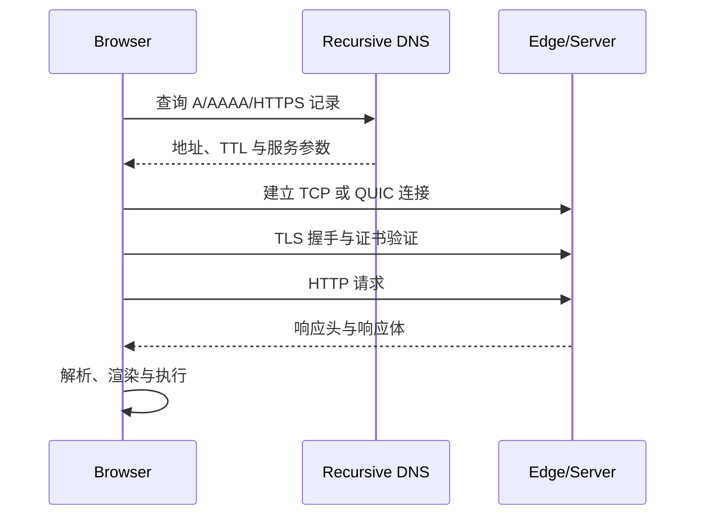

# 从 DNS 到 HTTP：浏览器请求的连接路径与诊断

本章假定已会使用浏览器 Network 面板和基本 HTTP，请进一步掌握一次导航在 DNS、传输连接、TLS、HTTP 请求、服务端处理与响应传输之间的责任边界。目标是从时间线证据定位延迟，而不是把所有等待统称为“网络慢”。

## 1. 请求路径与可复用边界



图是首次连接的逻辑顺序。真实浏览器可以复用 DNS 缓存、已有连接和 TLS 会话；HTTP/3 把 QUIC 传输和 TLS 1.3 握手整合，不经过 TCP。Navigation Timing 中某阶段耗时为 0，可能表示缓存、连接复用或跨源计时被隐藏，不能直接判定该协议步骤不存在。

## 2. DNS：从主机名得到可连接端点

DNS 将 `www.example.com` 解析为记录。页面加载常见记录包括：

| 记录 | 作用 | 性能与生产边界 |
|---|---|---|
| A | IPv4 地址 | 一个名称可返回多个地址 |
| AAAA | IPv6 地址 | 浏览器可并行/交错尝试 IPv6 与 IPv4 |
| CNAME | 指向另一规范名称 | 链过长增加解析工作，根域使用受 DNS 提供商能力限制 |
| HTTPS/SVCB | 声明服务端点、ALPN 等参数 | 可帮助发现 HTTP/3；实际使用取决于客户端与 DNS 链路 |
| TXT | 文本策略或验证 | 不直接给页面建立连接 |

### 2.1 查询链

浏览器或操作系统先查本地缓存，再把请求交给递归解析器。递归解析器可查 root、TLD 和权威 DNS，也可能已有缓存。权威记录的 TTL 控制递归缓存可复用期限，但操作系统、浏览器和中间设施可能有自身缓存策略。

DNS TTL 的取舍：

- 短 TTL 更快传播切流和故障转移，但增加权威查询量；
- 长 TTL 减少查询并提高缓存命中，但地址迁移需要更长兼容窗口；
- TTL 到期不保证所有客户端同时更新；
- DNS 故障转移不能替代应用健康检查和连接超时策略。

### 2.2 地址选择

双栈主机同时有 A/AAAA。客户端通常不会机械地“先完整等待 IPv6 失败再试 IPv4”，而会按地址选择和连接竞速策略降低单栈故障延迟。排障要分别测试 IPv4、IPv6 和不同网络，不把一台开发机结果推广到所有用户。

### 2.3 DNS 隐私与安全

传统 DNS 查询可能暴露域名元数据。DoH/DoT 保护客户端到解析器的传输，但解析器仍能看到查询。DNSSEC 认证 DNS 数据来源和完整性，不加密查询，也不等同网站 TLS。

## 3. TCP：可靠字节流

HTTP/1.1 与 HTTP/2 通常运行在 TCP 上。首次连接需三次握手，典型需要一个网络往返时间 RTT 才能发送应用数据；TLS 还会增加握手数据。

TCP 提供：有序、可靠、拥塞控制的字节流。丢包时重传；同一连接上的后续字节可能等待缺失字节，这属于传输层队头阻塞。HTTP/2 在一个 TCP 连接中多路复用 stream，消除 HTTP/1.1 应用层按请求排队，但底层丢包仍影响连接内所有 stream。

### 3.1 建连与吞吐不是同一问题

- 高 RTT：握手和短请求等待明显；
- 丢包：重传与拥塞窗口收缩；
- 带宽小：大响应传输时间长；
- 服务端拥塞或限速：Network 面板看似接收慢；
- 连接数上限：请求排队，尚未开始 DNS/TCP。

“100 Mbps 网络”不能推出首字节快；短请求常被 RTT、连接与服务器处理主导。

## 4. QUIC 与 HTTP/3

HTTP/3 使用基于 UDP 的 QUIC。QUIC 集成 TLS 1.3、按 stream 提供可靠性；一个 stream 丢包不会像 TCP 那样阻塞其他 stream 的数据交付。它还支持连接迁移等能力。

HTTP/3 不保证每次都更快：网络可能阻断 UDP、服务器/客户端实现与 CPU 开销不同、短连接是否已有会话影响结果。浏览器会通过 ALPN、Alt-Svc 或 HTTPS/SVCB 等发现能力，并可能回退到 HTTP/2。优化报告记录 `nextHopProtocol` 和用户分布，不只在本地强制 h3 后下结论。

## 5. TLS：身份、机密性与完整性

TLS 握手协商协议版本、密码套件与密钥，并验证服务器证书。浏览器还会检查：

- 证书有效期；
- 主机名是否在 Subject Alternative Name；
- 证书链能否到受信任根；
- 签名和用途；
- 撤销与证书透明度等浏览器策略；
- 页面是否加载被策略阻止的混合内容。

TLS 成功只证明连接到证书覆盖的端点并保护传输，不证明业务内容可信、服务无漏洞或用户有权限。

### 5.1 ALPN 与协议协商

ALPN 在 TLS 握手中协商 `h2`、`http/1.1` 等应用协议。HTTP/3 的 QUIC 自身包含 TLS 协商。Network 的 Protocol 列或 `PerformanceResourceTiming.nextHopProtocol` 可观察结果，但代理/CDN 到源站可能使用另一协议。

### 5.2 会话恢复与 0-RTT

TLS 1.3 会话恢复可减少后续连接握手。QUIC/TLS 0-RTT 允许恢复连接更早发送应用数据，但 early data 具有重放风险。非幂等写操作不能仅因“更快”就允许 0-RTT；服务端与 CDN 必须按协议和业务语义防重放。

### 5.3 证书链生产问题

服务端漏发中间证书可能在有缓存的开发机成功、在新设备失败。部署验证使用干净客户端和完整链工具；证书续期监控覆盖所有域名、备用域名和 CDN 配置。HSTS 能强制后续 HTTPS，但错误证书下也会让用户无法绕过，启用 includeSubDomains/preload 前先保证所有子域支持。

## 6. HTTP 请求与响应

HTTP 消息包含方法、目标、字段和内容。性能分析先分清：

| 阶段 | 观察问题 |
|---|---|
| Request queued | 是否等待连接槽、优先级、Service Worker 或调度 |
| Request sent | 请求头/体是否很大，上行是否慢 |
| Waiting / TTFB | 网络 RTT、边缘处理、源站处理、数据库与缓存 |
| Content download | 响应大小、带宽、丢包、流式策略 |
| Browser processing | 解压、解析、脚本与渲染，不属于 HTTP 传输 |

### 6.1 HTTP/1.1、HTTP/2、HTTP/3

HTTP/1.1 常通过多个连接并发；HTTP/2 在一个连接上多路复用并压缩头字段；HTTP/3 在 QUIC stream 上承载 HTTP 语义。方法、状态码、Cache-Control 等高层语义跨版本基本一致。

域名分片在 HTTP/1.1 曾用于增加连接并发，在 h2/h3 下可能造成额外 DNS、TLS、连接和较差优先级协调。是否保留第三方独立域要按缓存、隔离、安全和实测决定。

### 6.2 重定向

每次跨源重定向可能增加 DNS、连接与 TLS。入口 `http → https → www → locale` 链会累积 RTT。用一个永久或临时响应直接到规范 URL，并保留正确缓存与方法语义。301/302/303/307/308 对方法转换规则不同，写请求重定向需明确测试。

### 6.3 压缩与响应体

Brotli/gzip 减少文本传输，但需要 CPU；图片、视频等已压缩格式再次压缩收益低。`Content-Encoding` 与 `Vary: Accept-Encoding` 必须配合缓存。传输大小小不等于解析执行成本低，JavaScript 解压后仍占 CPU 和内存。

## 7. Timing API：在页面内量化

使用现代 Performance Entry：

```js
const [navigation] = performance.getEntriesByType("navigation");

if (navigation instanceof PerformanceNavigationTiming) {
  const metrics = {
    dns: navigation.domainLookupEnd - navigation.domainLookupStart,
    tcp: navigation.connectEnd - navigation.connectStart,
    tls: navigation.secureConnectionStart > 0
      ? navigation.connectEnd - navigation.secureConnectionStart
      : 0,
    requestToFirstByte: navigation.responseStart - navigation.requestStart,
    responseDownload: navigation.responseEnd - navigation.responseStart,
    protocol: navigation.nextHopProtocol,
  };
  console.table(metrics);
}
```

### 7.1 指标解释边界

- `connectStart` 到 `connectEnd` 包括建立传输连接；若 HTTPS 且新建连接，内部含 TLS 时间段；
- TLS 可用 `connectEnd - secureConnectionStart`，不是旧教程常写的 `requestStart - secureConnectionStart`；连接建立后到请求开始可能还有其他调度；
- connection reuse 时 DNS/connect timestamps 可相同；
- `responseStart - requestStart` 包含网络到服务器、服务器处理和首字节返回，不能直接命名“后端耗时”；
- 跨源 Resource Timing 详细字段需响应 `Timing-Allow-Origin`，否则部分值为 0；
- 浏览器时间线缓冲区有限，长期采集需 PerformanceObserver 与缓冲策略。

## 8. 案例一：首次访问公共内容页

### 8.1 输入与证据

移动网络冷缓存：首页导航 TTFB 820 ms；DNS 80 ms、connect 190 ms，其中 TLS 110 ms；response download 45 ms；协议 h2。CDN 日志显示 edge 到源站 330 ms，源站数据库 240 ms。

### 8.2 推理

1. 传输下载仅 45 ms，压缩 HTML 收益有限；
2. DNS+连接约 270 ms，可通过同源、连接复用和合适 preconnect 改善后续资源，但不能消除主导航首次建连；
3. TTFB 的主要可控项是 edge 回源与数据库；
4. 页面公共且可短时陈旧，可在 CDN 按 locale 缓存；
5. 缓存命中后再测，若 TTFB 降到 210 ms，证明改动作用在服务器路径。

### 8.3 输出与验证

配置 `Cache-Control: public, s-maxage=60, stale-while-revalidate=300`，发布事件主动 purge。分别记录 CDN `Age`/cache status、冷/热 TTFB 和错误率。不能把用户 cookie 误入公共 cache key。

### 8.4 失败分支

上线后某 locale 返回他人个性化欢迎语，说明公共缓存混入用户内容。立即 purge/禁用缓存，拆分公共 HTML 与私有进度，不通过增加 Cookie 到 Vary 无限降低命中来掩盖模型错误。

## 9. 案例二：API 偶发建立连接慢

### 9.1 输入

同一 API p50 120 ms、p95 1.8 s；慢样本 connect 1.4 s，服务器 access log 的处理仅 35 ms；只发生在部分 IPv6 移动网络。

### 9.2 诊断

1. 按协议族、ASN、地区和浏览器切分；
2. 分别 `curl -4`、`curl -6`，用同一边缘站点复现；
3. 检查 AAAA 指向和 IPv6 防火墙/路由；
4. 确认浏览器最终是否回退 IPv4；
5. 检查连接复用与 idle timeout 是否导致频繁重连。

### 9.3 修复与验证

修复故障 IPv6 路由或临时撤销错误 AAAA，保持足够 DNS 迁移窗口。验证不是“改成 IPv4 就快”，而是双栈 p95、失败率和地址族分布恢复。

失败注入：在测试网络丢弃 IPv6 SYN/QUIC 包，确认客户端能在可接受时间使用其他路径；服务端 API 写操作仍使用幂等键，防止客户端超时重试造成重复。

## 10. DevTools 诊断顺序

1. 保留日志并禁用/启用 cache 分别录制；
2. 打开 Protocol、Remote Address、Priority、Connection ID；
3. 查看请求是否 queued、ServiceWorker、disk/memory cache；
4. 对比首次与重复导航；
5. 导出 HAR 前确认不会泄露 Cookie、Authorization 和表单；
6. 与 CDN/server trace 通过 request ID 关联；
7. 使用不同网络、地区、IPv4/IPv6 和协议复验；
8. 用 Resource/Navigation Timing 做真实用户分布，不靠一个瀑布图。

## 11. 方案取舍

| 方案 | 能改善 | 成本与风险 |
|---|---|---|
| 减少跨源 | DNS/TLS/连接复用 | 代理复杂、缓存与安全域扩大 |
| preconnect | 已知关键第三方的后续连接 | 浪费 socket、带宽、隐私暴露 |
| CDN/edge cache | 回源和服务器 TTFB | cache key、失效、私人数据风险 |
| HTTP/3 | 高丢包多 stream、连接迁移 | UDP 可达性、CPU、回退与运维 |
| 长连接复用 | 重复握手 | idle 资源、负载均衡超时一致性 |
| 减少重定向 | 多个 RTT | URL/权限/locale 决策需前置 |

## 12. 生产观测与安全

- RUM 采集分位数，不上传完整 URL query；
- `Server-Timing` 可暴露 cache/db 等阶段，但对公共响应只给安全聚合值；
- `Timing-Allow-Origin` 只授予确需读取的源；
- 监控证书到期、DNS 修改、边缘回源和协议回退；
- 网络错误日志区分 DNS、TLS、连接、HTTP status、abort 与离线；
- 前端看不到所有底层错误码，需结合边缘与服务器日志。

## 13. 综合练习：建立请求分解实验

搭建同源页面和一个独立 API 域，分别测试冷/热 DNS、首次/复用连接、h2/h3、IPv4/IPv6、CDN hit/miss。

验收标准：

1. 页面使用 PerformanceNavigationTiming 与 ResourceTiming 输出各阶段；
2. 跨源服务器正确配置最小 `Timing-Allow-Origin`；
3. 每个场景至少采样 30 次并报告 p50/p75/p95；
4. server timing 与浏览器 timing 通过 request ID 对齐；
5. 对 TTFB 明确分出客户端网络、edge、回源和应用阶段；
6. 注入 DNS 慢、IPv6 黑洞、TLS 证书错误、源站慢和大响应；
7. 写出每项优化的收益、代价与回滚；
8. 报告不包含 token、cookie、个人 query 或内部主机名。

## 来源

- [W3C Navigation Timing Level 2](https://www.w3.org/TR/navigation-timing-2/)（访问日期：2026-07-17）
- [W3C Resource Timing Level 3](https://www.w3.org/TR/resource-timing-3/)（访问日期：2026-07-17）
- [RFC 9114：HTTP/3](https://www.rfc-editor.org/rfc/rfc9114)（访问日期：2026-07-17）
- [RFC 9000：QUIC](https://www.rfc-editor.org/rfc/rfc9000)（访问日期：2026-07-17）
- [RFC 8446：TLS 1.3](https://www.rfc-editor.org/rfc/rfc8446)（访问日期：2026-07-17）
