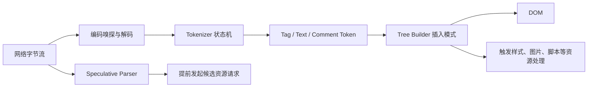

# HTML Parser 与 Speculative Parser：流式建树、脚本重入和资源发现

浏览器不会等完整 HTML 下载后再解析。字节进入解码器和 tokenizer，token 交给 tree builder 构造 DOM；经典 parser-blocking script 可以暂停 tokenizer 并重入解析，浏览器可同时运行 speculative parser 发现后续资源。理解这些机制用于解释资源为什么晚发现、DOM 为什么被纠正，以及脚本怎样阻塞文档。

## 1. 从字节到 DOM



Tokenizer 和 tree builder 是不同阶段。Tokenizer 根据 data、tag open、attribute value、script data 等状态识别 token；tree builder 根据 before html、in head、in body、in table 等插入模式决定节点位置。HTML 不是用一个正则或 XML parser 解析。

## 2. 编码确定与流式解析

服务器应发送正确 `Content-Type: text/html; charset=utf-8`，文档开头放 `<meta charset="utf-8">`。编码声明过晚可能使浏览器先按错误编码解析，再重新解码，浪费工作并产生乱码。

流式解析的收益：

- 首批 HTML 到达即可发现 CSS、图片、字体提示和脚本；
- DOM 可渐进构造；
- 服务端可先发送 head 和页面 shell；
- 关键资源发现时间可早于 HTML 完整下载。

但首批字节若只有大段注释、内联 JSON 或阻塞模板，资源仍会晚发现。优化检查 Network 的 request start 与 initiator，而不是只看 HTML 总大小。

## 3. Tokenizer 状态与特殊文本

`<script>`、`<style>`、`<textarea>`、`<title>` 的内容不按普通 data 状态处理。`<script>` 结束标签识别、字符引用和历史兼容规则非常复杂，不能通过字符串拼接安全注入不可信数据。

```html
<script type="application/json" id="boot-data">
  {"title":"课程"}
</script>
```

即使 type 不是 JavaScript，`</script>` 仍能结束元素。把 JSON 序列化进 HTML 时必须使用框架经过验证的安全序列化策略，防止字符串包含结束标签形成 XSS。CSP 不能修复已经破坏 HTML 上下文的转义。

## 4. Tree Builder 与错误恢复

HTML tree builder 会修复大量无效标记。源码缩进不等于最终 DOM：

```html
<table>
  文本
  <div>操作</div>
  <tr><td>课程</td></tr>
</table>
```

在 table 插入模式下，不允许位置的字符/元素可能通过 foster parenting 被移到 table 之前。浏览器不是简单把节点放在源码父标签下。

### 4.1 隐式元素

浏览器可为 table 插入 `tbody`，自动关闭 `p`，纠正嵌套 form 和交互元素。框架 hydration 若按无效源码期望另一棵树，会出现 mismatch。

### 4.2 Adoption Agency Algorithm

错误嵌套 formatting elements（如 `b`、`i`）由专门算法修复，可能创建或重排节点。应用不应依赖错误恢复结果；使用 Nu HTML Checker 在 CI 阻止无效结构。

### 4.3 template

`template` 的内容进入独立 `DocumentFragment`，不直接成为活动文档子树；内部图片通常不会像普通可见 DOM 一样立即参与页面，但具体资源发现要按元素规则测试。克隆内容后才插入主 DOM。

## 5. Parser-blocking script

没有 `async`、`defer`、`type=module` 的外部经典脚本通常是 parser-blocking：parser 遇到 script，等待脚本可执行并执行，然后继续。脚本前已有尚未就绪、会阻塞脚本的样式表时，脚本还需等待样式。

```html
<link rel="stylesheet" href="/critical.css">
<script src="/legacy.js"></script>
<main>...</main>
```

脚本可能读取计算样式，所以样式表会阻止该脚本；脚本又阻止 parser，形成关键链。把脚本移到 body 尾部只改变发现和阻塞位置，现代代码通常用 defer/module 并减少关键 CSS。

## 6. 脚本重入与 document.write

Parser 执行脚本时设置 insertion point。`document.write()` 可以向输入流插入字符，导致 tokenizer/tree builder 重入。网络慢、async 调用或文档加载完成后调用可能被忽略、清空文档或行为依赖条件。

```html
<script>
  document.write('<p id="inserted">同步插入</p>');
</script>
```

新应用不使用 document.write 加载脚本或 UI。第三方 tag 若仍使用，应隔离、异步替代并在慢网络测试；浏览器可能对跨源 parser-blocking document.write 采取干预。

## 7. Speculative HTML Parser

WHATWG 将其描述为用户代理可选优化。正常 parser 因 pending parsing-blocking script 等待时，speculative parser 可继续读取可用字节，在不改变真实 DOM 的前提下产生 speculative fetch。

关键规则：

- 它不执行真实 DOM 操作；
- 发现哪些资源是实现定义，但不能在假设阻塞脚本“不做任何事”时请求本不会请求的资源；
- 正常 parser 之后仍会看到标记，缓存/请求合并避免重复下载；
- document.write 可能让预测状态失效并重启扫描；
- JavaScript 动态创建或隐藏在字符串中的 URL 无法由 HTML 扫描提前发现。

“Preload Scanner”是常用实现术语；规范中的准确抽象是 speculative HTML parsing。不能假定所有浏览器采用完全相同优先级和扫描策略。

## 8. 资源怎样被发现

| 标记 | 发现时可确定的信息 | 常见边界 |
|---|---|---|
| `<link rel=stylesheet>` | URL、media、crossorigin | CSS 内的资源需等 CSS 下载解析 |
| `<script src>` | URL、类型、async/defer | 动态 import 需执行模块或 modulepreload |
| `` | 候选、viewport 选择信息 | CSS 背景图需等 CSSOM；lazy 可能延后 |
| `<link rel=preload>` | URL、as、type、crossorigin | 属性不匹配会重复请求或浪费 |
| `<iframe src>` | 子文档 URL | loading=lazy 和可见性影响时机 |
| 内联 style `url()` | 元素被解析后可发现 | 外部 CSS 更晚 |

CSS 背景图晚于 HTML `` 发现，是 LCP 图片不应只用背景图的原因之一；但语义装饰图仍适合 CSS，不能为性能破坏内容语义。

## 9. DOMContentLoaded 与 load

`document.readyState`：loading 表示 parser 仍工作；interactive 表示解析完成，defer/module 脚本执行阶段与事件顺序需考虑；complete 表示相关资源加载完成。

`DOMContentLoaded` 在文档解析且 defer/module 等相应脚本执行后触发，不等待所有图片。`load` 等待更多依赖资源。async 脚本独立执行，可能在 DOMContentLoaded 前或后。

```js
function initialize() {
  document.querySelector("#app")?.setAttribute("data-ready", "true");
}

if (document.readyState === "loading") {
  document.addEventListener("DOMContentLoaded", initialize, { once: true });
} else {
  initialize();
}
```

异步加载脚本不能只注册 DOMContentLoaded，因为事件可能已经发生。

## 10. 案例一：LCP 图片发现晚

### 输入

Network 显示 HTML 0 ms 开始、CSS 150 ms 开始、hero.jpg 520 ms 才请求；Initiator 是 `hero.css`。LCP 2.9 s，图片下载只 400 ms。

### 处理

1. hero 只存在于外部 CSS 的 background-image；
2. scanner 先发现 CSS，必须等 CSS 下载解析才发现图片；
3. hero 是内容图和 LCP 候选，改为 ``/`picture`，在 HTML 首批字节提供 srcset/sizes；
4. 明确 width/height 防 CLS，`fetchpriority="high"` 只用于真实关键候选；
5. 删除重复 CSS background URL，避免双请求。

### 输出与验证

hero 请求从 520 ms 提前至 170 ms，LCP 多次样本 p75 从 2.9 s 降到 2.3 s。验证图片语义 alt、不同 viewport 选择、缓存冷/热和慢网。

### 失败分支

同时保留 `<link rel=preload href=hero-large.jpg>` 与响应式 picture，窄屏仍预载大图且又请求小图。修复为匹配 imagesrcset/imagesizes 或直接依赖早期 ``，以 Network 确认单请求。

## 11. 案例二：第三方同步脚本阻塞解析

### 输入

head 中广告脚本等待 1.4 s；HTML 后半内容在这之后才进入 DOM。speculative parser 发起部分图片，但脚本执行 180 ms 且 document.write 插入另一个脚本。

### 处理与方案

方案 A：第三方支持 async，改 async 并在回调初始化；不保证 DOM 顺序。方案 B：需要 DOM 顺序但不操作 parser，改 defer；按文档顺序、解析后执行。方案 C：若供应商只能 document.write，将其放 sandbox iframe，避免阻塞主文档和扩大 DOM 权限。

### 输出与验证

主文档 DOMContentLoaded 提前，长任务减少；广告失败不阻止正文。验证第三方同意的加载方式、收入指标、CSP、consent 和 iframe 尺寸。

失败注入：阻断第三方域，页面主导航、正文和键盘仍可用；超时后保留占位尺寸而非布局跳动。

## 12. 流式 SSR 的 parser 边界

服务器可先 flush head、critical CSS link 和页面骨架，再输出慢内容。收益取决于代理/CDN 是否缓冲、压缩是否攒包、首批字节是否包含关键发现。

不能在响应头已提交 200 后才发现根资源不存在并想改 404。服务端在 flush 前完成身份、权限和主要资源存在性判断；次要区域用流式错误边界。

内联 hydration 数据需安全序列化；chunk 边界不能拆坏多字节编码或 HTML 语义，框架流 renderer 负责协议，应用不要手拼不可信 HTML。

## 13. 调试实验

使用 DevTools：

1. Network 查看请求 Initiator、Priority 与开始时刻；
2. Performance 记录 Parse HTML、Evaluate Script、DOMContentLoaded；
3. Disable cache + Slow 3G 放大顺序；
4. Coverage 检查早期脚本是否首屏需要；
5. View Source 对比 Elements，识别 tree builder 修复；
6. 用 `performance.getEntriesByType("resource")` 导出资源 startTime；
7. 用 Nu checker 阻止无效 HTML；
8. 禁用 JavaScript确认基础 HTML 内容。

## 14. 方案取舍与生产边界

| 做法 | 收益 | 成本/风险 |
|---|---|---|
| 流式 HTML | 提前解析和资源发现 | 状态码、代理缓冲、错误边界复杂 |
| defer/module | 不阻塞 parser | 执行仍可长任务；依赖 DOM/顺序需设计 |
| async | 独立下载尽早执行 | 顺序不确定，可打断主线程 |
| preload | 显式提前关键资源 | 配错 as/cors/type 重复或浪费 |
| 内联关键数据 | 少一次请求、可 SSR | XSS 序列化、HTML 体积、缓存个性化 |
| 第三方 iframe | 权限/阻塞隔离 | 通信、布局、无障碍和 cookie 约束 |

## 15. 综合练习

构建一个可切换四种脚本模式和两种 hero 发现方式的实验页，服务器按 100 ms 分块发送 HTML。

验收标准：

1. 记录 tokenizer/DOM 节点出现、资源请求、DOMContentLoaded/load 时间；
2. 展示普通、defer、async、module 的真实顺序；
3. 加入 parser-blocking CSS，解释脚本为什么等待；
4. 构造无效 table/p 嵌套，对比源码和 DOM；
5. background hero 与 img hero 各测 30 次 request start/LCP；
6. 第三方阻断时正文仍可用；
7. Nu HTML Checker 通过正常版本；
8. 报告包含至少两个方案、失败注入和生产选择依据。

## 来源

- [WHATWG HTML：Parsing HTML documents](https://html.spec.whatwg.org/multipage/parsing.html)（访问日期：2026-07-17）
- [WHATWG HTML：The script element](https://html.spec.whatwg.org/multipage/scripting.html#the-script-element)（访问日期：2026-07-17）
- [WHATWG HTML：Current document readiness](https://html.spec.whatwg.org/multipage/dom.html#current-document-readiness)（访问日期：2026-07-17）
- [MDN：DOMContentLoaded](https://developer.mozilla.org/docs/Web/API/Document/DOMContentLoaded_event)（访问日期：2026-07-17）
- [Nu HTML Checker](https://validator.github.io/validator/)（访问日期：2026-07-17）
