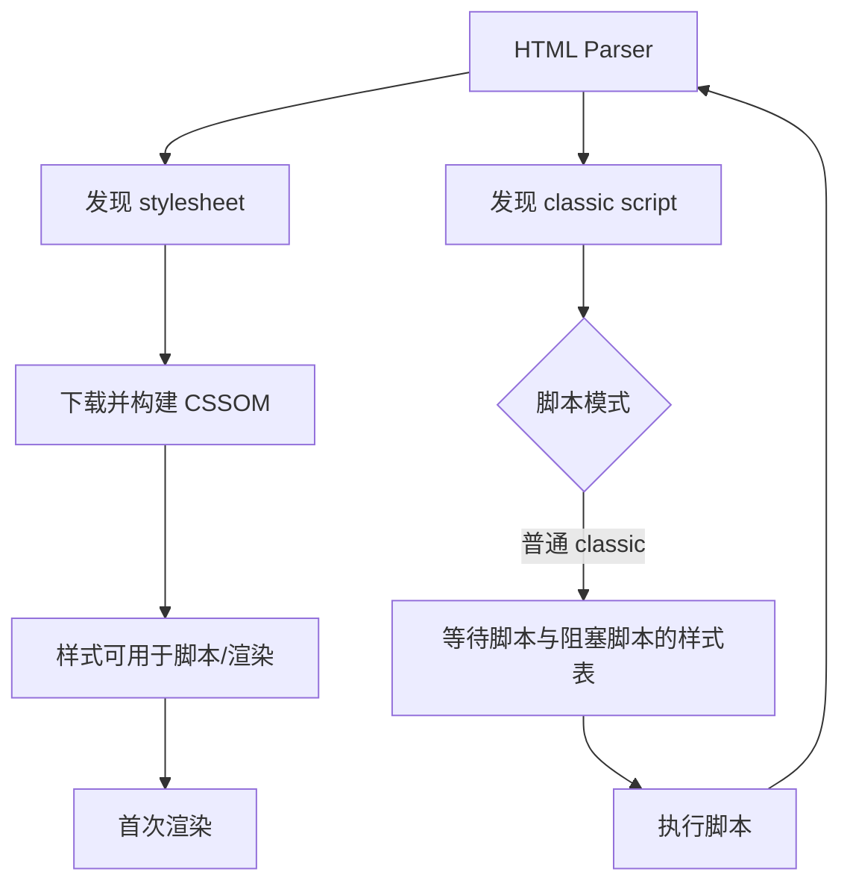

# CSS 与 Script 的阻塞行为：解析、渲染和执行的关键链

“阻塞”必须说明阻塞哪个阶段。样式表可能阻塞首次渲染并阻止 parser-blocking script 执行；经典同步脚本阻塞 HTML parser；defer、async 与 module 改变下载和执行时机，但脚本执行本身仍占主线程。优化目标是缩短真实关键链，同时保持样式、执行顺序和页面正确性。

## 1. 三类阻塞



区分：

- parser-blocking：HTML tokenizer/tree builder 停止；
- render-blocking：用户代理推迟渲染，避免无样式内容；
- script-blocking stylesheet：parser-created、media 匹配等条件下，脚本读取样式前需等待。

## 2. 样式表为什么影响首次渲染

外部 stylesheet 需要下载、解析、处理 `@import` 与字体/图片引用，形成 CSSOM。浏览器需要 DOM 与适用样式计算可绘制结果。head 中 media 匹配的 stylesheet 通常位于关键渲染路径。

```html
<link rel="stylesheet" href="/base.css">
<link rel="stylesheet" href="/print.css" media="print">
```

`media=print` 在 screen 环境通常不阻塞屏幕首次渲染，但仍可能被低优先级获取。运行时切换 media 后需可用。用错误 media hack 异步加载关键 CSS 会造成 FOUC 和无障碍问题。

### 2.1 @import 链

```css
@import url("tokens.css");
@import url("components.css");
```

浏览器先下载父 CSS，解析后才发现 import，形成串行链。构建期合并或用多个早期 link 可提前发现，但多个文件也增加请求和顺序管理。HTTP/2/3 不能消除“URL 尚未被发现”的依赖。

### 2.2 CSS 内资源

字体、background image 需等 CSS 解析且选择器/元素需要时才请求。首屏内容图优先使用 HTML img/picture；装饰资源仍放 CSS。不要为早发现把所有背景图都预载。

## 3. 经典同步脚本

```html
<script src="/app.js"></script>
```

parser 遇到脚本后等待下载、等待脚本阻塞样式表、执行，然后继续解析。内联经典脚本无需网络，但执行同样阻塞 parser。

同步脚本适用于必须在后续标记前执行且非常小的初始化，例如在 head 早期设置主题 class 以避免闪烁。即便如此也需 CSP nonce/hash、无不可信数据且执行极短。

## 4. defer

```html
<script defer src="/vendor.js"></script>
<script defer src="/app.js"></script>
```

经典外部 defer 脚本并行下载，不阻塞 HTML 解析；文档解析完成后按文档顺序执行，在 DOMContentLoaded 前完成。defer 对内联经典脚本没有同样效果。

defer 保证相互顺序，但前一个下载/执行慢会延后后一个。依赖链应由模块 import 表达，减少隐式全局顺序。

## 5. async

```html
<script async src="/analytics.js"></script>
```

async 脚本并行下载，准备好后尽快执行，可中断 HTML 解析；多个 async 的执行顺序不由文档顺序保证。适合独立、无 DOM 顺序依赖的 analytics/ads，但第三方执行仍可制造长任务。

“异步下载”不等于“不会影响性能”。async 在输入或首次渲染附近执行 300 ms，会直接影响响应和渲染。

## 6. JavaScript modules

```html
<script type="module" src="/src/main.js"></script>
```

模块脚本默认类似 defer：并行获取模块图，文档解析后执行。模块严格模式、单次求值、跨源请求使用 CORS、import 图按依赖执行。

`async` 可用于 module，使其图准备后尽快执行，不再等待默认 defer 时机。动态 import 在代码执行到表达式时发现，关键依赖可用 modulepreload 提前获取。

### 6.1 top-level await

模块的 top-level await 会让依赖它的模块求值等待。把远程配置 fetch 放根模块 TLA 可能让整个应用启动卡住且错误传播复杂。可渲染 shell 后在组件/loader 中显式管理 loading/error，或只等待真正启动不变量。

## 7. nomodule 与旧浏览器

`nomodule` 让支持 module 的浏览器跳过经典 fallback：

```html
<script type="module" src="/modern.js"></script>
<script nomodule defer src="/legacy.js"></script>
```

现代 Vite 8 默认面向 Baseline Widely Available；是否生成 legacy bundle 由真实浏览器支持范围决定。双 bundle 增加构建、测试和缓存成本，不能永久保留未使用兼容层。

## 8. 动态创建脚本

```js
function loadScript(url, integrity) {
  return new Promise((resolve, reject) => {
    const script = document.createElement("script");
    script.src = url;
    script.integrity = integrity;
    script.crossOrigin = "anonymous";
    script.addEventListener("load", resolve, { once: true });
    script.addEventListener("error", reject, { once: true });
    document.head.append(script);
  });
}
```

动态脚本通常不 parser-blocking，默认 async 行为；但执行仍在主线程。任意 URL loader 是 XSS/供应链边界，生产使用固定 allowlist、CSP、SRI（适用时）和固定版本。不能把用户输入直接交给 src。

## 9. CSS 加载方案

### 9.1 单一主 CSS

简单、顺序稳定，但大型多路由应用下载未使用样式。适合中小应用或高度共享设计系统。

### 9.2 路由 CSS 拆分

减少初始 CSS，但导航会请求新样式；chunk 失败或加载晚可能闪烁。框架需协调 JS/CSS chunk 与错误恢复。

### 9.3 Critical CSS

内联首屏必要样式，异步加载剩余 CSS。收益依赖页面和缓存；内联无法跨页缓存、增加 HTML、可能与外部 CSS 重复、CSP 需要 nonce/hash。通过 coverage 与真实 LCP 生成和验证，不能手工无限追加。

### 9.4 `blocking="render"` 的明确控制

HTML 的 `blocking` 属性定义 `render` token，可用于位于 head 的 script、link 或 style 等受支持元素，显式让元素阻塞渲染：

```html
<script type="module" blocking="render" src="/theme-bootstrap.js"></script>
```

模块脚本默认不 parser-blocking；加 `blocking="render"` 也不会把它变成同步 parser-blocking，而是让渲染等待其处理。动态插入到 head 的 script 若确有首次绘制前不变量，可在插入前设置该 token。

这个能力只用于必须在首次绘制前完成的极小逻辑。把应用主 bundle 标为 render-blocking 会直接延后首次绘制；异步数据、analytics 和低频功能不应使用。目标浏览器不支持该 token 时，功能仍必须正确，只允许出现已经接受的视觉降级。

### 9.5 `fetchpriority` 不是执行顺序

`fetchpriority="high|low|auto"` 给浏览器资源获取优先级提示，不改变 async、defer 或 module 的执行语义，也不保证绝对调度顺序。只提升少数已证实的关键资源；把所有脚本和图片都设 high 会让提示失去区分并挤压 CSS、字体或 LCP 资源。

验证比较请求开始、DevTools Priority、LCP/INP 和带宽竞争。用户代理选择不同调度策略时，功能必须保持正确。

## 10. Script 执行成本

Network 只显示下载。JavaScript 后续还有解压、解析、编译、模块实例化、执行、GC 和触发样式/layout。200 KB 复杂 JS 可能比 500 KB 图片更影响 INP。

```js
new PerformanceObserver((list) => {
  for (const entry of list.getEntries()) {
    console.log(entry.name, entry.duration);
  }
}).observe({ type: "longtask", buffered: true });
```

Long Tasks API 观察超过 50 ms 的长任务，但归因粒度有限；结合 DevTools Performance Bottom-up/Call tree 和框架 profiler。

## 11. 案例一：head 同步 bundle 阻塞

### 输入

移动端 HTML parser 在 90 ms 遇到 app.js；下载 700 ms，执行 420 ms；DOMContentLoaded 1.5 s，正文 HTML 位于脚本后。CSS 120 ms 已完成。

### 方案比较

A. 把 script 放 body 尾：parser 先构造正文，但下载发现可能更晚。B. 加 defer：下载保持早发现，解析继续，解析后按序执行。C. type=module + code split：显式依赖并减少初始执行。

### 输出

采用 module/defer 并拆低频编辑器，正文 DOM 提前，初始 JS 执行降至 170 ms。验证 DOMContentLoaded、LCP、INP、功能和旧浏览器范围。

### 失败分支

脚本原先通过 `document.write` 注入组件，改 defer 后 document.write 行为破坏页面。先移除 document.write，改显式 DOM/API，再切加载模式；不能只加属性。

## 12. 案例二：CSS 拆分导致无样式导航

### 输入

客户端导航到报表页，JS chunk 先执行并插入 DOM，report.css 500 ms 后到达；用户看到布局跳变，CLS 0.22。

### 处理

1. 构建 manifest 确认 JS/CSS 关联；
2. 路由器在提交页面前等待必要 CSS；
3. 对高概率导航预取对应资源，但受 Save-Data/网络限制；
4. shell 保留稳定尺寸和共享基础样式；
5. chunk 失败显示错误，不提交半样式页面。

### 验证

模拟 Slow 3G、禁用 cache、直接访问与客户端导航；检查 CSS request、DOM commit、layout shift。失败注入 CSS 404，错误边界提供重试并保留导航。

## 13. 案例三：第三方 async 仍伤害 INP

### 输入

analytics async，不阻塞 parser，但在用户首次点击前执行 280 ms。RUM 显示带该脚本会话 INP p75 高 90 ms。

### 方案

- 延迟到 consent/首次空闲，但关键埋点可能丢失；
- worker/off-main-thread 方案受 DOM API 和供应商支持限制；
- server-side event 对部分事件替代，需隐私与归因设计；
- 删除未使用功能和重复 tag。

验证业务数据完整率、Long Task 和 INP，不用“async 已加”作为完成标准。

## 14. 调试路径

1. Network：Blocking/Queueing、Initiator、Priority、Protocol；
2. Performance：Parse HTML、Recalculate Style、Evaluate Script、Long Task；
3. Coverage：首屏未用 JS/CSS；
4. Performance Insights/critical request chain；
5. 禁用脚本/样式逐一隔离；
6. 查看 DOMContentLoaded/load marker；
7. CPU slowdown 与慢网分别测试，区分下载和执行；
8. 生产构建测试，开发模式成本不同。

## 15. 安全与正确性

- CSP 限制脚本/样式来源和 inline；
- SRI 适合固定跨源资源，更新需同步 hash；
- crossorigin 属性必须与 preload/SRI/字体请求一致；
- defer/async 改动要验证初始化顺序和错误处理；
- 样式加载失败仍需可读语义和错误观测；
- 第三方脚本拥有页面上下文权限，最小化数量和能力。

## 16. 选择表

| 脚本类型 | 解析期间下载 | 是否阻塞 parser | 执行顺序 | 适用 |
|---|---|---|---|---|
| classic 无属性 | 是 | 是 | 文档顺序 | 极小且必须同步 |
| classic defer | 是 | 否 | 文档顺序，解析后 | 主应用/有序依赖 |
| classic async | 是 | 执行时可能暂停 | 准备顺序 | 独立第三方 |
| module | 模块图 | 否 | 依赖顺序，默认解析后 | 现代应用 |
| module async | 模块图 | 执行时可能影响 | 准备后 | 独立模块图 |
| dynamic import | 执行到表达式后 | 否 | Promise | 低频功能 |

## 17. 综合练习

建立一个含 4 个 CSS 文件、6 种脚本模式和第三方模拟器的关键链实验。

验收标准：

1. 用 Performance 证明三类阻塞区别；
2. 制造 CSS→script→parser 关键链并解除；
3. 对 defer/async/module 记录下载与执行顺序；
4. 注入第三方 300 ms CPU 和域名阻断；
5. 比较单 CSS、路由 CSS、critical CSS 的 LCP/CLS/cache；
6. 生产 CSP 下脚本与样式正常，恶意 inline 被阻止；
7. 至少两个方案有收益、代价、失败和回滚；
8. 报告使用同一设备条件、30 次样本和 p75。

## 来源

- [WHATWG HTML：The script element](https://html.spec.whatwg.org/multipage/scripting.html#the-script-element)（访问日期：2026-07-17）
- [WHATWG HTML：Interactions of styling and scripting](https://html.spec.whatwg.org/multipage/semantics.html#interactions-of-styling-and-scripting)（访问日期：2026-07-17）
- [MDN：script element](https://developer.mozilla.org/docs/Web/HTML/Reference/Elements/script)（访问日期：2026-07-17）
- [MDN：Render-blocking](https://developer.mozilla.org/docs/Glossary/Render_blocking)（访问日期：2026-07-17）
- [W3C Long Tasks API](https://www.w3.org/TR/longtasks-1/)（访问日期：2026-07-17）
