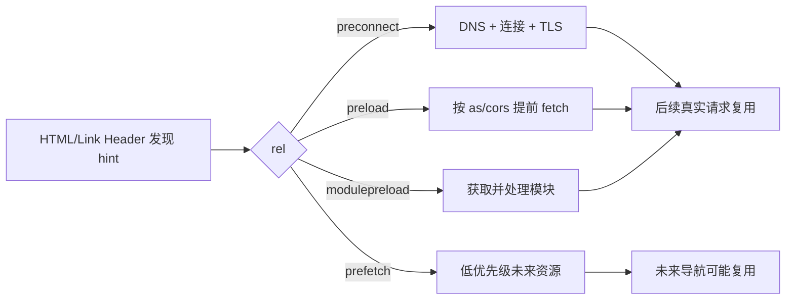

# preload、modulepreload、prefetch 与 preconnect：资源提示的证据化使用

资源提示让浏览器更早发现未来工作，但不是强制调度命令。`preload` 面向当前导航的已知资源，`modulepreload` 面向模块图，`prefetch` 面向可能的未来导航资源，`preconnect` 提前建立跨源连接，`dns-prefetch` 只提前名称解析。每个提示都会消耗网络、连接、内存或隐私预算，必须用瀑布图和用户指标验证。

## 1. 提示与实际消费



提示成功的条件是后续真实消费与提前工作匹配。URL、credentials mode、destination、integrity 或响应缓存策略不匹配，可能产生两次请求。

## 2. preload

```html
<link
  rel="preload"
  href="/fonts/brand.woff2"
  as="font"
  type="font/woff2"
  crossorigin
>
```

preload 为当前导航提前 fetch 资源，不自动执行脚本、应用样式或显示图片。真正的 stylesheet、font-face、img、script 仍负责消费。

### 2.1 `as`

`as` 表示请求 destination，影响优先级、CSP、Accept 和缓存匹配。常见值：`style`、`script`、`font`、`image`、`fetch`。缺失或错误会导致浏览器警告、错误优先级或无法复用。

### 2.2 `type`

MIME 提示允许浏览器在不支持格式时跳过下载：

```html
<link rel="preload" href="/hero.avif" as="image" type="image/avif">
```

若 picture 有多个格式，不能无条件预载所有候选，否则下载不会使用的资源。优先让 `<picture>/` 早出现，只有确认 LCP 发现仍晚时再加匹配提示。

### 2.3 `crossorigin`

字体即使同源也按字体获取规则使用 CORS mode，preload 应匹配 `crossorigin`。API fetch 是否带凭证也必须匹配真实请求。`crossorigin="anonymous"` 与空属性等价于 anonymous；`use-credentials` 会带凭证，不能随意用于公共资源。

### 2.4 响应头 Link

```http
Link: </assets/app.css>; rel=preload; as=style
```

响应头可在 HTML body 解析前提供提示，但仍要在主响应头到达后。103 Early Hints 能在最终响应前发送 Link，适合服务器仍处理时提前关键资源；代理/CDN/客户端支持与缓存语义需实测。

### 2.5 103 Early Hints 的部署边界

```http
HTTP/1.1 103 Early Hints
Link: </assets/app.css>; rel=preload; as=style

HTTP/1.1 200 OK
Content-Type: text/html; charset=utf-8
```

103 是信息响应，不是最终状态。服务器可以在鉴权或页面数据仍处理时发送，但不能提前泄露只有授权用户才应知道的私有资源 URL，也不能让有副作用的请求通过 hint 发起。最终响应仍可能是 404/500，因此只提示不同结果都安全使用的公共资源。

CDN 可能生成、转发、合并或忽略 Early Hints。验证抓取线上的原始响应和浏览器瀑布，确认 CSS 请求真的早于最终 200 响应头，而不是只看到配置已开启。还要比较源站计算足够长的场景；最终响应本来在几十毫秒内到达时，103 可能没有可测收益。

## 3. modulepreload

```html
<link rel="modulepreload" href="/assets/app.js">
<script type="module" src="/assets/app.js"></script>
```

modulepreload 获取模块、解析并可编译，使模块 map 在执行时可用；用户代理还可获取依赖。它与 `as=script` 的普通 preload 语义不同。

构建工具通常根据入口生成 modulepreload。手工预载每个模块会与 hash、拆包和部署耦合。生产从 manifest/框架输出生成，并检查旧 HTML 引用旧 chunk 的部署兼容。

动态 import 的低频路由不应全部 modulepreload；这会把 code splitting 重新变成首屏下载。对高概率下一导航可在 hover/viewport/空闲策略下预取。

## 4. prefetch

```html
<link rel="prefetch" href="/assets/report-route.js" as="script">
```

prefetch 表示未来导航可能使用，通常较低优先级，由浏览器根据网络、缓存、用户设置决定是否执行。它不保证下载，也不保证缓存保留到未来导航。

不适合：用户很少访问的大资源、按用户不同的私人响应、Save-Data/受限网络、马上需要的当前关键资源。未来导航 HTML prefetch 还涉及 Cookie、缓存和隐私，不能无条件预取敏感 URL。

## 5. preconnect

```html
<link rel="preconnect" href="https://cdn.example.com" crossorigin>
```

preconnect 提前执行 DNS、传输连接和 TLS，能减少该 origin 首次关键请求的等待。它不下载具体资源。

连接有 socket、内存、服务器状态和移动无线电成本。浏览器只会维护有限预连接；对十几个第三方都 preconnect 会挤占真正关键 origin。通常只给 1–3 个已知、很快使用且连接成本显著的跨源。

`crossorigin` 应匹配后续 CORS/credentials 模式。只写 host 不写正确 scheme/port 也不能复用另一 origin。

## 6. dns-prefetch

```html
<link rel="dns-prefetch" href="//analytics.example.com">
```

它只提前 DNS，不建立连接。成本低于 preconnect，收益也小。用于较晚可能访问的第三方；如果马上需要关键请求，preconnect 已包含 DNS，不必重复两种提示。

受 CSP、浏览器设置、代理与隐私策略影响。功能不能依赖 hint 执行。

## 7. Speculation Rules 与普通 prefetch

Speculation Rules API 用 JSON 规则表达文档级 prefetch/prerender 候选，可按 URL pattern、selector/eagerness 等选择导航。它比单个 link 更适合站内预测导航，但预渲染执行更多页面工作，隐私、服务端副作用和资源成本更高。

```html
<script type="speculationrules">
{
  "prefetch": [{
    "where": { "href_matches": "/courses/*" },
    "eagerness": "moderate"
  }]
}
</script>
```

JSON 必须是有效规则；CSP 的 `script-src` 控制 inline speculationrules，导航预取受相应策略。GET 页面不得因“被访问”产生写副作用；认证、库存、一次性 token 页面要排除。

## 8. Priority Hints

```html

```

`fetchpriority` 的 high/low/auto 是提示，改变同类型资源相对调度，不提前发现 URL。hero 在外部 CSS 中时，high 无法在 CSS 解析前生效；应先解决发现链。

不要把所有资源设 high。低优先级也不是延迟加载：资源仍可立即请求。加载时机用 lazy、动态 import 或条件插入控制。

## 9. 响应式图片 preload

```html
<link
  rel="preload"
  as="image"
  href="/hero-1280.jpg"
  imagesrcset="/hero-640.jpg 640w, /hero-1280.jpg 1280w"
  imagesizes="100vw"
>
```

`imagesrcset`/`imagesizes` 让浏览器按 viewport 和 DPR 选择候选，避免预载固定大图后 `` 又选择小图。对应 img 的 srcset/sizes 必须一致。picture 的 type/media 组合更复杂时，优先早放 img/picture 并验证请求数量。

## 10. 字体 preload

字体 URL 藏在 CSS 的 @font-face，可能晚发现。只预载首屏真实使用的一个或少数 woff2 子集：

- URL 与 CSS 完全相同；
- crossorigin 匹配；
- 服务器 Content-Type 与 CORS 正确；
- unicode-range 与文本命中；
- font-display 策略控制交换；
- 不预载每个粗细/语言。

字体预载可能抢 LCP 图片带宽。实测文本 FCP/LCP、CLS、字体命中与网络竞争。

## 11. 案例一：跨源字体和 LCP 图片竞争

### 输入

head 预载 6 个字体，全设高优先级；hero 图片 300 ms 后发现。Slow 4G 下字体占用早期连接，LCP 3.4 s。页面首屏只用 regular Latin 与一张 hero。

### 方案

A. 移除全部字体 preload，依赖 CSS，hero 优先；文本可能后换字体。B. 只预载一个 regular subset，并使用 font-display；平衡。C. 系统字体首屏，品牌字体仅标题后加载；视觉差异最大、网络最小。

### 输出

选 B：只保留一个 28 KB woff2，hero HTML 早发现并 fetchpriority high。LCP p75 降 480 ms，字体切换 CLS 保持 <0.02。

### 失败分支

预载 URL 无 `crossorigin`，真实 font 请求使用 CORS，Network 出现双请求。修正属性和服务器 ACAO，确认仅一个 transfer。

## 12. 案例二：报表路由预测加载

### 输入

报表 route JS 420 KB，用户进入概率 12%；首页 prefetch 导致所有用户多流量，移动用户退出率不变且 CDN egress 上升。

### 方案

1. 删除无条件 prefetch；
2. 用户 hover/focus 报表导航 100 ms 后启动，防止快速划过；
3. 仅非 Save-Data、effectiveType 合理、页面空闲时执行；
4. 点击时仍有 skeleton 和错误恢复；
5. 记录 prefetched-and-used ratio。

输出：额外流量显著下降，真正导航者等待小幅改善。prefetch 失败不影响点击后的正常加载。

失败注入：发布后旧页面预取已删除 chunk，捕获 preload error 并刷新前保护未保存草稿；部署保留旧 hash 资源是首选。

## 13. 案例三：API preconnect 无收益

### 输入

为 `api.example.com` 加 preconnect，但 API 请求在用户登录后 30 秒才发生；连接在此之前被 idle timeout 关闭，RUM connect time 无变化。

### 处理

删除 head preconnect，改在用户打开登录 dialog 时建立，或把 API 与页面通过边缘同源代理复用连接。比较额外连接数、API connect 和服务端 idle resource。

同源代理增加缓存、CORS 和故障域责任，不能只为少量握手收益引入。

## 14. DevTools 与 RUM 验证

1. Network 查看 Initiator 是否 preload/prefetch；
2. 检查真实消费是否显示 from preload cache；
3. 查 Console 的 “preloaded but not used” 警告；
4. 统计重复 URL 是否因 credentials/destination 不匹配；
5. 在 Slow 4G/CPU 下看带宽竞争；
6. 对比有/无 hint 的随机实验；
7. 记录 LCP、INP、流量、连接数、used ratio；
8. RUM 按设备/网络/缓存状态分层。

## 15. 安全、隐私与成本

- preconnect 暴露用户可能访问的 origin；
- prefetch/prerender 可向服务端发送 Cookie 和访问痕迹；
- GET 必须安全，不因预取执行购买/退出/删除；
- CSP 限制允许的连接与资源；
- 跨源 Timing-Allow-Origin 不应无必要开放；
- 预测加载消耗用户流量、电量、CDN 和服务器成本；
- 个性化资源避免公共缓存串用户。

## 16. 决策表

| 问题 | 首选 |
|---|---|
| 当前页关键 URL 已知但发现晚 | preload/modulepreload，先修 HTML 发现 |
| 当前页马上访问关键跨源 | 少量 preconnect |
| 未来可能访问第三方 | dns-prefetch 或不提示 |
| 高概率下一路由资源 | 条件 prefetch |
| 文档级高置信导航 | Speculation Rules，严格排除副作用 |
| 资源已早发现但优先级低 | fetchpriority，经测量使用 |

## 17. 综合练习

为内容首页建立资源提示实验，包含 hero、两个字体、API 和两个路由 chunk。

验收标准：

1. 每个 hint 写出实际消费者和匹配属性；
2. Network 无重复请求和未使用 preload 警告；
3. 通过 A/B 测 30 次冷缓存 p75 LCP；
4. 报告总传输、浪费字节、连接数和 used ratio；
5. Save-Data/慢网不做低价值预测；
6. GET 页面无预取副作用，敏感路由排除；
7. 发布切换时旧 chunk 仍可用或可安全恢复；
8. 至少比较无 hint、静态 hint、交互预测三种方案。

## 来源

- [WHATWG HTML：Link type preload](https://html.spec.whatwg.org/multipage/links.html#link-type-preload)（访问日期：2026-07-17）
- [WHATWG HTML：Link type modulepreload](https://html.spec.whatwg.org/multipage/links.html#link-type-modulepreload)（访问日期：2026-07-17）
- [W3C Resource Hints](https://www.w3.org/TR/resource-hints/)（访问日期：2026-07-17）
- [WHATWG HTML：Speculative loading](https://html.spec.whatwg.org/multipage/speculative-loading.html)（访问日期：2026-07-17）
- [MDN：fetchpriority](https://developer.mozilla.org/docs/Web/API/HTMLImageElement/fetchPriority)（访问日期：2026-07-17）
