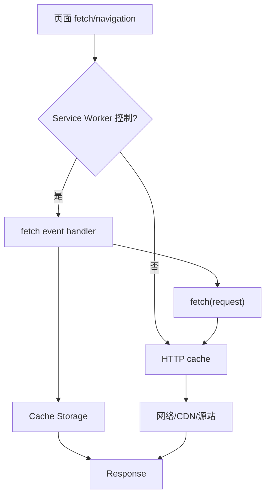

# HTTP Cache 与 Service Worker Cache：新鲜度、重验证和离线一致性

HTTP cache 按协议字段自动复用响应，Service Worker Cache API 由应用代码显式存取 Request/Response。两层可同时存在：Service Worker 拦截 fetch 后决定访问 Cache Storage、网络，而它发起的网络请求仍可能经过 HTTP cache。正确设计必须明确 cache key、freshness、validation、invalidator、private data 和失败恢复。

## 1. 两层缓存路径



DevTools 的 “from ServiceWorker”“from memory cache”“from disk cache”“304” 表示不同路径。关闭 Network cache 不一定绕过 Service Worker；排障分别禁用/注销。

## 2. HTTP cache key

基础 key 通常包含请求方法和目标 URI，响应 `Vary` 让选定请求字段参与变体匹配：

```http
Vary: Accept-Encoding, Accept-Language
```

`Vary: *` 使响应不能用于后续请求。随意 `Vary: Cookie` 会把几乎每个用户变成独立变体并降低命中；若内容私人，应使用 private/no-store 或拆公开与私有内容。

只有可缓存方法/状态与符合规则的响应才能复用。POST 默认行为不能当作普通 GET cache 使用；业务幂等与 HTTP cacheability 是不同概念。

## 3. Cache-Control 指令

| 指令 | 作用 | 常见边界 |
|---|---|---|
| `max-age=N` | 从响应生成起 N 秒新鲜 | 共享和私人 cache 都可使用 |
| `s-maxage=N` | 覆盖共享 cache 新鲜度 | 浏览器通常忽略 |
| `public` | 响应可由共享 cache 存储 | 含 Authorization/私人数据需谨慎 |
| `private` | 仅私人 cache 存储 | 不等于加密或禁止浏览器存储 |
| `no-cache` | 可存储，但每次复用前重验证 | 不是“不缓存” |
| `no-store` | cache 不应存储该响应 | 已有副本清理和浏览器历史另有语义 |
| `must-revalidate` | stale 后必须成功验证才能用 | 离线时可能失败 |
| `immutable` | 新鲜期间不需主动刷新验证 | 配内容哈希 URL |
| `stale-while-revalidate=N` | stale 的 N 秒内可先用并后台验证 | 用户短时看到旧内容 |
| `stale-if-error=N` | 错误时可用一定期限 stale | 不适合严格实时/权限数据 |

### 3.1 典型策略

哈希资源：

```http
Cache-Control: public, max-age=31536000, immutable
```

HTML：

```http
Cache-Control: no-cache
ETag: "release-abc"
```

敏感响应：

```http
Cache-Control: private, no-store
```

HTML no-cache 可存但每次验证，确保拿到引用最新 hash 的文档；旧 hash 资源仍应保留一段时间支持长期标签页。

## 4. Age 与新鲜度

cache 根据响应生成时间、Date、Age 和驻留时间计算 current age，再与 freshness lifetime 比较。CDN 返回 `Age` 可帮助判断共享 cache 中停留时间，但不同层可能重写或不暴露内部状态。

客户端时钟不能作为服务器 cache 正确性的唯一依据。响应 Date 与 cache 算法处理时钟偏差。排障保存完整响应头、CDN cache status 和请求链。

## 5. 条件请求

### 5.1 ETag / If-None-Match

```http
ETag: "course-v42"
```

客户端重验证：

```http
If-None-Match: "course-v42"
```

未变化返回 304，不含完整响应体，cache 合并允许更新的字段后复用原内容。强 ETag 表示字节级一致，弱 ETag `W/` 允许语义等价；生成策略由服务器决定。

### 5.2 Last-Modified / If-Modified-Since

修改时间精度和语义较弱，适合文件资源；多个更新发生在时间精度内可能漏掉。若两种 validator 都有，条件优先规则按 HTTP 规范处理。

304 仍需网络 RTT 和服务器验证工作。对 hash 静态资源直接长期 fresh 比每次 304 更有效。

## 6. Service Worker 生命周期

Service Worker 经 register、install、waiting、activate；页面只有在被 active worker 控制后，fetch 才经过它。首次注册页面通常要下一次导航才受控，除非使用 `clients.claim()`，但立即接管旧页面可能造成版本不匹配。

```js
self.addEventListener("install", (event) => {
  event.waitUntil(
    caches.open("shell-v3").then((cache) => cache.addAll([
      "/offline.html",
      "/assets/app.css",
    ])),
  );
});

self.addEventListener("activate", (event) => {
  event.waitUntil(
    caches.keys().then((keys) => Promise.all(
      keys.filter((key) => key.startsWith("shell-") && key !== "shell-v3")
        .map((key) => caches.delete(key)),
    )),
  );
});
```

install 的关键预缓存失败会让新 worker 安装失败；不要把大量可选资源放 `addAll`。activate 删除旧 cache 前要考虑仍被旧页面使用的资源。

## 7. Cache API 语义

`cache.put(request, response)` 显式存储；Cache API 不自动尊重 HTTP freshness，也不会自动重验证或删除过期项。应用必须自行记录/决定版本和 TTL。

```js
async function cacheFirst(request) {
  const cache = await caches.open("static-v1");
  const hit = await cache.match(request);
  if (hit) return hit;

  const response = await fetch(request);
  if (response.ok) await cache.put(request, response.clone());
  return response;
}
```

Response body 是 stream，只能消费一次；存 cache 和返回调用方需 `clone()`。opaque 跨源响应 status 为 0、内容不可读，错误响应也可能 opaque；无条件缓存会永久保留第三方 404/异常。

### 7.1 match key

Cache.match 默认考虑完整 URL，但可配置 ignoreSearch 等选项。对 API 忽略 search 会把不同分页/用户查询当同一结果，危险。POST 等非 GET 不能直接用 Cache.add/put 的普通语义当通用业务 cache。

## 8. 常用策略

### Cache First

先 cache 后网络。适合 hash 静态资源；版本 URL 不变时会长期陈旧。

### Network First

网络成功更新 cache，失败用 cache。适合需要新鲜但允许离线旧副本的内容。必须设置超时，否则离线/弱网等待很久。

### Stale While Revalidate

立即返回 cache，同时 fetch 更新。适合短时陈旧可接受的头像/列表；后台更新不会自动让当前 UI 重新渲染，需消息或下次请求。

### Network Only / Cache Only

认证写请求用 network only；预缓存 shell可 cache only，但丢 cache 时要有明确错误。

## 9. 案例一：离线课程阅读

### 输入

用户主动点击“离线保存”，课程包含 HTML 数据、12 张图和视频链接。要求离线读取文本/图，视频不强制；课程更新需提示版本。

### 设计

1. 用户动作触发下载，不在访问时静默缓存数百 MB；
2. manifest 列资源 URL、版本、大小和 integrity；
3. 先检查 storage estimate 和配额；
4. 使用临时 cache `course-42-v7-staging` 下载并验证；
5. 全部关键资源成功后原子切换元数据到 v7；
6. 旧版本在新版本完成后删除；
7. 视频只保存清单/低码率版本，给出占用。

### 输出与验证

飞行模式重新打开应用，课程文本和图片可读；进度写 IndexedDB 队列，不假装已同步。版本 v8 到达时展示 38 MB 更新并由用户确认。

### 失败分支

下载到第 8 张图配额不足。保留 v6 可用版本，删除 staging，报告具体资源和可释放空间；不能先删旧版本导致两者都不可用。

## 10. 案例二：API cache 泄露用户数据

### 输入

Service Worker 用 `cache.match('/api/profile')` 缓存响应。用户 A 退出、B 登录，同一浏览器显示 A 资料。

### 根因

cache key 只有 URL，没有用户/会话；登出未清理；响应虽然 HTTP `private`，Cache API 的显式 put 不自动执行 HTTP cache private 语义。

### 修复选择

A. 不缓存认证 profile，network only；最安全。B. cache key 加不可逆 account scope 并在登录切换清理，仍有磁盘私人数据。C. 只缓存无个人数据的公开 profile。

选择 A。服务端仍发 `Cache-Control: private, no-store`，退出时清 Cache Storage/IndexedDB 并注销会话。验证 A→退出→B、离线、后退和多个标签。

失败注入：清理失败时应用不读取旧 private cache，宁可显示离线不可用。

## 11. 案例三：新旧版本混用

### 输入

新 Service Worker `skipWaiting()` 立即接管，旧页面 main.js 请求 lazy chunk；新 cache 没有旧 chunk，服务器已删除，功能崩溃。

### 方案

- 部署保留旧 hash 静态资源；
- worker 不立即接管，提示用户刷新；
- 更新前检测未保存草稿；
- cache 名按 release，旧 clients 全部关闭后清理；
- HTML no-cache，静态资源 immutable。

验证同时打开两个旧标签、发布、一个刷新一个不刷新；两者都能完成当前任务或收到安全更新提示。

## 12. Range、Streaming 与大文件

视频和大文件可能使用 Range 请求。普通 `cache.match` 的完整响应不能自动正确满足所有 byte range；Workbox 等实现也需完整资源和专门插件。不要把大型视频全读入内存拼片段。

Streaming response 可边下载边消费，但缓存副本和返回流需 clone/tee，增加资源。离线媒体优先平台支持的下载/存储方案和配额管理。

## 13. Storage 配额与淘汰

`navigator.storage.estimate()` 提供 usage/quota 估计；浏览器可在存储压力下淘汰非持久数据。`persist()` 是请求，不保证批准。离线功能必须能检测缺失并重新下载。

无界 cache 每个 URL/query 写入会耗尽空间。维护 LRU/版本/最大字节和按用户清理；Cache API 本身不提供大小和 TTL 索引，可用 IndexedDB 元数据管理，但二者操作不是天然跨库事务。

## 14. 调试路径

1. Application → Service Workers 查看 active/waiting/controller；
2. Cache Storage 查看 cache 名、key、响应；
3. Network 勾选/取消 Bypass for network；
4. 查看请求 from ServiceWorker、memory/disk、304；
5. 手动 Update/Unregister/Clear site data 测生命周期；
6. Offline/Slow 3G/HTTP 500 注入；
7. 多标签与版本发布；
8. 服务端/CDN 响应头用 curl 验证。

## 15. Cache 决策表

| 数据 | HTTP cache | SW Cache | 失效 |
|---|---|---|---|
| hash JS/CSS | 1 year immutable | 可预缓存 | 新 hash |
| HTML | no-cache + validator | 通常 network first/offline fallback | release |
| 公共内容 API | 短 max-age/SWR | 按需求 network first | 内容事件/TTL |
| 用户资料 | private/no-store | 默认不缓存 | 登录会话 |
| 离线用户选择内容 | server policy + explicit | 版本 cache | manifest/用户删除 |
| mutation | no-store | 不用 Cache API | 服务端幂等与同步队列 |

## 16. 安全与生产边界

- Service Worker 只能在安全上下文注册，scope 决定拦截范围；
- worker 脚本被攻陷可控制该 scope 请求，最小 scope/CSP/供应链；
- 不缓存 Authorization、Set-Cookie 语义相关私人响应；
- 离线 UI 不把 queued 写操作显示为服务器已确认；
- cache 失败不能阻止核心在线路径；
- 监控版本、install/activate 失败、cache hit、离线成功和配额。

## 17. 综合练习

实现离线课程 PWA，包含版本化 shell、公开课程、用户进度与主动下载。

验收标准：

1. 每类资源有 key、TTL、失效、上限和私人范围；
2. HTTP 头在真实响应验证；
3. Service Worker 首装、更新、waiting、activate、多标签均测试；
4. A/B 账户不串数据；
5. 配额不足保留旧可用版本；
6. 离线 mutation 明确 queued，恢复后幂等同步；
7. 服务器 500、超时、cache 损坏和 chunk 删除有恢复；
8. 报告 HTTP cache、Cache Storage、网络三条路径的证据。

## 来源

- [RFC 9111：HTTP Caching](https://www.rfc-editor.org/rfc/rfc9111)（访问日期：2026-07-17）
- [WHATWG Service Workers](https://w3c.github.io/ServiceWorker/)（访问日期：2026-07-17）
- [WHATWG Cache API](https://w3c.github.io/ServiceWorker/#cache-interface)（访问日期：2026-07-17）
- [MDN：Cache-Control](https://developer.mozilla.org/docs/Web/HTTP/Reference/Headers/Cache-Control)（访问日期：2026-07-17）
- [Storage Standard](https://storage.spec.whatwg.org/)（访问日期：2026-07-17）
