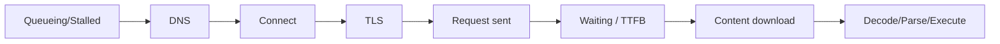
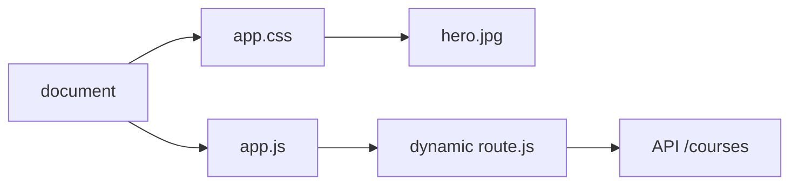
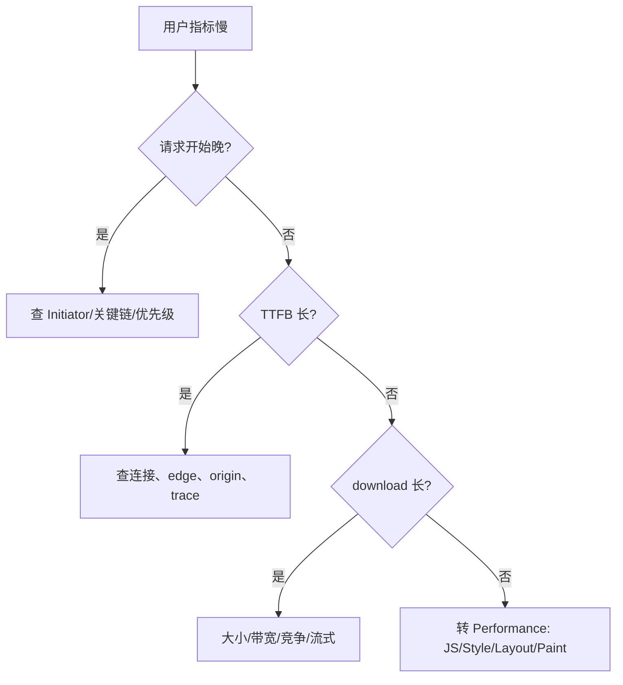

# Network 瀑布图：关键请求链、优先级与端到端定位

瀑布图按时间展示请求排队、连接、发送、等待和接收，但颜色条不是根因。中级分析需要把请求 initiator、dependency、priority、cache、protocol 与服务器 trace 连接起来，区分网络慢、发现晚、服务端慢、主线程阻塞和资源竞争。

## 1. 先定义分析问题

同一瀑布可回答不同问题：

- 为什么 LCP 图片开始晚；
- 为什么 API TTFB 高；
- 为什么路由 chunk 404；
- 为什么相同 URL 请求两次；
- 为什么资源下载完成但页面仍空白；
- 为什么第三方拖慢交互。

先选择用户动作、指标和样本，再录制。没有问题定义的瀑布容易只做请求数量清单。

## 2. 请求阶段



最后一段常不在 Network timing 条内，需要 Performance 面板。

### 2.1 Queueing / Stalled

可能来自请求优先级、连接可用性、代理协商、磁盘 cache、Service Worker、浏览器调度或主线程发起延迟。HTTP/2/3 有多路复用仍受服务器并发、拥塞和浏览器优先级限制。

### 2.2 DNS、Connect、SSL

仅新连接出现明显时间；复用连接时通常为 0。跨源详细 Resource Timing 没有 `Timing-Allow-Origin` 时字段可被清零。

### 2.3 Request Sent

GET 通常很短；大上传、慢上行或 request streaming 会明显。DevTools 显示的 header 体积和实际协议压缩不同；Cookie 过大仍会在许多请求携带并增加处理。

### 2.4 Waiting / TTFB

从请求发送到首字节，包括去程网络、边缘/CDN、服务端排队/处理、回源和回程首字节。不能直接叫“服务器计算”。用 Server-Timing、trace 和边缘日志分解。

### 2.5 Content Download

受编码后大小、带宽、丢包、拥塞、流式速度和竞争影响。下载条很长但 transfer size 小，可能是服务器流式/限速，而不只是用户带宽。

## 3. Initiator 与依赖图

Initiator 说明请求由 parser、CSS、script、preload、redirect、fetch 或其他资源触发。关键链不是最长条集合，而是“前一个完成/执行后才发现或允许下一个开始”的依赖。



减少 C 大小不能消除 A→B→C 的发现延迟；将 hero 放 HTML 可缩短链。API 若必须等 route JS 执行，可由路由 loader/SSR 提前。

## 4. Priority

浏览器按资源类型、发现位置、可见性、fetchpriority 和内部策略调度。Priority 是相对且可动态变化，不是严格队列。

典型问题：

- LCP img 加 loading=lazy，优先级和时机太晚；
- 所有 preload/fetchpriority high 抢关键 CSS；
- 第三方大脚本早请求；
- 字体全预载；
- iframe/图片未 lazy，首屏带宽竞争。

修改后验证 start time、实际带宽和 LCP，不只看 Priority 文字。

## 5. Cache 与传输字段

DevTools 常见：

- `(memory cache)`：当前浏览器进程内存复用；
- `(disk cache)`：持久 HTTP cache；
- `304`：网络重验证后复用 body；
- `from ServiceWorker`：响应经 worker；可能内部又访问网络/cache；
- transfer size 与 resource size：压缩/协议头/cache 影响差异。

禁用 cache 是冷启动实验，不代表真实重复访问。报告同时给 cold、warm、navigation type 和 Service Worker 状态。

## 6. Protocol、Connection ID 与多路复用

显示 Protocol、Connection ID、Remote Address：

- 同一 origin 的 h2 请求通常复用连接；
- 多个连接可能因 credentials、代理、服务器设置或不同 origin；
- h3 回退到 h2 需按样本记录；
- connection coalescing 可让证书/DNS 条件满足的不同 origin 共用，但不能依赖为应用契约。

大量短请求在 h2/h3 不等于免费，仍有 header、服务端工作、优先级和 JS 处理成本。

## 7. 重定向链

DevTools 勾选 Preserve log。检查：

- http→https；
- 裸域→www；
- locale/auth；
- API 版本；
- trailing slash；
- 登录循环。

主导航跨源重定向可能重复连接。服务端直接产生 canonical URL；内部链接一开始就指最终地址。写请求 307/308 保留方法，301/302/303 行为需按客户端和规范测试。

### 7.1 Waterfall 之外的关键列

瀑布条必须和其他字段一起读：

| 字段 | 能回答 | 不能直接推出 |
|---|---|---|
| Status | HTTP 结果或 cache 验证 | 200 不代表业务数据正确 |
| Type | document/script/fetch/font 等 | initiator 的完整调用链 |
| Initiator | parser、脚本调用栈、依赖 | 服务端内部依赖 |
| Priority | 浏览器当前调度提示 | 一定先完成或固定带宽 |
| Size | transfer/resource/cache 信息 | JS 解析执行成本 |
| Time | 从排队到完成 | 用户何时看到或可交互 |
| Protocol | h2/h3/http1.1 | CDN 到源站协议 |
| Remote Address | 当前网络端点 | 最终源站物理位置 |
| Connection ID | 是否可能复用连接 | 内部 stream 队列全部细节 |

自定义 Response Headers 列可显示 `x-cache`、`server-timing`、release 和 request ID。只展示安全字段；不要让内部拓扑和用户标识进入公共响应。

### 7.2 Request/Response 体

API 慢时检查请求是否意外上传巨大 JSON、base64 文件或全量查询；响应是否返回 50,000 条而 UI 只显示 50 条。Preview 自动格式化不等于传输格式，结合 Content-Encoding、Content-Length、transfer size 和 Response 原文。

OPTIONS 可能是 CORS preflight，不是重复业务调用。能否减少预检取决于跨源、方法和请求头设计；不能为少一个请求绕过 CSRF、授权或内容类型安全。敏感 payload 不进入共享 HAR、截图和录屏。

### 7.3 按资源类型定位后续阶段

Document 检查 redirect、TTFB、streaming 和 HTML 首批资源发现。CSS 检查 @import、阻塞、字体/图片依赖，下载后转 Performance 查看样式计算。JavaScript 检查 chunk/modulepreload，下载后查看 parse/compile/evaluate。

图片检查 srcset 候选、priority、尺寸、decode；字体检查 preload CORS、子集和文本命中。Fetch/XHR 检查 Effect 重复、abort、retry、credentials、cache 与 schema。WebSocket/SSE 长期 pending 正常，改看握手、消息帧、心跳、重连和 backpressure。

### 7.4 屏幕截图与 filmstrip

Performance filmstrip 把请求完成与视觉变化对齐。若 CSS 在 600 ms 完成但首屏到 2 s 才出现，查看主线程、字体和图片 decode；若 LCP 资源 1 s 完成但 3 s 才绘制，Network 不是终点。

截图只用于定位视觉时序，核心结论仍记录请求时间、主线程事件和 Web Vitals。动画、cookie banner 和随机内容会污染对比，应固定输入和 viewport。

## 8. 案例一：LCP 4.2 秒但下载不慢

### 输入

hero.jpg 传输 180 ms，开始于 2.5 s；Initiator 是 `marketing.css`，该 CSS 由 `route.js` 动态 import 后插入。LCP 4.2 s。

### 推理

1. 图片大小不是主瓶颈；
2. 请求链 document→main.js→route.js→CSS→hero；
3. hero 是内容图，应在 SSR/HTML 出现；
4. route CSS 可在路由匹配时预加载，但仍不如 HTML 直接发现；
5. 设置尺寸和高优先级。

### 输出

hero start 350 ms，LCP p75 2.1 s。验证不同 viewport、DPR、缓存和无 JS HTML。失败分支：预载固定 desktop 图造成 mobile 双下载，改响应式 preload 或只依赖 picture。

## 9. 案例二：API TTFB p95 高

### 输入

Network waiting 2.4 s，DNS/connect 为 0（连接复用）；Server-Timing `edge;dur=5, origin;dur=2100, db;dur=1800`。服务器 trace 显示缺索引查询。

### 处理

前端 preconnect、HTTP/3 和压缩都不能解决主要 1.8 s DB。后端加复合索引/改查询，edge cache 只在响应公共且可陈旧时使用。前端保留 timeout、cancel、retry 边界。

### 验证

DB span、origin TTFB 和浏览器 p95 同时下降；结果量和业务正确。失败分支：前端自动重试三次使数据库压力翻倍，重试仅对安全幂等且带 jitter/上限，429/Retry-After 尊重服务策略。

## 10. 案例三：请求重复

### 输入

同一 font URL 两条 200，一条 Initiator preload，一条 CSS。查看 Request Headers：preload 没 `crossorigin`，真实字体是 CORS anonymous。

### 修复

匹配 crossorigin、URL、type 和 destination。验证 transfer 只有一次。其他重复原因：不同 query/hash（hash 不发服务器但 cache key API不同）、Vary、credentials、Service Worker cache key、redirect、开发 StrictMode effect、无请求去重。

不能只根据 URL 相同就认定浏览器 bug。

## 11. 案例四：下载完成后页面仍空白

### 输入

HTML/CSS/JS 在 800 ms 全部完成，FCP 2.8 s。Network 看似正常；Performance 显示 main.js Evaluate 1.3 s、同步 JSON parse 400 ms、style/layout 250 ms。

### 处理

问题是主线程。减少初始 JS、分片数据、移 Worker/服务端、避免渲染巨树。Network 瀑布只证明获取完成，必须切换 Performance。

验证 CPU slowdown 下 FCP/Long Task/INP；失败注入低端设备。不能通过 preload 更多 JS 改善执行瓶颈。

## 12. HAR 的用途和风险

HAR 可保存请求、响应头、timing 和部分内容，用于离线共享/比较。它可能包含 Cookie、Authorization、query、响应个人数据和内部地址。

导出前使用无敏感测试账户，清理内容并按安全渠道传输。HAR timing 来自记录浏览器，不等同 packet capture，也不包含完整主线程执行。

## 13. Server-Timing 与 Trace

服务器可响应：

```http
Server-Timing: edge;dur=8, app;dur=42, db;dur=17
```

浏览器将其显示在 timing。公共响应不要暴露表名、内部主机或精确安全策略。Duration 是服务器报告，需定义包含范围。

请求 ID/traceparent 关联 CDN、网关、应用和 DB。浏览器 TTFB - server duration 的差额仍包含网络、队列和未报告阶段。

## 14. RUM 与实验室差异

DevTools 单样本用于机制定位；RUM 说明真实分布。切分：

- device memory/CPU proxy；
- effective connection、RTT；
- country/ASN/CDN POP；
- protocol；
- cache/Service Worker；
- release、route、登录状态；
- cold/warm navigation。

URL 去除 query/ID，低采样保护隐私和成本。p75/p95 不用平均值掩盖长尾。

## 15. 诊断决策树



## 16. 常见误判

1. TTFB 全算后端；
2. connection time 0 认为没有 TLS；
3. disable cache 结果代表所有用户；
4. 只减请求数，不看关键链和协议；
5. async 脚本不阻塞 parser就认为无成本；
6. 200/304 都当完整下载；
7. request priority 当强制保证；
8. 瀑布结束等于页面可交互。

## 17. 生产优化报告

每项结论包含：

- 用户问题与指标；
- 样本条件和分位数；
- 瀑布/trace 证据；
- 因果假设；
- A/B 或前后对照；
- 收益、成本、回归；
- 失败注入；
- 发布监控与回滚。

## 18. 综合练习

为一个 SSR 列表 + 客户端报表路由录制并优化瀑布。

验收标准：

1. 冷/热缓存、h2/h3、快/慢网各 30 样本；
2. 标出至少两条关键请求链；
3. 关联 Server-Timing 与 trace；
4. 制造并定位发现晚、DB 慢、重复 preload、chunk 404；
5. Network 与 Performance 分别找一个瓶颈；
6. 报告 p50/p75/p95 和传输/执行；
7. HAR 无敏感信息；
8. 至少两个优化有成本与回滚标准。

## 来源

- [W3C Resource Timing Level 3](https://www.w3.org/TR/resource-timing-3/)（访问日期：2026-07-17）
- [W3C Navigation Timing Level 2](https://www.w3.org/TR/navigation-timing-2/)（访问日期：2026-07-17）
- [W3C Server Timing](https://www.w3.org/TR/server-timing/)（访问日期：2026-07-17）
- [Chrome DevTools：Network reference](https://developer.chrome.com/docs/devtools/network/reference/)（访问日期：2026-07-17）
- [OpenTelemetry：Trace Context](https://www.w3.org/TR/trace-context/)（访问日期：2026-07-17）
