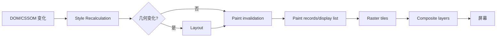

# Style、Layout、Paint 与 Composite：浏览器渲染流水线和失效范围

DOM 或 CSS 变化不会统一执行“完整重绘”。浏览器根据失效范围重新计算样式，必要时执行 layout，生成 paint records、光栅化 tiles，最后由 compositor 合成图层。优化要找到实际阶段和范围，避免把 `transform` 优化、reflow、repaint 当作万能口号。

## 1. 流水线



现代浏览器内部阶段和线程实现可变化，DevTools 名称也会演进。应用层可靠分类是：样式匹配、几何计算、像素绘制、已有纹理的合成。

## 2. Style Recalculation

样式计算为元素匹配选择器、处理 cascade、inheritance、custom properties 和计算值。变化可能只影响一个元素，也可能因继承/custom property 影响大子树。

```css
.theme-dark { --surface: #15171b; --text: #f3f5f7; }
.card { color: var(--text); background: var(--surface); }
```

在根节点切主题会让大量使用变量的元素重新计算，这是功能所需，不应简单禁止。减少无关 DOM、限制主题作用域、避免频繁逐节点写 style。

### 2.1 选择器成本

浏览器选择器匹配高度优化。真实大页面中 DOM 数、失效范围和频繁 mutation 常比“class 比 descendant 快”更关键。Performance 的 Recalculate Style 时长和 Selector Stats（可用时）作为证据。

复杂 `:has()` 能表达父级状态，但在高频变化的大范围 DOM 中需测量失效；不能因是新选择器就认定慢，也不能无测量铺满根级规则。

## 3. Layout

Layout 根据盒模型、字体、包含块、grid/flex、writing mode、viewport 等计算几何位置和尺寸。一个变化可能影响祖先、兄弟和后代。

会常引起 layout 的属性：width/height、padding/margin、border width、font metrics、display、positioning、grid/flex 结构和文本内容。具体范围取决于布局上下文。

### 3.1 Layout dependency

父宽变化会让文本换行，改变高度，再推动后续内容；图片缺尺寸在加载后改变几何，产生 CLS。为 img/video/iframe 设置 width/height 或 aspect-ratio，预留异步内容空间。

### 3.2 Forced synchronous layout

浏览器通常批量处理写入；脚本写样式后立即读需要最新几何的属性，会强制提前 layout：

```js
for (const item of document.querySelectorAll(".item")) {
  item.style.width = `${container.clientWidth}px`;
  console.log(item.offsetHeight);
}
```

读写交错会 layout thrashing。先批量读，再批量写；或使用 ResizeObserver/IntersectionObserver 和 CSS layout。

### 3.3 Layout 读 API

常见可能刷新布局：`offsetWidth/Height`、`clientWidth/Height`、`scrollTop` 某些读写、`getBoundingClientRect()`、`getComputedStyle()` 在特定条件。是否强制取决于 pending invalidation；读取 API 本身不是永久禁止。

## 4. Paint

Paint 把背景、边框、文字、阴影、图片等转成绘制指令。改变 color/background/box-shadow 通常不改几何，但需要 repaint。paint 可以只覆盖 invalidated region，不必整页。

昂贵 paint 来源：大面积 blur/filter、复杂阴影、渐变、大固定背景、频繁 canvas 绘制和超大区域。DevTools Paint Profiler/paint flashing 定位实际区域。

## 5. Raster

绘制指令被光栅化为 tiles/纹理。浏览器可在 raster worker 线程处理，且只光栅可见/即将可见区域。高 DPR、大图层、缩放和复杂 paint 增加内存与 GPU upload。

图片 decode 与 raster 不完全相同，但都可能影响可见时机。`img.decode()` 返回图片可解码完成的 Promise，可用于切换前避免空白，但不能让下载/解码免费；错误需处理。

## 6. Composite

Compositor 把已光栅化的图层按 transform、opacity、clip 等组合。只改变 transform/opacity 常可跳过 layout/paint，在 compositor 上更新。

```css
.drawer {
  transform: translateX(100%);
  transition: transform 180ms ease;
}
.drawer[data-open="true"] { transform: translateX(0); }
```

“只合成”不是绝对：元素未单独图层、filter、clip、内容变化、图层 promotion/demotion 都可能产生 paint。DevTools Layers/Rendering 验证。

## 7. 图层提升

浏览器依据 transform、video、canvas、3D context、will-change 等启发式建立 composited layer。

`will-change` 是提示：

```css
.dragging { will-change: transform; }
```

只在交互前短时添加，结束移除。给所有元素 `translateZ(0)`/will-change 会增加纹理内存、栅格和合成开销，移动端可能崩溃或变慢。

## 8. Containment

CSS containment 限制布局、样式、paint 或 size 影响范围：

```css
.dashboard-widget {
  contain: layout paint;
}
```

`contain: size` 会让元素尺寸计算不依赖内容，若没有显式/内在尺寸可能塌陷。`content-visibility: auto` 可跳过屏外子树渲染，并用 `contain-intrinsic-size` 提供占位估计，减少长页面初始工作。

这些属性改变布局、overflow、stacking/containing behavior，应用前测试 sticky、positioned、focus/find-in-page 和无障碍。屏外内容仍在 DOM/可访问树的具体行为按实现与规范验证。

## 9. 动画属性选择

| 动画 | 典型阶段 | 取舍 |
|---|---|---|
| transform | composite | 不改变文档流，周围元素不让位 |
| opacity | composite | 隐形元素仍可点击/聚焦，需状态控制 |
| width/height/top/left | layout+paint | 真实影响几何，但成本高 |
| background/color | paint | 小区域通常可接受 |
| filter/box-shadow | paint/composite 依实现 | 大 blur 可能昂贵 |

不能为性能把需要真实 reflow 的 accordion 改 transform 缩放文字造成失真。可用 grid rows/height 并限制区域，或接受一次 layout；性能和视觉语义一起评估。

## 10. 案例一：侧栏动画

### 输入

侧栏用 `left` 从 -360px 动到 0，60 帧内每帧触发大页面 layout/paint，低端机 FPS 35。

### 方案

A. fixed drawer + transform，主内容不让位；适合 overlay。B. 真正推开内容，用 width/grid，layout 成本但语义正确。C. 桌面静态栏、窄屏 overlay，按断点选择。

### 输出

产品要求窄屏 overlay，采用 transform；打开前加 will-change，完成后移除。主线程 layout 下降，帧稳定。focus trap、Escape、背景 inert 和 reduced motion 同时实现。

### 失败分支

只把 opacity 设 0 关闭，隐藏链接仍可 Tab。关闭态使用 hidden/inert/visibility 与交互状态同步，动画结束后再完成隐藏。

## 11. 案例二：无限列表 DOM 过大

### 输入

20,000 行全在 DOM；一次根 class 改变 Recalculate Style 180 ms、Layout 260 ms，内存 450 MB。

### 方案

A. `content-visibility:auto` 快速降低屏外渲染，DOM/内存仍大。B. 虚拟列表只保留可见窗口，复杂焦点/高度。C. 分页，交互最简单但连续浏览不同。

选 B，保留 overscan、稳定 key、动态高度测量和可访问列表语义；搜索/打印提供非虚拟路径。

### 验证

DOM 节点 <150，滚动无空白，键盘聚焦越界时滚入；style/layout p95 与 heap 降低。失败注入快速滚动、字体加载改变行高和 200% zoom。

## 12. 案例三：主题切换卡顿

### 输入

根节点切 140 个 custom properties，页面 8,000 节点；style 120 ms、paint 90 ms。

### 方案

减少首屏 DOM；将不受主题影响的嵌入区域隔离；合并一次 class 写而非逐元素；非关键屏外区域 content-visibility；接受一次必要重绘但避免在滚动高频触发。

不能通过截图覆盖/opacity 伪造主题后异步逐块更新，可能导致闪烁和可访问性不一致。测试对比、forced-colors、系统主题和过渡期间输入。

## 13. DevTools 分析

1. Performance 录制目标交互；
2. Main track 看 Recalculate Style/Layout/Paint；
3. Bottom-up 按 Self/Total time；
4. Layout 事件查看 invalidated nodes/原因（可用时）；
5. Rendering 开 paint flashing、layout shift regions、layer borders；
6. Layers 看纹理尺寸和层数量；
7. Performance monitor 看 DOM nodes、layouts/sec、GPU memory（可用时）；
8. CPU slowdown 和目标设备复验。

## 14. Layout Shift 与 layout 成本不同

CLS 衡量非预期视觉位置变化，不是 layout 执行时间。一次昂贵 layout 若元素最终不移动，CLS 可为 0；一次很快但用户可见的广告插入可产生高 CLS。

`layout-shift` PerformanceEntry 的 `hadRecentInput` 用于 CLS 会话窗口判断。修复资源尺寸、动态插入位置和字体，不通过禁止所有 layout。

## 15. 滚动、Sticky 与固定元素

滚动时浏览器优先让 compositor 移动已光栅内容，但页面仍可能因 scroll handler、sticky、fixed、parallax、复杂 clip/filter 触发主线程或 repaint。Passive listener 只表示处理器不会取消滚动，不会让处理器中的 80 ms 计算消失。

```js
window.addEventListener("scroll", () => {
  latestScrollY = window.scrollY;
  if (!scheduled) {
    scheduled = true;
    requestAnimationFrame(() => {
      progress.style.transform = `scaleX(${latestScrollY / maxScroll})`;
      scheduled = false;
    });
  }
}, { passive: true });
```

这段代码把多次事件合并到一帧，但每帧仍需读取/写入和边界处理。纯滚动进度可优先评估 CSS scroll-driven animations；业务功能需保留不支持时的静态回退，并尊重 reduced motion。

sticky 元素的包含块、overflow 祖先和 stacking context 会改变行为。DevTools paint flashing 若显示大面积每帧重绘，检查背景、阴影、blend/filter 与图层；不要先加 `will-change` 掩盖。

## 16. View Transitions 的流水线成本

View Transitions 捕获旧/新状态快照并由伪元素动画，能把 DOM 结构切换转成可合成视觉过渡。快照会占纹理内存；超大页面、多元素 `view-transition-name` 和同时解码图片可能增加成本。

过渡 API 不代替真实 DOM 更新、焦点管理和路由错误处理。更新回调失败时页面保持可用；动画仅视觉层，完成后焦点移到新页面标题。使用 `@media (prefers-reduced-motion: reduce)` 关闭非必要动画。

测量 old/new DOM 计算、snapshot、动画帧、图层内存和输入是否被阻塞。若低端设备成本高，直接无动画切换是有效回退。

## 17. 生产边界

- RUM 收集 LCP/INP/CLS，无法直接收每次内部 style/layout 完整时间；
- Long Animation Frames API（支持时）可提供长帧脚本与渲染时间，需特性检测；
- DevTools profile 使用测试数据和真实生产 build；
- 屏幕刷新率 60/120Hz 时每帧预算不同，不能固定说“永远16ms”；
- GPU/driver/电量状态影响，跨设备看分布；
- 优化不能破坏语义、focus、zoom、reduced motion。

## 18. 常见错误

1. 把 style、layout、paint 都叫 reflow；
2. 认为 transform 永远创建独立层；
3. 全局 will-change；
4. 只看 FPS，不看输入延迟和帧分布；
5. 用 JS 测量能由 CSS 完成的 layout；
6. content-visibility 未测试焦点/查找/打印；
7. 减少 repaint 却增加巨大图层内存；
8. 用 CLS 推断 layout CPU。

## 19. 两个完整实验

实验 A：1000 卡片主题切换，对比逐节点 inline style、根 class/custom properties、分区 containment。记录 style/layout/paint、总帧和 heap。

实验 B：drawer 对比 left、transform、grid 推开。分别测试 overlay 与内容让位，记录帧、图层内存、无障碍和 reduced motion。

验收标准：

1. 每方案至少 30 次同条件 profile；
2. 说明变化触发哪些阶段；
3. 有 DevTools trace 与可复现代码；
4. 低端 CPU、窄屏、200% zoom 测试；
5. 图层数量和内存不无界增长；
6. 键盘、focus、reduced motion 正确；
7. 提供收益、成本和适用条件；
8. 注入字体晚加载、图片无尺寸和超大 DOM。

## 来源

- [CSSOM View Module](https://www.w3.org/TR/cssom-view-1/)（访问日期：2026-07-17）
- [CSS Containment Level 2](https://www.w3.org/TR/css-contain-2/)（访问日期：2026-07-17）
- [MDN：Critical rendering path](https://developer.mozilla.org/docs/Web/Performance/Guides/Critical_rendering_path)（访问日期：2026-07-17）
- [Chrome DevTools：Rendering performance](https://developer.chrome.com/docs/devtools/performance/rendering-performance/)（访问日期：2026-07-17）
- [W3C Layout Instability](https://www.w3.org/TR/layout-instability/)（访问日期：2026-07-17）
