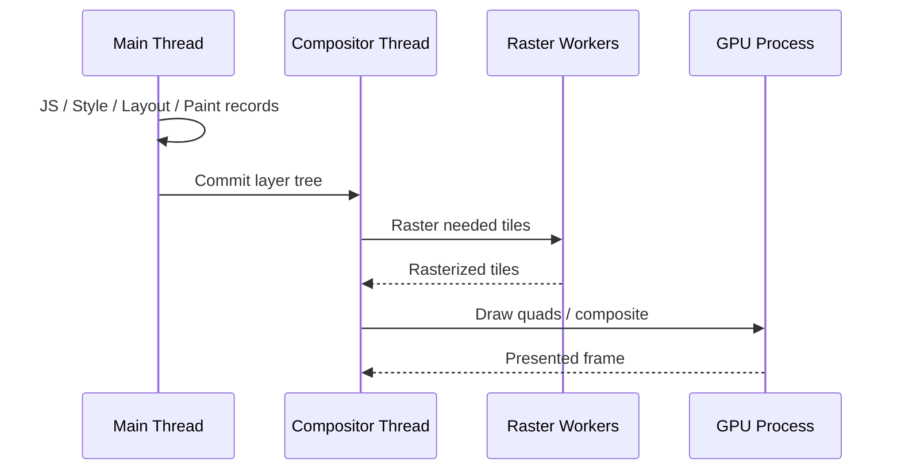
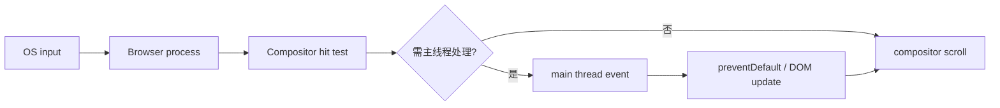

# 主线程、合成线程与光栅线程：帧生产、滚动和跨线程成本

浏览器进程/线程架构属于实现细节，但性能诊断需要稳定边界：JavaScript、DOM、style 与大部分 layout 在 renderer 主线程；compositor 可在不运行页面脚本时处理部分滚动与图层合成；raster workers 把绘制指令转成 tiles；GPU process 执行图形命令。线程并行不能消除依赖、同步和内存成本。

## 1. 一帧的协作



滚动、transform/opacity 动画若条件满足，可由 compositor 更新而主线程暂忙；但新暴露区域需要 raster，sticky/scroll handler/主线程滚动区域也可能拉回主线程。

## 2. Browser 与 Renderer 进程

多进程浏览器通常有 browser process 管导航、权限、输入和网络协调；renderer process 运行站点页面；GPU process 隔离图形工作；utility/network 等进程按实现拆分。站点隔离可能让 iframe 位于不同 renderer。

跨进程通信有序列化、复制/共享内存、调度和安全检查。把任务拆 iframe/worker 不等于零成本；消息频率和数据量必须测量。

## 3. 主线程

主要负责：

- JavaScript task 与 microtask；
- DOM mutation、event dispatch；
- style recalculation、layout；
- 生成 paint records；
- accessibility tree 部分更新；
- 与 compositor 提交。

主线程长任务会延迟输入处理、timer、render opportunity 和其他 script。网络可并行，但 response callback 仍需主线程执行 JavaScript（worker fetch 除外）。

## 4. Compositor Thread

compositor 维护图层树、可见区域、scroll offset 和合成。输入到达时，如果滚动区域没有需要主线程判断的监听/行为，可先滚动已有 layer，降低延迟。

Compositor-only animation 通常限 transform/opacity 等已有纹理操作。动画期间内容改变、需要新 raster、复杂 mask/filter 或图层不足会触发额外工作。

## 5. Raster Workers

paint records 描述绘制操作，raster workers 将 tiles 生成位图/纹理。浏览器按 viewport 与预测方向优先 raster；快速滚动可能看到 checkerboarding/空白，因为 tile 未及时生成。

影响 raster：

- 大图层和高 DPR；
- blur/shadow/filter；
- 超大图片缩放；
- 频繁 paint invalidation；
- tile cache 内存压力；
- 页面缩放与旋转。

光栅多线程不代表 paint 免费；工作仍消耗 CPU/GPU 和电量。

## 6. GPU Process

GPU 擅长并行像素/纹理合成，但上传纹理、显存和同步有成本。浏览器可能因 driver、远程桌面、电量或安全策略使用软件路径。不能把“GPU acceleration”当作一致环境。

DevTools/system trace 看实际 GPU/raster；CSS 没有“强制一定上 GPU”的可靠开关。

## 7. Input 流程与滚动



touch/wheel listener 非 passive 时，浏览器可能等待主线程确认是否 `preventDefault()`。对不取消滚动的 listener 使用 passive；需要自定义手势时限定小区域并保持处理短。

`touch-action` 用 CSS 声明允许的浏览器手势，比运行时反复取消事件更明确。例如横向 carousel `touch-action: pan-y` 允许页面纵向滚动。

## 8. Worker 的责任

Web Worker 有独立事件循环，可做纯 CPU、解析、压缩、搜索索引；不能直接访问 DOM。数据通过 structured clone、transferable 或 SharedArrayBuffer（需跨源隔离等安全条件）传递。

```js
// main.js
const worker = new Worker(new URL("./search-worker.js", import.meta.url), { type: "module" });
worker.postMessage({ type: "build", records });
worker.addEventListener("message", ({ data }) => renderResults(data));
```

若每次键入复制 100 MB 数据给 worker，传输成本可能超过计算。初始化一次索引，消息只传 query/小结果；大 ArrayBuffer 可 transfer 后原发送方失去所有权。

## 9. OffscreenCanvas

支持时可把 canvas control 转给 worker：

```js
const canvas = document.querySelector("canvas");
const offscreen = canvas.transferControlToOffscreen();
worker.postMessage({ canvas: offscreen }, [offscreen]);
```

适合图表、图像处理和游戏 render loop，但 DOM label、accessibility、resize/DPR 和输入仍在主线程协调。Canvas 像素没有自动语义，需要旁路 HTML/ARIA 信息。

## 10. 帧预算与调度

60 Hz 每帧约 16.7 ms，120 Hz 约 8.3 ms，但应用不能占满：浏览器还需输入、style/layout/paint/composite。后台标签和省电模式会节流；固定 16 ms 不是 API 保证。

目标是消除长尾阻塞，让交互能在下一合适帧响应。`requestAnimationFrame` 对齐绘制前回调，但其中 30 ms 工作仍掉帧；`scheduler.yield()`（支持时）可在长任务中让出，需回退。

### 10.1 Task、Microtask 与渲染机会

事件循环从 task queue 取一个 task 执行，随后执行 microtask checkpoint；浏览器在合适时机更新渲染。Promise 回调和 `queueMicrotask()` 进入 microtask。递归安排 microtask 可以让队列长期不空，推迟渲染和输入，虽然每个回调很短。

```js
function processInMicrotasks(items) {
  const next = () => {
    const item = items.shift();
    if (!item) return;
    process(item);
    queueMicrotask(next);
  };
  next();
}
```

上例不会向浏览器提供 task 间的渲染机会。长批处理用 task/yield 分片，并按时间预算而不是固定元素个数；输入 pending 时优先让出。microtask 用于保持同一 task 后的一致性，不是通用后台队列。

### 10.2 `requestIdleCallback` 的边界

支持时 idle callback 只在浏览器判断有空闲时执行，可能长期不运行；设置 timeout 又可能在繁忙时强制执行。适合可丢弃/低优先级预计算，不适合保存、授权、关键 analytics 或 UI 必需工作。

后台标签、节电和移动设备节流更明显。必须有正常路径和取消机制；任务仍需分片，不能在一次 idle callback 内运行 500 ms。

## 11. 图片解码、上传与显示

Network 下载完成不表示图片已显示。压缩图片需要 decode，随后参与 raster/GPU upload；大尺寸图片即使传输文件小，解码后的 RGBA 内存约为 `width × height × 4` 字节，4000×3000 单张约 48 MB，不含额外副本和 mipmap。

应用选择接近显示尺寸的响应式资源，限制用户上传像素维度，在 worker/服务端生成缩略图。CSS 缩成 100px 不会自动减少原图 decode 内存。

`decoding="async"` 是提示；`img.decode()` 可在替换前等待解码：

```js
async function replacePreview(img, url) {
  const candidate = new Image();
  candidate.src = url;
  await candidate.decode();
  img.replaceWith(candidate);
}
```

失败时 Promise reject，应保留旧图/错误占位。批量并行 decode 20 张大图会制造内存峰值；用可见性和小并发队列。

## 12. iframe 与跨进程边界

跨站 iframe 可能位于独立 renderer process，提升站点隔离，但父子仍共享屏幕、输入与资源。postMessage 使用明确 targetOrigin 和消息 schema；不要用 `"*"` 发送敏感数据。

iframe 内长任务不一定出现在父页面 Main track 同一位置，却仍会争用 CPU/GPU并影响用户。分别选择 frame target profile，关联父子时间线。sandbox 最小授权；第三方 frame 崩溃/超时保留占位和替代内容。

## 13. 案例一：大型 JSON 解析阻塞

### 输入

fetch 5 MB JSON，下载 400 ms，主线程 `response.json()` + normalize 520 ms；点击延迟 480 ms。

### 方案

A. 后端分页/裁剪字段，减少根因。B. worker fetch/parse/normalize；JSON.parse 本身在 worker，但数据 clone 回主线程。C. 流式 NDJSON 分批处理，协议复杂。

先实施 A 将响应降到 500 KB，再用 worker 建搜索索引，只回前 50 ID。输入保持响应；总 CPU 未消失但移出主线程。

### 验证

记录 transfer、worker task、main Long Task、INP、内存。失败分支：worker 返回完整复制对象造成 2× heap；改只返回 ID/Transferable，并限制索引缓存。

## 14. 案例二：Canvas 图表滚动卡

### 输入

主线程每帧绘制 100k 点 22 ms，页面滚动掉帧。Canvas 还每帧按 DPR 重设 width 导致清空和内存波动。

### 方案

- 数据降采样到像素密度；
- OffscreenCanvas worker 绘制；
- resize 只在实际尺寸/DPR 变化；
- 主线程只传 viewport 与交互；
- HTML 提供图表标题、摘要和表格替代。

输出：主线程帧工作 <3 ms，worker raster 可并行。失败注入不支持 OffscreenCanvas，回退主线程低分辨率/静态图。

## 15. 案例三：滚动 listener 阻塞 compositor

### 输入

document 上 wheel listener 未 passive，每次读 500 个元素 rect 再写 class。Scrolling performance issues 标记主线程滚动区域。

### 修复

使用 passive；可见性改 IntersectionObserver；读写批量；元素状态只更新变化项。若需要阻止 carousel 横向手势，用 touch-action 和局部 pointer events。

验证 wheel/touch、低端 CPU、nested scroller；不能只在鼠标桌面测。

## 16. 案例四：图层太大导致 raster 压力

### 输入

长页面每个 card `will-change: transform`，800 layers，纹理数百 MB；滚动出现 checkerboarding。

### 修复

移除全局 will-change，只在拖拽/动画前添加；缩小 layer bounds；减少大 blur；虚拟化屏外 DOM。Layers/Memory 与滚动帧复验。

## 17. 跨线程通信取舍

| 方式 | 优点 | 风险 |
|---|---|---|
| structured clone | 易用、支持多种结构 | 大对象复制/遍历成本 |
| Transferable | ArrayBuffer 所有权转移，少复制 | 发送方 buffer detached |
| SharedArrayBuffer | 共享低延迟 | 原子同步、数据竞态、跨源隔离 |
| MessageChannel | 独立消息端口 | 仍有 clone/排队 |
| Comlink 类 RPC | API 友好 | 隐藏消息/序列化成本 |

Shared memory 需要清晰协议、Atomics 和安全 header；普通应用优先消息传递。

## 18. DevTools 与 Trace

1. Performance 录制并展开 Main、Compositor、Raster、GPU；
2. 看 Frames track 的 dropped/partial；
3. 看 Event Log/Bottom-up 主线程函数；
4. Rendering 开 layer borders、scrolling performance issues；
5. Layers 查看层大小、memory；
6. worker 目标单独 profile；
7. system trace 在需要时观察 GPU/进程；
8. 生产 build、真实数据和设备复验。

## 19. 安全、无障碍与恢复

- worker URL 受 CSP worker-src；
- worker 中异常/崩溃要重建并降级；
- 数据传 worker 前按最小权限，不发送 token/完整 PII；
- canvas/worker 渲染提供语义替代；
- 页面隐藏时暂停非必要 render loop；
- 内存压力下清理 tiles、缓存和 worker；
- 版本发布保证 worker chunk 与 main 协议兼容。

## 20. 常见错误

1. 所有计算扔 worker，不算传输；
2. passive 解决 listener 内 CPU；
3. rAF 自动在 compositor；
4. transform 一定不 raster；
5. GPU 层越多越快；
6. OffscreenCanvas 自动有无障碍；
7. 只看平均 FPS；
8. worker 异常无 fallback。

## 21. 综合练习

构建 100k 数据图表与可搜索列表，分别实现全主线程、worker 索引、OffscreenCanvas。

验收标准：

1. 输出线程/消息/图层图；
2. 记录主线程 Long Task、帧、worker CPU、clone/transfer、heap；
3. 60/120Hz 和低端 CPU 测试；
4. 注入 worker 加载失败、崩溃、消息乱序和旧协议；
5. unsupported OffscreenCanvas 有回退；
6. 键盘、屏幕阅读器、缩放可访问；
7. 页面隐藏暂停工作，恢复不跳帧；
8. 比较至少三种方案的收益与维护成本。

## 来源

- [HTML Standard：Event loops](https://html.spec.whatwg.org/multipage/webappapis.html#event-loops)（访问日期：2026-07-17）
- [W3C Web Workers](https://html.spec.whatwg.org/multipage/workers.html)（访问日期：2026-07-17）
- [HTML Standard：Structured serialize](https://html.spec.whatwg.org/multipage/structured-data.html#structuredserialize)（访问日期：2026-07-17）
- [WHATWG OffscreenCanvas](https://html.spec.whatwg.org/multipage/canvas.html#the-offscreencanvas-interface)（访问日期：2026-07-17）
- [Chrome RenderingNG Architecture](https://developer.chrome.com/docs/chromium/renderingng-architecture)（访问日期：2026-07-17）
