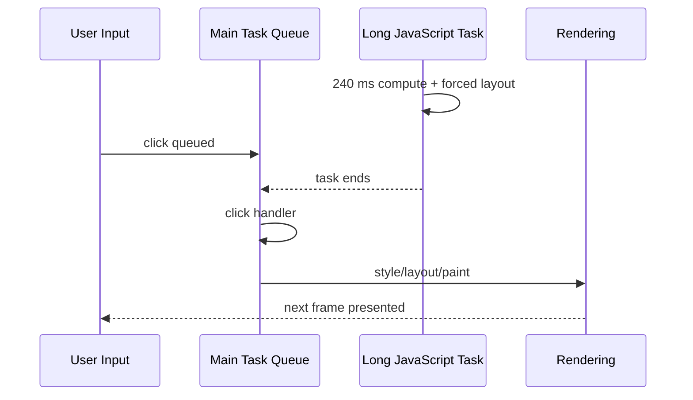

# Long Task 与 Layout Thrashing：输入延迟、强制布局和批量修复

Long Task 是主线程连续占用超过 50 ms 的 task；它会延迟输入、定时器和渲染机会。Layout thrashing 是脚本在同一 task/多帧中交错写入样式与读取几何，迫使浏览器反复同步 layout。两者相关但不相同：纯计算可形成 Long Task 而无 layout；短 task 也可触发昂贵强制 layout。

## 1. 输入为什么等待



交互延迟包含 input delay、事件处理和 presentation delay。只把 handler 优化到 5 ms，若之前排队 200 ms 或之后 layout 150 ms，INP 仍慢。

## 2. Long Tasks API

```js
const observer = new PerformanceObserver((list) => {
  for (const entry of list.getEntries()) {
    console.log({ start: entry.startTime, duration: entry.duration });
  }
});

observer.observe({ type: "longtask", buffered: true });
```

Long Tasks API 记录超过 50 ms 的长任务和有限 attribution。它不是完整 profiler：不提供每个函数、layout 原因或所有跨源细节。生产采样用于发现时段/route/release，DevTools profile 用于根因。

`duration - 50ms` 常称 blocking portion，但不能直接等于某次输入 delay；输入是否在该时间到达决定影响。

## 3. Long Animation Frames

Long Animation Frames API（目标浏览器支持时）观察超过阈值的长帧，并提供脚本/渲染相关信息，比 Long Task 更接近一帧从工作到呈现。使用特性检测和采样；字段/可用性按浏览器实现。

```js
if (PerformanceObserver.supportedEntryTypes.includes("long-animation-frame")) {
  new PerformanceObserver((list) => {
    for (const frame of list.getEntries()) sendLongFrame(frame);
  }).observe({ type: "long-animation-frame", buffered: true });
}
```

发送前移除完整 URL、函数参数和用户数据，限制事件体积。

## 4. Layout Thrashing 机制

脚本写 DOM/CSS 后，浏览器标记 style/layout dirty。若脚本在渲染步骤前读取需要最新几何的值，浏览器必须同步刷新：

```js
for (const row of rows) {
  row.style.width = `${container.clientWidth}px`; // 读 + 写
  row.style.height = `${row.scrollHeight}px`;     // 读 + 写
}
```

每次循环都可能让上次写入失效，再被下一次读取强制计算。复杂度不仅是 n 次 API，还可能每次 layout 影响大量 DOM。

## 5. 批量读取与写入

```js
const width = container.clientWidth;
const heights = rows.map((row) => row.scrollHeight);

requestAnimationFrame(() => {
  rows.forEach((row, index) => {
    row.style.width = `${width}px`;
    row.style.height = `${heights[index]}px`;
  });
});
```

这减少读写交错，但两组测量之间 DOM/字体可能变化。更好的方案可能是 CSS grid/flex/auto height，完全不由 JS 设置。批处理库只能管理时序，不能修复错误布局模型。

## 6. 哪些读操作可能强制布局

常见：`getBoundingClientRect()`、offset/client/scroll 几何、`getComputedStyle()` 某些属性、range/client rect、focus/selection 和 scroll 写。具体是否同步刷新取决于已有 dirty state、viewport/media query 和实现。

规则不是“禁止读”，而是：

- 在写入前集中读取；
- 不在高频循环重复不变测量；
- 用 observer 接收异步变化；
- 缩小 DOM 与 layout scope；
- 用 profile 识别 Forced reflow。

## 7. Observer 替代轮询

### ResizeObserver

监听元素 content/border box 尺寸变化。回调在渲染流程特定阶段执行；回调再改被观察尺寸可能形成 resize loop，浏览器会限制并报告。

### IntersectionObserver

异步观察交叉状态，适合 lazy/曝光/虚拟化提示，不保证像素级每帧同步。广告计费等需定义阈值、可见时长和页面可见性。

### MutationObserver

观察 DOM mutation，不提供布局尺寸。回调是 microtask；大量 mutation 可产生批量 records，处理必须短并断开不再需要的 observer。

## 8. 拆分 CPU Long Task

```js
async function processRecords(records, signal) {
  let index = 0;
  while (index < records.length) {
    const deadline = performance.now() + 8;
    while (index < records.length && performance.now() < deadline) {
      normalize(records[index]);
      index += 1;
    }
    if (signal.aborted) throw signal.reason;
    await yieldToMain();
  }
}
```

时间切片适应记录复杂度。`yieldToMain` 可用 `scheduler.yield()`，不支持时用 MessageChannel/setTimeout fallback。Promise.resolve 只排 microtask，不给渲染机会。

分片增加总调度开销，并让中间状态可见；用双缓冲/事务式 commit，只在完整或安全 checkpoint 更新 UI。

## 9. Worker 方案

CPU 纯计算 >50–100 ms 且输入可序列化，worker 可释放主线程。适合搜索索引、压缩、解析、图像；不适合依赖 DOM/layout。

对比：

| 方案 | 输入响应 | 总完成 | 复杂度 |
|---|---|---|---|
| 同步 | 最差 | 可能最短 | 低 |
| task 分片 | 好 | 调度后略长 | 中，需取消/进度 |
| worker | 好 | 取决于传输/启动 | 高，协议/错误/版本 |
| 服务端/减少数据 | 常最佳 | 网络/服务成本 | 跨系统 |

### 9.1 Scheduling API 的优先级与取消

支持时可使用 `scheduler.postTask()` 按 `user-blocking`、`user-visible`、`background` 提交 task，并用 TaskController 调整/取消：

```js
const controller = new TaskController({ priority: "background" });

const promise = scheduler.postTask(
  () => rebuildIndex(),
  { signal: controller.signal },
);

function promoteForSearch() {
  controller.setPriority("user-visible");
}
```

优先级只影响调度，不缩短 `rebuildIndex()` 内部 300 ms 同步工作。回调仍需分片或移 worker。TaskSignal 的取消在 task 开始前有效；开始后的同步函数不会被抢占，代码在 checkpoint 主动读 signal。

浏览器不支持时用明确的小型 scheduler abstraction 回退 MessageChannel/setTimeout。不要在业务各处直接散落不同调度 API，使测试与取消无法统一。

### 9.2 `scheduler.yield()` 的连续任务

`await scheduler.yield()` 让当前异步工作暂停并安排后续 continuation，通常比随意 setTimeout 更能保留任务连续性/优先级。它不是标准 JavaScript Promise 微任务，也不保证固定等待时间。

```js
async function hydrateCards(cards, signal) {
  for (let index = 0; index < cards.length; index += 1) {
    if (signal.aborted) throw signal.reason;
    hydrateCard(cards[index]);
    if (index % 20 === 19) await scheduler.yield();
  }
}
```

按固定 20 个只是起点；卡片复杂度变化时改时间预算。UI 允许部分完成，并在取消时清理临时状态。

## 10. GC、内存分配与长帧

高频循环每帧创建大量数组、对象和字符串，会增加 GC 压力；GC pause 可能出现在用户交互附近。解决不是把所有对象变全局池：对象池增加生命周期、旧引用和内存常驻，也可能更慢。

先用 Allocation sampling/Memory timeline 证明分配热点。减少不必要中间数组、重复 JSON stringify、每帧闭包和巨大临时 buffer；Transferable 及时释放所有权；缓存设置上限。

案例：图表每 pointermove 对 100k 点 `map().filter().sort()`，单次脚本 40 ms但每几次触发 90 ms GC。改为预构建索引、复用受控 typed array scratch buffer、只计算邻域，既降低 task 又降低 allocation。验证 heap sawtooth、GC event、INP 和数据正确。

## 11. 案例一：表格自动测宽

### 输入

2,000 cells 渲染后逐个 `getBoundingClientRect()`，每次写 column width；Performance 有 600 次 Forced reflow，总 480 ms。

### 方案

A. CSS table/grid 自动布局，最少 JS；B. 抽样每列代表 cell，一次读后统一写 CSS variable；C. canvas measureText 离线估计，不含真实字体/样式；D. 虚拟化只测可见。

选择 B+D：每列 header+20 rows 测量，字体 ready 后一次重测，CSS variable 统一应用。列拖动只更新目标 variable。

### 输出与验证

强制 layout 从 600 次降到 2 次，交互 p75 90 ms。验证中英文长文本、字体迟到、200% zoom、RTL、动态列。

失败分支：只测可见行漏掉后续超长值；产品定义最大宽与省略/tooltip，不追求全部内容撑开。

## 12. 案例二：搜索过滤 50k 条

### 输入

每次 input 同步 lowercase+filter+sort+render，Long Task 320 ms；快速输入还依次计算已过时 query。

### 方案

1. debounce 减少触发，但会增加等待且最终任务仍长；
2. worker 构建规范化索引；
3. 每次 query 只发小消息并带 requestId；
4. 丢弃旧结果；
5. 只渲染前 100/虚拟列表；
6. 可取消/重建索引。

输出：键入保持响应，结果 60 ms 内更新。失败注入 worker 崩溃，回退服务端搜索/小数据同步，并展示明确状态。

## 13. 案例三：滚动视差 thrashing

### 输入

scroll 每事件读取 80 rect、写 top；120Hz 设备每秒数百事件，layout/paint 持续。

### 方案

A. 移除非必要视差；最佳可访问/性能。B. CSS scroll timeline；兼容回退。C. rAF 合并读、transform 写；仍有计算。D. IntersectionObserver 只做区段进入，不做逐像素。

选择 A 对 reduced-motion，B/C 对其他；变换不改变文档流。验证滚动、输入、图层内存和眩晕设置。

## 14. 案例四：React Effect 测量循环

组件 commit 后 Effect 测量 rect，再 setState 改 layout，下一 commit 再测，形成多次 layout/渲染。解决：优先 CSS；确需测量用 ResizeObserver；state 只在值实质变化时更新；避免浮点微差循环；useLayoutEffect 只在绘制前必须同步测量，且保持短。

开发 Strict Mode 额外周期会暴露不完整清理，但生产循环根因仍是依赖/状态模型。

## 15. DevTools 定位

1. Performance 选中 Long Task；
2. Bottom-up 找 Self time；
3. Call tree 查看触发路径；
4. 红三角/Forced reflow 查看脚本位置；
5. Layout event 查看影响节点；
6. 开 layout shift/paint flashing；
7. Event Timing/Interactions 关联用户输入；
8. CPU slowdown 重现长尾。

调试 console 自身会影响 timing；不要在循环大量 console.log 后测性能。

## 16. INP 关联

INP 选择页面生命周期中接近最差的交互延迟代表值（具体算法由 Web Vitals 定义）。改一条 click handler 不代表整体 INP 改善；菜单、输入、拖拽、第三方 task 都可能成为长尾。

RUM 记录 interaction type、target 的安全语义标识、release、duration 和 long task overlap；不采集输入文本或完整 selector/URL。

## 17. 生产防线

- performance budget：单 task/interaction/DOM node；
- CI trace 固定流程防回归；
- RUM p75/p95 + release；
- 第三方脚本长任务归因和 kill switch；
- AbortSignal 取消已过时分片/worker；
- 页面隐藏停止非关键工作；
- 低内存/低端 CPU 降级数据量和动画。

## 18. 常见错误

1. `setTimeout(0)` 让任务立即且无开销；
2. Promise 微任务能让浏览器绘制；
3. debounce 等于拆长任务；
4. rAF 内工作不会 Long Task；
5. 所有几何读取都强制 layout；
6. 批读写后不考虑字体/resize 失效；
7. worker 不算传输和内存；
8. 平均耗时掩盖 p95。

## 19. 综合练习

制造表格测量、50k 搜索和 scroll 视差三个性能故障，分别用 CSS/批读写、yield/worker、observer/scroll timeline 修复。

验收标准：

1. 每个故障有 trace、Long Task/LoAF、forced layout 证据；
2. 输出输入延迟、处理、呈现三阶段；
3. 比较至少三种修复取舍；
4. 旧 query 取消且不覆盖新结果；
5. 字体/resize/zoom 不制造测量循环；
6. reduced motion 和键盘正确；
7. 生产 RUM 脱敏并按 release 观测；
8. 注入 worker 失败、第三方长任务和 120Hz 滚动。

## 来源

- [W3C Long Tasks API](https://www.w3.org/TR/longtasks-1/)（访问日期：2026-07-17）
- [W3C Long Animation Frames](https://w3c.github.io/long-animation-frames/)（访问日期：2026-07-17）
- [W3C Event Timing](https://www.w3.org/TR/event-timing/)（访问日期：2026-07-17）
- [CSSOM View Module](https://www.w3.org/TR/cssom-view-1/)（访问日期：2026-07-17）
- [MDN：ResizeObserver](https://developer.mozilla.org/docs/Web/API/ResizeObserver)（访问日期：2026-07-17）
