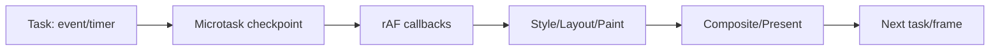

# requestAnimationFrame 与任务切片：帧同步、让出主线程和可取消工作

`requestAnimationFrame`（rAF）安排下次绘制前的回调，适合读取下一帧状态并提交视觉更新；task yielding 把长计算拆成多个 task，让输入和渲染获得机会。rAF 不会把工作移到 GPU，也不会拆分 100 ms 回调；yield 不会减少总 CPU。正确方案还需优先级、取消、中间一致性和后台节流。

## 1. 事件循环中的位置



浏览器只在合适渲染机会运行 rAF；后台/隐藏文档会暂停或大幅节流。回调 timestamp 表示该帧时间基准，同一帧多个回调通常收到相同值。

## 2. rAF 动画

```js
function animate(element, duration = 240) {
  const startedAt = performance.now();
  let frameId;

  return {
    finished: new Promise((resolve) => {
      const tick = (now) => {
        const progress = Math.min(1, (now - startedAt) / duration);
        element.style.transform = `translateX(${progress * 240}px)`;
        if (progress < 1) frameId = requestAnimationFrame(tick);
        else resolve();
      };
      frameId = requestAnimationFrame(tick);
    }),
    cancel() {
      cancelAnimationFrame(frameId);
    },
  };
}
```

动画用时间差，不按“每帧移动 4px”；60/120Hz、掉帧时速度仍一致。cancel 只能取消尚未执行回调；已写的样式需明确恢复/保留。

CSS/Web Animations 能表达的 transform/opacity 动画优先交给浏览器，减少 JS 每帧工作。rAF 适合 canvas、物理模拟或状态需逐帧计算。

## 3. rAF 中的读写顺序

理想一帧：先读取全部几何，再写入视觉属性。多个模块各自 rAF 仍可能 A写→B读造成 forced layout；大型应用用共享 frame scheduler 分 read/write phase。

```js
const reads = [];
const writes = [];

function flushFrame() {
  const readResults = reads.splice(0).map((read) => read());
  writes.splice(0).forEach((write, index) => write(readResults[index]));
}
```

真实 scheduler 需处理新增任务、异常、取消和 read/write 数量，不直接使用索引假设跨模块对应。

## 4. rAF 不是定时器

- 不保证固定 16.7 ms；
- 页面隐藏会暂停；
- CPU/GPU 繁忙会跳帧；
- 回调都在主线程（worker OffscreenCanvas 有其上下文能力）；
- 30 ms 回调仍阻塞输入；
- 请求两次 rAF 常用于等待至少一次绘制，但不构成严格“浏览器已显示”协议。

业务 timeout、网络重试不能用 rAF 计时。动画完成使用时间和状态，后台恢复时决定跳到最终还是暂停。

## 5. 为什么 Promise 不让出渲染

```js
async function wrong(items) {
  for (const item of items) {
    process(item);
    await Promise.resolve();
  }
}
```

resolved Promise continuation 是 microtask；microtask checkpoint 会继续清空，浏览器通常无法在每项间处理下一 task/render。用 task-level yield：

```js
const channel = new MessageChannel();
const queue = [];
channel.port1.onmessage = () => queue.shift()?.();

function fallbackYield() {
  return new Promise((resolve) => {
    queue.push(resolve);
    channel.port2.postMessage(undefined);
  });
}
```

MessageChannel 不是优先级 API，但通常比 setTimeout 的嵌套最小延时更合适回退。

## 6. `scheduler.yield()` 与 `postTask()`

支持时：

```js
async function yieldToMain() {
  if (globalThis.scheduler?.yield) {
    await scheduler.yield();
  } else {
    await fallbackYield();
  }
}
```

`postTask` 可提交 user-blocking/user-visible/background；`TaskController` 可取消/改优先级。已开始的同步工作不会被强制抢占，代码仍需 checkpoint。

调度 abstraction 在一个模块封装，测试注入 fake；不要在所有业务函数特性检测。

## 7. 时间预算切片

```js
async function mapInChunks(items, transform, { signal, budget = 8 } = {}) {
  const result = new Array(items.length);
  let index = 0;

  while (index < items.length) {
    const deadline = performance.now() + budget;
    do {
      if (signal?.aborted) throw signal.reason;
      result[index] = transform(items[index], index);
      index += 1;
    } while (index < items.length && performance.now() < deadline);

    if (index < items.length) await yieldToMain();
  }
  return result;
}
```

预算 8 ms 只是起点；高刷新率/低端设备/transform 单项长时需更小或 worker。单项本身 50 ms 时切循环无效，必须拆算法或移线程。

## 8. 输入感知

`navigator.scheduling.isInputPending()`（支持时）可在循环中发现待处理输入，尽快 yield；不能读取具体输入，也不能替代固定最大切片，避免在没有输入时霸占 200 ms。

```js
const shouldYield = () =>
  performance.now() >= deadline
  || navigator.scheduling?.isInputPending?.();
```

高频 pointermove 可 coalesce；处理最新位置而不是逐事件回放。绘图等需要完整轨迹时使用 `getCoalescedEvents()` 并限制点数。

## 9. 中间状态与原子提交

分片让其他代码观察中间状态。不要边排序共享数组边渲染；在局部 buffer 计算，完成后一次替换，或定义明确 progressive result。

```js
const nextIndex = await buildIndexInChunks(records, signal);
if (!signal.aborted && version === currentVersion) {
  searchIndex = nextIndex;
}
```

version/requestId 防旧任务完成后覆盖新数据。AbortSignal 负责停止资源，版本检查负责即使取消太晚也不 commit。

## 10. 任务切片与 React transition

React `startTransition` 调整 React state 更新优先级和可中断渲染，不会把 transition 回调里的同步数据处理自动切片：

```tsx
startTransition(() => {
  const sorted = hugeArray.toSorted(compare); // 仍同步阻塞
  setRows(sorted);
});
```

先 worker/切片/服务端计算，结果到达后 transition 更新非紧急 UI。受控 input value 保持紧急 state。

## 11. `requestIdleCallback` 的适用边界

`requestIdleCallback` 只在浏览器判断当前帧还有空闲时间时运行。`IdleDeadline.timeRemaining()` 返回本次空闲期预计还剩多少毫秒，`didTimeout` 表示是否因为 `timeout` 到期而被强制调度。

```js
function runWhenIdle(queue, { timeout = 1000, signal } = {}) {
  return new Promise((resolve, reject) => {
    function consume(deadline) {
      if (signal?.aborted) {
        reject(signal.reason);
        return;
      }

      while (
        queue.length > 0
        && (deadline.timeRemaining() > 1 || deadline.didTimeout)
      ) {
        queue.shift()();
      }

      if (queue.length === 0) {
        resolve();
      } else {
        requestIdleCallback(consume, { timeout });
      }
    }

    requestIdleCallback(consume, { timeout });
  });
}
```

它适合预计算低优先级索引、清理非紧急缓存、预生成下一页数据。它不适合保存用户输入、支付确认、心跳、超时控制和必须在限定时间完成的初始化：忙碌页面可能长时间没有空闲期，后台页面还会被进一步节流。

`didTimeout` 为真时也不能一次清空所有剩余任务，否则 timeout 只是把长任务推迟发生。仍应设置单次处理上限，并在下一轮继续。没有该 API 时，用低优先级 `scheduler.postTask` 或 task yield 回退，而不是假定 `setTimeout(fn, 0)` 等同空闲调度。

## 12. 绘制后工作与双 rAF

rAF 回调发生在绘制前。需要在样式提交后的下一渲染机会读取新几何时，可以在一次 rAF 中写、下一次 rAF 中读，但双 rAF 仍不保证像素已经出现在物理屏幕上。截图、视觉回归和 View Transition 应使用对应 API 的完成信号。

```js
function nextFrame() {
  return new Promise((resolve) => requestAnimationFrame(resolve));
}

async function expandAndMeasure(panel) {
  await nextFrame();
  panel.classList.add("expanded");
  await nextFrame();
  return panel.getBoundingClientRect();
}
```

若只需在本次事件后批量写样式，一次 rAF 足够。为了“保险”连续嵌套多次会增加至少一帧延迟，高刷新率与低刷新率下实际等待时间也不同。测试应断言最终状态与事件顺序，不依赖固定 `setTimeout(32)`。

## 13. 案例一：进度可见的批量导入

### 输入

解析/校验 100k CSV rows 总 CPU 1.8 s。同步执行页面冻结；需要取消、错误汇总、每 5% 进度。

### 方案

A. 主线程 8 ms 切片；实现简单但总 CPU/GC在主线程。B. worker streaming parser；主线程最稳，消息与协议复杂。C. 服务端导入；大文件、审计更适合，但上传与后端任务。

选择 C 为生产，worker 为本地预检。worker 每 1000 行发进度/错误摘要，不发全部行副本；AbortMessage + version。

### 验证

输入/取消 <100 ms 响应，进度单调，内存上限，错误行可下载。失败注入 worker 崩溃/服务端断线，任务状态可恢复。

## 14. 案例二：Canvas 动画与后台恢复

### 输入

物理动画按每帧 +1 更新，120Hz 变双速；后台 10 秒恢复后瞬移/循环 600 次。

### 修复

使用 timestamp delta 并 clamp（例如最大 50 ms），物理模拟 fixed timestep + accumulator，渲染插值；visibilitychange 暂停或重置 lastTime。

```js
let previous;
function frame(now) {
  if (previous === undefined) previous = now;
  const delta = Math.min(50, now - previous);
  previous = now;
  update(delta / 1000);
  render();
  requestAnimationFrame(frame);
}
```

验证 60/120Hz、CPU slowdown、切后台、reduced motion。失败分支 delta 未 clamp，恢复一次模拟穿透碰撞。

## 15. 案例三：富文本语法高亮

### 输入

每次键入对 20k 行同步 tokenize，280 ms。debounce 300 ms 让键入短期顺滑但停下仍冻结。

### 方案

增量解析受影响区；worker tokenize；viewport only decoration；旧结果 requestId；用户输入高优先。rAF 只负责把已算好的 decorations 批量 commit，不能在 rAF tokenize 全文。

输出 INP p75 改善且高亮最终一致。失败注入 IME composition、快速 undo、worker 旧版本，不能覆盖当前文档。

## 16. 案例四：DOM 分批插入

一次 append 10k rows 会产生长 JS/style/layout。分批 100 rows 每帧仍可能耗几十帧并造成内容跳动。更好的顺序：分页/虚拟化；必须生成打印 DOM 时 DocumentFragment 构建、分 task、进度和 cancel，完成前避免每批读取 layout。

无障碍：aria-busy，完成后播报，焦点不落入尚未稳定区域。页面用户浏览场景不应用“慢慢插 10k”替代虚拟化。

## 17. rAF 调度器设计

共享 scheduler 应支持：

- 本帧 read、write、afterPaint 队列；
- 每任务取消 token；
- 异常隔离；
- 同一 key 去重（只保留最新 pointer）；
- 页面隐藏暂停；
- 防止回调递归无限加入本帧；
- profile label 与预算告警。

不要抽象到看不出实际 DOM 时序。业务函数仍声明需要读还是写。

## 18. 测量

1. Performance Frames/Main/Interactions；
2. rAF callback duration；
3. Long Task/LoAF；
4. input delay/processing/presentation；
5. yield 次数、总完成时间、取消 latency；
6. worker message/clone；
7. hidden/visible；
8. 60/120Hz 与低端设备。

## 19. 取舍表

| 工作 | 方案 | 边界 |
|---|---|---|
| 视觉逐帧 | CSS/WAAPI 或 rAF | rAF 回调短、时间驱动 |
| <10ms 小计算 | 同步 | 避免过度调度 |
| 10–100ms 可拆 | yield 时间切片 | 中间一致性、总耗时 |
| 大纯 CPU | worker | 传输/协议/失败 |
| 巨量数据 | 减少/服务端 | 网络和系统设计 |
| DOM layout | CSS/virtualize/batched read-write | worker 不能访问 DOM |

## 20. 常见错误

1. rAF 等于 60Hz；
2. rAF 中 100ms 不算长任务；
3. Promise.resolve 能让出绘制；
4. 固定每批 100 项适配所有设备；
5. yield 后旧任务可以安全 commit；
6. transition 自动切片任意 JS；
7. 后台 rAF 用于业务计时；
8. 分批 DOM 替代虚拟化。

## 21. 综合练习

实现 100k 记录校验和 Canvas 进度可视化，提供同步、yield、worker 三种模式。

验收标准：

1. 记录首次输入响应、总完成、Long Task、heap；
2. 切片按时间预算且支持输入 pending；
3. cancel 在 100 ms 内停止，旧结果不 commit；
4. worker 崩溃有恢复；
5. rAF 动画在 60/120Hz 速度一致；
6. 后台恢复无时间跳跃；
7. reduced motion 使用静态进度；
8. 比较三方案的吞吐、交互和复杂度。

## 来源

- [HTML Standard：Animation frames](https://html.spec.whatwg.org/multipage/imagebitmap-and-animations.html#animation-frames)（访问日期：2026-07-17）
- [Prioritized Task Scheduling](https://wicg.github.io/scheduling-apis/)（访问日期：2026-07-17）
- [MDN：requestAnimationFrame](https://developer.mozilla.org/docs/Web/API/Window/requestAnimationFrame)（访问日期：2026-07-17）
- [W3C Event Timing](https://www.w3.org/TR/event-timing/)（访问日期：2026-07-17）
- [Page Visibility Level 2](https://www.w3.org/TR/page-visibility-2/)（访问日期：2026-07-17）
