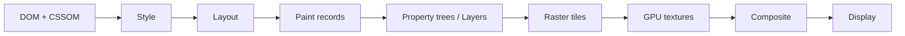

# GPU 合成层：分层、栅格化、合成与层成本

浏览器把页面绘制结果拆成若干图形层，栅格化为可合成的表面，再由合成器按变换、透明度、裁剪和顺序组合成一帧。独立层可让某些动画避开主线程重排与重绘，但会消耗纹理内存、栅格时间、上传带宽和合成资源。是否分层由浏览器决定，CSS 属性只提供输入或提示。

## 1. 从 DOM 到屏幕



布局决定盒子几何；绘制生成背景、文字、边框、阴影等绘制指令；分层阶段确定哪些内容可以作为独立表面；栅格线程把绘制指令变成像素 tile；合成线程把 tile 映射到屏幕。实现细节因 Chromium、Gecko、WebKit 而异，调试应看目标浏览器的实际 trace。

“GPU 加速”不是把 JavaScript、样式计算或布局交给 GPU。GPU 主要参与栅格和合成；主线程执行 80 ms JavaScript 时，合成器可继续已有的滚动或动画，但不能得到主线程尚未产生的新内容。

## 2. 为什么产生独立层

浏览器可能为以下内容建立独立层或合成表面：

- 正在运行可合成的 `transform`、`opacity` 动画；
- 视频、canvas、WebGL、嵌入内容；
- 固定或粘性定位且满足实现条件的内容；
- 3D transform、perspective 和需要保留 3D 的上下文；
- filter、mask、blend、clip 等需要离屏渲染的效果；
- 隔离的滚动区域；
- `will-change` 提示；
- 与其他层重叠、必须保持正确绘制顺序的内容。

不是每个 stacking context 都是合成层，也不是每个合成层都对应一个 DOM 元素。z-index、opacity、transform 会形成 stacking context，但浏览器可把多个上下文绘到同一表面，或因实现原因拆出更多层。

## 3. 合成友好属性

通常，动画 `transform` 和 `opacity` 可以复用既有栅格结果，只更新合成属性：

```css
.drawer {
  transform: translateX(-100%);
  transition: transform 180ms ease-out;
}

.drawer[data-open="true"] {
  transform: translateX(0);
}
```

改 `left`、`top`、`width`、`height` 会影响几何，通常触发布局；改 `box-shadow`、背景、文字颜色通常需要重绘。属性是否真正只合成还受元素内容、滤镜、裁剪、浏览器和动画方式影响，必须录制验证。

对于布局相关动画，可用 FLIP：

1. First：读取旧位置；
2. Last：应用最终布局并读取新位置；
3. Invert：用 transform 把元素视觉移回旧位置；
4. Play：把 transform 动画到 identity。

```js
const first = card.getBoundingClientRect();
card.classList.add("expanded");
const last = card.getBoundingClientRect();

card.animate(
  [
    {
      transform: `translate(${first.left - last.left}px, ${
        first.top - last.top
      }px) scale(${first.width / last.width}, ${first.height / last.height})`,
    },
    { transform: "none" },
  ],
  { duration: 240, easing: "ease-out" },
);
```

两次几何读取之间故意发生一次布局，用一次布局成本换取后续合成动画。圆角、文字和子元素缩放可能失真，需要对子元素反向缩放或改用 View Transition。

## 4. `will-change`

`will-change` 告诉浏览器某属性即将变化，使其有机会提前建立优化结构：

```js
button.addEventListener("pointerenter", () => {
  panel.style.willChange = "transform";
});

panel.addEventListener("transitionend", () => {
  panel.style.willChange = "auto";
});
```

它不是强制分层协议，也不保证性能提升。长期对大量节点设置：

```css
* {
  will-change: transform;
}
```

会提前分配资源、增加层数和内存，还可能改变 stacking context，从而影响定位和 z-index。只对已测得有收益、即将频繁变化的少量元素使用，并给浏览器一小段准备时间。

`translateZ(0)`、`translate3d(0,0,0)` 曾常用于触发层提升，但属于依赖实现的技巧，还会引入 3D/stacking 行为。表达意图时优先 `will-change`，性能结果仍以 trace 为准。

## 5. 纹理内存

一个未压缩 RGBA 表面粗略需要：

```text
width × height × devicePixelRatio² × 4 bytes
```

1920×1080、DPR 2 的全屏层约为：

```text
1920 × 1080 × 4 × 4 ≈ 31.6 MiB
```

这不包含双/三缓冲、mipmap、tile 边界、离屏 effect surface 和其他副本。十个全屏层并非简单的“十个 div”；在移动设备上可能触发 tile eviction、重复栅格和掉帧。

层可被切成 tile，只栅格可见或即将可见部分。快速滚动超过预栅格范围时会出现 checkerboarding 或迟到内容。大图、固定背景、超长滚动层和巨型 blur 会放大 tile 成本。

## 6. 栅格清晰度与 scale

把小图层放大很多时，浏览器可能先在较低分辨率栅格，再由 GPU 放大，文字或边缘暂时模糊；也可能重新以目标 scale 栅格，带来 raster 峰值。

```css
.thumbnail:hover {
  transform: scale(4);
}
```

生产方案：

- 为放大内容准备足够分辨率的图像；
- 避免把包含正文文字的整个容器从极小放到极大；
- 在动画结束后允许浏览器重新栅格；
- 用 DevTools 的 paint flashing、Layers 和 Performance 检查 raster；
- 在真实 DPR、缩放比例和低端 GPU 上测试。

图片尺寸还受解码内存影响。压缩后的 300 KB JPEG 解码为 4000×3000 RGBA 后约 45.8 MiB，网络体积不能代表运行时图像内存。

## 7. 离屏表面

`filter: blur()`、`backdrop-filter`、混合模式、复杂遮罩和透明组可能要求先把内容绘到离屏表面，再应用效果：

```css
.glass {
  backdrop-filter: blur(24px);
  background: rgb(255 255 255 / 0.2);
}
```

模糊半径会扩大采样区域；大面积、持续变化的 backdrop blur 成本尤其高。滚动时背景每帧变化，浏览器可能持续重新栅格。可替代为半透明纯色、较小区域、静态预模糊资源，或在低性能模式关闭。

`contain: paint` 可限制后代绘制不越过边界，帮助减小 invalidation；它不是分层指令，也会裁剪溢出内容。`isolation: isolate` 建立独立 stacking context，常用于控制混合，不等同一定创建 GPU 层。

## 8. 层爆炸

虚拟列表给每一行添加 `will-change: transform`：

```css
.row {
  will-change: transform;
}
```

即使只有 50 行可见，也可能建立大量层；行内文字、图标和阴影增加栅格表面。滚动期间层创建、回收与内存压力会抵消合成收益。

改进顺序：

1. 移除默认 `will-change`；
2. 只移动列表容器或正在拖拽的一行；
3. 拖拽开始前设置提示，结束后移除；
4. 控制 overscan；
5. 检查 Layers 面板的 layer count、尺寸和 compositing reason；
6. 用低端设备测滚动帧和内存。

## 9. 层与命中测试

合成器可处理异步滚动和部分 hit testing，但主线程事件处理器、非被动监听器和复杂交互仍可能阻塞。`pointer-events: none` 改变命中行为；透明度为 0 的元素默认仍可命中。

```css
.overlay[data-hidden="true"] {
  opacity: 0;
  pointer-events: none;
}
```

动画离场期间何时禁用命中必须由状态机决定。仅看到元素视觉消失，不代表它已从可访问树、焦点顺序或命中区域移除。

## 10. 案例一：侧边抽屉

### 输入

抽屉宽 420px，用 `left: -420px → 0`，内部有图片和阴影。打开时 Layout/Paint 合计每帧 12–25 ms，正文也被重排。

### 候选

- A：`transform: translateX` 覆盖正文，避免正文重排；
- B：正文必须缩进，用 FLIP 表达整体位移；
- C：View Transition 表达跨状态变化；
- D：保留 layout 动画，接受成本并减少内容。

选择 A。抽屉打开前短暂添加 `will-change`，完成后移除；阴影固定，不在每帧改变 blur；焦点 trap 和 `aria-modal` 独立实现。

### 验证

Performance 中动画期间无持续 Layout/Paint，Compositor track 连续；Layers 只增加预期层；DPR 3 设备无大纹理抖动；CPU 4× slowdown 仍可响应 Escape；`prefers-reduced-motion` 直接切换最终状态。

## 11. 案例二：卡片拖拽

拖拽开始时保存指针与卡片起点，pointermove 只记录最新坐标，rAF 每帧一次写 transform：

```js
let latest;
let frameId;

function move(event) {
  latest = event;
  if (frameId) return;
  frameId = requestAnimationFrame(() => {
    frameId = 0;
    card.style.transform = `translate3d(${latest.clientX}px, ${latest.clientY}px, 0)`;
  });
}
```

真实实现使用差值而不是把左上角直接设为 pointer；设置 pointer capture；拖拽开始建立层，结束后清空 transform 或提交最终布局。若每帧读取 `getBoundingClientRect()` 再写，则合成属性也救不了 forced layout。

验证拖拽开始的单次层创建 spike、移动中的主线程工作、释放后的层回收、跨 iframe/窗口边界、缩放和滚动坐标。

## 12. 案例三：大面积背景模糊

全屏导航覆盖层使用 `backdrop-filter: blur(40px)`，移动端滚动时 GPU/raster 高、设备发热。四种方案：

| 方案 | 视觉 | 成本 | 边界 |
|---|---|---|---|
| 实时 backdrop blur | 背景始终正确 | 高 | 小区域、静态背景 |
| 半透明纯色 | 近似 | 低 | 品牌允许 |
| 打开时截取/预模糊 | 接近 | 中 | 截图权限与更新 |
| 降低半径/分辨率 | 折中 | 中 | 需视觉评审 |

使用媒体查询或运行时能力档位只是选择机制，不能只按 user agent。测打开、滚动、视频背景、旋转屏幕和低电量模式。

## 13. 案例四：无限画布

画布有数千节点。把每个节点变成 DOM 合成层会超过内存与层管理能力。候选架构：

- DOM + 视口虚拟化：文本可访问、编辑方便；
- 单 Canvas 2D：绘制集中，命中测试自管；
- WebGL/WebGPU：大量图元吞吐高，资源与着色器复杂；
- 混合：画布渲染静态节点，DOM 渲染当前编辑器和辅助技术入口。

缩放/平移可合成整个 canvas，但内容变清晰需要按 zoom 重绘；纹理大小受设备限制，必须 tile。应用应统计可见 tile、GPU 资源、图片解码缓存和丢失上下文恢复。

## 14. DevTools 诊断

### Performance

录制稳定复现：

1. 看 Main 是否有 Layout/Paint；
2. 看 Raster、GPU、Compositor 活动；
3. 定位 Paint 事件和 invalidation；
4. 观察帧是否错过 deadline；
5. 比较动画前后 layer 变化；
6. 保存 trace 与浏览器/设备信息。

### Rendering

- Paint flashing：绿色区域表示发生重绘；
- Layer borders：观察 tile 和层边界；
- FPS meter：快速观察帧与 GPU 内存，仅用于定位；
- Scrolling performance issues：发现影响异步滚动的区域。

### Layers

检查 layer tree、尺寸、合成原因和内存估算。面板展示的是当前实现诊断，不应把具体 compositing reason 文案写成业务契约。

## 15. 可复现实验

建立三个 1200×800 面板：

1. `left` 动画；
2. `transform` 动画；
3. `transform` + 长期 `will-change` 的 100 个元素。

每种运行 10 秒，记录：

- Main 的 Layout、Paint、Scripting；
- Raster/Composite 时间；
- dropped frames；
- layer count 和纹理估算；
- JS heap 与进程内存；
- DPR 1/2/3；
- 页面隐藏恢复。

保持内容、动画距离和持续时间一致。先 warm-up，至少三次，报告中同时写中位数和最差一次。不要只用 FPS 数字推断瓶颈。

## 16. 生产边界

- 动画开始时第一次层提升可能卡顿，预热需有界；
- GPU 进程可能重启，Canvas/WebGL 要处理 context loss；
- 移动端内存预算远低于桌面；
- iframe、视频、受保护内容可能有独立合成路径；
- 浏览器缩放和 DPR 改变纹理规模；
- transform 会创建包含块，影响 `position: fixed` 后代；
- transform 后视觉位置变化，但 DOM 顺序和键盘顺序不变；
- subpixel transform 可能让文字边缘变化；
- 大型 fixed 背景可能持续重栅格；
- 合成顺畅不代表输入处理或业务状态正确。

## 17. 常见错误

1. 认为每个 stacking context 都是 GPU 层；
2. 给所有元素 `translateZ(0)`；
3. 永久保留 `will-change`；
4. 只看主线程，忽略 raster/GPU；
5. 用压缩图片体积估算显存；
6. transform 动画中每帧强制 layout；
7. 只在高端桌面测；
8. 用层越多越快作为目标；
9. 忽略滤镜的离屏表面；
10. 认为 compositor animation 不会消耗电量。

## 18. 综合练习

实现一个包含抽屉、拖拽卡片、毛玻璃遮罩和 200 行虚拟列表的页面，提供“基线”和“优化”开关。

验收：

1. 抽屉由 layout 动画改为 transform；
2. 拖拽每帧最多一次视觉写；
3. `will-change` 有生命周期；
4. 列表行不批量升层；
5. 毛玻璃有低成本模式；
6. 记录 DPR 1/3 的层内存；
7. CPU slowdown 和低端设备有 trace；
8. reduced motion 与键盘焦点正确；
9. 输出层数、Paint、Raster、掉帧的前后对比；
10. 说明每项优化的代价与回退。

## 来源

- [CSS Will Change Module Level 1](https://drafts.csswg.org/css-will-change/)（访问日期：2026-07-17）
- [CSS Transforms Module Level 2](https://drafts.csswg.org/css-transforms-2/)（访问日期：2026-07-17）
- [Chromium：GPU Accelerated Compositing](https://www.chromium.org/developers/design-documents/gpu-accelerated-compositing-in-chrome/)（访问日期：2026-07-17）
- [Chrome DevTools：Layers](https://developer.chrome.com/docs/devtools/layers/)（访问日期：2026-07-17）
- [MDN：will-change](https://developer.mozilla.org/docs/Web/CSS/will-change)（访问日期：2026-07-17）
