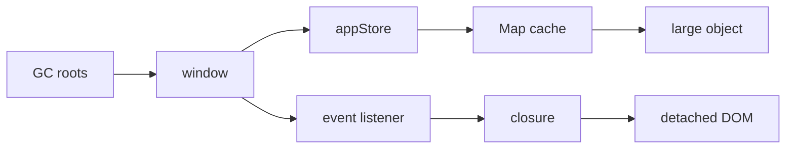

# JavaScript Heap 与分配分析：快照、时间线和内存归因

JavaScript heap 保存对象、字符串、闭包和运行时内部结构。垃圾回收器根据对象是否仍可从 GC root 到达决定能否回收，而不是根据业务是否还需要它。内存分析的核心是区分正常增长、瞬时分配、高位缓存和不可达但仍被引用的泄漏，并用稳定操作、强制回收后的基线和 retainer path 找到所有权。

## 1. 先区分内存指标

一个网页进程的内存不只有 JavaScript heap：

| 区域 | 常见内容 | 观察方式 |
|---|---|---|
| JS heap | 对象、数组、闭包、Map | Memory、`performance.memory`（非标准/受限） |
| DOM/native | 节点、事件、浏览器对象 | Heap snapshot、任务管理器 |
| 图片 | 解码后的像素 | Performance、进程内存、资源诊断 |
| Canvas/GPU | backing store、纹理 | Layers/GPU/进程内存 |
| ArrayBuffer/Wasm | 外部/线性内存 | Snapshot、runtime 指标 |
| 网络缓存 | response body、Cache API | Storage、进程内存 |
| worker | 独立执行上下文与 heap | 对应 worker target |

JS heap 下降不代表进程常驻集立即下降。运行时可保留已经申请的页供后续分配；浏览器也可能有图片、DOM 或 GPU 资源。只看操作系统进程数字无法直接定位 JavaScript 泄漏。

## 2. 可达性



常见 root：

- 全局对象与模块单例；
- 当前调用栈和微任务；
- 活跃 timer、事件监听器与 observer；
- 原生对象持有的 JavaScript callback；
- worker、MessagePort 和待处理 Promise；
- DevTools 控制台保存的最近求值结果。

循环引用本身不会泄漏。现代 GC 能回收互相引用但从 root 不可达的一组对象。真正问题是从 root 仍有路径，例如全局 Map → entry → DOM。

## 3. GC 基础

分代 GC 基于多数对象短命的经验，把新对象放在 young generation，多次存活的对象晋升到 old generation。标记阶段发现可达对象，清扫或压缩回收空间；写屏障记录新旧代引用。

应用可见影响：

- 高频临时对象导致频繁 minor GC；
- 大量长期对象导致 major GC 成本；
- 一次分配巨大数组可能触发立即回收或 OOM；
- GC 可并发/增量，但某些阶段仍需暂停；
- 弱引用行为不确定，不能依赖“下一次 GC 立即清理”。

不要手动追求零分配。可读且有界的短命对象通常比复用可变对象安全。只有 profile 证明 allocation rate 或 GC pause 是瓶颈时再优化。

## 4. Heap Snapshot 的列

Snapshot 常见字段：

- **Shallow size**：对象自身占用，不含所引用对象；
- **Retained size**：如果该对象被回收，随之可回收的近似总量；
- **Distance**：到 GC root 的最短距离；
- **Constructor**：运行时推断的对象分类；
- **Retainers**：谁直接引用该对象；
- **Dominator**：支配该对象可达路径的节点。

高 shallow size 的 ArrayBuffer 可能直接重要；一个 shallow 很小的 Map 若支配 200 MB 数据，其 retained size 更值得看。retained size 是基于 heap graph 的归因，不等于对象“拥有”的业务数据，也不能跨快照简单相加。

## 5. 三快照法

稳定复现：

1. 打开测试页面，完成初始化；
2. 执行一次操作，排除懒加载/JIT/缓存预热；
3. 强制 GC，拍 Snapshot A；
4. 重复目标操作 N 次；
5. 强制 GC，拍 Snapshot B；
6. 返回初始业务状态；
7. 再 GC，拍 Snapshot C；
8. 比较 B-A 与 C-A，查看增长 constructor；
9. 沿 retainers 回到明确 owner；
10. 修复后用相同步骤复测。

操作例：打开/关闭弹窗 20 次、进入/离开路由 20 次、订阅/退订 100 次。GC 后 C 仍随次数线性增长，比单次 heap 大更有泄漏信号。

强制 GC 只用于诊断。生产中不能假设 GC 时机，也不应通过制造内存压力促使回收。

## 6. Allocation instrumentation on timeline

分配时间线记录对象何时创建、是否在后续 GC 后仍存活。适合回答：

- 输入一次产生哪些对象；
- 滚动期间 allocation rate 多高；
- 哪个调用栈持续分配；
- 哪批对象跨过多个 GC；
- 路由离开后哪些分配仍存在。

录制本身有明显开销，时间结果不能当生产性能数据。缩短录制、只复现一个动作、用 source map 定位函数。蓝色/存活条表示录制区间内分配且仍存活，不自动等于泄漏；缓存和当前页面状态也应存活。

## 7. Allocation sampling

Sampling profiler 以较低开销按调用栈估算分配字节，适合较长、较接近真实负载的录制。它回答“哪里分配得多”，但可能漏掉小样本，也不能直接给出完整对象引用图。

使用顺序：

1. sampling 找到高分配调用栈；
2. timeline 判断对象是否短命；
3. snapshot 查看幸存对象及 retainer；
4. 代码中确认所有权和生命周期；
5. 用用户指标验证优化价值。

## 8. 内存曲线

典型健康锯齿：

```text
heap
 ^       /\      /\       /\
 |  ____/  \____/  \_____/  \___
 +--------------------------------> time
```

分配使 heap 上升，GC 后回到大致稳定基线。泄漏更像 GC 后低点逐步升高：

```text
heap
 ^          /\          /\
 |     ____/  \____----/  \____
 | ___/
 +--------------------------------> time
```

但基线上升也可能是：

- 懒加载模块；
- 字体、图片或代码缓存；
- JIT 优化数据；
- 首次访问的国际化表；
- 有界 LRU 尚未填满；
- DevTools 自身保持对象；
- 测试每轮业务状态没有真正复位。

因此要跑到缓存稳定、返回等价状态、关闭不必要 DevTools 功能，并查看增长是否最终平台化。

## 9. 对象所有权

为长期容器写清楚：

| 容器 | owner | key | 上限 | 删除时机 |
|---|---|---|---|---|
| 用户详情 LRU | data client | userId | 200 | 淘汰/登出 |
| 路由组件树 | router | location | 1 当前 | 导航卸载 |
| 图片 bitmap | gallery | assetId | 50 MiB | 离屏/压力 |
| 订阅表 | event hub | subscriber | 活跃组件数 | cleanup |

没有上限和删除时机的 Map 不是完整缓存设计。弱引用只适合“键不应被容器保活”的附加元数据，不能代替容量策略。

## 10. 闭包分配

闭包会捕获其词法环境：

```js
function register(button, report) {
  const rows = report.rows; // 可能很大
  button.addEventListener("click", () => {
    console.log(rows.length);
  });
}
```

只要监听器存在，`rows` 就可达。若只需要长度：

```js
const rowCount = report.rows.length;
button.addEventListener("click", () => console.log(rowCount));
```

真正修复通常是正确移除监听器，而不是逐个减少捕获。编译器和引擎可能优化未使用捕获，Snapshot 看到的结构不必与源码一一对应。

## 11. 字符串与 source

大字符串可能来自 JSON response、编辑器文档、日志或 data URL。切片字符串的内部表示由引擎决定，某个小 substring 可能间接保留大 backing store，也可能被复制；不能依赖具体实现。

诊断：

- Snapshot 按 string/concatenated string 查找；
- 搜索已知数据片段；
- 沿 retainer 找缓存、日志或闭包；
- 比较保留 parsed object 与 raw JSON 的双份成本；
- 避免把完整 payload 写入长期错误对象；
- Blob URL 使用完成后 revoke。

## 12. TypedArray 与 ArrayBuffer

```js
const buffer = new ArrayBuffer(100 * 1024 * 1024);
const view = new Uint8Array(buffer, 0, 16);
```

一个 16-byte view 仍引用整个 100 MiB buffer。需要保存小片段时复制到新 buffer。结构化克隆大型 buffer 会复制；可转移所有权：

```js
worker.postMessage({ buffer }, [buffer]);
```

转移后发送方 buffer 被 detached，不能继续使用。SharedArrayBuffer 不转移且有跨源隔离要求，还需原子同步。Wasm linear memory、WebCodecs frame 和 ImageBitmap 可能有显式 `close()` 生命周期。

## 13. 案例一：路由往返增长

### 症状

报表路由打开/离开 20 次，GC 后 heap 每轮增加约 8 MiB。Comparison 显示 `ChartModel`、Array 和 detached div 增长。

### 定位

Retainer：

```text
Window
→ module chartRegistry Map
→ routeId entry
→ ChartModel
→ canvas wrapper
```

卸载只调用 `container.remove()`，没有 `chart.destroy()` 与 `chartRegistry.delete(routeId)`。图表内部 ResizeObserver、timer 和数据仍存活。

### 修复

路由 effect cleanup 中停止 observer/timer、调用库销毁、删除 registry；异常初始化也进入统一 disposer。复测 50 轮后对象数平台化，GC 后基线波动而不线性增长。

## 14. 案例二：搜索联想的高分配

### 症状

无长期泄漏，但输入时每秒分配 120 MiB，minor GC 频繁，INP 恶化。Sampling 指向：

```js
items
  .map(normalize)
  .filter(matches)
  .map(toViewModel)
  .slice(0, 20);
```

每次键入对 50k 项创建中间数组和对象。

### 方案

- 服务端/索引查询减少输入集；
- 提前停止收集 20 项；
- normalize 结果按数据版本有界缓存；
- worker 构建搜索索引；
- 不在 render 中重建所有 view model。

优化后总分配降低，但不把代码改成难维护的全局对象池。比较总 CPU、GC、输入延迟、缓存内存和结果一致性。

## 15. 案例三：图片编辑器

### 症状

撤销栈保存每一步完整 RGBA bitmap，10 次操作后进程超过 1 GiB；JS heap 仅增加少量，因为主要内存在 ImageBitmap/Canvas/GPU。

### 设计

1. 撤销记录操作或差分，而非全部像素；
2. 每 N 步 checkpoint；
3. 限制总字节和步数；
4. 离屏 bitmap 不再使用时 `close()`；
5. 大图使用 tile；
6. 监控进程内存，不只 JS heap；
7. 内存不足时降采样并明确提示。

这说明“heap snapshot 没增长”不能排除页面内存问题。

## 16. 案例四：观测 SDK

SDK 把每个错误保存到数组，错误对象带 request payload、DOM target 和完整 state：

```js
history.push({ error, context, target: event.target });
```

线上长会话内存持续增长。修复：

- ring buffer 上限；
- 立即序列化允许字段；
- 去掉 DOM/response/raw state 引用；
- 限制单项字节；
- 上传成功或过期后删除；
- 离线队列设 TTL 与总容量；
- 统计丢弃数量，不静默无限保存。

隐私最小化与内存边界在此是同一个数据生命周期问题。

## 17. 自动化内存测试

浏览器自动化可重复动作并收集指标，但 GC 和实现差异使固定字节阈值脆弱。更可靠：

1. 预热；
2. 重复 10/50/100 轮；
3. 每组返回相同状态；
4. 可用时请求 GC；
5. 比较斜率、对象计数和平台化；
6. 保存 trace/snapshot 供人工归因；
7. 在固定浏览器版本运行；
8. 只把显著回归作为门禁。

CDP 的 HeapProfiler 属于浏览器调试协议，不是网页生产 API。CI 失败需保留复现输入、浏览器版本、commit 和 profile。

## 18. 调试干扰

- Console 中打印对象会使 DevTools 保留引用；
- `$0` 保存当前检查元素；
- 开着 Snapshot/Allocation 工具改变性能和对象生命周期；
- React/Vue DevTools 可能保留组件信息；
- source map 与开发构建对象形状不同；
- HMR 会保留旧模块或重复注册；
- Strict Mode 开发检查会重复执行部分生命周期；
- 扩展脚本与页面共享进程资源；
- BFCache 会保留整页以便返回，但属于有意生命周期。

最终要在生产构建、无扩展的新 profile、真实导航模式下复核。

## 19. 优化取舍

| 手段 | 收益 | 成本/边界 |
|---|---|---|
| 删除引用 | 回收正确 | 要明确 owner |
| LRU/TTL | 容量可控 | miss 与实现复杂度 |
| WeakMap | 键不被容器保活 | 不可枚举、GC 不确定 |
| 对象池 | 降低特定分配 | 状态污染、长期内存 |
| worker | 隔离计算 | worker 也可泄漏 |
| 数据压缩 | 降存储 | CPU 和随机访问 |
| virtualization | 降 DOM/模型 | 滚动、a11y 复杂 |
| streaming | 降峰值 | 协议和错误恢复 |

## 20. 常见错误

1. heap 上升一次就认定泄漏；
2. 只看 Task Manager；
3. 把 circular reference 当根因；
4. 只按 shallow size 排序；
5. 不返回等价业务状态；
6. 忽略 DevTools 保留；
7. 用 WeakMap 修复所有缓存；
8. 把 GC 后不归还 OS 当泄漏；
9. 忽略图片、GPU、worker；
10. 修复后不按相同步骤复测；
11. 为零分配牺牲正确性；
12. 在生产依赖强制 GC。

## 21. 综合实验

建立一个页面，包含路由图表、50k 项搜索、图片撤销栈和日志 SDK，分别注入泄漏与高分配。

验收：

1. 记录初始化后的 Snapshot A；
2. 目标动作 20 次并拍 B/C；
3. 用 Comparison 找增长 constructor；
4. 给出一条完整 retainer path；
5. 用 sampling 找最高分配栈；
6. 区分 JS heap 与外部图像内存；
7. 修复所有 disposer 与缓存上限；
8. 比较 GC 后基线斜率；
9. 比较 allocation rate、GC、INP；
10. 保存复现脚本、profile 与结论。

## 来源

- [Chrome DevTools：Record heap snapshots](https://developer.chrome.com/docs/devtools/memory-problems/heap-snapshots/)（访问日期：2026-07-17）
- [Chrome DevTools：Fix memory problems](https://developer.chrome.com/docs/devtools/memory-problems/)（访问日期：2026-07-17）
- [Chrome DevTools Protocol：HeapProfiler](https://chromedevtools.github.io/devtools-protocol/tot/HeapProfiler/)（访问日期：2026-07-17）
- [MDN：Memory management](https://developer.mozilla.org/docs/Web/JavaScript/Guide/Memory_management)（访问日期：2026-07-17）
- [ECMAScript：Managing Memory](https://tc39.es/ecma262/multipage/managing-memory.html)（访问日期：2026-07-17）
