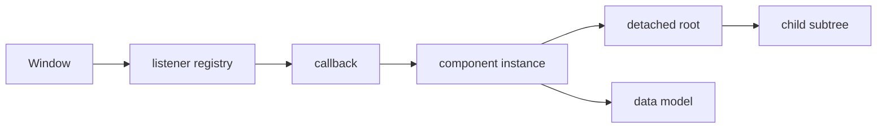

# Detached DOM 与 Retainer Path：定位已离开文档但仍存活的节点

Detached DOM 是已不在当前文档树中、却仍被 JavaScript 或浏览器对象引用的节点。节点离开文档并不自动构成泄漏：模板片段、离屏缓存和即将重新挂载的节点可以有意存活。问题在于它的生命周期已经结束，引用路径仍把节点、后代、事件闭包和业务数据保留。

## 1. 三种状态

```js
const node = document.createElement("section"); // 从未连接
document.body.append(node);                     // connected
node.remove();                                   // detached
```

`node.isConnected` 表示节点当前是否连接到某个 Document 或 ShadowRoot 所在文档。它不说明节点是否应该回收。只要局部变量、全局数组、监听器或缓存仍引用 `node`，它就可达。

| 状态 | `isConnected` | 是否一定泄漏 |
|---|---:|---|
| 新建模板 | false | 否 |
| 页面中的节点 | true | 否 |
| 临时 DocumentFragment 子树 | false | 否 |
| 已关闭弹窗但被全局 Map 引用 | false | 很可能 |
| 框架缓存的待复用视图 | false | 取决于上限和设计 |

## 2. 为什么一个节点能保留很多内存

DOM 节点不是孤立对象。父节点引用子节点，节点关联属性、文本、事件、样式和原生结构；JavaScript 属性还可挂载模型：

```js
panel.model = hugeReport;
panel.remove();
leakedPanels.push(panel);
```

保留 `panel` 可间接保留整个子树和 `hugeReport`。反向也成立：一个事件 closure 捕获组件实例，实例引用 root DOM，导致整棵已卸载视图存活。



## 3. Retainer path

Retainer path 是从目标对象反向追踪到 GC root 的引用链。Heap Snapshot 中选中 detached node，查看 Retainers，逐层回答：

1. 谁直接引用它？
2. 这个引用是数组元素、Map value、闭包变量还是原生 listener？
3. 该 owner 的生命周期是什么？
4. cleanup 为什么没有删除？
5. 是否还有第二条独立路径？

修复一条路径后对象仍存活，说明存在其他 path。不要只把选中变量设为 null；应修复真正 owner 的注册/注销协议。

## 4. DOM API 的引用关系

### 静态集合

`querySelectorAll()` 返回静态 `NodeList`。保存结果会保存其中节点：

```js
const oldRows = document.querySelectorAll(".row");
container.replaceChildren();
// oldRows 仍引用原来的 row
```

局部函数返回后集合可回收；把它放到模块变量、调试历史或缓存才延长生命周期。

### 活集合

`getElementsByClassName()`、`children` 等返回 live collection，会随树变化。保存 collection 可能保留其 root/context，并在读取时动态计算。不要长期缓存只为省一次查询。

### Range 与 Selection

`Range` 的 start/end container、浏览器 Selection、编辑器 bookmark 都引用节点。富文本编辑器卸载时应清理 selection/range、observer、插件与 history。

### MutationObserver

Observer 注册在 target 上并持有 callback；callback 又可捕获 owner。调用 `disconnect()` 停止观察，必要时 `takeRecords()` 处理或清空待记录。仅删除 target 节点不等于完成业务清理。

## 5. 事件监听器

监听器注册在目标对象上。节点与监听器一起变成不可达时通常可被 GC；真正泄漏常是长寿命目标引用短寿命组件 callback：

```js
function mountPanel(panel) {
  const onResize = () => panel.layout();
  window.addEventListener("resize", onResize);
  return () => window.removeEventListener("resize", onResize);
}
```

必须使用同一个 callback 和相同 capture 值移除。更稳健：

```js
function mountPanel(panel) {
  const controller = new AbortController();
  window.addEventListener(
    "resize",
    () => panel.layout(),
    { signal: controller.signal },
  );
  return () => controller.abort();
}
```

AbortSignal 可统一多个 listener，但 timer、第三方库和不支持 signal 的资源仍要单独 disposer。

## 6. 定时器和异步回调

```js
function openModal(root) {
  const id = setInterval(() => refresh(root), 1000);
  return () => clearInterval(id);
}
```

活跃 timer 的 callback 捕获 root。`setTimeout` 最终执行后引用通常释放，但超长 timeout、不断重排的 timeout、待定 Promise 和重试队列可延长生命周期。

网络请求 callback 也会捕获组件：

```js
const controller = new AbortController();
fetch(url, { signal: controller.signal })
  .then((response) => response.json())
  .then((data) => render(root, data));
```

卸载时 abort，并在 commit 前检查 request version。取消网络节省资源，版本检查避免已经完成的旧结果写回。

## 7. 框架组件

### React

Effect 应返回 cleanup。开发 Strict Mode 可能执行 setup→cleanup→setup 以暴露不对称生命周期。DOM ref 在框架卸载后通常清空，但模块 registry、第三方 widget 和全局 listener 仍需显式处理。

```tsx
useEffect(() => {
  const chart = createChart(containerRef.current, data);
  return () => chart.destroy();
}, [dataVersion]);
```

把完整 `data` 放依赖可能反复销毁/创建，需定义稳定输入，而不是省略依赖隐藏问题。

### Vue

在 `onMounted` 注册外部资源，在 `onUnmounted` 清理。`watch`/`watchEffect` 内启动异步工作时使用 cleanup 取消旧任务。KeepAlive 中 deactivated 不等于 unmounted；资源是否暂停由产品生命周期决定。

### Web Components

`disconnectedCallback` 可在节点离开文档时触发，但节点可能随后重新连接。清理应可重复，`connectedCallback` 不得重复注册。移动节点、文档 adoption 与框架渲染都要测试。

## 8. 第三方 widget

图表、编辑器、地图和播放器常在容器外创建：

- window/document listener；
- portal/overlay DOM；
- canvas/WebGL context；
- worker；
- ResizeObserver/MutationObserver；
- timer 和 requestAnimationFrame；
- module-level registry；
- injected style；
- object URL。

组件 wrapper 的 `destroy()` 必须覆盖全部资源。若库没有完整销毁 API，将其放在 iframe 或重载边界可提供更强隔离，但会增加通信、样式和无障碍成本。

## 9. Portal 与 Overlay

弹窗视觉上属于组件，DOM 可能挂到 `document.body`：

```html
<main id="app"></main>
<div id="overlay-root"></div>
```

卸载 app 子树不会自动删除手写 overlay。统一 overlay manager 应持有实例 token：

```js
const dispose = overlays.open(renderMenu());
routeDisposers.add(dispose);
```

关闭动画结束前 overlay 仍有意存活；动画取消、路由跳转、异常和 reduced motion 都必须进入最终 dispose。不要仅用 CSS `display:none` 积累旧弹窗。

## 10. Shadow DOM

Shadow root、slot、adoptedStyleSheets 和 custom element 内部形成额外引用关系。外部查询看不到 closed shadow tree，但 Heap Snapshot 仍可能显示内部节点。事件 composed path 可包含跨 shadow 边界对象；保存完整 event 到日志可能保留 target/path。

组件断开时：

- 删除全局事件；
- 断开 observer；
- 停止动画与 worker；
- 清理共享 registry；
- 取消异步；
- 保留可重新连接所需的最小状态；
- 再连接不得重复注册。

## 11. 案例一：表格行缓存

### 症状

分页表格每次翻页 `tbody.replaceChildren()`，但模块保存：

```js
const cellsById = new Map();
cellsById.set(row.id, cell);
```

100 页后 Snapshot 有 10k detached `HTMLTableCellElement`。

### Retainer

```text
Window
→ module
→ cellsById
→ Map entry
→ HTMLTableCellElement
```

### 修复

缓存业务数据或 cell state，不缓存 DOM；如必须按当前页查找，在 render 前 `clear()`，或让 key/value 都随 owner 生命周期删除。WeakMap 以 row model 为 key 只在 key 不被其他容器长期持有时有帮助。

验证翻页 10/100/500 次，GC 后 detached cell 数平台化；键盘焦点和 selection 不被错误清除。

## 12. 案例二：富文本编辑器重建

编辑器切换文档时销毁 root，但插件保存 selection Range、document keydown listener 和 history snapshots。Snapshot 中一个 detached text node 的 retainer：

```text
Window
→ pluginManager.plugins
→ mentionPlugin
→ lastRange
→ Text node
```

修复插件 disposer：

1. `lastRange = null`；
2. remove document listener；
3. observer.disconnect；
4. abort suggestion fetch；
5. 清空只属于旧文档的 history；
6. 销毁 portal；
7. 从 plugin manager 删除实例。

仅清空 root.innerHTML 不会触及这些 owner。

## 13. 案例三：图片预览

预览层为每张图创建 object URL：

```js
const url = URL.createObjectURL(file);
img.src = url;
```

DOM 删除后 Blob URL registry 仍保留数据，Heap Snapshot 不一定把全部字节归因到 detached img。图片 load 或预览关闭后：

```js
img.removeAttribute("src");
URL.revokeObjectURL(url);
```

不能在设置 `src` 后立即 revoke；确保图片已完成使用。下载链接、worker script URL、媒体 source 也有独立生命周期。异常/取消必须进入 `finally`。

## 14. 案例四：微前端卸载

子应用卸载后 DOM 已空，但主应用事件总线保存子应用 subscriber，subscriber 捕获 router/store/root。修复不是扫描 DOM，而是定义 mount contract：

```ts
interface MountedApp {
  unmount(): Promise<void>;
  diagnostics(): {
    listeners: number;
    timers: number;
    workers: number;
  };
}
```

unmount 应幂等，等待异步销毁，有 timeout 和失败日志。主应用使用 token 删除 bus subscription；子应用重复挂载测试 100 次。

## 15. DevTools 定位流程

1. 用生产构建复现；
2. 预热一次；
3. Snapshot A；
4. 打开/关闭目标 UI 20 次；
5. GC；
6. Snapshot B；
7. Comparison 按 `Detached`、节点 constructor 和 Delta 筛选；
8. 选一项查看 Retainers；
9. 忽略 DevTools 自身路径，找到第一个业务 owner；
10. 搜索 owner 注册代码和 cleanup；
11. 修复后重跑相同步骤；
12. 再检查是否存在第二条 path。

Elements 面板的 Detached elements 工具可快速列出分离树；Snapshot 适合完整引用归因。Performance monitor 的 DOM Nodes/Listeners 曲线适合发现趋势，不提供根因。

## 16. 程序化生命周期管理

统一 disposer stack：

```js
function createScope() {
  const disposers = [];
  let disposed = false;

  return {
    add(dispose) {
      if (disposed) dispose();
      else disposers.push(dispose);
      return dispose;
    },
    dispose() {
      if (disposed) return;
      disposed = true;
      const errors = [];
      for (const fn of disposers.splice(0).reverse()) {
        try {
          fn();
        } catch (error) {
          errors.push(error);
        }
      }
      if (errors.length) throw new AggregateError(errors);
    },
  };
}
```

逆序销毁匹配依赖建立顺序；异常隔离确保一个 cleanup 失败不阻止其他项。异步 disposer 需要 `await Promise.allSettled` 或有序 await，并设置超时。TC39 Explicit Resource Management 的 `using`/`DisposableStack` 可表达相同所有权，但需检查运行环境和转译策略。

## 17. 自动化实验

构造 Leak Lab：

- 按钮 A 创建 1000 节点并注册 window listener；
- 按钮 B 删除 DOM但不移除 listener；
- 按钮 C 正确 abort；
- 路由模式重复 mount/unmount；
- 显示业务 registry 计数；
- 自动执行 10/50/100 轮；
- 导出 heap snapshot。

验收不应要求“0 detached node”，因为 DevTools/框架/浏览器可有合理对象。应断言目标 constructor、registry 和 listener 数不随轮次线性增长，并给出 retainer path。

## 18. 生产防线

- 为全局 listener/event bus 封装 token；
- 每个 mount 返回 disposer；
- observer、timer、rAF、worker、URL、第三方实例进入同一 scope；
- 长期 Map 有容量和删除条件；
- 路由 E2E 重复往返并监控 heap/DOM/listener；
- 错误路径与半初始化也执行 cleanup；
- HMR dispose 清理开发时模块副作用；
- 记录活动资源计数，不记录完整 DOM；
- 大型会话做采样内存回归；
- 合并前评审所有新增全局注册。

## 19. 常见错误

1. 把所有 detached node 都当泄漏；
2. 认为 `element.remove()` 会移除 window listener；
3. 只执行一次操作拍快照；
4. 只看 constructor 数，不看 retainer；
5. 修复一条 path 后不复测；
6. 把变量设 null 但 registry 仍引用；
7. 认为循环引用无法 GC；
8. 忽略 Range、Selection、observer；
9. 第三方组件只删除 container；
10. 用 WeakMap 隐藏不清晰生命周期；
11. 保存 console/event 对象污染测试；
12. 把 KeepAlive 的有意保留当卸载。

## 20. 综合练习

实现包含表格分页、编辑器、图片预览和微前端 mount 的页面，每个模块提供故障开关。

验收：

1. 预热后拍 A/B/C 三快照；
2. 每模块循环 50 次；
3. 找到四条业务 retainer path；
4. 用 AbortController 管理监听器；
5. observer/timer/rAF/worker 有 disposer；
6. object URL 正确 revoke；
7. overlay 从 body 删除；
8. unmount 幂等且异常隔离；
9. 修复后目标对象数量平台化；
10. 输出所有权表和自动化复现步骤。

## 来源

- [Chrome DevTools：Detached elements](https://developer.chrome.com/docs/devtools/memory-problems/dom-leaks/)（访问日期：2026-07-17）
- [Chrome DevTools：Heap snapshots](https://developer.chrome.com/docs/devtools/memory-problems/heap-snapshots/)（访问日期：2026-07-17）
- [DOM Standard：Nodes](https://dom.spec.whatwg.org/#nodes)（访问日期：2026-07-17）
- [DOM Standard：AbortSignal listener option](https://dom.spec.whatwg.org/#dom-addeventlisteneroptions-signal)（访问日期：2026-07-17）
- [MDN：Node.isConnected](https://developer.mozilla.org/docs/Web/API/Node/isConnected)（访问日期：2026-07-17）
