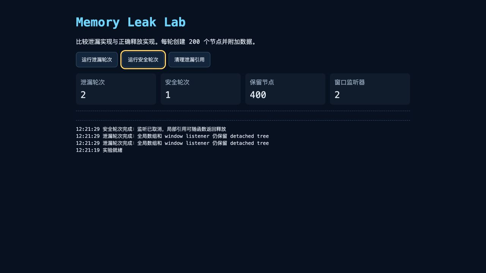
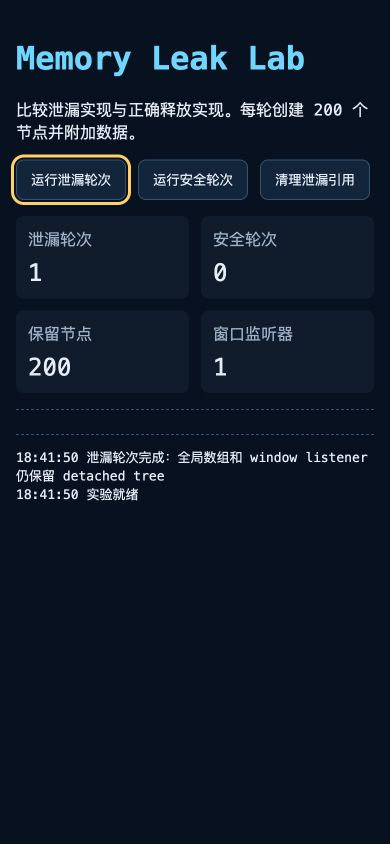
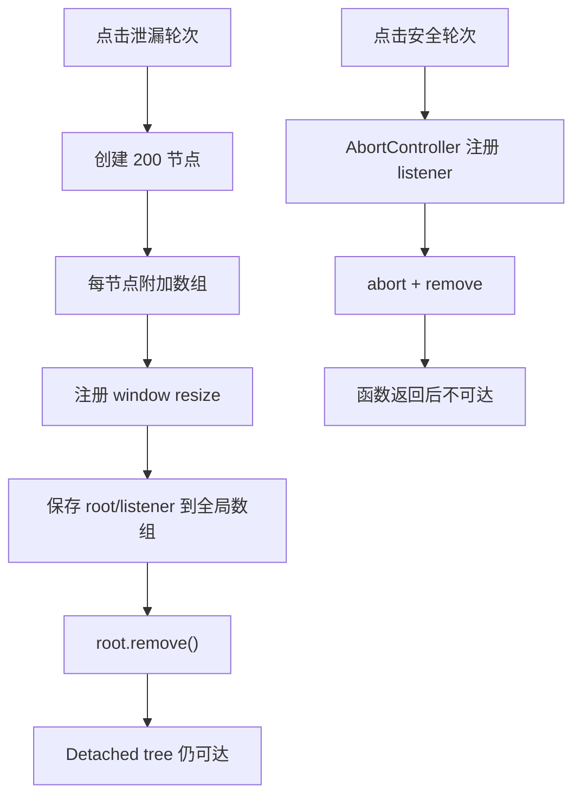

# 内存泄漏实验：从稳定复现到 Retainer Path 修复

本实验用同一页面构造 detached DOM、全局监听器和大数组保留，分别运行泄漏轮次与安全轮次。目标不是观察一次内存数字，而是建立可重复操作，比较 GC 后基线，找到从 GC root 到目标对象的引用链，修复 owner 后用相同步骤复测。

实验文件：

- [`index.html`](../../examples/browser-runtime/memory-leak-lab/index.html)
- [`style.css`](../../examples/browser-runtime/memory-leak-lab/style.css)
- [`main.js`](../../examples/browser-runtime/memory-leak-lab/main.js)

桌面状态执行两次泄漏轮次和一次安全轮次；窄屏状态执行一次泄漏轮次。计数、焦点状态与日志均来自实际浏览器运行，390px 视口无横向溢出，控制台无错误。





## 1. 实验结构



泄漏路径有两条：

```text
Window → leakedNodes → section → children → payload
Window → event listener → closure → section → children → payload
```

只有同时清空数组并移除监听器，节点才不再从这两条路径可达。

## 2. 启动

不要直接双击依赖模块和跨源能力的复杂实验。当前页面可直接打开，但统一使用本地 HTTP：

```bash
cd 01-frontend/examples/browser-runtime/memory-leak-lab
python3 -m http.server 4173
```

访问 `http://localhost:4173`。使用无痕窗口或新浏览器 profile，关闭会注入页面脚本的扩展。打开 DevTools 后切到 Memory。

## 3. 建立基线

1. 刷新页面；
2. 点击一次“安全轮次”使代码完成懒加载；
3. 点击垃圾桶图标请求 GC；
4. 选择 Heap snapshot；
5. 拍 Snapshot A；
6. 记录页面显示的四个计数；
7. 不在 Console 打印 DOM 节点。

预热能把事件模块初始化、字体、首次函数执行与目标增长分开。强制 GC 只为提高实验可比性，生产代码不能调用。

## 4. 泄漏轮次

点击“运行泄漏轮次”20 次。每轮：

```js
const root = createBatch();
sandbox.append(root);

const listener = () => {
  root.dataset.lastResize = String(innerWidth);
};

window.addEventListener("resize", listener);
leakedListeners.push(listener);
leakedNodes.push(root);
root.remove();
```

页面 DOM 中看不到 row，但全局数组和 window listener 仍引用 root。执行 GC 后拍 Snapshot B。

在 Summary 搜索：

- `Detached`；
- `HTMLDivElement`；
- `HTMLSectionElement`；
- `Array`；
- `payload-`。

不同 Chromium 版本展示名称可能不同，重点是 constructor 数量差异与 retainer。

## 5. Comparison

把视图切到 Comparison，Base 选择 Snapshot A。预期：

- HTMLDivElement delta 约 4000；
- section delta 约 20；
- Array/String 明显增长；
- retained size 随轮数上升。

数值不会严格相等：引擎字符串去重、内部表示、DevTools 与 GC 会影响结果。业务计数 `20 × 200` 是实验期望，heap 数用于归因而不是逐字节验收。

按 `# Delta` 找数量增长，按 `Size Delta` 找字节增长，按 retained size 找能释放最大子图的 owner。三种排序回答不同问题。

## 6. 查 Retainer

选中一个 detached div，展开 Retainers。沿路径向上：

```text
HTMLDivElement
← child/element
← HTMLSectionElement
← leakedNodes[...]
← Window
```

另一个 section 实例可能显示：

```text
HTMLSectionElement
← context: root
← listener closure
← EventListener
← Window
```

找到第一个业务对象 `leakedNodes` 或 listener closure 后即可回源码。不要一直展开到浏览器内部 root 而忽略业务 owner。

## 7. 验证第二条路径

在 Console 仅清数组会污染调试，但可用于教学分步：

```js
// 实验代码默认未把数组暴露到 window，因此生产实验不这样操作。
```

推荐点击“清理泄漏引用”，实现：

```js
for (const listener of leakedListeners.splice(0)) {
  window.removeEventListener("resize", listener);
}
leakedNodes.length = 0;
```

请求 GC 并拍 Snapshot C。若只清 `leakedNodes`，listener path 仍保留 root；若只移除 listener，全局数组 path 仍保留。这个过程证明修复必须覆盖所有 owner。

## 8. 安全轮次

安全实现：

```js
function runSafeRound() {
  const controller = new AbortController();
  const root = createBatch();
  sandbox.append(root);

  window.addEventListener(
    "resize",
    () => {
      root.dataset.lastResize = String(innerWidth);
    },
    { signal: controller.signal },
  );

  controller.abort();
  root.remove();
}
```

函数返回后没有模块变量保存 root；abort 从 window 移除 listener。运行 100 次、GC、拍快照，目标 detached tree 不应随轮数线性增长。

## 9. 为什么局部闭包可以回收

闭包引用 root 不自动泄漏。安全轮次中的 callback 与 root 互相构成一组对象，但 callback 已从 window listener table 删除，局部 controller/root 也在函数返回后失去 root path。循环可达组整体不可达，GC 能回收。

泄漏轮次中 window 是 root，window listener table 引用 callback，因此 callback→root 的路径一直存在。

## 10. Allocation Timeline

选择 Allocation instrumentation on timeline：

1. 开始录制；
2. 运行泄漏轮次 5 次；
3. 等待一次 GC；
4. 再运行安全轮次 5 次；
5. 停止；
6. 选择泄漏操作的时间区间；
7. 查看跨 GC 仍存活的蓝条；
8. 展开分配调用栈。

录制会降低页面速度。此模式用于把对象连接到分配位置，不用于比较真实 INP 或函数耗时。

## 11. Sampling

Allocation sampling 适合发现 `createBatch` 的高分配调用栈：

```text
runLeakingRound
└── createBatch
    ├── new Array
    ├── fill
    └── createElement
```

泄漏轮次与安全轮次初始分配量几乎相同，区别是操作结束后的存活。Sampling 回答哪里分配，Snapshot/retainer 回答为什么活着。

## 12. Performance Monitor

打开 More tools → Performance monitor，观察：

- JS heap size；
- DOM Nodes；
- JS event listeners；
- Documents；
- CPU usage。

连续点泄漏按钮，DOM Nodes/Listeners 上升；安全轮次可能短时上升后回落。Monitor 用于找趋势，不能从曲线定位哪一个 Map 或 callback 保留对象。

## 13. 实验一：只泄漏 listener

修改故障分支，不再 `leakedNodes.push(root)`，保留：

```js
window.addEventListener("resize", listener);
leakedListeners.push(listener);
```

retainer 仍经 Window→listener→closure→root。这个实验说明“没有全局 DOM 数组”不代表组件不会被全局目标保留。

修复：listener 使用 AbortSignal，并由组件 scope 在卸载时 abort。

## 14. 实验二：只泄漏 Map

移除 window listener，改为：

```js
const registry = new Map();
registry.set(crypto.randomUUID(), root);
```

retainer 为 Window/module→registry→value→root。Map key 是字符串还是对象不重要；value 被强引用。若只是节点附加 metadata：

```js
const metadata = new WeakMap();
metadata.set(root, { createdAt: performance.now() });
```

WeakMap 不保活 root，但不可枚举，不能承担需要主动管理的 registry。

## 15. 实验三：Timer

```js
const timer = setInterval(() => {
  root.dataset.time = String(Date.now());
}, 1000);
```

删除 root 后 timer callback 继续捕获。修复 `clearInterval(timer)`。观察 CPU 唤醒和逻辑副作用；内存只是问题之一。

用递归 timeout 做轮询时，既要 clear 当前 timeout，也要设置 `stopped`，防正在执行的 async callback 完成后安排下一轮。

## 16. 实验四：Observer

```js
const observer = new ResizeObserver(() => update(root));
observer.observe(root);
```

离开路由时 `observer.disconnect()`。不同实现中 observer/target 引用细节可能不同，业务仍需显式结束观察，避免回调和资源继续活动。

若共享一个 observer，组件卸载调用 `unobserve(root)`，服务整体关闭才 disconnect。共享 owner 与组件 owner 不可混淆。

## 17. 实验五：Promise 与旧请求

```js
fetch("/large-report")
  .then((response) => response.json())
  .then((data) => render(root, data));
```

pending chain 会暂时保留 callback/root。网络最终完成后可能释放，这更像生命周期延长而非永久泄漏；慢请求和重试仍可造成高峰。

修复：

```js
const controller = new AbortController();
fetch(url, { signal: controller.signal });
// unmount
controller.abort();
```

再加 version guard，防请求已经完成时旧结果 commit。

## 18. 实验六：Blob 与外部内存

加入：

```js
const blob = new Blob([new Uint8Array(50 * 1024 * 1024)]);
const url = URL.createObjectURL(blob);
```

即使 img/remove 和 JS heap 变化不明显，URL registry 仍可能保留 Blob。结束时 `URL.revokeObjectURL(url)`。此实验要同时观察浏览器任务管理器/进程内存，不能只看 heap。

## 19. 自动重复

手点适合理解，回归测试要自动化：

```js
async function repeat(action, count) {
  for (let index = 0; index < count; index += 1) {
    action();
    if (index % 10 === 0) {
      await new Promise(requestAnimationFrame);
    }
  }
}
```

测试 10、50、100 轮，观察 GC 后 retained node 与 listener 的增长斜率。自动化浏览器可通过 CDP 请求 heap snapshot；固定浏览器版本并保留 artifact。

## 20. 阈值设计

不建议断言：

```text
JS heap 必须低于 20,000,000 bytes
```

浏览器、构建、JIT 和机器会造成波动。更稳健：

- 业务 registry 回到 0；
- listener counter 回到基线；
- 目标 constructor 不随轮数线性增长；
- 100 轮相对 50 轮的 retained delta 接近平台；
- 无活动 worker/socket/timer；
- 快照中不存在指定 owner path。

heap 字节用于检测显著回归，并留出统计容差。

## 21. 案例一：弹窗组件

弹窗使用 body portal、keydown listener、focus trap、ResizeObserver、退出动画 timer。故障：动画正常完成会 cleanup，路由跳转打断动画则不执行。

修复用单一幂等 `dispose()`，正常关闭、取消、卸载、异常都调用；退出动画只是状态，不拥有最终释放。测试 reduced motion、Escape、快速 reopen、route replace 和初始化失败。

## 22. 案例二：图表路由

图表库内部拥有 canvas、observer、window listener、数据 cache。每次路由往返增长 8 MiB。Snapshot retainer 从 library registry 找到实例。

wrapper 在 effect cleanup 调官方 destroy，再从自建 registry 删除；生产构建循环 50 次，确认 chart constructor、canvas 与 detached nodes 平台化。若库仍泄漏，制作最小复现并升级/隔离。

## 23. 案例三：虚拟列表

列表滚动创建 row model cache，按 DOM 节点作为 key 的 Map 永不删。即使虚拟化 DOM 数保持 40，model 与旧节点增长。

修复：

- 当前窗口 row component 生命周期清理；
- 业务数据 cache 用 ID + LRU；
- 纯节点 metadata 用 WeakMap；
- overscan 有界；
- selection/focus 数据与 DOM 分离。

同时测 DOM 数、cache entries、heap 和滚动性能。

## 24. 案例四：开发环境重复注册

HMR 每次更新模块都执行：

```js
window.addEventListener("message", handler);
```

旧模块未 dispose，监听成倍增长；正式构建不复现。模块支持：

```js
if (import.meta.hot) {
  import.meta.hot.dispose(() => {
    window.removeEventListener("message", handler);
  });
}
```

还要避免 HMR 全局 singleton 重建。开发泄漏会污染长时间调试和快照，不能因生产不复现而忽略。

## 25. 修复记录模板

```md
### 复现
- 构建/浏览器/设备：
- 初始状态：
- 操作与次数：

### 证据
- A/B/C 快照：
- 增长对象：
- Retainer path：
- 外部资源计数：

### 所有权
- acquire：
- owner：
- release：
- 失败路径：

### 修复
- 代码：
- 取舍：

### 复测
- 相同操作：
- GC 后趋势：
- 功能/性能回归：
```

记录 owner 和路径，而不是只写“优化内存”。

## 26. 常见错误

1. 不预热就拍基线；
2. 只运行一次；
3. 不返回相同业务状态；
4. Console 保存节点；
5. 只看 heap 数字；
6. 只清一条 retainer path；
7. 把循环引用当原因；
8. 安全轮次也保存调试引用；
9. 用开发 HMR 结果代表生产；
10. 修复后不复测 100 轮；
11. 忽略 Blob/GPU/worker；
12. 把强制 GC 写入业务代码。

## 27. 完整验收

1. A/B/C 三快照保存；
2. 泄漏 20 轮出现可解释增长；
3. 找到数组与 listener 两条 path；
4. 清一条时证明对象仍存活；
5. 两条都清后目标对象可回收；
6. 安全轮次 100 次不线性增长；
7. allocation timeline 找到分配区间；
8. sampling 找到 `createBatch`；
9. timer/observer/fetch/blob 四个扩展故障完成；
10. 生产构建复核；
11. 自动化指标使用斜率和业务计数；
12. 输出修复前后报告。

## 来源

- [Chrome DevTools：Fix memory problems](https://developer.chrome.com/docs/devtools/memory-problems/)（访问日期：2026-07-17）
- [Chrome DevTools：Detached elements](https://developer.chrome.com/docs/devtools/memory-problems/dom-leaks/)（访问日期：2026-07-17）
- [Chrome DevTools：Heap snapshots](https://developer.chrome.com/docs/devtools/memory-problems/heap-snapshots/)（访问日期：2026-07-17）
- [DOM Standard：EventTarget](https://dom.spec.whatwg.org/#interface-eventtarget)（访问日期：2026-07-17）
- [File API：Blob URL](https://w3c.github.io/FileAPI/#url)（访问日期：2026-07-17）
