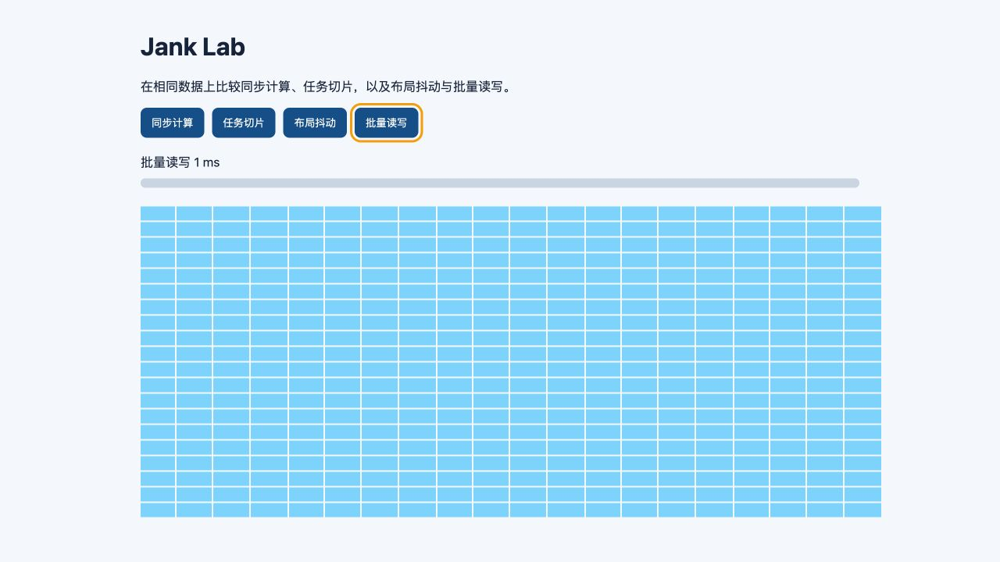
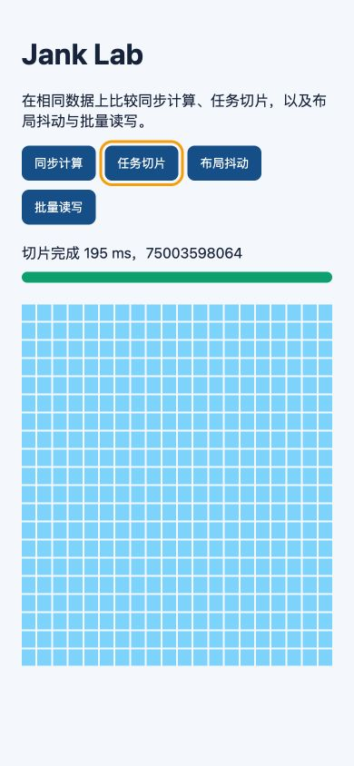
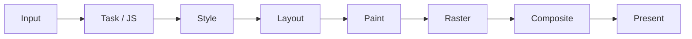

# 卡顿实验：长任务、布局抖动、任务切片与交互延迟

卡顿是页面在用户预期时间内没有产生对应视觉反馈。原因可能是主线程长任务、强制同步布局、重绘/栅格、GPU、内存回收、网络等待或第三方脚本。实验通过同一输入构造同步计算、任务切片、交错布局读写和批量读写，使用 Performance trace 连接代码、帧和交互。

实验文件：

- [`index.html`](../../examples/browser-runtime/jank-lab/index.html)
- [`style.css`](../../examples/browser-runtime/jank-lab/style.css)
- [`main.js`](../../examples/browser-runtime/jank-lab/main.js)

桌面状态完成批量读写，窄屏状态完成任务切片。两种状态均生成 400 个盒子；390px 视口无横向溢出，按钮保留键盘焦点，控制台无错误。





## 1. 运行

```bash
cd 01-frontend/examples/browser-runtime/jank-lab
python3 -m http.server 4174
```

打开 `http://localhost:4174`，DevTools → Performance：

1. 勾选 Screenshots；
2. 保持正常 CPU 先录基线；
3. 一次录制只点击一个实验按钮；
4. 再用 4× CPU slowdown；
5. 每个模式至少三次；
6. 保存 trace 和浏览器/设备信息。

实验计算量按机器不同会有明显差异。若同步不足 50 ms，可在 `values` 或 `expensive` 中增加工作；若超过数秒则减少，避免 DevTools 本身无响应。

## 2. 一帧的预算

60 Hz 显示每次刷新约 16.7 ms，120 Hz 约 8.3 ms。浏览器在预算内还要处理输入、JavaScript、样式、布局、绘制、栅格和合成。应用不能把全部 16.7 ms 分给脚本。



掉一帧不必然被用户察觉，持续掉帧、输入后的长等待和动画节奏不稳定更重要。高刷新率设备对单帧预算更严格。

## 3. Long Task

Long Tasks API 报告主线程连续占用超过 50 ms 的 task。Performance 中常见长 task 带红色角标。它包括 JavaScript 和同一 task 触发的渲染工作。

实验“同步计算”：

```js
function syncWork() {
  let checksum = 0;
  for (const value of values) {
    checksum += expensive(value);
  }
}
```

整个循环在 click task 中完成。期间：

- 第二次输入只能排队；
- progress 不能绘制；
- timer/网络 callback 不能运行；
- accessibility 反馈推迟；
- 页面动画可能只靠 compositor 继续；
- task 结束后浏览器才有机会渲染。

总 CPU 300 ms 即使算法正确，也不满足交互线程的调度约束。

## 4. INP 分解

Event Timing 把交互延迟分为：

```text
input delay + processing duration + presentation delay
```

- input delay：事件到达后等待主线程；
- processing：事件 listener 执行；
- presentation：handler 完成到下一帧显示。

同步计算放在 click handler 增加 processing；此前另一个长 task 增加 input delay；handler 中写大量 DOM 使 layout/paint 延后，增加 presentation delay。

优化必须定位具体分量。仅把计算延迟到 `setTimeout` 可能让当前 click 很快返回，但 timeout 随后仍阻塞下一次输入。

## 5. 任务切片

实验按约 8 ms 预算处理：

```js
while (index < values.length) {
  const deadline = performance.now() + 8;
  while (index < values.length && performance.now() < deadline) {
    checksum += expensive(values[index]);
    index += 1;
  }
  updateProgress(index);
  if (index < values.length) await taskYield();
}
```

每片结束后用 MessageChannel 进入新 task，浏览器可处理输入和渲染。预期：

- 单个 task 变短；
- 进度可见；
- 按钮仍可响应；
- 总完成时间可能增加；
- task 数和调度开销增加；
- 中间状态必须可被观察。

切片不会减少 CPU。需要降低耗电、总耗时和设备压力时，应减少工作、换算法、缓存或移到 worker/服务端。

## 6. 为什么不用 resolved Promise

```js
await Promise.resolve();
```

continuation 进入 microtask queue。同一个 microtask checkpoint 通常继续清空队列，渲染和下一 task 得不到机会。实验的 `taskYield()` 使用 MessageChannel：

```js
function taskYield() {
  return new Promise((resolve) => {
    const channel = new MessageChannel();
    channel.port1.onmessage = resolve;
    channel.port2.postMessage(undefined);
  });
}
```

生产封装应复用 channel，避免每片新建端口；优先支持 `scheduler.yield()` 的环境，并提供 fallback。

## 7. 切片预算

固定每批 1000 项的问题：单项成本会因输入和设备变化。按时间预算更适配，但 `performance.now()` 检查也有成本，可每 N 项检查。

预算选择：

| 目标 | 起点 | 说明 |
|---|---:|---|
| 高频输入 | 4 ms | 更快让出，吞吐较低 |
| 普通后台计算 | 8 ms | 常用起点 |
| 页面隐藏离线任务 | 16–50 ms | 仍需取消和上限 |
| 单项超过预算 | 无效 | 拆单项或 worker |

通过真实 INP、总完成时间和 yield 次数调参，不把 8 ms 写成普遍正确值。

## 8. 取消与旧结果

任务切片后用户可改变输入：

```js
async function calculate(items, { signal, version }) {
  const result = [];
  // chunks...
  if (!signal.aborted && version === currentVersion) {
    commit(result);
  }
}
```

AbortSignal 让循环尽早停止，version 防止已到最后阶段的旧任务覆盖新结果。局部 buffer 完成后一次提交，避免 UI 读到半排序的共享数组。

实验可新增“取消”按钮，验收从点击取消到循环停止 <100 ms。切片 50 ms 则取消上限至少接近 50 ms。

## 9. Worker 方案

纯 CPU 且不访问 DOM 的计算适合 worker：

```js
const worker = new Worker("./compute.worker.js", { type: "module" });
worker.postMessage({ id, values }, [values.buffer]);
```

取舍：

- 主线程更空闲；
- 数据 clone/transfer 有成本；
- worker 有独立 heap；
- 需要请求协议、取消、崩溃与版本；
- 结果 commit 仍在主线程；
- worker 计算可能与主线程竞争 CPU；
- 低核设备需限制 worker 数。

切片适合中等、可拆、需要渐进的工作；worker 适合大纯计算；最优先仍是减少工作。

## 10. Layout Thrashing

布局信息读取：

- `offsetWidth/Height`；
- `clientWidth/Height`；
- `scrollWidth/Height`；
- `getBoundingClientRect()`；
- `getComputedStyle()` 某些值；
- focus/selection/scroll API 的部分操作。

样式写入使布局失效，随后读取可能迫使浏览器立即计算：

```js
for (const box of boxes) {
  box.style.width = `${box.offsetWidth + 1}px`;
}
```

序列：

```text
read → write → forced layout → write → forced layout ...
```

DevTools 会在反复 Layout 或 Forced reflow 警告中显示调用栈。

## 11. 批量读写

```js
const widths = boxes.map((box) => box.offsetWidth);
boxes.forEach((box, index) => {
  box.style.width = `${widths[index] + 1}px`;
});
```

所有读取发生在写前，通常只需一次布局。大型应用中多个模块各自批量仍可能交错，使用共享 frame scheduler：

```text
rAF: read phase → calculate → write phase
```

不要把读取放进每个 write callback。CSS layout 能表达的排列优先交给 Grid/Flex/Container Queries，删除 JavaScript 测量。

## 12. 实验的布局变量

当前 `#boxes` 使用 Grid。单个 box 写 width 可能影响自身和 grid track，浏览器优化程度会因版本不同。为了扩大差异可：

- 增加 box 到 2000；
- 让容器宽度由内容决定；
- 在每轮读取容器 `scrollWidth`；
- 加复杂后代；
- CPU 4× slowdown。

每次只改变一个变量，确保 thrash 与 batch 使用同一 DOM 和目标尺寸。

## 13. Style、Layout、Paint 区分

Performance trace：

- Recalculate Style：选择器匹配与 computed style；
- Layout：几何；
- Pre-Paint/Paint：绘制记录；
- Raster：像素 tile；
- Composite：层组合。

改 class 可能只触发 style；改颜色触发 paint；改 width 常触发布局+paint；改 transform 可能只 composite。实际取决于属性、层和上下文。

“Scripting 降低”但 Paint 增加可能没有改善帧；必须看整条流水线。

## 14. 帧视图

Frames track 中：

- 长帧超过刷新预算；
- screenshot 显示用户看到的状态；
- Main 与 Raster/GPU 对齐定位瓶颈；
- 连续帧间隔揭示动画不均；
- idle gap 说明并非主线程持续忙。

CPU slowdown 只放大 CPU 相关主线程，不准确模拟慢 GPU、内存带宽和移动散热。最终在目标设备复测。

## 15. Long Animation Frame

LoAF API 关注超过阈值的动画帧，并可关联 scripts、style/layout。它比 Long Tasks 更贴近一帧内由多个 task/callback 汇总造成的卡顿。

```js
const observer = new PerformanceObserver((list) => {
  for (const entry of list.getEntries()) {
    console.log(entry.duration, entry.blockingDuration);
  }
});
observer.observe({ type: "long-animation-frame", buffered: true });
```

生产采样时限制数量、去除 URL/query 用户数据，并特性检测。PerformanceObserver 自身与保存的 entries 也要有界。

## 16. User Timing

给业务阶段加标记：

```js
performance.mark("search:start");
await buildIndex();
performance.mark("search:end");
performance.measure("search", "search:start", "search:end");
```

mark/measure 帮助在 trace 中连接业务，但不会自动判断主线程是否阻塞。完成后可 `clearMarks`/`clearMeasures`，长期监控不要无限积累唯一名称。

## 17. 案例一：表格排序

### 基线

100k rows 点击列头，同步 `toSorted` + render 全部 DOM，handler 900 ms。

### 分解

- sort 180 ms；
- view model 120 ms；
- 创建 100k row 300 ms；
- style/layout/paint 300 ms。

只把 sort worker 化仍有 600 ms DOM。方案：

1. 服务端排序或 worker；
2. 虚拟化只 render 视口；
3. 旧结果 version；
4. pending 状态即时；
5. transition 提交非紧急 UI；
6. focus/aria row index 正确。

优化按子阶段验证，而不是笼统“用了 worker”。

## 18. 案例二：富文本输入

每次 input：

- 全文 parse 180 ms；
- decoration DOM 90 ms；
- selection 几何读写 40 ms。

方案：

- composition 期间不破坏 IME；
- 增量 parse；
- worker；
- viewport decoration；
- read selection rect 后批量写；
- 旧 parse result 丢弃；
- 输入 state 紧急，高亮可延后。

测键入、粘贴、撤销、中文输入、20k 行、后台恢复，目标是交互而不只总 parse。

## 19. 案例三：滚动吸顶

scroll handler 每事件读取 30 元素 rect 并写 class，产生强制布局。方案优先 CSS `position: sticky`；只需可见性用 IntersectionObserver；确需连续位置则 passive listener 记录 scroll，rAF 一次 read/write。

不要 debounce 200 ms 导致吸顶明显滞后。滚动同步视觉需要每帧最新值，不需要回放每个 scroll event。

## 20. 案例四：第三方脚本

广告/分析脚本在输入前执行 120 ms。应用代码没有调用栈归属并不代表无法治理：

- 延迟到同意/交互后；
- 按页面加载；
- 减少供应商；
- worker/iframe 隔离（能力边界明确）；
- tag budget；
- CSP/权限；
- Long Task attribution；
- 失败不阻断核心 UI。

第三方仍消耗同一设备 CPU/网络，异步 script 不等于执行不阻塞。

## 21. 案例五：React 渲染

一次 state 更新让 10k 子组件 rerender。Performance 同时看浏览器 trace 和 React Profiler：

- state owner 是否过高；
- context value 是否每次新对象；
- list 是否虚拟化；
- selector 是否缩小订阅；
- memo 是否真的减少 render；
- render 中是否高分配；
- commit 是否大量 DOM/layout。

`startTransition` 可让 React 更新可中断，但同步排序和第三方 DOM 仍不自动切片。

## 22. 测量矩阵

| 维度 | 取值 |
|---|---|
| 构建 | production |
| 缓存 | cold/warm |
| CPU | normal/4× |
| 刷新率 | 60/120Hz |
| 数据 | 1k/100k/边界 |
| 输入 | mouse/keyboard/touch/IME |
| 页面 | visible/background restore |
| 网络 | online/offline/retry |
| 辅助功能 | reduced motion/screen reader |

不是每次跑全部组合。高风险路径进 CI，小型变更至少跑目标设备与最差数据。

## 23. 报告指标

- interaction input delay；
- processing duration；
- presentation delay；
- INP field p75；
- Long Task count/total/max；
- LoAF count/blockingDuration；
- 每片 duration/yield count；
- 总完成时间；
- Layout/Paint/Raster；
- dropped/long frames；
- memory/allocation；
- cancel latency；
- correctness。

实验室单次 INP 不能替代真实用户分位数；字段数据又不能直接给出源码栈，两者结合。

## 24. 常见无效修复

1. 把同步函数放 `setTimeout(0)`；
2. 循环中 `await Promise.resolve()`；
3. 固定每批项数；
4. rAF 内执行全部重计算；
5. debounce 后仍单次冻结；
6. worker 后 render 全部 DOM；
7. 只改 transform 但每帧读 layout；
8. 只看 FPS；
9. 只看平均值；
10. CPU slowdown 当真实手机；
11. 优化总耗时却恶化交互；
12. 不验证结果一致性。

## 25. 自动化回归

浏览器测试执行固定动作，保存 trace 与 Web Vitals。门禁可用：

- Long Task max 不超过基线显著阈值；
- 特定 action processing/presentation 不回归；
- DOM 数有界；
- 同步故障模式必须产生长任务；
- yield 模式取消 <100 ms；
- layout batch 的 Layout 次数显著低于 thrash。

性能有噪声，使用多轮中位数、固定机器、基线区间，失败时保留 trace 而不是只输出一个数字。

## 26. 完整实验步骤

1. 正常 CPU 跑同步三次；
2. 保存 trace；
3. 跑切片三次；
4. 在计算期间连续移动鼠标/点击；
5. 比较 Long Task、进度和总时间；
6. 4× CPU 重复；
7. 跑布局抖动；
8. 记录 Layout 次数和调用栈；
9. 跑批量读写；
10. 增加 box 到 2000 重复；
11. 实现 worker 模式；
12. 添加 cancel/version；
13. 输出指标表；
14. 在真实移动设备复核。

## 27. 综合验收

1. 同步模式可稳定产生长 task；
2. 切片单片符合预算；
3. progress 能在任务完成前显示；
4. Promise microtask 版本证明不能绘制；
5. cancel/旧结果正确；
6. worker 处理 transfer 与崩溃；
7. thrash 有 forced layout 证据；
8. batch 显著减少 layout；
9. CSS 替代方案完成；
10. INP 三分量有记录；
11. CPU 4× 与真实设备都有 trace；
12. 报告包含总耗时、交互、帧、内存和取舍。

## 来源

- [Long Tasks API](https://w3c.github.io/longtasks/)（访问日期：2026-07-17）
- [Long Animation Frames API](https://w3c.github.io/long-animation-frames/)（访问日期：2026-07-17）
- [Event Timing API](https://www.w3.org/TR/event-timing/)（访问日期：2026-07-17）
- [HTML Standard：Event loops](https://html.spec.whatwg.org/multipage/webappapis.html#event-loops)（访问日期：2026-07-17）
- [Chrome DevTools：Performance](https://developer.chrome.com/docs/devtools/performance/)（访问日期：2026-07-17）
