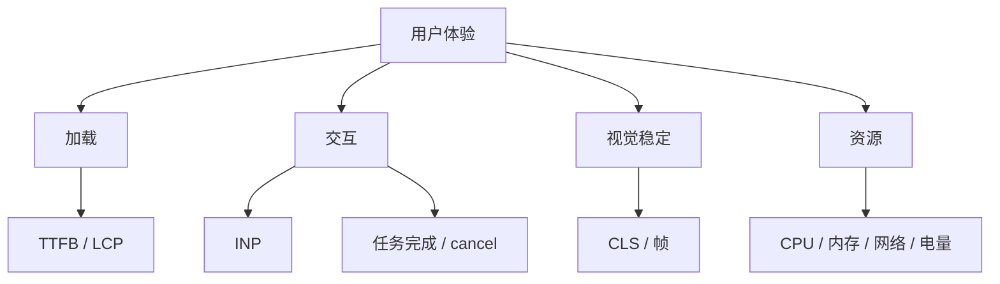

# 性能优化前后报告：假设、证据、指标与可复现结论

性能报告不是“优化后更快”的截图集合。它要让读者复现同一场景，理解用户问题、瓶颈证据、修改机制、指标变化、统计不确定性、功能取舍和生产结果。完整报告能区分实验室改善、真实用户改善与尚未验证的推断。

## 1. 报告回答的问题

1. 哪类用户在什么操作中遇到什么问题？
2. 环境、数据和操作如何复现？
3. 瓶颈在哪个线程/阶段/函数？
4. 为什么选择这个方案？
5. 改动影响哪个性能机制？
6. 前后使用同一条件吗？
7. 结果有多大、波动多大？
8. 功能、可访问性和资源成本是否回归？
9. 真实用户数据是否改善？
10. 哪些结论仍有限制？

## 2. 先写用户场景

弱目标：

```text
提升页面性能。
```

可验证目标：

```text
移动端用户在 50k 行报表中点击“按金额排序”后，
下一帧反馈需在 100 ms 内出现，排序结果在 2 s 内完成，
期间取消按钮可在 100 ms 内响应。
```

目标同时包含即时反馈、最终完成和可取消性。只优化总完成时间可能仍让用户冻结；只优化点击反馈可能把长任务推迟到下一 task。

## 3. 指标树



每个项目选择与问题直接相关的少量主指标，再用诊断指标解释：

- 主指标：INP p75、LCP p75、任务完成时间；
- 诊断：Long Task、Layout、JS execution、request chain；
- 防回归：CLS、内存、bundle、错误率；
- 业务：提交成功率、取消率、转化。

不要把所有指标都列为同等目标。

## 4. Lab 与 Field

### Lab

固定设备/网络/步骤，能保存 trace 与源码调用栈，适合定位和前后比较。局限是样本小、环境人工。

### Field

真实设备、网络、数据和用户行为，适合判断分位数和覆盖面。局限是归因困难、版本混合、隐私约束。

流程：

```text
Field 发现问题 → Lab 稳定复现 → Trace 定位 → 修复 → Lab 验证
→ 灰度发布 → Field 验证 → 继续/回滚
```

Lab 通过不表示所有用户改善；field 改善也可能受流量、设备或产品变化影响。

## 5. 测试环境

报告固定：

| 项 | 示例 |
|---|---|
| commit | `abc1234` |
| build | production |
| 浏览器 | Chrome 版本号 |
| OS/设备 | Pixel / macOS |
| CPU | native / 4× slowdown |
| 网络 | RTT/吞吐/丢包 |
| DPR/刷新率 | 3 / 120Hz |
| 缓存 | cold/warm |
| 登录/权限 | tenant/role |
| 数据 | 50k rows、字段分布 |
| viewport | 390×844 |
| 扩展 | 禁用 |

“移动端模拟”必须说明只是 DevTools viewport/CPU/network，不能等同真实手机 GPU、散热和内存。

## 6. 数据集

性能与输入相关。保存可公开的合成 fixture 或生成器：

```js
function makeRows(count, seed) {
  const random = mulberry32(seed);
  return Array.from({ length: count }, (_, index) => ({
    id: `row-${index}`,
    amount: Math.round(random() * 100000),
    label: `Item ${index}`,
  }));
}
```

记录：

- 数量；
- 字符串长度；
- 图片尺寸；
- 嵌套深度；
- 重复/唯一 key；
- 命中率；
- worst-case；
- seed；
- 是否含隐私数据。

前后数据不一致会让结果不可比。生产样本需去标识化和授权。

## 7. 操作脚本

```text
1. 新 profile 打开 URL；
2. 等待 network idle + 页面 ready 标记；
3. 预热一次排序；
4. 恢复原始顺序；
5. 开始 trace；
6. 点击金额列；
7. 等待完成标记；
8. 停止 trace；
9. 重复 10 次；
```

使用稳定的 ready/complete 业务信号，不以固定 sleep 代替。点击坐标、滚动距离、输入文本和等待条件都明确。自动化脚本与报告同仓库。

## 8. 冷/热测试

加载场景至少区分：

- 首次导航、冷 HTTP cache；
- 重复导航、热 cache；
- Service Worker 已安装/未安装；
- 新旧版本升级；
- DNS/connection 已复用；
- 数据 client cache 有/无。

交互场景区分：

- 首次操作的懒加载/JIT；
- 预热后的稳态；
- 缓存填满后的长会话；
- 后台恢复。

不能把优化后热缓存与优化前冷缓存对比。

## 9. 录制 Trace

Performance trace 的最小阅读顺序：

1. 选择目标 interaction/导航；
2. 看截图和 Frames；
3. 看 Main/GPU/Raster/Network；
4. 展开最长 task；
5. Bottom-Up 按 Self Time 找热点；
6. Call Tree 看调用关系；
7. Event Log 看时序；
8. 检查 Layout/Paint/GC；
9. 用 source map 回源码；
10. 标出瓶颈时间范围。

报告附完整 trace artifact 或明确存放位置；截图仅展示关键区域，并写出如何导航到它。

## 10. 建立因果假设

格式：

```text
因为 [证据中的机制]，
所以 [用户指标] 变差；
如果 [修改]，
则 [诊断指标] 应发生 [方向/幅度]，
同时 [防回归指标] 不应恶化。
```

示例：

```text
点击排序后同步创建 100k DOM，单个 task 860 ms，
导致 processing 和 presentation delay。
若只渲染 40 行并把排序移入 worker，
Long Task max 应降至 <50 ms，反馈 <100 ms；
总排序可稍增，但内存与结果正确性不能回归。
```

先预测再修改，能识别改善是否来自预期机制。

## 11. 一次改变一个主变量

同时升级框架、压缩图片、改 API、加 CDN 和虚拟化，前后虽改善却不能归因。大型项目可分 commit/feature flag：

1. 只减少 DOM；
2. 再 worker；
3. 再请求压缩；
4. 最后组合。

若生产只能整体发布，实验仍可用 flags 做 ablation。报告说明交互效应，避免把各项百分比简单相加。

## 12. 重复次数与统计

至少报告：

- 样本数 n；
- median；
- p75/p95 或最差；
- min/max/IQR；
- 原始结果链接；
-异常值处理规则。

```text
before: n=15, median 842 ms, p75 910, range 790–1120
after:  n=15, median 96 ms,  p75 108, range 82–160
```

平均值容易被少数异常值影响；中位数不能隐藏最差体验。样本很少时不要假装统计精确。前后交替运行可减少温度、后台任务和时间漂移。

## 13. 百分比

延迟降低：

```text
(before - after) / before × 100%
```

842→96 ms 为约 88.6% 降低。不要写“快 8.8 倍”和“降低 8.8 倍”混用。吞吐提升公式方向相反。

同时给绝对值：5→1 ms 降低 80% 可能无用户意义；1000→400 ms 降低 60% 仍可能不达目标。

## 14. 性能预算

预算在实现前定义：

| 指标 | 预算 | 环境 |
|---|---:|---|
| 点击反馈 | <100 ms | 目标手机 |
| 最大主线程 task | <50 ms | 4× CPU |
| 列表 DOM | <100 | 50k rows |
| route JS | <180 KiB gzip | production |
| 图片解码内存 | <64 MiB | DPR 3 |
| GC 后 heap 增长 | 平台化 | 100 轮 |

预算来自用户目标、设备分布和系统约束，不来自统一魔法数。CI 门禁留噪声区间，重大回归保存 artifact。

## 15. 案例一：加载性能

### 现象

商品详情移动端 LCP p75 4.2 s。Lab waterfall 显示 hero image 由 client JS 运行后发现，且初始下载 3 MB。

### 假设

把语义图片写入 HTML、正确 `srcset/sizes`、高优先级并压缩，可提前发现且减少字节。

### 前后

| 指标 | 前 | 后 |
|---|---:|---:|
| image request start | 1.8 s | 0.35 s |
| transfer | 3.0 MB | 420 KB |
| Lab LCP median | 3.9 s | 1.8 s |
| CLS | 0.02 | 0.02 |

### 边界

高 fetchpriority 只给真正 LCP 候选；尺寸属性防布局偏移；慢 CDN/TTFB 仍需后端处理。发布后按页面/设备验证 field LCP。

## 16. 案例二：交互性能

### 现象

报表排序 INP field p75 720 ms。Trace 显示排序 170 ms、10k React render 330 ms、Layout/Paint 180 ms。

### 方案

- worker 排序 transferable indices；
- 虚拟化 50 行；
- 点击立即显示 pending；
- request version；
- 非紧急结果 transition。

### 结果

| 指标 | 前 | 后 |
|---|---:|---:|
| processing | 510 ms | 32 ms |
| presentation | 190 ms | 48 ms |
| total result | 690 ms | 310 ms |
| DOM nodes | 12,400 | 620 |
| worker transfer | 0 | 18 ms |

报告仍需验证键盘、读屏、打印、搜索和滚动定位，虚拟化不是纯性能改动。

## 17. 案例三：内存

### 现象

地图路由往返 50 次后 GC baseline 从 80 MiB 到 470 MiB，worker 从 1 到 51。

### 证据

Heap retainer：

```text
Window → mapRegistry → MapInstance → detached canvas
```

且每次 mount 新建 worker，无 terminate。

### 修复

destroy map、registry delete、worker terminate、observer disconnect。复测 100 轮：

- heap 80–98 MiB 平台化；
- worker 回到 1；
- detached map root 不线性增长；
- route close latency +8 ms；
- 功能无回归。

内存报告必须写 GC 条件和进程外资源，不只截 heap 曲线。

## 18. 案例四：网络

### 现象

Dashboard 进入后 38 个相同配置请求。React 多组件各 fetch，HTTP cache 被 `no-store` 禁用。

### 方案

- data client single-flight；
- server 正确 Cache-Control/ETag；
- 配置 session cache 有版本失效；
- retry 统一；
- 请求 key 含 tenant/locale。

### 结果

请求 38→1，transfer 760→20 KB，主内容完成 1.4→0.8 s。代价是缓存一致性与登出清理；错误不能永久 Promise-cache。

## 19. 反例：分数改善但用户变差

为了提高 Lighthouse：

- 延迟加载聊天入口；
- 移除首屏个性化；
- 点击后才加载 500 KB JS。

首屏分数提高，但首次聊天点击等待 2 s，业务转化下降。报告必须覆盖关键用户旅程和业务指标，不把单页面加载分数当产品体验。

## 20. 视觉证据

合适图片：

- waterfall 前后；
- flame chart 关键长 task；
- Frames/screenshot；
- Layers/paint flashing；
- heap retainer path；
- 真实 UI 前后。

每张图：

- 裁到相关区域；
- 标注时间/函数；
- 提供 alt；
- 不含 token、用户数据；
- 保存原 trace；
- 说明环境；
- 不用图片替代指标表。

流程关系用 Mermaid，真实视觉效果用浏览器截图，数据趋势用图表。

## 21. 功能回归清单

性能改动常改变：

- 键盘与焦点；
- screen reader DOM；
- reduced motion；
- 搜索/打印；
- SEO/SSR；
- 错误/重试；
- offline；
- 数据一致性；
- analytics；
- 权限；
- 多 tab；
- 浏览器兼容；
- 内存；
- 电量。

报告列出已测与未测，不写笼统“功能正常”。

## 22. 生产发布

使用：

1. feature flag；
2. 1% 内部/灰度；
3. 监控错误、主指标、防回归指标；
4. 按设备/网络/地区/版本分段；
5. 扩到 10/50/100%；
6. 保留回滚；
7. 观察足够业务周期；
8. 对照组避免同期变化误判。

性能监控本身有成本和隐私边界。采样、去标识化、限制 entry 数，不上传完整 URL/query/DOM。

## 23. Field 分段

总体 p75 改善可能掩盖低端设备回归。至少考虑：

- mobile/desktop；
- effective connection；
- device memory/CPU proxy；
- 新/回访；
- cold/warm；
- page/route；
- app version；
- feature flag cohort；
- 数据规模；
- 地区/CDN；
- 登录状态。

分段不能用高基数 metric labels；在分析仓库中受控聚合。样本不足不下强结论。

## 24. 回归门禁

### 静态

- bundle budget；
- 图片尺寸；
- dependency duplication；
- route chunk；
- source map。

### Lab CI

- 固定场景 trace；
- Lighthouse/WebPageTest；
- interaction benchmark；
- memory loop；
- DOM count；
- API request count。

### Production

- Web Vitals；
- task/LoAF 采样；
- errors；
- resource timing；
-业务指标。

CI 噪声大时先报警/保存 artifact，再对稳定显著项阻断。不要让团队因随机红灯关闭门禁。

## 25. 报告模板

```md
# [场景] 性能优化报告

## 摘要
- 用户问题：
- 目标：
- 结果：
- 状态：

## 环境与复现
- commit/build/browser/device/network/cache/data：
- 操作脚本：
- artifacts：

## 基线
- 主指标：
- trace 证据：
- bottleneck：

## 假设与方案
- 因果假设：
- 备选与取舍：
- 修改：

## 结果
- n/median/p75/range：
- 前后表：
- 诊断指标：

## 正确性与边界
- 功能/a11y/兼容/内存：
- 未覆盖：

## 发布
- flag/cohort：
- field 结果：
- 回滚条件：
```

## 26. 证据强度

从弱到强：

1. 主观觉得更顺；
2. 单次本机数字；
3. 可重复 lab、多次统计；
4. trace 证明机制；
5. 对照/消融证明修改归因；
6. 灰度 field 分位数；
7. 业务周期稳定且无回归。

报告可以停在第 3–4 层，但要明确“实验室验证完成，生产效果待观察”，不能把推断写成已证实结果。

## 27. 常见错误

1. 前后环境不同；
2. 只跑一次；
3. 只报告最好一次；
4. 只写百分比；
5. 热缓存对冷缓存；
6. 使用不同数据；
7. 同时改太多无法归因；
8. 只看 Lighthouse 分；
9. 截图无 trace；
10. 平均值隐藏长尾；
11. 不测功能/a11y；
12. lab 结论冒充 field；
13. 监控收集敏感 URL；
14. 没有回滚条件；
15. 报告无法复现；
16. 优化局部却增加内存/电量。

## 28. 综合练习

使用 Jank Lab 和 Memory Leak Lab 各完成一份前后报告：

1. 为同步计算定义反馈/完成/cancel 目标；
2. 固定数据与 seed；
3. 正常与 4× CPU 各 10 次；
4. 对比同步、yield、worker；
5. 保存 Long Task、INP 分解和总耗时；
6. 为 layout thrash/batch 保存 trace；
7. 内存实验做 A/B/C 快照；
8. 给出 retainer path；
9. 修复后循环 100 次；
10. 加入功能/a11y检查；
11. 写方案取舍；
12. 模拟灰度与回滚阈值；
13. 所有原始数据和 artifact 可访问；
14. 结论只覆盖证据支持范围。

## 29. 最终审核

- [ ] 用户场景具体；
- [ ] 目标可衡量；
- [ ] 环境完整；
- [ ] 数据与操作可复现；
- [ ] 前后 commit 可定位；
- [ ] 同一条件多次运行；
- [ ] 有原始值和统计；
- [ ] trace 证明瓶颈；
- [ ] 修改机制与预测一致；
- [ ] 主指标改善；
- [ ] 防回归指标稳定；
- [ ] 功能/a11y/兼容已测；
- [ ] field 与 lab 分开；
- [ ] 边界和未验证项明确；
- [ ] 灰度与回滚存在；
- [ ] 无敏感数据。

## 来源

- [W3C：Web Performance Working Group](https://www.w3.org/groups/wg/webperf/)（访问日期：2026-07-17）
- [Chrome：Web Vitals](https://web.dev/articles/vitals)（访问日期：2026-07-17）
- [Chrome DevTools：Performance](https://developer.chrome.com/docs/devtools/performance/)（访问日期：2026-07-17）
- [W3C Event Timing](https://www.w3.org/TR/event-timing/)（访问日期：2026-07-17）
- [W3C Resource Timing](https://www.w3.org/TR/resource-timing/)（访问日期：2026-07-17）
