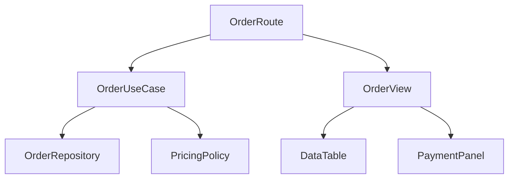

# 单一职责与组合：按变化原因拆分前端模块

单一职责不是“一个组件只做一件小事”，而是一个模块只对一类变化原因负责。组合让更高层模块连接数据、策略与视图，使低层能力可独立替换、测试和复用。拆分依据是业务变化、依赖方向与生命周期，不是文件行数。

## 1. 变化原因

一个订单页面可能因以下原因改变：

- 价格规则；
- 权限规则；
- API schema；
- 路由参数；
- 表格视觉；
- 国际化；
- 埋点；
- 缓存策略；
- 支付流程；
- 无障碍要求。

如果一个 `OrderPage.tsx` 同时实现这些，任一变化都会修改同一模块，测试需搭建所有依赖，错误影响范围扩大。



Route 组合 URL、加载与页面；use case 编排业务；repository 适配传输；policy 计算规则；view 只表达状态和事件。

## 2. “职责”不是函数数量

以下组件虽然函数很多，仍可能只有一个职责：渲染可访问的日期选择器。键盘导航、焦点、ARIA、网格计算共同服务一个交互契约。

反之，20 行组件也可能混合职责：

```tsx
function BuyButton({ productId }) {
  const user = JSON.parse(localStorage.user);
  const price = calculatePrice(productId, user);
  return (
    <button onClick={() => fetch("/buy", {
      method: "POST",
      body: JSON.stringify({ productId, price }),
    })}>
      Buy
    </button>
  );
}
```

它读取持久化身份、计算价格、调用网络并渲染按钮，变化原因不同。

## 3. 组合根

组合根负责选择实现并注入依赖：

```ts
const repository = new HttpOrderRepository(httpClient);
const pricing = new RemotePricingPolicy(featureFlags);
const checkout = createCheckoutUseCase({
  repository,
  pricing,
  clock: systemClock,
  analytics,
});
```

在 React 中，route entry、provider setup 或 app bootstrap 可作为组合根。不要让每个低层组件自行 import 全局客户端；否则测试只能 mock 模块，运行环境切换困难。

组合根可以知道具体实现，业务核心只依赖接口。接口应围绕调用者需要，而不是复制第三方 SDK 全部 API。

## 4. Container 与 Presentational

这种分法仍有价值，但不是强制目录：

```tsx
function OrderRoute() {
  const order = useOrderFromUrl();
  const actions = useOrderActions(order.id);
  return <OrderView state={order} actions={actions} />;
}

function OrderView({ state, actions }) {
  if (state.status === "loading") return <OrderSkeleton />;
  if (state.status === "error") {
    return <OrderError error={state.error} onRetry={actions.retry} />;
  }
  return <OrderDetails order={state.data} onPay={actions.pay} />;
}
```

Route 负责环境连接；View 用可序列化 props 表达状态，Storybook/测试无需真实网络。边界过度时会出现巨大 props drilling；可在一个 feature 内用 context 注入稳定能力，但仍控制范围。

## 5. 组合优于模式开关

模式开关让一个组件包含多种产品：

```tsx
<Card
  compact
  clickable
  showAvatar
  showActions
  editable
  adminMode
/>
```

布尔组合会形成大量状态。组合明确结构：

```tsx
<Card>
  <Card.Header><Avatar /><Card.Title /></Card.Header>
  <Card.Body>{summary}</Card.Body>
  <Card.Actions><EditAction /></Card.Actions>
</Card>
```

但调用者需要理解合法组合。设计系统可用 compound components、类型和运行时警告约束，例如 Card.Title 必须在 Header 内。

## 6. 数据与视图职责

不要让视图把 transport DTO 当领域模型：

```ts
type OrderDto = {
  id: string;
  total_cents: number;
  status_code: "P" | "D";
};

type Order = {
  id: OrderId;
  total: Money;
  status: "pending" | "done";
};
```

repository mapper 负责验证与转换。UI 不应到处写 `total_cents / 100` 和 `status_code === "P"`。API 改字段只影响 adapter；业务规则在 Money/Order 上表达。

映射有成本：类型、代码和调试层。小型只读后台可直接使用 DTO；一旦规则、多个后端或长期演化出现，边界价值上升。

## 7. 业务逻辑位置

判断：

- 只影响展示：view/helper；
- 与业务规则相关且跨 UI：domain/policy；
- 编排多个 repository：use case；
- 传输与 schema：adapter；
- 浏览器 API：infrastructure wrapper；
- 页面导航/参数：route/controller。

```ts
function canCancelOrder(order: Order, actor: Actor, now: Instant) {
  return order.status === "pending"
    && actor.permissions.includes("order:cancel")
    && now < order.cancelDeadline;
}
```

这不是按钮内部条件。按钮只消费 `canCancel` 并触发 action；后端仍执行权威授权。

## 8. Hooks 的职责

自定义 Hook 是复用 stateful React 逻辑的机制，不自动形成良好架构：

```ts
function useEverything() {
  // fetch, localStorage, resize, analytics, permissions, routing...
}
```

仍是混合职责。更清晰：

- `useOrderQuery`：server state；
- `useCheckoutFlow`：交互状态机；
- `useViewport`：浏览器 capability；
- `useOrderRoute`：URL；
- `useCheckoutAnalytics`：观测。

高层 Hook 可组合它们，但低层各自有生命周期与契约。

## 9. Props 与依赖注入

注入函数：

```tsx
<SearchBox search={catalogSearch} onSelect={navigateToProduct} />
```

优点：明确、易测。缺点：深层传递。

Context：

```tsx
<CatalogServicesProvider value={services}>
  <CatalogRoute />
</CatalogServicesProvider>
```

优点：跨树。缺点：依赖隐式、更新范围、provider 嵌套。

模块 singleton 简单但全局耦合、测试隔离困难。选择依据是依赖作用域；不要为了“依赖注入”把每个纯工具都包装接口。

## 10. 组件 API 稳定性

稳定组件对外暴露用户意图：

```tsx
<Checkout
  orderId={orderId}
  onCompleted={handleCompleted}
  onCancelled={handleCancelled}
/>
```

不暴露内部：

```tsx
<Checkout
  setStep={setStep}
  setPaymentState={setPaymentState}
  cacheClient={cacheClient}
  retryCounter={retryCounter}
/>
```

前者允许内部从三步改成状态机；后者让调用者依赖实现细节。事件命名描述已发生事实或用户意图，不让父组件操控子组件内部每个变量。

## 11. 何时拆组件

有效信号：

- 有独立业务词汇；
- 独立生命周期/副作用；
- 有多个调用者；
- 需要独立性能边界；
- 需要独立可访问交互；
- 变化频率/团队 owner 不同；
- 测试需独立；
- 依赖方向可明确。

无效信号：

- 超过 100 行必拆；
- 每个 div 一个组件；
- 只为减少文件长度；
- 预想未来可能复用；
- 抽出后 props 比内部代码更复杂。

## 12. 何时合并

拆分也有成本：

- 跳转文件；
- props/类型；
- 间接调用；
- 状态分散；
- 调试栈；
- render 边界；
- API 维护。

如果两个小组件永远一起变化、无独立语义、拆开后需要大量内部状态泄露，应合并。局部 helper 不需要公开成共享包。

## 13. Feature Slice

按技术层全局目录：

```text
components/
hooks/
services/
utils/
```

随规模增长会让一个 feature 分散。按领域：

```text
features/checkout/
  api/
  domain/
  ui/
  use-cases/
  index.ts
```

feature 内仍有小层次，对外只从 `index.ts` 导出稳定 API。共享目录只放已证明跨 feature 的能力；不要一开始把所有 Button 之外的东西都叫 shared。

## 14. Public API

禁止跨 feature 深层 import：

```ts
// 不推荐
import { normalizeCoupon } from "../checkout/domain/internal/coupon";

// 推荐
import { validateCoupon } from "@/features/checkout";
```

barrel 过度可能导致循环依赖、tree-shaking 诊断困难。对外 entry 与内部文件分开；同 feature 内可直接相对 import。用 ESLint boundaries/import rules 检查。

## 15. 案例一：搜索页

### 初始

`SearchPage` 读取 URL、debounce、fetch、缓存、筛选、埋点、render 结果、控制弹窗，共 900 行。

### 拆分

```text
SearchRoute        URL ↔ input
SearchController   请求版本、状态
SearchRepository   HTTP/schema
SearchPolicy       query normalize
SearchView         状态渲染
ResultList         虚拟化/a11y
SearchAnalytics    事件映射
```

Route 组合：

```tsx
const state = useSearchController({ query, repository });
return <SearchView state={state} onQueryChange={setQuery} />;
```

### 验证

repository 契约测试错误 schema；policy 纯测试；view stories 覆盖 loading/empty/error/data；E2E 覆盖 URL back/forward、IME、旧请求。拆分后没有把每个变量变成跨层 props。

## 16. 案例二：上传组件

一个 Upload 既选文件、校验、压缩、分片、重试、预览、持久化、埋点。

职责：

- file picker：浏览器输入与 a11y；
- validation policy：类型/尺寸；
- processor worker：压缩/hash；
- upload use case：分片状态机；
- repository：协议；
- queue store：持久化；
- view：进度/错误；
- analytics adapter。

`UploadView` 不直接 new Worker 或读 IndexedDB。use case 通过 port 调用，UI 订阅显式状态。取消要贯穿 worker、fetch 和 queue。

## 17. 案例三：设计系统 Select

Select 的键盘、ARIA、focus、typeahead 是一个交互职责，不应拆到调用者。视觉可通过 slots/headless 组合；数据加载不属于基础 Select。

```tsx
<AsyncUserSelect
  loadOptions={searchUsers}
  renderOption={(user) => <UserOption user={user} />}
/>
```

Async wrapper 组合 data 与 headless Select。基础组件对 loading/disabled/invalid 提供语义槽位，但不知具体 API。

## 18. 案例四：支付

支付包含高风险状态与第三方 SDK。边界：

```text
CheckoutPage
→ CheckoutUseCase
  → PaymentPort
    → VendorPaymentAdapter
  → OrderRepository
  → IdempotencyStore
```

UI 不直接调用 vendor SDK；adapter 转换错误、事件和 token。use case 保证幂等与状态迁移。更换供应商主要影响 adapter 和组合根。PCI/安全边界仍需服务端设计。

## 19. 测试金字塔

### 纯模块

policy、mapper、state machine：输入输出与边界。

### 组件

view：角色、名称、键盘、状态，不 mock 内部实现。

### Contract

repository/adapter：对 fixture 或 test server 验证 schema、错误。

### Integration

composition：provider、route、cache、effects。

### E2E

关键旅程、真实网络边界、失败恢复。

拆分不是为了追求单元测试数量，而是让失败定位到相应契约。

## 20. 错误边界

职责也体现在错误转换：

- HTTP adapter：status/body → typed transport error；
- use case：业务可重试/冲突/禁止；
- controller：loading/error/retry state；
- view：用户文案与 action；
- analytics：稳定 error code，不上传敏感 payload。

低层不弹 toast，高层不解析原始 `response.status`。React Error Boundary 处理 render 异常，不替代请求错误状态。

## 21. 性能边界

组件拆分不保证少 render。考虑：

- state ownership 越低，更新影响越局部；
- context value 变化会通知消费者；
- memo 需稳定 props 且 render 昂贵；
- composition 可让稳定 JSX 作为 children 避免父 state 传播；
- virtualization 是数据/视图架构；
- server state selector 缩小订阅；
- profiling 后优化。

不要为减少组件数把状态抬到根，也不要为了 memo 把所有 callback 包 `useCallback`。

## 22. 迁移策略

对 1000 行旧组件：

1. 先写行为测试；
2. 列变化原因与外部依赖；
3. 抽纯 policy/mapper；
4. 抽 infrastructure adapter；
5. 用 controller 收拢状态；
6. 保持旧 view；
7. 再拆可访问交互；
8. 每步保持功能；
9. profile；
10. 删除旧路径。

大爆炸重写容易同时改变行为和架构，无法定位回归。

## 23. 架构审核问题

- 模块的业务名称是什么？
- 哪类变化会修改它？
- 它依赖哪些外部系统？
- 谁创建、谁销毁？
- 对外 API 是否泄漏实现？
- state owner 是否明确？
- 错误在哪层转换？
- 是否可在测试替换依赖？
- 是否跨 feature 深层 import？
- 组合根在哪里？
- 拆分是否增加不必要间接？
- 性能与 a11y 边界是否正确？

## 24. 常见错误

1. 单一职责等于单函数；
2. 按行数机械拆分；
3. 每个 div 一个组件；
4. 低层组件直接 import 全局 API client；
5. UI 解析 transport DTO；
6. 巨型 Hook 代替巨型组件；
7. Context 放所有状态；
8. 布尔 props 组合爆炸；
9. 共享目录成为杂物箱；
10. 深层 import 内部实现；
11. 业务规则留在 click handler；
12. 抽象没有第二个真实用例；
13. 拆分后测试仍需全应用；
14. 为架构牺牲可访问交互完整性。

## 25. 综合练习

把一个包含 URL、搜索、上传、支付和埋点的页面重构为 feature 模块。

验收：

1. 列出至少六类变化原因；
2. 定义 route/use-case/repository/policy/view；
3. 组合根注入依赖；
4. DTO 在 adapter 转领域模型；
5. 业务规则无 React/DOM 依赖；
6. view 可独立展示五种状态；
7. 第三方 SDK 有 port；
8. mount 返回完整 disposer；
9. feature 只有公开 entry；
10. lint 禁止跨层/深层 import；
11. 纯测试、组件、contract、E2E 分层；
12. 对重构前后 bundle/render/INP 比较；
13. 记录抽象成本；
14. 删除无真实价值的拆分。

## 来源

- [React：Passing Props to a Component](https://react.dev/learn/passing-props-to-a-component)（访问日期：2026-07-17）
- [React：Sharing State Between Components](https://react.dev/learn/sharing-state-between-components)（访问日期：2026-07-17）
- [TypeScript：Modules](https://www.typescriptlang.org/docs/handbook/2/modules.html)（访问日期：2026-07-17）
- [WAI-ARIA APG：Patterns](https://www.w3.org/WAI/ARIA/apg/patterns/)（访问日期：2026-07-17）
