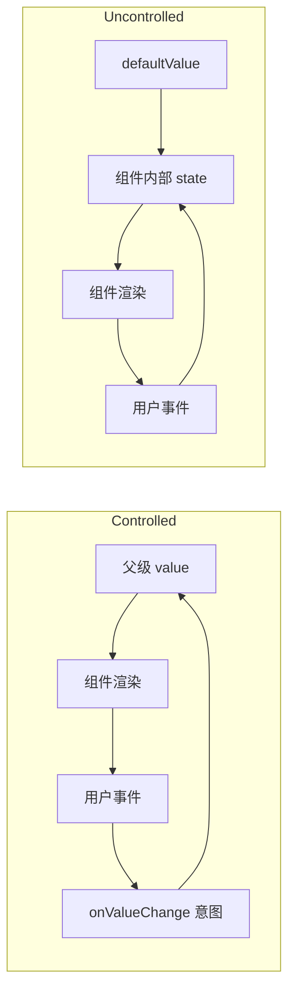

# Controlled 与 Uncontrolled 组件：设计状态所有权与同步契约

Controlled 组件的重要状态由外部输入决定，组件通过事件报告变更意图；Uncontrolled 组件在内部保存状态，外部只提供初始值或通过命令式接口读取结果。二者不是组件的永久分类，而是针对每一项状态选择所有者。

## 前置知识与能力边界

先掌握组件、Props、State、事件和表单基础：

- [框架组件基础](../04-typescript-frameworks/07-framework-components.md)；
- [状态分类](../04-typescript-frameworks/10-state-categories.md)；
- [HTML 表单控件](../01-html/06-forms-controls-validation-autofill-submit.md)；
- [单一职责与组合](01-single-responsibility-composition.md)。

本文以 React 19.2 为主要代码环境，但状态所有权问题也存在于 Vue 的 `v-model`、Svelte 的 bindable props、Web Components 和自建设计系统中。

## 1. 控制的对象必须明确

一个组件可能同时拥有多项状态：

| 状态 | 可能的所有者 | 例子 |
|---|---|---|
| 业务值 | 父组件或表单 | 输入的邮箱、选中行 ID |
| 展开/关闭 | 父组件或组件内部 | Accordion 当前展开项 |
| 输入草稿 | 组件内部或编辑器控制器 | 尚未提交的文本 |
| 焦点与光标 | DOM/浏览器 | selectionStart、IME composition |
| 请求结果 | server-state 层 | 搜索结果、保存状态 |
| 视觉瞬态 | 组件内部 | hover、pressed、临时动画 |

“这个组件是 controlled”通常只意味着它的关键业务状态由 props 控制。DOM 焦点、内部测量和动画仍可能由组件或浏览器管理。

## 2. 两种基本契约

### 2.1 Controlled

```tsx
type DisclosureProps = {
  open: boolean;
  onOpenChange(next: boolean): void;
};

function Disclosure({ open, onOpenChange }: DisclosureProps) {
  return (
    <section>
      <button
        type="button"
        aria-expanded={open}
        onClick={() => onOpenChange(!open)}
      >
        详情
      </button>
      {open && <div>内容</div>}
    </section>
  );
}
```

组件不会在点击后自行承诺 `open=true`；它只提出 `onOpenChange(true)`。父级可以接受、拒绝、延迟或根据权限改写下一值。下一次渲染的 `open` 才是权威状态。

### 2.2 Uncontrolled

```tsx
type DisclosureProps = {
  defaultOpen?: boolean;
};

function Disclosure({ defaultOpen = false }: DisclosureProps) {
  const [open, setOpen] = useState(defaultOpen);
  return (
    <section>
      <button
        type="button"
        aria-expanded={open}
        onClick={() => setOpen(value => !value)}
      >
        详情
      </button>
      {open && <div>内容</div>}
    </section>
  );
}
```

`defaultOpen` 只初始化内部 state。父级之后改变 `defaultOpen`，不应覆盖用户已经操作过的状态。需要重置时应使用明确的 reset API、改变组件身份的 `key`，或改为 controlled。

## 3. 状态数据流



Controlled 模式形成显式闭环。Uncontrolled 模式把闭环封装在组件内部，调用者配置更少，但协调能力下降。

## 4. 原生表单控件的准确行为

React 文本输入传入字符串 `value` 后受控；checkbox/radio 传入布尔 `checked` 后受控。受控输入必须同步处理 `onChange`，否则 React 会把 DOM 值恢复为传入值。

```tsx
function EmailField() {
  const [email, setEmail] = useState("");
  return (
    <label>
      邮箱
      <input
        name="email"
        type="email"
        value={email}
        onChange={event => setEmail(event.currentTarget.value)}
      />
    </label>
  );
}
```

Uncontrolled 输入使用 `defaultValue` 或 `defaultChecked`：

```tsx
function SearchForm() {
  function submit(formData: FormData) {
    const query = String(formData.get("query") ?? "").trim();
    if (query) navigate(`/search?q=${encodeURIComponent(query)}`);
  }

  return (
    <form action={submit}>
      <input name="query" defaultValue="browser runtime" />
      <button type="submit">搜索</button>
    </form>
  );
}
```

React 19 的 form Action 成功后会重置 uncontrolled 控件。失败时是否保留输入需由产品状态与 Action 返回结果决定。

### 4.1 不能在生命周期中切换模式

```tsx
function NameExamples() {
  return (
    <>
      {/* 错误：加载前 undefined，加载后 string。 */}
      <input value={profile?.name} onChange={handleName} />
      {/* 受控模式从首次渲染起保持 string。 */}
      <input value={profile?.name ?? ""} onChange={handleName} />
    </>
  );
}
```

同理，受控 checkbox 的 `checked` 始终是 boolean。切换会使 DOM 内部状态和 React 状态的责任不明确。

### 4.2 File input

文件选择由浏览器和用户控制，脚本不能把本地路径写入 `input.files`。通过 `ref` 或提交时的 `FormData` 读取，并在选择后立即复制需要的 `File` 引用：

```tsx
function UploadForm() {
  const inputRef = useRef<HTMLInputElement>(null);

  function submit(event: FormEvent<HTMLFormElement>) {
    event.preventDefault();
    const files = Array.from(inputRef.current?.files ?? []);
    startUpload(files);
  }

  return (
    <form onSubmit={submit}>
      <input ref={inputRef} name="files" type="file" multiple />
      <button type="submit">上传</button>
    </form>
  );
}
```

accept 只是选择器提示，不是安全验证；服务端仍需验证类型、内容、大小、权限和恶意文件。

## 5. 设计同时支持两种模式的 API

设计系统组件常同时提供 `value/defaultValue/onValueChange`：

```tsx
type ControllableProps<T> =
  | {
      value: T;
      defaultValue?: never;
      onValueChange(next: T): void;
    }
  | {
      value?: never;
      defaultValue?: T;
      onValueChange?(next: T): void;
    };
```

可辨识性并不完美，因为 `value` 是否存在要在运行时判断。实现必须在首次渲染记录模式，并在开发环境警告切换：

```tsx
function useControllableState<T>({
  value,
  defaultValue,
  onChange,
}: {
  value: T | undefined;
  defaultValue: T;
  onChange?(value: T): void;
}) {
  const controlledAtMount = useRef(value !== undefined);
  const [internal, setInternal] = useState(defaultValue);
  const controlled = controlledAtMount.current;
  const current = controlled ? (value as T) : internal;

  const set = useCallback((next: T | ((previous: T) => T)) => {
    const resolved = typeof next === "function"
      ? (next as (previous: T) => T)(current)
      : next;
    if (!controlled) setInternal(resolved);
    if (!Object.is(resolved, current)) onChange?.(resolved);
  }, [controlled, current, onChange]);

  return [current, set] as const;
}
```

该简化实现适合说明契约，生产库还要处理 stale closure、函数值 T、并发更新、SSR 与开发警告。优先使用经过测试的设计系统 primitive，而不是每个组件复制一份。

## 6. 何时选择 Controlled

需要外部协调时选择：

- 多个组件必须保持一致；
- URL、server state 或全局工作流是权威来源；
- 权限或业务规则可以拒绝状态变化；
- 父级需要记录、撤销、持久化或回放；
- 测试必须精确注入每个状态；
- 同一状态驱动多个视图；
- 状态切换需要跨组件 transaction。

代价包括更多 props、父级重渲染、同步循环风险和调用者配置成本。

## 7. 何时选择 Uncontrolled

状态只对局部交互有意义时选择：

- 独立 disclosure、tooltip 延迟或临时 hover；
- 简单原生表单，提交时统一读取 FormData；
- 输入频率很高，父级不需要逐键响应；
- 第三方编辑器/画布拥有复杂内部模型；
- 调用者只需要初始值和最终结果；
- 状态无需跨路由保存或与其他组件同步。

代价是外部难以强制同步、重置和观察。不要为了减少重渲染把业务权威状态隐藏进 ref。

## 8. 应用案例一：数据表格的行选择

### 8.1 约束

后台表格支持分页、筛选、批量审批和权限变化。选择状态可能只作用当前页，也可能跨页；被撤权行必须移除；URL 不需要保存选择。

### 8.2 错误设计

表格内部用行索引保存选择：

```tsx
const [selectedIndexes, setSelectedIndexes] = useState<number[]>([]);
```

排序或翻页后索引对应其他数据。父级批量操作又需要读取内部 state，最终依赖 ref 暴露 `getSelectedRows()`，形成时间相关命令式 API。

### 8.3 Controlled 设计

```tsx
type Selection = ReadonlySet<string>;

function ApprovalRoute() {
  const [selected, setSelected] = useState<Selection>(() => new Set());
  const rows = useApprovalRows(filters);
  const allowedIds = useMemo(
    () => new Set(rows.allAuthorizedIds),
    [rows.allAuthorizedIds],
  );

  const effective = useMemo(
    () => new Set([...selected].filter(id => allowedIds.has(id))),
    [selected, allowedIds],
  );

  return (
    <DataTable
      rows={rows.page}
      selectedIds={effective}
      onSelectedIdsChange={setSelected}
    />
  );
}
```

选择以稳定资源 ID 表达，父级与批量操作共享。服务端提交时仍逐条授权，前端过滤只改善界面一致性。

### 8.4 受控事件契约

`onSelectedIdsChange` 应返回完整下一集合，还是 `{added, removed}` patch？

| 形式 | 适用 | 成本 |
|---|---|---|
| 完整值 | 小集合、替换简单 | 大集合复制成本 |
| patch | 大集合、事件审计 | 调用者要正确合并和去重 |
| 意图事件 | 规则复杂，如 selectAllMatching | 需要状态机与服务端快照 |

跨页“全选所有筛选结果”不能真的把百万 ID 放进浏览器。可表示为 `{mode:"allMatching", filterSnapshot, excludedIds}`，由服务端根据同一筛选快照执行。

### 8.5 失败注入与验证

1. 选择 3 行后排序，ID 不变化；
2. 翻页再选 2 行，批量栏显示 5；
3. 其中 1 行权限撤销，界面移除并说明；
4. 另一会话已审批 1 行，服务端返回部分失败；
5. 重试只处理仍可审批项；
6. 键盘 Space 切换 checkbox，焦点不丢失；
7. 虚拟化卸载行后选择仍存在。

## 9. 应用案例二：富文本编辑器

### 9.1 为什么不逐字符完全受控

富文本编辑器管理 selection、IME composition、history、插件 transaction、协作位置映射和大文档节点树。把整个文档在每个输入事件序列化后传给 React，再通过 prop 写回，可能破坏光标并产生高成本重渲染。

### 9.2 Hybrid 契约

```ts
interface EditorController {
  getSnapshot(): EditorSnapshot;
  replaceDocument(next: EditorDocument, version: string): void;
  focus(): void;
  destroy(): void;
}

interface EditorProps {
  initialDocument: EditorDocument;
  onTransaction?(event: EditorTransaction): void;
  onDirtyChange?(dirty: boolean): void;
  controllerRef?: Ref<EditorController>;
}
```

编辑器内部控制高频 transaction；外部接收可增量持久化的操作和 dirty 状态。远程替换必须带版本，不能在每次父级渲染时把 `initialDocument` 写回。

### 9.3 权威边界

- 编辑会话内即时文档：编辑器模型；
- 协作已确认版本：协作服务；
- 保存状态：server state 层；
- 页面离开阻止：route 层消费 dirty；
- 权限：服务端权威，编辑器据此切换只读；
- 光标/selection：编辑器和浏览器。

### 9.4 外部更新冲突

外部版本 v8 到达而本地基于 v7 有未确认操作时，不能简单 `replaceDocument(v8)`。需要 OT/CRDT rebase、冲突视图或阻止编辑并恢复草稿。Controlled prop 本身不能解决并发一致性。

### 9.5 验证

- 中文 IME 组合期间不提交半成品；
- undo 只撤销本地正确 transaction；
- 10 万字文档输入保持目标 INP；
- 页面切换后编辑器 `destroy` 释放 listener/worker；
- 断网操作持久化并在重连后去重；
- 权限撤销后服务端拒绝写入，界面保留可复制草稿；
- SSR 只渲染安全占位，客户端创建编辑器时无 hydration mismatch。

## 10. Reset 与重新同步

Uncontrolled 组件需要明确重置语义：

```tsx
<ProfileForm key={profileId} defaultValue={profile} />
```

key 改变会卸载旧实例并清除所有局部状态，适合切换完全不同的实体。若只重置一个字段或要保留焦点，用显式 reset 命令或 controlled 值更准确。

不要写 Effect 盲目同步 prop：

```tsx
// 风险：每次服务器刷新都覆盖用户草稿。
useEffect(() => setDraft(profile.name), [profile.name]);
```

需要定义版本和冲突策略：仅在实体 ID 改变、表单 pristine，或用户确认丢弃后同步。

## 11. SSR、Hydration 与表单

服务端和客户端首次渲染的 `value/defaultValue` 必须兼容。若服务端输出 `defaultValue="A"`，用户在 hydration 前改为 B，框架不应无条件覆盖真实输入。受控输入在 hydration 后由 state 权威驱动，更要确保初值来自同一快照。

密码、文件和浏览器自动填充存在平台特殊行为。不要把 DOM 当前值写入日志；自动填充检测不能依赖单一事件。提交时使用 FormData 与服务端校验是最终边界。

## 12. 性能边界

受控输入每次更改会触发拥有 state 的子树渲染。优先：

1. 把 state 下沉到最小表单子树；
2. 把昂贵结果与输入值分开；
3. 对非紧急派生使用 deferred value；
4. 用 worker 或服务端处理真正昂贵计算；
5. Profile 后再 memoize；
6. 不要通过 ref 绕过正确状态模型。

Uncontrolled 不等于自动更快：第三方编辑器仍可能有昂贵 transaction；提交时一次序列化也可能阻塞。使用实际 INP、Long Task 和 Profile 证据。

## 13. 常见失败模式

### 13.1 同时传 value 与 defaultValue

两套来源冲突。类型 API 应互斥，运行时发开发警告。

### 13.2 onChange 既更新内部又等待父级

组件先乐观改内部，父级随后传不同 value，界面闪烁。受控模式只报告意图；若需要 optimistic state，显式定义 pending/confirmed 状态。

### 13.3 用 ref 作为隐藏数据总线

父级在任意时刻读取 `getValue()`，无法订阅变化、回放或 SSR。ref 适合 focus、measure、selection 等命令式能力，不适合共享业务事实。

### 13.4 把全部状态提升到全局

单一数据源指每项状态有一个权威所有者，不是所有 state 放进一个 store。hover、临时展开和未提交组合输入通常应靠近组件。

### 13.5 把客户端控制当安全边界

受控选择、禁用按钮和只读视图都不能替代服务端授权、数据验证和并发控制。

## 14. 调试路径

出现值跳回、光标跳动或状态不同步时：

1. React DevTools 检查当前 value/checked 与 owner；
2. 检查是否首次 undefined 后变成确定值；
3. 检查 onChange 是否同步写入事件当前值；
4. 检查组件或祖先 key 是否每次变化；
5. 检查是否在组件函数内部定义组件类型；
6. 检查 Effect 是否覆盖用户草稿；
7. 检查同一事实是否在 DOM、局部 state、store、URL 多份保存；
8. 检查 IME composition 和 selection；
9. 用 Profiler 查看每次输入影响的渲染范围；
10. 对 server state 检查版本与旧请求覆盖。

## 15. API 选择矩阵

| 约束 | 推荐所有权 |
|---|---|
| 多组件协调 | Controlled，提升到最近共同所有者 |
| 简单提交型原生表单 | Uncontrolled + FormData |
| 需要逐键校验/联动 | Controlled，限制渲染范围 |
| 大型编辑器/画布 | 内部控制 + transaction/controller 混合契约 |
| URL 可分享状态 | URL 权威，组件 controlled |
| 服务端数据 | Query/cache 层权威，不复制到局部 state |
| 局部瞬态交互 | Uncontrolled/local state |
| 安全与权限 | 服务端权威，前端只反映结果 |

## 16. 综合练习：可受控 TreeSelect

实现同时支持两种模式的 TreeSelect：

```tsx
function TreeSelectExamples() {
  return (
    <>
      <TreeSelect
        value={selectedIds}
        onValueChange={setSelectedIds}
        expanded={expandedIds}
        onExpandedChange={setExpandedIds}
      />
      <TreeSelect
        defaultValue={new Set()}
        defaultExpanded={new Set(["root"])}
      />
    </>
  );
}
```

验收：

- value 与 expanded 可独立选择 controlled/uncontrolled；
- 生命周期内切换模式给出开发错误；
- default 只初始化一次；
- stable ID 不依赖数组索引；
- 异步加载、失败、重试和权限撤销有明确状态；
- 键盘 Arrow、Home、End、Enter、Space 和焦点符合 tree 模式；
- 虚拟化不会丢失选择；
- 1 万节点下有 Profiler 与 INP 记录；
- 服务端再次验证提交资源权限；
- 测试覆盖父级拒绝变更、外部重置和快速切换实体。

## 来源

- [React：Sharing State Between Components](https://react.dev/learn/sharing-state-between-components)（访问日期：2026-07-18）
- [React：input](https://react.dev/reference/react-dom/components/input)（访问日期：2026-07-18）
- [React 19](https://react.dev/blog/2024/12/05/react-19)（访问日期：2026-07-18）
- [WHATWG HTML：A form control's value](https://html.spec.whatwg.org/multipage/form-control-infrastructure.html#a-form-control's-value)（访问日期：2026-07-18）
