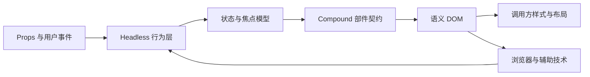

# Headless 与 Compound Component：分离行为、结构与视觉

Headless 组件封装状态、事件、焦点和无障碍语义，不规定最终视觉。Compound Component 把一个完整控件拆成一组协作子组件，由共同状态协调。两者解决的问题不同，但经常结合：Headless 决定“控件怎样正确工作”，Compound API 决定“调用方怎样组合控件结构”。

## 前置知识与能力边界

先掌握：

- [单一职责与组合](01-single-responsibility-composition.md)；
- [Controlled 与 Uncontrolled](02-controlled-uncontrolled.md)；
- React Props、State、Context、事件与 Ref；
- HTML 的按钮、链接、标题、列表和表单语义；
- 焦点顺序、可访问名称、ARIA 状态与键盘操作。

本文以 React 19.2 和 TypeScript 为代码环境。相同的分层也可用于 Vue Composables、Svelte actions、Web Components 和框架无关的 DOM 控制器。

## 1. 三层职责

一个交互组件至少包含三层：

| 层 | 负责内容 | 不应负责 |
|---|---|---|
| 行为层 | 状态转换、事件规则、焦点移动、ID 关联、Controlled 契约 | 品牌颜色、间距、具体布局 |
| 结构层 | Trigger、List、Item、Panel 等部件及其合法关系 | 业务数据请求、页面级授权 |
| 视觉层 | CSS、图标、响应式布局、动画和主题 | 改写键盘语义、伪造状态 |

传统成品组件通常把三层一起封装。Headless 组件主要提供前两层，把 DOM 元素和样式的部分选择权留给调用方。



“无样式”不是 Headless 的充分条件。一个只返回布尔值、没有处理键盘、焦点和语义的 Hook 仍可能是不完整的交互实现。

## 2. Headless 组件的输出形态

### 2.1 Hook

Hook 返回状态和需要绑定的属性：

```tsx
type DisclosureOptions = {
  open?: boolean;
  defaultOpen?: boolean;
  onOpenChange?(open: boolean): void;
};

function useDisclosure(options: DisclosureOptions) {
  const triggerId = useId();
  const panelId = useId();
  const [internalOpen, setInternalOpen] = useState(
    options.defaultOpen ?? false,
  );
  const controlled = options.open !== undefined;
  const open = controlled ? options.open : internalOpen;

  function change(next: boolean) {
    if (!controlled) setInternalOpen(next);
    options.onOpenChange?.(next);
  }

  return {
    open,
    triggerProps: {
      id: triggerId,
      type: "button" as const,
      "aria-expanded": open,
      "aria-controls": panelId,
      onClick: () => change(!open),
    },
    panelProps: {
      id: panelId,
      "aria-labelledby": triggerId,
      hidden: !open,
    },
  };
}
```

调用方决定元素和样式：

```tsx
function ShippingHelp() {
  const disclosure = useDisclosure({ defaultOpen: false });

  return (
    <section className="shipping-help">
      <h2>
        <button {...disclosure.triggerProps}>配送说明</button>
      </h2>
      <div {...disclosure.panelProps}>工作日 18:00 前下单可当日出库。</div>
    </section>
  );
}
```

Hook API 显式、容易单测，但调用方可能漏绑属性、绑定到错误元素，或把内部事件处理器覆盖掉。

### 2.2 Prop getter

Prop getter 接收调用方属性并安全合并：

```tsx
function composeHandlers<E>(
  internal: (event: E) => void,
  external?: (event: E) => void,
) {
  return (event: E) => {
    external?.(event);
    if (!(event as Event).defaultPrevented) internal(event);
  };
}

function getTriggerProps(
  userProps: React.ButtonHTMLAttributes<HTMLButtonElement> = {},
) {
  return {
    ...userProps,
    type: userProps.type ?? "button",
    "aria-expanded": open,
    "aria-controls": panelId,
    onClick: composeHandlers(() => change(!open), userProps.onClick),
  };
}
```

属性合并顺序是 API 契约：

- `className` 通常合并，而不是互相覆盖；
- 用户事件先执行并允许 `preventDefault()` 取消默认行为；
- `aria-*` 中表示内部真实状态的字段不能被外部伪造；
- 多个 ref 需要组合，不能只保留最后一个；
- `id` 可以允许覆盖，但所有引用必须使用最终 ID。

### 2.3 Render prop

Render prop 把状态交给渲染函数：

```tsx
<Disclosure defaultOpen>
  {({ open, triggerProps, panelProps }) => (
    <>
      <button {...triggerProps}>{open ? "收起" : "展开"}</button>
      <div {...panelProps}>内容</div>
    </>
  )}
</Disclosure>
```

它适合结构差异很大的场景，但嵌套较深时可读性下降，类型和属性合并仍由调用方负责。

### 2.4 Compound Components

Compound API 让部件贴近最终 DOM：

```tsx
<Tabs defaultValue="profile">
  <Tabs.List aria-label="账户设置">
    <Tabs.Trigger value="profile">资料</Tabs.Trigger>
    <Tabs.Trigger value="security">安全</Tabs.Trigger>
  </Tabs.List>
  <Tabs.Panel value="profile">资料表单</Tabs.Panel>
  <Tabs.Panel value="security">安全设置</Tabs.Panel>
</Tabs>
```

调用方能调整部件之间的布局和插入装饰元素，同时不直接处理选中、roving tabindex、方向键和 ARIA 关联。

## 3. Compound Component 的内部模型

Compound 不是“把组件挂到对象属性上”。真正的协作需要共享：

- 当前 value 与变更函数；
- Controlled/Uncontrolled 模式；
- orientation、direction、activationMode；
- 每个 Trigger 和 Panel 的稳定 ID；
- 注册顺序、禁用状态和 DOM ref；
- 组件是否位于正确 Provider 内。

### 3.1 Context 只承载局部组件协议

```tsx
type TabsContextValue = {
  value: string;
  setValue(value: string): void;
  baseId: string;
  orientation: "horizontal" | "vertical";
};

const TabsContext = createContext<TabsContextValue | null>(null);

function useTabsContext(part: string) {
  const context = useContext(TabsContext);
  if (!context) {
    throw new Error(`${part} 必须位于 <Tabs> 内部`);
  }
  return context;
}
```

React 19 可以使用 `<TabsContext value={value}>` 提供上下文；兼容 React 18 的库仍使用 `<TabsContext.Provider value={value}>`。

Context 的默认值设为 `null`，可以在子部件脱离 Root 时立即报错。伪造一个可工作的默认对象会让错误结构悄悄运行，并把问题延迟到交互阶段。

### 3.2 稳定上下文值

```tsx
const contextValue = useMemo(
  () => ({ value, setValue, baseId, orientation }),
  [value, setValue, baseId, orientation],
);
```

Context value 使用 `Object.is` 比较。每次渲染创建新对象会使所有消费者重新渲染。`useMemo` 只能稳定对象身份，不能解决高频状态广播；大型组件应拆分状态 Context 与命令 Context，或使用可选择订阅的外部 store。

### 3.3 数据身份不能依赖数组索引

Trigger 和 Panel 用业务稳定值关联：

```tsx
function tabId(baseId: string, value: string) {
  return `${baseId}-tab-${encodeURIComponent(value)}`;
}

function panelId(baseId: string, value: string) {
  return `${baseId}-panel-${encodeURIComponent(value)}`;
}
```

数组重排、插入和删除后，索引会变化。若索引同时承担选中值、React key 和 DOM ID，焦点可能跳到另一个对象，ARIA 引用也会错误。

## 4. 一个可验证的 Tabs 实现

以下示例集中展示 API 契约。生产实现还需处理 RTL、动态注册、删除焦点恢复和服务端渲染。

```tsx
type TabsRootProps = {
  value?: string;
  defaultValue: string;
  onValueChange?(value: string): void;
  orientation?: "horizontal" | "vertical";
  children: ReactNode;
};

function TabsRoot({
  value: controlledValue,
  defaultValue,
  onValueChange,
  orientation = "horizontal",
  children,
}: TabsRootProps) {
  const [internalValue, setInternalValue] = useState(defaultValue);
  const controlled = controlledValue !== undefined;
  const value = controlled ? controlledValue : internalValue;
  const baseId = useId();

  const setValue = useCallback((next: string) => {
    if (!controlled) setInternalValue(next);
    if (next !== value) onValueChange?.(next);
  }, [controlled, onValueChange, value]);

  const context = useMemo(
    () => ({ value, setValue, baseId, orientation }),
    [value, setValue, baseId, orientation],
  );

  return <TabsContext value={context}>{children}</TabsContext>;
}
```

List 负责复合控件的键盘模型：

```tsx
function TabsList({
  onKeyDown,
  ...props
}: React.HTMLAttributes<HTMLDivElement>) {
  const { orientation } = useTabsContext("Tabs.List");

  function move(event: React.KeyboardEvent<HTMLDivElement>) {
    const tabs = Array.from(
      event.currentTarget.querySelectorAll<HTMLElement>(
        '[role="tab"]:not([aria-disabled="true"])',
      ),
    );
    const current = tabs.indexOf(document.activeElement as HTMLElement);
    if (current < 0) return;

    const previousKeys = orientation === "horizontal"
      ? ["ArrowLeft"]
      : ["ArrowUp"];
    const nextKeys = orientation === "horizontal"
      ? ["ArrowRight"]
      : ["ArrowDown"];

    let next = current;
    if (previousKeys.includes(event.key)) next = (current - 1 + tabs.length) % tabs.length;
    else if (nextKeys.includes(event.key)) next = (current + 1) % tabs.length;
    else if (event.key === "Home") next = 0;
    else if (event.key === "End") next = tabs.length - 1;
    else return;

    event.preventDefault();
    tabs[next]?.focus();
    tabs[next]?.click();
  }

  return (
    <div
      {...props}
      role="tablist"
      aria-orientation={orientation}
      onKeyDown={event => {
        onKeyDown?.(event);
        if (!event.defaultPrevented) move(event);
      }}
    />
  );
}
```

Trigger 和 Panel 生成双向语义关联：

```tsx
type ValuePartProps = {
  value: string;
  children: ReactNode;
};

function TabsTrigger({ value, children }: ValuePartProps) {
  const context = useTabsContext("Tabs.Trigger");
  const selected = context.value === value;
  const triggerId = tabId(context.baseId, value);
  const contentId = panelId(context.baseId, value);

  return (
    <button
      id={triggerId}
      type="button"
      role="tab"
      aria-selected={selected}
      aria-controls={contentId}
      tabIndex={selected ? 0 : -1}
      onClick={() => context.setValue(value)}
    >
      {children}
    </button>
  );
}

function TabsPanel({ value, children }: ValuePartProps) {
  const context = useTabsContext("Tabs.Panel");
  const selected = context.value === value;

  return (
    <div
      id={panelId(context.baseId, value)}
      role="tabpanel"
      aria-labelledby={tabId(context.baseId, value)}
      hidden={!selected}
      tabIndex={0}
    >
      {children}
    </div>
  );
}
```

### 4.1 自动激活与手动激活

自动激活在焦点移动时立即切换 panel；手动激活只移动焦点，按 `Enter` 或 `Space` 后才选中。

| 模式 | 适用条件 | 风险 |
|---|---|---|
| 自动激活 | Panel 已预加载，切换没有明显延迟 | 每次方向键都可能触发请求或昂贵渲染 |
| 手动激活 | Panel 懒加载、切换成本高、需要先预览标签 | 焦点项与选中项不同，实现状态更多 |

不能为了减少代码而强制自动激活。方向键移动若触发网络等待，会使键盘浏览明显变慢。

## 5. `asChild`、Slot 与多态元素

Headless 库常允许调用方替换默认 DOM：

```tsx
<Tooltip.Trigger asChild>
  <a href="/billing">查看账单说明</a>
</Tooltip.Trigger>
```

`asChild` 通常克隆唯一子元素，把事件、ARIA 属性和 ref 合并到该元素。它不是任意换标签的许可。

### 5.1 叶子组件必须转发契约

```tsx
type ActionLinkProps = React.ComponentPropsWithoutRef<"a">;

const ActionLink = forwardRef<HTMLAnchorElement, ActionLinkProps>(
  function ActionLink(props, ref) {
    return <a {...props} ref={ref} className={`action-link ${props.className ?? ""}`} />;
  },
);
```

叶子组件需要：

- 把未知但合法的 DOM props 传到实际元素；
- 转发 ref，供测量、焦点和定位使用；
- 合并 className 和 style；
- 不吞掉 `onPointerDown`、`onKeyDown`、`aria-*` 与 `data-*`；
- 保持替换后元素的原生语义。

React 19 支持把 `ref` 作为 prop 传给函数组件，但需要兼容旧 React 或第三方库时，`forwardRef` 仍是常见边界。

### 5.2 不能制造嵌套交互元素

```tsx
<>
  {/* 错误：最终可能得到 <button><a>...</a></button> */}
  <Dialog.Trigger>
    <a href="/settings">设置</a>
  </Dialog.Trigger>

  {/* 合并到链接自身；仍需确认“打开对话框”是否应当是链接语义。 */}
  <Dialog.Trigger asChild>
    <a href="/settings">设置</a>
  </Dialog.Trigger>
</>
```

按钮执行动作，链接导航。即使技术上可以合并行为，也必须先确认用户意图。用 `div` 替换按钮后再补 `role` 和键盘事件，通常比保留原生按钮更脆弱。

### 5.3 多个行为的事件冲突

```tsx
<Tooltip.Trigger asChild>
  <Dialog.Trigger asChild>
    <ActionButton>删除记录</ActionButton>
  </Dialog.Trigger>
</Tooltip.Trigger>
```

多层组合可能同时注册 pointer、focus、escape 和 ref。需要验证：

- 内外层事件顺序是否稳定；
- 一层 `preventDefault()` 是否会阻断另一层；
- Escape 关闭最上层还是全部关闭；
- 焦点恢复目标属于哪个浮层；
- 两层是否都写同一个 `aria-describedby`、`id` 或 `data-state`。

行为可以组合不等于语义一定可以组合。

## 6. 可访问性是行为契约

Headless 组件不自动等于可访问组件。库只能提供通用基础，调用方仍会通过错误标签、DOM 顺序、颜色、隐藏方式或自定义元素破坏结果。

### 6.1 Tabs 的最低语义

- 容器为 `tablist`，并有可访问名称；
- 每个 tab 位于 tablist 内；
- 活动 tab 为 `aria-selected="true"`；
- tab 的 `aria-controls` 指向对应 panel；
- panel 的 `aria-labelledby` 指回 tab；
- Tab 键进入活动 tab，方向键在 tab 内移动；
- 水平 tab 不拦截上下方向键，保留页面滚动；
- Panel 首个内容不可聚焦时，Panel 自身进入 Tab 顺序。

### 6.2 Accordion 与 Tabs 不能共用同一键盘模型

Accordion 标题通常包含原生 button：

- `Enter`/`Space` 展开或收起；
- 所有 header button 都在普通 Tab 顺序中；
- 不要求方向键在标题间移动；
- `aria-expanded` 表示对应 panel 的可见状态。

Tabs 是单一复合焦点模型：

- 通常只有活动 tab 的 `tabIndex=0`；
- 方向键移动 tab 焦点；
- `aria-selected` 表示当前 panel；
- Panel 与 tab 一一关联。

外观相似不能成为共享行为实现的理由。

## 7. API 设计选择

### 7.1 显式部件优于解析 children

不要依赖 `Children.toArray()` 深入识别任意包装层中的子组件。React 的 `Children` 只处理收到的直接 children 结构，无法可靠推断用户组件内部最终渲染出的部件。

Context 注册或显式数据配置更稳定：

```tsx
const items = [
  { value: "profile", label: "资料", panel: <ProfileForm /> },
  { value: "security", label: "安全", panel: <SecuritySettings /> },
];
```

数据配置适合固定、重复结构；Compound API 适合每个 Panel 结构差异明显的场景。

### 7.2 限制非法结构

开发环境应尽早报告：

- 子部件不在 Root 内；
- value 重复；
- Trigger 没有对应 Panel；
- 默认值指向不存在或禁用项；
- 一个 `asChild` 传入多个子节点；
- 替换元素不可聚焦；
- controlled 与 uncontrolled 模式切换。

TypeScript 能约束 props，不能证明运行时 children 树一定合法。

### 7.3 样式状态接口

调用方需要稳定状态选择器：

```html
<button
  role="tab"
  aria-selected="true"
  data-state="active"
  data-orientation="horizontal"
>
  资料
</button>
```

优先用标准 `aria-*` 表达可访问状态；`data-*` 补充样式需要但没有对应 ARIA 的内部状态。不要让调用方依赖私有 class 名或组件内部 DOM 层数。

## 8. 服务端渲染与 Hydration

Headless 组件常生成 ID、Portal 和依赖布局的状态，这些都会影响 SSR。

### 8.1 稳定 ID

`useId()` 适合生成服务端与客户端一致的关联 ID。不要在 render 中使用 `Math.random()`、时间戳或全局自增变量。

ID 只用于 DOM 关联，不应作为数据库 ID、列表 key 或分析事件业务标识。

### 8.2 初始状态一致

```tsx
// 风险：服务端没有 window，客户端首次渲染值不同。
const [open] = useState(() => window.innerWidth > 768);
```

服务端输出与客户端首次渲染必须一致。视口相关布局可用 CSS；确实需要测量时，先渲染稳定结构，再在 effect 后更新。

### 8.3 Portal

Dialog、Popover、Tooltip 常通过 Portal 渲染。需要验证：

- 服务端是否输出 Portal 内容；
- Hydration 前内容是否闪动；
- 浮层的层叠上下文；
- 模态时背景是否不可交互；
- 关闭后的焦点恢复；
- 嵌套 Portal 的 Escape 和 outside interaction 顺序。

## 9. 性能边界

性能问题通常来自状态广播和隐藏内容，而不是 Compound 语法本身。

### 9.1 Context 广播

一个 Context 同时放 `value`、hover、尺寸、注册表和动画进度，会让不相关子部件一起更新。处理方式：

1. 将低频配置与高频状态拆开；
2. 将命令函数保持稳定；
3. 高频交互使用局部 state 或外部 store 的选择订阅；
4. 用 React Profiler 观察提交次数和受影响组件；
5. 以实际交互延迟判断，不以 `useMemo` 数量判断。

### 9.2 隐藏与卸载

Tabs Panel 有两种策略：

| 策略 | 收益 | 成本 |
|---|---|---|
| 非活动 Panel 卸载 | DOM 小、重组件不运行 | 表单草稿和滚动位置丢失，再次打开重新请求 |
| 保留并 `hidden` | 状态保留、切换快 | DOM 和内存增加，隐藏内容仍可能订阅数据 |

可增加 `forceMount` 或 `keepAlive` API，但默认值必须符合主要场景，并写清状态保留语义。

## 10. 实际案例：设计系统 Tabs

### 10.1 需求

后台系统需要横向与纵向 Tabs，支持受控路由、懒加载 Panel、禁用项、RTL、关闭动态标签和两套视觉主题。

### 10.2 状态拆分

- `selectedValue`：业务状态，可由 URL 控制；
- `focusedValue`：键盘瞬态，手动激活时独立存在；
- `items`：注册表，保存稳定 value、ref、disabled 和 DOM 顺序；
- `activationMode`：自动或手动；
- `orientation` 与 `dir`：决定方向键；
- `mountedPanels`：决定懒加载后的保留策略。

### 10.3 路由受控

```tsx
function SettingsTabs() {
  const [searchParams, setSearchParams] = useSearchParams();
  const current = searchParams.get("tab") ?? "profile";

  return (
    <TabsRoot
      value={current}
      defaultValue="profile"
      onValueChange={tab => setSearchParams({ tab })}
    >
      {/* parts */}
    </TabsRoot>
  );
}
```

需要先校验 URL value。若 URL 指向不存在或无权限的 Panel，应重定向到安全默认项，不能渲染一个没有活动 tab 的结构。

### 10.4 验收矩阵

| 条件 | 验证 |
|---|---|
| 键盘 | Tab 进入活动项，方向键循环，Home/End 正确 |
| RTL | 水平方向键符合产品采用的方向约定 |
| 懒加载 | 高延迟 Panel 使用手动激活，移动焦点不发请求 |
| 动态删除 | 删除当前项后焦点移到相邻有效项 |
| 禁用项 | 不能激活，焦点策略与文档一致 |
| SSR | 无 hydration mismatch，ID 双向关联一致 |
| 200% 缩放 | 标签可滚动或换行，不遮挡焦点 |
| 主题 | 选中、hover、focus-visible 不只靠颜色区分 |

## 11. 调试路径

### 11.1 点击有效，键盘无效

1. 检查最终 DOM 是否为可聚焦元素；
2. 检查事件绑定是否被叶子组件吞掉；
3. 检查 `asChild` 后是否仍渲染 button/link；
4. 检查方向键监听在 tablist 还是单个 tab；
5. 检查调用方是否覆盖了 `onKeyDown`；
6. 用 Accessibility Tree 核对 role、name、state。

### 11.2 Panel 与标签错配

1. 检查 value 是否唯一且稳定；
2. 核对 `aria-controls` 指向存在的 ID；
3. 核对 `aria-labelledby` 反向指回；
4. 检查排序后是否使用了数组索引；
5. 检查服务端和客户端 ID 是否一致；
6. 检查无权限项过滤后默认值是否仍存在。

### 11.3 大量无关重渲染

1. 用 Profiler 记录一次切换；
2. 标记实际消费 Context 的部件；
3. 检查 Provider value 是否每次创建新对象；
4. 拆分配置、状态和命令 Context；
5. 检查隐藏 Panel 是否继续订阅高频数据；
6. 再测交互延迟与提交次数。

### 11.4 浮层关闭后焦点丢失

1. 记录打开前 `document.activeElement`；
2. 检查 Trigger ref 是否成功转发；
3. 检查 Trigger 是否在关闭期间被卸载；
4. 检查嵌套浮层谁先处理 Escape；
5. 目标消失时定义可预测的备用焦点；
6. 用键盘连续完成打开、操作、关闭、继续任务。

## 12. 测试分层

### 12.1 状态机单元测试

验证纯状态转换：

- uncontrolled 初始值；
- controlled 只发出意图；
- 禁用项不激活；
- 动态删除后的选择；
- 自动与手动激活；
- 首尾循环策略。

### 12.2 DOM 组件测试

```tsx
it("方向键切换到下一个标签", async () => {
  render(<AccountTabs />);
  const profile = screen.getByRole("tab", { name: "资料" });
  const security = screen.getByRole("tab", { name: "安全" });

  profile.focus();
  await user.keyboard("{ArrowRight}");

  expect(security).toHaveFocus();
  expect(security).toHaveAttribute("aria-selected", "true");
  expect(
    screen.getByRole("tabpanel", { name: "安全" }),
  ).toBeVisible();
});
```

按 role 和可访问名称查询，能同时验证用户可感知契约。不要只查询内部 class。

### 12.3 浏览器与辅助技术测试

- Chromium、Firefox、WebKit 的实际焦点移动；
- 键盘和触屏切换；
- 屏幕阅读器宣布名称、选中和展开状态；
- 200%/400% 缩放与高对比模式；
- 慢网下自动激活的延迟；
- SSR 页面刷新与 hydration；
- Portal、嵌套浮层和焦点恢复。

自动化无障碍检查能发现缺失属性，不能证明键盘模型和朗读顺序符合任务。

## 13. 常见失败模式

### 13.1 把 Headless 理解为“返回 state”

遗漏 DOM 语义、键盘和焦点后，调用方会各自实现一套不一致行为。行为层必须明确输出完整交互契约。

### 13.2 Context 变成全局状态仓库

Compound Context 应局限于一个控件实例。把页面请求、用户权限和所有表单状态放入其中，会扩大重渲染与隐式依赖。

### 13.3 子组件可以任意排列

视觉上灵活不表示语义上无约束。Tab 必须属于 tablist，Dialog Title 必须给对话框命名，Menu Item 必须处于正确复合控件内。

### 13.4 `asChild` 后语义失效

把 button 换成 div，即使仍能鼠标点击，也会失去原生键盘、焦点和表单行为。替换元素的责任属于调用方和库共同定义的契约。

### 13.5 样式读取内部 DOM

依赖 `.root > div:nth-child(2)` 会在实现升级时破坏。公开稳定部件、ARIA 状态、`data-state` 和 CSS variables。

### 13.6 只在 Storybook 中验证

组件单独运行正常，不代表嵌套路由、Portal、表单、SSR 和权限过滤后仍正常。需要在真实页面组合中测试。

## 14. 何时不使用

不需要 Headless/Compound 的情况：

- 原生 `<details>/<summary>`、`select`、button 或 link 已满足语义和交互；
- 组件只有一个元素、一个动作，没有协作部件；
- 产品视觉与结构完全固定，开放组合只会增加错误空间；
- 团队无法承担跨浏览器、键盘、辅助技术和升级测试；
- 业务状态应由路由、表单或 server-state 层管理，而非组件 Context。

组件 API 的自由度越高，需要维护的不变量越多。只开放真实需求需要的组合点。

## 15. 练习

实现一个 Headless Accordion：

1. 同时支持 `value/defaultValue/onValueChange`；
2. 支持单开与多开；
3. Header 使用标题元素包裹 button；
4. button 维护 `aria-expanded` 与 `aria-controls`；
5. Panel 维护 `aria-labelledby`；
6. 动态插入、删除和重排后 ID 关联不变；
7. 子部件脱离 Root 时抛出清晰错误；
8. 两套完全不同的 CSS 主题复用同一行为；
9. 使用键盘、屏幕阅读器、SSR 和 200% 缩放验证。

验收时分别解释：状态所有者、部件协议、属性合并、焦点规则、隐藏策略和非法结构处理。

## 来源

- [React：createContext](https://react.dev/reference/react/createContext)（访问日期：2026-07-18）
- [React：useContext](https://react.dev/reference/react/useContext)（访问日期：2026-07-18）
- [Radix Primitives：Composition](https://www.radix-ui.com/primitives/docs/guides/composition)（访问日期：2026-07-18）
- [WAI-ARIA APG：Tabs Pattern](https://www.w3.org/WAI/ARIA/apg/patterns/tabs/)（访问日期：2026-07-18）
- [WAI-ARIA APG：Accordion Pattern](https://www.w3.org/WAI/ARIA/apg/patterns/accordion/)（访问日期：2026-07-18）
