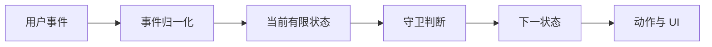

# State Machine 与 Context Boundary：显式约束交互状态

状态机把有限状态、事件、转移、守卫与副作用写成可检查的模型；Context Boundary 则限定谁能读取和修改该模型。二者结合用于消除互相矛盾的布尔状态，并控制更新传播范围。

## 前置知识与能力边界

- [单一职责与组合](01-single-responsibility-composition.md)
- [Controlled 与 Uncontrolled](02-controlled-uncontrolled.md)
- [Headless 与 Compound Component](03-headless-compound-components.md)
- React 的 State、Context、Effect、Ref 与并发渲染基础
- TypeScript 联合类型、泛型、模块与异步错误处理

本文只处理前端交互流程的有限状态建模、扩展数据和 React Context 边界。服务端工作流引擎、分布式事务与全局状态库只在接口处说明。

## 1. 核心模型

有限状态机由有限状态集合、事件集合、初始状态和转移函数组成。Statechart 在此基础上增加层级、并行区域、历史状态和进入/退出动作。Context 是随状态一起存在但不适合枚举成状态节点的数据，例如重试次数和草稿内容。

多个独立布尔值会形成大量未被设计的组合。`isLoading=true` 与 `isSuccess=true` 同时出现时，组件不知道该渲染哪一支。显式状态值把可达组合压缩为模型允许的集合，并让测试按转移覆盖。

下图用于识别数据、决策和副作用各自经过的边界：



事件先被转换为领域事件；守卫只决定某条转移能否发生；状态变化决定哪些副作用启动或取消；React 只把快照映射成界面。

### 1.1 所有权判定

机器实例由最接近完整流程且需要跨步骤保持状态的组件创建。展示子组件只接收快照切片和事件发送函数，不直接修改 Context，也不把机器实例放入整个应用的根 Context。

| 判定问题 | 结论如何影响设计 |
|---|---|
| 有限状态 | 状态值表达当前行为模式，同一原子区域一次只激活一个状态；层级状态可同时激活祖先和叶子节点。 枚举所有可达 state value，并用模型测试确认非法组合不可达。 |
| 事件 | 事件是带 type 的事实消息，载荷只携带发生转移所需数据；事件名应描述发生了什么。 记录事件序列并重放，确认相同初始快照得到相同转移结果。 |
| 转移 | 转移由当前状态、事件、可选守卫决定目标状态，并可执行动作；无目标转移只更新 Context。 对每个状态建立 event×state 表，未声明事件必须保持状态不变。 |
| 守卫 | 守卫是同步纯判断，不执行网络请求或修改外部变量；多个守卫按声明顺序选择。 相同 Context 与事件连续调用守卫，结果应稳定且没有额外调用。 |
| 动作 | 进入、退出和转移动作执行赋值、日志或通知；长异步任务应建模为 actor/service。 注入可观测实现，断言动作顺序及退出后的取消信号。 |

### 1.2 不变量

- `submitting` 状态下不会再次接受 `SUBMIT`。
- 只有校验通过的草稿才能从 `editing` 转到 `submitting`。
- 离开 `submitting` 时必须取消仍在运行的请求。
- 错误信息只在 `failed` 状态存在，重新编辑时清除。
- Context 更新保持不可变，机器实例之间不共享可变初始对象。

不变量应能由类型、测试、运行时断言或服务端约束验证。仅把规则写在组件注释里，不能阻止其他调用路径制造非法状态。

## 2. 关键机制逐项展开

### 2.1 有限状态

状态值表达当前行为模式，同一原子区域一次只激活一个状态；层级状态可同时激活祖先和叶子节点。

缺少这一约束时，布尔组合会出现模型未定义的同时加载、成功和失败。

验证方法：枚举所有可达 state value，并用模型测试确认非法组合不可达。

### 2.2 事件

事件是带 type 的事实消息，载荷只携带发生转移所需数据；事件名应描述发生了什么。

缺少这一约束时，把“跳到成功页”作为事件会把调用方与内部目标状态耦合。

验证方法：记录事件序列并重放，确认相同初始快照得到相同转移结果。

### 2.3 转移

转移由当前状态、事件、可选守卫决定目标状态，并可执行动作；无目标转移只更新 Context。

缺少这一约束时，任意 setState 会绕过允许转移和清理动作。

验证方法：对每个状态建立 event×state 表，未声明事件必须保持状态不变。

### 2.4 守卫

守卫是同步纯判断，不执行网络请求或修改外部变量；多个守卫按声明顺序选择。

缺少这一约束时，有副作用的守卫在预测、测试或重复计算时产生不一致结果。

验证方法：相同 Context 与事件连续调用守卫，结果应稳定且没有额外调用。

### 2.5 动作

进入、退出和转移动作执行赋值、日志或通知；长异步任务应建模为 actor/service。

缺少这一约束时，在动作中启动不可取消 Promise 会在离开状态后写回旧结果。

验证方法：注入可观测实现，断言动作顺序及退出后的取消信号。

### 2.6 扩展 Context

Context 保存数量大或连续变化的数据，有限状态只保存影响允许行为的模式。

缺少这一约束时，把每个输入字符建成状态节点会导致状态爆炸；把模式全塞进 Context 又失去可达性约束。

验证方法：检查字段：若它改变允许事件集合，应优先成为状态或守卫条件。

### 2.7 Actor 生命周期

被 invoking 的异步 actor 随状态进入启动、随退出停止；完成和错误转为明确事件。

缺少这一约束时，组件卸载或转移后旧请求仍提交结果，形成竞态。

验证方法：延迟旧请求并先触发新请求，断言旧完成事件不改变当前快照。

### 2.8 Context 边界

Provider 只覆盖需要共享协议的子树；读写接口分离，消费者订阅最小切片。

缺少这一约束时，根级大对象每次变化会重渲染所有消费者，并让任意模块拥有写权限。

验证方法：React Profiler 记录一次事件的消费者提交数，并测试 Provider 外使用立即报错。

### 2.9 并行状态

互不排斥的维度可建模为并行区域，例如上传流程与网络在线状态；组合状态仍显式可见。

缺少这一约束时，把独立维度做成笛卡尔积状态名会快速膨胀。

验证方法：分别覆盖各区域转移，再测试关键组合与联动事件。

### 2.10 终态与恢复

final 表示该 actor 的生命周期完成；持久化快照需版本和迁移，恢复后重新建立外部资源。

缺少这一约束时，直接恢复旧快照可能引用已删除状态，或误以为网络订阅仍存在。

验证方法：用旧版本 fixture 恢复，验证迁移、无效快照回退和副作用重启。

## 3. 数据流与生命周期

状态机运行时持有一个快照。发送事件不会直接渲染 UI，而是先计算启用转移、更新 Context，再向订阅者发布下一快照。

| 阶段 | 输入 | 处理 | 输出与观察点 |
|---|---|---|---|
| 创建 | 机器定义与 input | 计算初始 Context 和初始状态 | 初始快照、entry 动作 |
| 启动 | actor.start() | 激活订阅和被 invoke 的 actor | status 为 active |
| 发送 | 类型化事件 | 选择转移、检查守卫、执行退出/转移/进入动作 | 新 snapshot |
| 停止 | 离开状态或卸载 | 取消子 actor、停止通知 | 不再处理新事件 |
| 恢复 | 带版本的持久化快照 | 迁移并解析为当前机器状态 | 恢复后的新 actor |

React render 必须保持纯净。actor 的启动、订阅和停止应由框架适配层管理，不能在每次 render 中创建并启动新实例。

## 4. 应用案例一：
### 多步骤付款表单

输入包括购物车版本、收货地址、支付方式和后端返回的支付意图。用户可能重复点击、返回修改地址、网络超时或由银行拒付。

#### 处理步骤

1. 定义 editing、validating、submitting、succeeded、failed 五个原子状态。

观察与证据：状态表中没有 submitting+succeeded 这类组合。

2. 把地址与支付方式放入 Context，把步骤模式放入有限状态。

观察与证据：输入变化不会增加状态节点数量。

3. 用 SUBMIT 事件触发同步守卫，校验失败保留 editing。

观察与证据：缺失卡号时 snapshot.can(SUBMIT) 为 false。

4. 进入 submitting 时 invoke 创建支付意图的请求。

观察与证据：网络面板只有一个带幂等键的请求。

5. PAYMENT_OK 转到 succeeded，PAYMENT_ERROR 转到 failed。

观察与证据：错误对象被归一化后显示可重试与否。

6. failed 接受 RETRY 返回 submitting，EDIT 返回 editing。

观察与证据：不可重试错误不会暴露 RETRY。

7. 离开 submitting 时取消 AbortController。

观察与证据：快速返回编辑后旧请求标记为 cancelled。

8. 用事件序列测试拒付后修改再成功。

观察与证据：最终快照为 succeeded，且只记录一次成功订单。

#### 输出

输出是一张完整转移表、类型化事件联合、支付 actor 接口和按状态渲染的 UI。按钮是否可用来自 `snapshot.can`，而不是另设 `disabled` 布尔源。

#### 失败分支

若提交请求完成晚于用户返回编辑，旧响应不能覆盖新草稿。测试中让第一次请求延迟 500ms、第二次立即返回，断言第一次的完成事件被取消或按 requestId 忽略。

#### 验证

- 覆盖每条转移和每个守卫的真/假分支。
- 检查重复 SUBMIT 不产生第二个支付请求。
- 模拟卸载并断言 AbortSignal.aborted 为 true。
- 键盘与读屏状态由当前快照派生。

## 5. 应用案例二：
### 文件上传队列与网络状态

一个队列可有等待、上传、暂停、失败和完成项，同时浏览器可能在线或离线。文件进度是连续数据，队列模式和网络模式是有限状态。

#### 处理步骤

1. 将 queue 与 connectivity 建成两个并行区域。

观察与证据：离线不会丢失每个文件的进度。

2. 每个文件使用独立 actor，父 actor 只协调并发名额。

观察与证据：父 Context 不保存每个 XHR 的内部句柄。

3. ONLINE 和 OFFLINE 事件只改变 connectivity 区域。

观察与证据：状态图中网络维度不与队列状态展开成名称组合。

4. 离线时向上传 actor 发送 PAUSE，在线后 RESUME。

观察与证据：浏览器切换离线时活动请求被取消。

5. 进度事件按 fileId 更新 Context 中对应记录。

观察与证据：未知 fileId 被拒绝并记录诊断。

6. 重试次数达到上限后转 permanentFailure。

观察与证据：重试策略不会无限请求。

7. 刷新前持久化可序列化队列，不保存 File 对象。

观察与证据：恢复时明确要求用户重新授权文件句柄。

8. 模拟乱序进度和完成事件。

观察与证据：完成后迟到的 80% 进度不会把状态降级。

#### 输出

输出把流程模式、连续进度、浏览器资源三类对象分开。快照可序列化，文件句柄和 AbortController 只存在于 actor 实现。

#### 失败分支

直接把 `File`、XHR 和回调放入 Context 会阻断快照持久化与可重复测试。恢复流程必须只保存元数据，并把缺少文件权限建模为等待用户操作的状态。

#### 验证

- 覆盖离线、恢复、超时与永久失败。
- 断言并发上传数从不超过配置上限。
- 恢复旧快照时执行版本迁移。
- Profiler 确认单文件进度不重渲染整个页面。

## 6. 可执行的 TypeScript 核心

以下 reducer 形式展示状态机的最小核心。它不依赖框架，非法事件保持原状态，并通过判别联合让每个状态只携带合法数据。

```ts
type CheckoutState =
  | { value: "editing"; draft: { address: string } }
  | { value: "submitting"; draft: { address: string }; requestId: string }
  | { value: "failed"; draft: { address: string }; message: string }
  | { value: "succeeded"; orderId: string };

type CheckoutEvent =
  | { type: "CHANGE_ADDRESS"; address: string }
  | { type: "SUBMIT"; requestId: string }
  | { type: "RESOLVE"; requestId: string; orderId: string }
  | { type: "REJECT"; requestId: string; message: string }
  | { type: "EDIT" };

export function transition(
  state: CheckoutState,
  event: CheckoutEvent,
): CheckoutState {
  if (state.value === "editing" && event.type === "CHANGE_ADDRESS") {
    return { value: "editing", draft: { address: event.address } };
  }
  if (state.value === "editing" && event.type === "SUBMIT") {
    if (state.draft.address.trim() === "") return state;
    return { value: "submitting", draft: state.draft, requestId: event.requestId };
  }
  if (state.value === "submitting" && event.type === "RESOLVE") {
    return event.requestId === state.requestId
      ? { value: "succeeded", orderId: event.orderId }
      : state;
  }
  if (state.value === "submitting" && event.type === "REJECT") {
    return event.requestId === state.requestId
      ? { value: "failed", draft: state.draft, message: event.message }
      : state;
  }
  if (state.value === "failed" && event.type === "EDIT") {
    return { value: "editing", draft: state.draft };
  }
  return state;
}
```

用 `requestId` 关联响应后，迟到响应不能跨请求转移状态。实际应用仍需在边界层取消请求，并将服务端幂等性作为最终保护。

## 7. 方案选择与取舍

| 方案 | 适用条件 | 成本与限制 | 退出条件 |
|---|---|---|---|
| useState/useReducer | 状态少、转移局部且没有长异步生命周期 | 规则分散后难以查看全部可达状态 | 出现互斥布尔值或跨组件事件 |
| 显式 reducer 状态机 | 需要类型穷尽和纯函数测试，但不需要层级 actor | 异步取消、并行区域需自行实现 | 副作用编排开始主导 reducer |
| XState v5 actor | 多步骤、可视化、invoke、并行或持久化有明确价值 | 学习、包体和集成成本更高 | 简单 CRUD 不再需要机器能力 |
| 局部 Context | Compound 组件内部共享稳定协议 | 更新会广播给全部消费者 | 高频切片需要选择订阅 |
| 外部 store | 跨树共享且需要细粒度订阅 | 必须管理实例、SSR 隔离与销毁 | 状态重新局部化后可下沉 |

先用状态表证明复杂度，再选择实现。状态机是一种模型，不要求一定引入库；Context 是依赖传递机制，也不是完整的状态管理策略。

## 8. 调试路径与失败注入

| 现象或注入 | 优先检查 | 修正与验证 |
|---|---|---|
| 同时显示加载和成功 | 是否存在多个独立布尔源 | 改为判别联合并删除派生布尔状态 |
| 重复提交 | submitting 是否仍接受 SUBMIT | 转移表拒绝事件，并在服务端使用幂等键 |
| 旧响应覆盖新状态 | 响应是否携带 requestId | 取消旧 actor，并按关联 ID 丢弃迟到事件 |
| Provider 下所有组件重渲染 | Context value 身份和订阅粒度 | 拆读写 Context 或改用 selector store |
| 守卫偶发不同结果 | 守卫是否读取时间或可变外部值 | 把时间作为事件载荷，保持守卫纯 |
| 恢复后停在不存在状态 | 快照版本与迁移函数 | 拒绝未知版本并回退安全初始状态 |
| 测试难以等待 | 动作里是否隐藏不可控 Promise | 注入 actor 实现和虚拟时钟 |
| 卸载后仍写状态 | 退出动作是否取消资源 | 注入延迟请求，断言取消和无后续通知 |

先检查事件是否发送，再检查当前状态是否声明该事件，然后检查守卫输入，最后检查动作与异步 actor。直接在组件中补一个 `setState` 会掩盖模型缺口。

## 9. 生产边界

- 机器定义和可变 actor 实例分开，SSR 的每个请求创建独立实例。
- 日志记录事件类型、前后状态、关联 ID 和耗时，不记录支付卡号等敏感 Context。
- 持久化快照必须有 schemaVersion、校验、迁移和失效策略。
- 网络重试区分可重试错误、客户端错误与业务拒绝，不对所有失败自动重试。
- 高频进度不应通过大型 Context 广播；使用子 actor 或细粒度外部 store。
- 授权规则仍由服务端执行，前端守卫只控制体验。
- 可取消副作用接收 AbortSignal，并在状态退出和组件卸载时停止。
- 监控非法事件、守卫拒绝率、状态停留时间和失败转移频率。

生产可观测性应围绕事件与转移建立，而不是只看最终页面。状态停留异常通常比笼统的“按钮无响应”更快定位阻塞点。

## 10. 与其他模块集成

- 与 URL 状态集成时，只把可分享的稳定状态编码进 URL，机器从解析后的领域值初始化。
- 与 Server State 集成时，查询缓存拥有远端数据；机器拥有提交、确认和取消流程。
- 与 Form State 集成时，表单库拥有字段值与校验；机器拥有多步骤流程模式。
- 与错误模型集成时，actor 把 transport error 归一化为领域事件。
- 与测试集成时，纯 transition 做表格测试，框架层做可访问交互测试。

同一事实只能有一个权威所有者。状态机可以引用缓存和表单的结果，但不复制整份数据并尝试双向同步。

## 11. 综合练习

实现一个支持创建、确认、提交、失败重试和取消的批量操作流程。先写状态图，再实现纯转移和可取消请求适配层。

### 验收标准

- [ ] 没有互斥布尔状态，非法组合在类型层不可构造。
- [ ] 至少覆盖成功、业务拒绝、网络超时、重复点击和卸载取消。
- [ ] Context Provider 只覆盖流程子树，并记录一次提交的渲染次数。
- [ ] 持久化快照带版本，未知版本回退安全初始态。
- [ ] 提交状态图、转移测试、集成测试和失败注入日志。

验收时必须同时提交架构说明、关键测试与可复现的失败记录；只有页面能运行，不能证明边界正确。

## 来源

- [XState v5：States](https://stately.ai/docs/states)（访问日期：2026-07-18）
- [XState v5：Events and transitions](https://stately.ai/docs/transitions)（访问日期：2026-07-18）
- [XState v5：Context](https://stately.ai/docs/context)（访问日期：2026-07-18）
- [React：Passing Data Deeply with Context](https://react.dev/learn/passing-data-deeply-with-context)（访问日期：2026-07-18）
- [React：useContext](https://react.dev/reference/react/useContext)（访问日期：2026-07-18）
