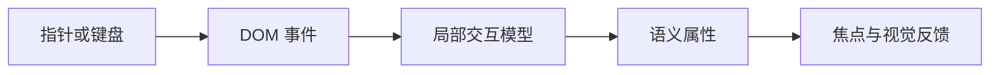

# Interaction State：把瞬时操作留在最小交互边界

交互状态的权威范围通常是一个复合控件：Root 维护活动项和阶段，子项通过上下文读取并上报事件。状态中的活动 ID、DOM 的真实焦点和 ARIA 属性必须由同一转换更新，否则视觉、键盘与辅助技术会观察到不同控件状态。

## 前置知识与能力边界

- [单一职责与组合](01-single-responsibility-composition.md)
- [Controlled 与 Uncontrolled](02-controlled-uncontrolled.md)
- React State、Context、Effect 与 TypeScript 判别联合
- 浏览器事件、HTTP 和可访问性基础

本文处理局部交互状态的所有权和状态机；业务工作流、表单字段与远端缓存分别由其他状态类别负责。

## 1. 定义、所有权与数据流

Interaction State 描述焦点、展开、悬停、拖拽、选择预览和动画阶段等短生命周期状态。它通常由组件或局部复合控件拥有，并必须与 DOM、键盘和辅助技术的真实状态一致。



Interaction State 描述焦点、展开、拖拽和动画等短生命周期行为。它应位于能看到完整控件协议的最小 Root 中，并始终与 DOM 可见性、ARIA 状态和键盘行为保持同源。

## 2. 关键机制

### 2.1 焦点

document.activeElement 是浏览器事实，React 状态只用于驱动需要的效果。

若边界缺失，复制 hasFocus 后事件遗漏导致漂移。

验证：用真实 Tab 顺序和 focusin/focusout 验证。

### 2.2 展开

trigger 拥有 aria-expanded，panel 用关联 id，关闭要决定焦点恢复。

若边界缺失，CSS 可见与 ARIA 状态不一致。

验证：检查可访问树和 hidden 状态。

### 2.3 悬停

hover 不能成为唯一入口，触屏和键盘需要等价路径。

若边界缺失，菜单只靠 mouseenter 打开。

验证：键盘和触控测试同一操作。

### 2.4 按下与激活

pressed、active、selected 语义不同，需匹配控件角色。

若边界缺失，用颜色表达选中但无 aria-selected。

验证：角色/状态矩阵检查。

### 2.5 拖拽

idle、picked、dragging、dropping、cancelled 有明确转移和恢复。

若边界缺失，pointermove 每次写全局 Context。

验证：局部订阅并测试 Escape 取消。

### 2.6 乐观视觉

按钮 pending 只是操作表现，最终业务结果仍来自 mutation。

若边界缺失，视觉完成被当作业务成功。

验证：失败时恢复并播报。

### 2.7 动画阶段

entering、entered、exiting 决定 DOM 生命周期，尊重 reduced motion。

若边界缺失，定时器与 transitionend 双完成。

验证：单一完成信号和超时保护。

### 2.8 组合边界

Compound Root 拥有部件注册、选中和 roving tabindex。

若边界缺失，每个 Item 各自维护 selected。

验证：动态删除当前项后验证焦点。

### 2.9 派生状态

disabled、empty 等若可从 Props 计算则不另存。

若边界缺失，Effect 同步派生造成一帧滞后。

验证：删除副本后测试一致。

### 2.10 事件归一

pointer、keyboard、assistive activation 转为领域交互事件。

若边界缺失，只处理 click 坐标排除键盘。

验证：事件测试覆盖 Enter、Space、Escape、方向键。

## 3. 浏览器事实与 React 快照

焦点的最终事实是 `document.activeElement`，hover 可由 CSS 伪类表达，展开值才需要驱动多个复合部件。不要把所有 DOM 状态复制进 React。只有状态会改变渲染或跨事件持续存在时才保存，并在元素删除、禁用和卸载时定义恢复。

## 4. 复合控件的事件归一

1. 把 pointer、Enter、Space 和辅助技术激活归一为同一控件命令。

2. Root 保存 activeId、open 或 dragging 模式，Item 只注册 id 和 ref。

3. 状态变化同步更新 aria-expanded、aria-selected、hidden 与 roving tabindex。

4. Escape 取消临时模式并恢复合理焦点。

5. 动态删除当前项时按 DOM 顺序选择后继，而不是让全部 tabIndex 变成 -1。

## 5. 应用案例一：命令面板

1. Dialog Root 拥有打开和焦点恢复，输入框只拥有 query。

2. 列表 activeId 从过滤结果派生，当前项消失时选择第一个可用项。

3. 上下键移动 activeId，Enter 执行，Escape 关闭。

4. 直接打开没有触发器时，关闭后聚焦主标题。

5. 用真实 Tab 序列和可访问树验证，不只触发 click。

结果：键盘、鼠标和读屏使用相同命令模型；没有把查询结果复制为全局状态。

失败分支：当前项被筛掉时 activeId 回退第一个可用项。

## 6. 应用案例二：可取消拖拽排序

1. 状态机保存 idle 或 dragging 及 grabbedId/from/over。

2. Space 拾取、方向键移动、Enter 放下、Escape 取消。

3. pointermove 只更新局部预览并用 transform，避免根 Context。

4. 保存失败回滚顺序并保留被拖项焦点。

5. prefers-reduced-motion 下取消过渡但保留状态播报。

结果：Escape 恢复原序，键盘可用 Space 拾取和方向键移动。

失败分支：服务端保存失败时列表回滚并把焦点留在原项。

## 7. TypeScript 核心实现

下面代码把复合控件的活动项、展开状态和键盘事件收敛到局部状态机。真实焦点移动留在 DOM 边界，并通过用户事件测试确认状态与 `document.activeElement` 一致。

```tsx
type DragState =
  | { value: "idle" }
  | { value: "dragging"; itemId: string; from: number; over: number };
type DragEvent =
  | { type: "PICK"; itemId: string; index: number }
  | { type: "MOVE"; index: number }
  | { type: "DROP" }
  | { type: "CANCEL" };

export function updateDrag(state: DragState, event: DragEvent): DragState {
  if (state.value === "idle" && event.type === "PICK")
    return { value: "dragging", itemId: event.itemId, from: event.index, over: event.index };
  if (state.value === "dragging" && event.type === "MOVE")
    return { ...state, over: event.index };
  if (state.value === "dragging" && (event.type === "DROP" || event.type === "CANCEL"))
    return { value: "idle" };
  return state;
}
```

状态联合能排除非法分支，却不能保证焦点目标仍在 DOM 中。动态增删项目、动画结束和失焦都要在运行时修复活动项，并用真实键盘序列验证。

## 8. 方案选择

| 方案 | 适用条件 | 成本与限制 |
|---|---|---|
| CSS 伪类 | 纯 hover/focus-visible/checked 表现 | 不能表达复杂跨部件流程 |
| 局部 State | 组件内短生命周期交互 | 跨树协调会增加传递 |
| 局部状态机 | 拖拽、动画、复合控件有非法组合 | 模型和测试成本增加 |

局部、短命且只服务一个控件的状态应贴近控件；跨路由分享或服务端事实则属于其他状态类型。状态机库适合并发阶段复杂的交互，但不会自动赋予正确 ARIA 和焦点语义。

## 9. 调试与失败注入

| 现象 | 检查 | 修正 |
|---|---|---|
| 视觉展开但读屏未展开 | ARIA 是否来自同一状态 | 绑定 aria-expanded 与 hidden |
| 关闭后焦点丢失 | 是否保存触发器 ref | 恢复到仍存在的合理元素 |
| 触屏无法操作 | 是否只依赖 hover | 提供 click/tap 路径 |
| 拖拽卡顿 | 是否广播 pointermove | 局部化并用 transform |
| Escape 无效 | 状态是否声明取消转移 | 所有临时模式覆盖取消 |
| 动画后 DOM 未移除 | 完成事件是否丢失 | 超时保护并处理 reduced motion |
| 删除项后 tabIndex 全 -1 | roving owner 是否修复 activeId | 动态集合测试 |
| 派生状态闪烁 | 是否用 Effect 同步 Props | render 时直接派生 |

先检查键盘事件是否到达正确控件，再对比活动项 ID、`tabIndex` 与真实焦点，最后确认项目删除或动画结束是否触发合法状态转换。失败信号是焦点落在已卸载节点、所有项均不可 Tab 或鼠标与键盘选择分叉；用动态集合和完整键盘路径测试验证。

## 10. 性能、安全与运维边界

- 高频 pointermove 使用局部订阅和 requestAnimationFrame，避免根 Context。
- 所有仅指针操作提供键盘等价和可见焦点。
- 动画尊重 prefers-reduced-motion。
- Dialog、Menu、Tabs 遵循对应 APG 键盘模式。
- 关闭浮层恢复焦点到仍可操作的来源或合理后继。
- 权限和业务成功不由交互状态决定。
- 记录交互失败时不采集敏感输入。
- 浏览器自动化检查键盘、窄屏、可访问名称和控制台错误。

生产验证至少记录一次正常路径和一次故障路径；对“Interaction State”的结论必须能关联到日志、Profile、网络记录或自动化测试。

## 11. 与其他架构模块集成

- Form State 拥有字段值，Interaction State 只拥有焦点与错误显示时机。
- Server State 拥有 mutation 结果，Interaction State 可显示 pending。
- State Machine 适合拖拽和动画等有限模式。
- 基础组件统一交互语义，业务组件提供领域命令。

集成时组件拥有瞬时焦点与展开阶段，URL 或领域层只接收最终选择结果。不要把 `isHovered`、动画帧或 DOM 引用提升到全局 store；这会扩大订阅并破坏控件生命周期。

## 12. 综合练习

实现支持键盘、触控、Escape 取消和保存失败回滚的可排序列表。

### 验收标准

- [ ] 键盘、触控和辅助技术路径等价。
- [ ] ARIA 状态与可见 DOM 来自同一值。
- [ ] 覆盖 Escape、删除活动项和焦点恢复。
- [ ] 拖拽保存失败可以回滚。
- [ ] 窄屏、reduced motion 和控制台均验证。

## 13. 焦点状态的进入与恢复

浮层打开前记录触发器不等于关闭后总能聚焦它。触发器可能因权限刷新、列表删除或路由变化而消失。恢复策略应按顺序选择：

1. 原触发器仍连接在文档中且可聚焦时，恢复到原触发器。
2. 删除列表项后，聚焦同组中紧邻的后继操作。
3. 没有后继时，聚焦列表标题或创建按钮。
4. 路由已离开原页面时，由新页面导航策略设置焦点。

`focus()` 执行后要检查 `document.activeElement`，而不是只断言函数被调用。被 `disabled`、`hidden`、`inert` 或卸载的节点都不能作为成功目标。

## 14. 拖拽的完整状态表

| 当前状态 | 事件 | 下一状态 | 必须执行 |
|---|---|---|---|
| idle | PICK(id,index) | dragging | 保存起点，播报已拾取 |
| dragging | MOVE(index) | dragging | 更新预览与目标位置 |
| dragging | DROP | saving | 提交稳定 id 顺序 |
| dragging | CANCEL | idle | 恢复原顺序和焦点 |
| saving | RESOLVE | idle | 使用服务端顺序对账 |
| saving | REJECT | idle | 回滚、聚焦原项并播报错误 |

pointer 路径和键盘路径发送同一组事件。指针坐标只用于计算目标 index，不进入业务保存命令。保存时发送稳定 item id 数组；如果只发送索引，其他用户并发插入后会移动错误对象。

大列表的 `pointermove` 可能每秒触发数十次。视觉预览用 `requestAnimationFrame` 合并，并用 transform 避免反复布局；React 状态只在目标 index 真正变化时更新。Profiler 中应检查拖动一项是否让全部行提交，Performance 面板中检查 Long Task 与 Layout。

失败注入在 DROP 后让服务器返回 409：本地恢复服务端最新顺序，保留被拖项焦点，并提供重新尝试入口。简单把数组恢复到拖拽前快照可能覆盖期间收到的他人排序。

自动化测试需读取最终 `document.activeElement`、`aria-grabbed` 替代语义对应的状态播报以及保存失败后的 DOM 顺序，不能只断言事件处理器被调用。

## 来源

- [WAI-ARIA APG：Keyboard Interface](https://www.w3.org/WAI/ARIA/apg/practices/keyboard-interface/)（访问日期：2026-07-18）
- [WAI-ARIA APG：Dialog Pattern](https://www.w3.org/WAI/ARIA/apg/patterns/dialog-modal/)（访问日期：2026-07-18）
- [Pointer Events Level 3](https://www.w3.org/TR/pointerevents3/)（访问日期：2026-07-18）
- [MDN：prefers-reduced-motion](https://developer.mozilla.org/en-US/docs/Web/CSS/@media/prefers-reduced-motion)（访问日期：2026-07-18）
