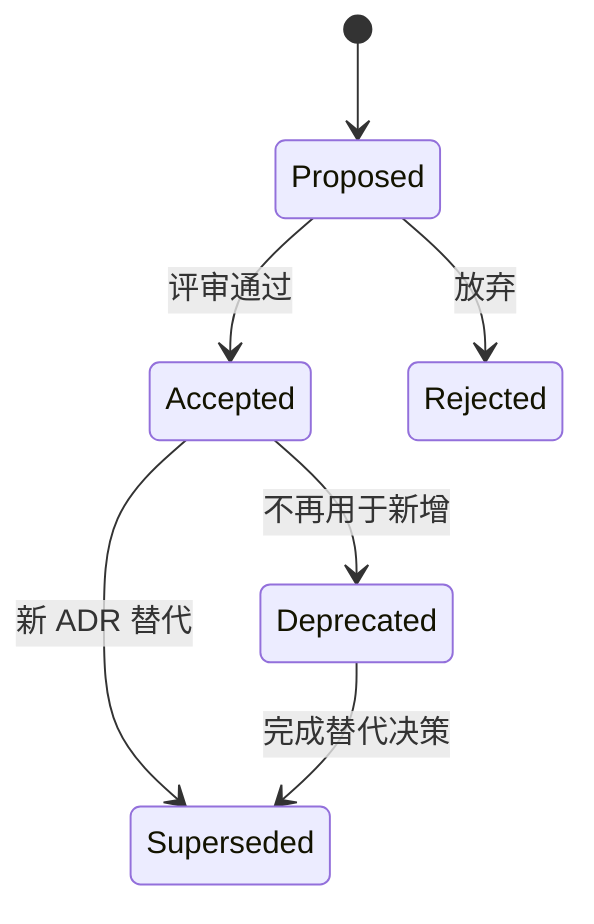

# ADR：记录架构决策、约束、后果与替代方案

一份 ADR 只回答一个具有长期影响的选择，并固定当时已知的约束、备选方案、决定和预期后果。状态从 proposed 到 accepted、deprecated 或 superseded，替代记录通过编号建立不可变的决策时间线。

## 前置知识与能力边界

- [单一职责与组合](01-single-responsibility-composition.md)
- [Controlled 与 Uncontrolled](02-controlled-uncontrolled.md)
- React State、Context、Effect 与 TypeScript 判别联合
- 浏览器事件、HTTP 和可访问性基础

本文处理前端仓库 ADR 的内容、生命周期和评审；会议纪要、需求文档和完整设计文档不由 ADR 替代。

## 1. 定义、所有权与数据流

Architecture Decision Record 是一份针对单个重要决策的短文档，记录上下文、决策、状态和后果。ADR 保存当时的约束与取舍，后续变化通过 supersede 建立链路，而不是重写历史。


ADR 为一个重要架构选择保存当时上下文、候选方案、决策、后果和状态。它不覆盖历史；新条件推翻旧选择时，用新 ADR supersede 旧记录并建立双向链接。

## 2. 关键机制

### 2.1 标题

使用可检索的决策陈述。

若边界缺失，标题只有技术名。

验证：搜索验证。

### 2.2 状态

proposed/accepted/deprecated/superseded 明确生命周期。

若边界缺失，旧决策看似仍有效。

验证：索引检查。

### 2.3 上下文

记录促成决策的事实、约束和不确定性。

若边界缺失，只写偏好。

验证：证据链接。

### 2.4 决策

说明选择及适用边界。

若边界缺失，模糊为建议。

验证：可执行规则。

### 2.5 备选

至少记录可行替代及放弃原因。

若边界缺失，事后无法理解取舍。

验证：评审记录。

### 2.6 后果

正面、负面和后续工作都写。

若边界缺失，只宣传收益。

验证：任务可追踪。

### 2.7 验证

定义怎样知道决策有效。

若边界缺失，没有指标。

验证：复审数据。

### 2.8 时间

日期解释环境但不写维护旁白。

若边界缺失，无时点导致版本歧义。

验证：Git 历史。

### 2.9 替代链

新 ADR 链接旧 ADR 并标记 superseded。

若边界缺失，修改旧文抹去历史。

验证：双向链接。

### 2.10 范围

一个 ADR 一个决策，细节链接设计文档。

若边界缺失，巨大万能 ADR。

验证：标题清单审查。

## 3. ADR 的最小可执行内容

Context 写可验证事实和约束，例如重复请求数量、SSR 要求、团队维护能力；Decision 写采用什么、适用范围和禁止事项；Alternatives 记录真正可行方案及放弃原因；Consequences 同时列收益、成本、迁移和退出条件；Validation 把结论连接到指标、lint 或测试。只写“采用 X，因为流行”不是决策记录。

## 4. 运行顺序与边界

1. proposed 状态进入设计评审，仍允许修改候选与证据。

2. accepted 后对应代码、规则和迁移任务进入同一变更。

3. 现实偏离时先记录数据，不静默编辑旧上下文。

4. 新 ADR 选择替代方案，标记 supersedes，旧 ADR 标为 superseded。

5. deprecated 表示不再推荐新增使用，但现有系统可能仍运行，需给迁移截止。

## 5. 应用案例一：选择查询缓存

1. 收集手写请求的重复、竞态和测试成本。

2. 比较手写、TanStack Query、规范化缓存三方案。

3. 按缓存需求、SSR、包体和团队能力加权。

4. 记录采用 Query 的 key/stale/错误约束和负面成本。

5. 三个月后用请求放大率、故障率和迁移进度复审。

结果：记录采用条件、包体、迁移计划和缓存指标。

失败分支：若只是“社区流行”，没有决策证据。

## 6. 应用案例二：替换 UI 库

1. 旧 ADR 选择 UI 库 A 时的浏览器和团队条件保留。

2. 新需求要求无样式组合、SSR 和更小包体。

3. 新 ADR 比较继续封装、渐进替换与自建。

4. 采用适配层渐进替换，并记录双轨期限。

5. 旧记录标 superseded，链接新记录而不改原结论。

结果：可以追踪为何当年选择及为何现在退出。

失败分支：直接覆盖历史让失败原因丢失。

## 7. TypeScript 核心实现

下面示例把 ADR 的状态、上下文、决策、后果和替代关系固定为可检查结构。仓库脚本只验证格式与链接，技术取舍仍由评审者结合证据判断。

```tsx
type AdrStatus = "proposed" | "accepted" | "deprecated" | "superseded";
type Adr = {
  id: string;
  title: string;
  status: AdrStatus;
  context: string;
  decision: string;
  consequences: string[];
  supersedes?: string[];
};
export function isComplete(adr: Adr): boolean {
  return adr.context.trim().length > 0 && adr.decision.trim().length > 0 && adr.consequences.length > 0;
}
```

结构校验只能发现缺字段和断链，不能证明决策已执行。每个可自动化约束都应链接到 lint、测试或指标，并在 CI 中验证当前实现仍符合 ADR。

## 8. 方案选择

| 方案 | 适用条件 | 成本与限制 |
|---|---|---|
| 代码注释 | 局部实现原因 | 无法表达系统取舍 |
| ADR | 跨模块重要决策 | 需维护状态和索引 |
| 设计文档 | 复杂方案与接口细节 | 篇幅大且不替代决策摘要 |

影响多个模块、难以撤销或改变长期约束的选择值得写 ADR；日常实现细节留在代码和 PR。文档工具可以生成编号与索引，但不能代替备选方案和后果分析。

## 9. 调试与失败注入

| 现象 | 检查 | 修正 |
|---|---|---|
| 只有结论 | 缺上下文 | 补证据约束 |
| 只有优点 | 无负面后果 | 写成本任务 |
| 旧 ADR 混乱 | 无状态 | 索引与替代链 |
| 文档无人看 | 不进 PR 流程 | 决策变更必改 ADR |
| 写成会议纪要 | 多人发言无决策 | 提炼单一选择 |
| 所有小事都写 | 无阈值 | 定义触发条件 |
| 链接腐烂 | 外部证据无摘要 | 保留关键事实 |
| 决策不执行 | 无自动规则 | 链接 lint/测试 |

发现实现与决策不一致时，先沿 ADR 状态和 supersede 链找到当前有效记录，再核对当时约束是否仍成立，最后检查对应自动规则是否缺失或失效。失败信号是多人引用不同版本、决策只存在聊天记录或链接腐烂；用索引校验、断链检查和规则映射表验证。

## 10. 性能、安全与运维边界

- ADR 与代码同仓评审。
- 编号稳定不复用。
- 旧记录不删除。
- 敏感商业信息不进公开仓库。
- 决策后果转为任务。
- 复审触发条件明确。
- 架构 lint 链接对应 ADR。
- 索引展示状态和替代关系。

生产验证至少记录一次正常路径和一次故障路径；对“ADR”的结论必须能关联到日志、Profile、网络记录或自动化测试。

## 11. 与其他架构模块集成

- 依赖规则引用 ADR。
- 第三方选择记录退出成本。
- 统一错误模型记录兼容影响。
- 领域切分争议以 ADR 固化。

集成时 PR 链接受影响 ADR，ADR 反向链接执行它的规则、迁移和指标。新决策通过 supersede 保留历史，不重写旧文档造成时间线失真。

## 12. 综合练习

为状态库选择写一份 ADR，包含三方案、权重证据、负面后果、验证指标和替代触发条件。

### 验收标准

- [ ] Context 含量化事实而非偏好。
- [ ] 至少三个可行候选及放弃理由。
- [ ] 正负后果、迁移与退出条件完整。
- [ ] 新旧 ADR supersede 链双向可导航。
- [ ] 至少一项 lint、测试或指标执行决策。

## 12. ADR 与自动化约束

如果 ADR 决定“domains 不得依赖 infrastructure”，对应 lint rule 的错误消息应链接 ADR 编号。规则变化与 ADR 状态在同一 PR 修改。这样读者既看到机器执行的结果，也能理解原始约束。

ADR 后果中的工作必须转为 issue：迁移消费者、建立指标、删除兼容层。仅在文档列出负面成本而没有负责人，会让决策成本长期隐藏。

索引至少显示编号、标题、状态、日期和 superseded by。CI 检查编号唯一、本地链接存在、accepted ADR 含 consequences 与 validation。结构检查不能判断决策质量，但能阻止缺字段和断链。

## 13. 一份可执行 ADR 的实例

标题：`ADR-0012 使用 TanStack Query 管理 HTTP Server State`。

Context 记录：同一用户详情在四个页面重复请求；现有 Effect 实现出现两类迟到响应；SSR 需要预取和 hydration；团队不需要 GraphQL 实体规范化。数据来源链接到性能记录和缺陷编号。

Decision 记录：只把远端快照放入 Query cache；query key 必须由 factory 创建并包含全部参数；Form 草稿和 URL 筛选不进入 cache；SSR 每请求创建 QueryClient；mutation 失败按统一错误联合处理。

Alternatives 记录：继续封装 Effect 的短期包体最小但取消与共享缓存成本持续；规范化缓存能细粒度实体更新，但当前关系复杂度不足以抵消 schema 和合并成本。

Consequences 记录：增加依赖和学习成本；必须建立 key、stale、失效与 SSR 测试；三个月内迁移四个重复请求点；如果 bundle 增量超过预算或 SSR hydration 无法稳定，则触发复审。

Validation 记录：重复请求下降、迟到响应缺陷清零、缓存命中率、bundle 增量、迁移完成率。指标有采样位置和负责人，而不是只写“性能改善”。

## 14. ADR 状态转移



Rejected 记录仍可保留，因为它解释某方案为何未采用。Superseded 不代表当年决策错误，只表示当前约束下由另一记录接管。旧 ADR 的正文保持原样，只修改状态和链接。

## 15. 何时不写 ADR

局部变量命名、可轻易撤销且没有跨模块影响的实现细节不需要 ADR。大型需求说明也不应全部塞入 ADR：接口、时序和迁移步骤留在设计文档，ADR 链接它们并保存选择。

触发阈值可包括：跨多个模块、引入长期依赖、改变安全或数据边界、迁移成本高、团队存在多个可行方案。阈值是团队约定，不是自然定律，应定期根据文档噪音和决策丢失情况调整。

## 16. ADR 评审检查

评审者逐项指出 Context 中哪个证据支撑哪个选择标准；无法关联的标准要删除或补证据。候选方案必须可行，不能把明显不可用的方案当陪衬。权重若存在，要说明由谁决定以及变化多大时会改变结论。

Consequences 中每个负面项给出接受者、缓解动作或退出条件。安全、隐私、无障碍和运维影响不能只写在通用模板而不结合决策。采用第三方库时记录版本范围、许可证、数据流和替换接缝。

合并后索引生成状态视图；链接检查保证 supersede 双向关系。半年复审不是强制重写所有 ADR，而是检查触发条件是否发生，例如浏览器支持、团队规模、流量或供应商价格改变。

复审结论如果仍成立，只记录复审日期和证据链接；如果约束改变到足以推翻选择，创建新的 proposed ADR。这样不会把历史判断和当前判断混进同一正文。

## 来源

- [AWS Prescriptive Guidance：ADR process](https://docs.aws.amazon.com/prescriptive-guidance/latest/architectural-decision-records/adr-process.html)（访问日期：2026-07-18）
- [Microsoft Azure Architecture Center：ADRs](https://learn.microsoft.com/en-us/azure/well-architected/architect-role/architecture-decision-record)（访问日期：2026-07-18）
- [adr.github.io](https://adr.github.io/)（访问日期：2026-07-18）
