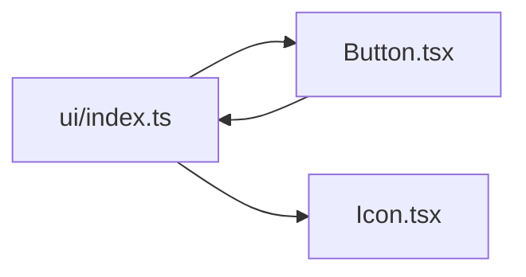

# 循环依赖检查：发现、解释并消除模块环

循环依赖表示模块图存在从节点出发又回到自身的路径。ES Module 能处理部分环，但初始化顺序、tree shaking、测试隔离和架构所有权会变得脆弱；检查目标是识别环的语义原因并重构方向。

## 前置知识与能力边界

- [单一职责与组合](01-single-responsibility-composition.md)
- [Controlled 与 Uncontrolled](02-controlled-uncontrolled.md)
- React State、Context、Effect 与 TypeScript 判别联合
- 浏览器事件、HTTP 和可访问性基础

本文处理源代码静态模块图；运行时事件循环和服务间调用环不是同一概念。

## 1. 定义、所有权与数据流

循环依赖表示模块图存在从节点出发又回到自身的路径。ES Module 的 live binding 允许部分环完成链接，但读取尚未初始化的绑定、模块副作用和架构双向知识仍会导致脆弱行为。检查的目标是找到完整强连通分量并修复依赖方向。


检查器用与真实构建一致的 resolver 把每个 import 转成有向边，再用强连通分量算法找环。报告必须给出完整路径、边类型和源位置，修复后重新执行行为测试与构建。

## 2. 关键机制

### 2.1 直接环

A→B→A 最易定位。

若边界缺失，初始化读未定义绑定。

验证：最小 fixture。

### 2.2 间接环

A→B→C→A 需图算法。

若边界缺失，人工搜索漏链。

验证：SCC 报告。

### 2.3 ESM live binding

导入是活绑定但初始化受执行顺序约束。

若边界缺失，认为 ESM 自动安全。

验证：运行 fixture。

### 2.4 类型环

import type 运行时可擦除但架构仍耦合。

若边界缺失，忽略导致边界退化。

验证：双图报告。

### 2.5 动态导入

可打断同步执行但不修复语义双向依赖。

若边界缺失，用 lazy 隐藏环。

验证：构建图审计。

### 2.6 barrel

index re-export 容易制造隐蔽回边。

若边界缺失，内部也从 barrel 导入。

验证：模块内部相对导入。

### 2.7 SCC

强连通分量大小>1 或自环即周期。

若边界缺失，只报告第一条路径。

验证：列出完整分量。

### 2.8 修复方向

移动所有权、提取稳定抽象或上移协调器。

若边界缺失，把所有东西塞 shared。

验证：依赖矩阵复核。

### 2.9 CI 基线

新环阻断，旧环有 owner 和期限。

若边界缺失，一次性报告无人处理。

验证：差异门禁。

### 2.10 多工具一致

TS path、条件 exports、Vite alias 均需解析。

若边界缺失，工具图与真实构建不同。

验证：对照 bundler metafile。

## 3. ES Module 环为什么可能运行也可能失败

ESM 在执行前先链接模块并建立 live binding。导入者读取的是导出绑定，不是 CommonJS 那样的一次值复制。但 `let`、`const` 和 `class` 在初始化前处于 temporal dead zone。

```ts
// a.ts
import { valueB } from "./b";
export const valueA = valueB + 1;

// b.ts
import { valueA } from "./a";
export const valueB = valueA + 1;
```

加载入口、转译器、打包优化和模块副作用都可能改变首先读取哪一个未初始化绑定。即使某个构建当前输出 `undefined` 而没有抛错，也不能把该实现行为当稳定契约。

如果两个模块只在函数被调用时读取对方绑定，初始化可能完成后才读取，因此看似正常。但环仍会让单元测试难以独立加载、tree shaking 保留更多副作用，并暴露双方职责没有单向归属。

## 4. 强连通分量与报告

有向图中，一个强连通分量内任意两个节点互相可达。分量大小大于 1 就包含环；节点存在指向自身的边也是自环。Tarjan 与 Kosaraju 都能在线性 `O(V+E)` 时间找到全部分量。

只报告发现的第一条环不够。若分量包含 A、B、C、D，修复 A→B 后可能仍有 A→C→D→A。报告应列出：

- 分量中的全部文件；
- 每条回边的 import 位置；
- 静态、动态、re-export 或 type-only 类型；
- 经过哪个 alias/package export 解析；
- 分量首次出现的提交或基线状态。

运行时环与架构环可分别展示：type-only 边通常不进入 JavaScript，但仍表示编译契约双向；动态 import 改变加载时机，却未必改变业务所有权。

## 5. 案例一：组件 barrel 环

`ui/index.ts` re-export `Button` 与 `Icon`，而 `Button.tsx` 为了方便从 `./index` 导入 `Icon`：



1. 检查工具报告 `index.ts → Button.tsx → index.ts`。
2. `Button.tsx` 改为直接从 `./Icon` 导入内部实现。
3. 包外消费者仍从 `ui/index.ts` 导入，公开 API 不变。
4. 增加规则：模块内部不得从本模块 barrel 回导。
5. 运行 Button 交互测试和构建 metafile，确认行为与 chunk 没有异常变化。

把 Button 改成动态导入 Icon 会增加异步边界和加载复杂度，却不修复内部依赖公开入口的原因。把两个文件合并可以消环，但只有在它们确实共同变化时才合理。

## 6. 案例二：订单与库存领域互导

订单用例直接调用库存预留，库存回调订单修改状态，形成 `orders → inventory → orders`。这里不是导入路径技巧，而是一个跨领域用例没有所有者。

1. 在 application 层定义 `allocateOrder` 协调用例。
2. 订单域公开创建待分配订单的端口，库存域公开预留端口。
3. 协调器依次调用两侧，并把补偿或失败状态写成用例策略。
4. 两个领域不导入对方 store、内部实体或 reducer。
5. 使用内存端口测试库存不足、预留超时、订单取消和幂等重试。

修复后的方向是 application→orders 与 application→inventory。把全部类型搬到 shared 虽能消除部分 import，却会失去订单和库存各自的所有权；只有确实稳定共享的值对象才进入共享内核。

## 7. TypeScript 核心实现

下面代码从解析后的模块边构建有向图，并报告强连通分量。解析器与 bundler 图在边界注入，以便分别覆盖源码 import、路径别名和动态加载。

```tsx
type Graph = Readonly<Record<string, readonly string[]>>;
export function hasPath(graph: Graph, from: string, target: string, seen = new Set<string>()): boolean {
  if (from === target && seen.size > 0) return true;
  if (seen.has(from)) return false;
  const nextSeen = new Set(seen).add(from);
  return (graph[from] ?? []).some((next) => hasPath(graph, next, target, nextSeen));
}
export function nodesInCycles(graph: Graph): string[] {
  return Object.keys(graph).filter((node) => (graph[node] ?? []).some((next) => hasPath(graph, next, node)));
}
```

TypeScript 能解析某些循环而不报错，运行时仍可能出现未初始化绑定，bundler 也可能形成大块。检查器需覆盖文件图、包图和动态边，并用已知环夹具测试漏报。

## 8. 方案选择

| 方案 | 适用条件 | 成本与限制 |
|---|---|---|
| 人工审查 | 极小项目 | 容易漏间接环 |
| ESLint import 检查 | 快速本地反馈 | 解析大型图成本 |
| 专用图工具 | 全仓 SCC、可视化与 CI | 需匹配真实 resolver |

小型项目可以在 CI 扫描全部边，大型 monorepo 需要缓存和只阻止新增环的迁移基线。工具选择取决于能否理解路径别名、workspace 和动态 import，而不是图形界面是否漂亮。

## 9. 调试与失败注入

| 现象 | 检查 | 修正 |
|---|---|---|
| 运行时 undefined | 初始化顺序环 | 消除回边 |
| 工具漏 alias | resolver 不一致 | 读取 tsconfig |
| 只报一条路径 | 未做 SCC | 输出完整分量 |
| type 环持续增长 | 忽略 type-only | 架构图纳入 |
| barrel 假环 | 内部导入公开入口 | 直接内部路径 |
| shared 膨胀 | 用 shared 消环 | 重新确定 owner |
| CI 突然失败大量旧环 | 无基线迁移 | 只阻止新增并计划清零 |
| 动态 import 掩盖 | 只看同步边 | 加入 bundler 图 |

先读取检查器报告的最短闭环，再展开 barrel 找到实际文件边，随后对照包依赖和 bundler chunk 图确认影响范围。失败信号是初始化值为 `undefined`、测试顺序改变结果或一个改动触发巨大重打包；用最小环复现、SCC 报告和构建统计验证。

## 10. 性能、安全与运维边界

- CI 阻止新增环。
- 旧环有 owner 和截止日期。
- 解析条件 exports 与 aliases。
- 报告完整路径和 SCC。
- 区分运行时环与类型架构环。
- 生成可下载依赖图。
- 修复后运行行为测试。
- 趋势指标进入架构审查。

生产验证至少记录一次正常路径和一次故障路径；对“循环依赖检查”的结论必须能关联到日志、Profile、网络记录或自动化测试。

## 11. 与其他架构模块集成

- 单向依赖矩阵定义哪些边非法。
- 领域组织确定节点所有权。
- ADR 记录暂时例外。
- 组合根用于消除双向实例创建。

集成时源码扫描、package 依赖检查和 bundler 分析使用同一模块身份映射。历史环进入有负责人和期限的基线，新环在 CI 立即阻断，避免基线永久膨胀。

## 12. 综合练习

给一个含直接环、间接环、barrel 环和 type 环的仓库建立 CI，并用三种不同重构方式清零。

### 验收标准

- [ ] fixture 同时包含直接环、间接环、barrel 环、type-only 环和自环。
- [ ] resolver 正确处理 tsconfig paths、package exports 和动态 import。
- [ ] CI 输出完整 SCC，而不是只报告第一条路径。
- [ ] barrel 环通过内部直接导入修复，公开入口保持兼容。
- [ ] 订单库存环通过上层协调用例修复，没有搬入万能 shared。
- [ ] 新环立即失败；旧环有 owner、基线和清零期限。

## 13. Tarjan 检查结果怎样阅读

Tarjan 深度优先遍历为节点记录 `index` 和 `lowlink`。`index` 是首次访问顺序；`lowlink` 是沿当前 DFS 栈可到达的最小 index。当一个节点的 lowlink 等于 index，它是一个强连通分量的根，算法从栈顶弹出到该节点。

报告不需要把算法内部数字暴露给普通开发者，但工具测试应覆盖：

- 无边图：每个节点各自成为大小 1 的分量，不报告环；
- 单向链 A→B→C：三个分量，不报告环；
- A→B→C→A：一个大小 3 的分量；
- A→A：大小 1 但存在自环，应报告；
- 两个相连环：若存在双向可达，合成一个 SCC；只有单向连接则保持两个；
- type-only 边在 runtime 模式删除，在 architecture 模式保留。

本文代码中的 `nodesInCycles` 适合说明可达性，但从每个节点重复搜索的成本高于 Tarjan。生产检查器应使用线性 SCC 算法，并缓存路径解析结果。

## 14. CI 基线与逐步清零

已有大型仓库可能存在数十个环。直接把所有环设为失败会迫使团队加入全局 ignore。更可执行的流程是：

1. 保存当前 SCC 清单，给每个分量稳定指纹、owner 和优先级。
2. CI 重新计算图；出现新分量、旧分量扩大或新增自环时失败。
3. 修复会使分量缩小或消失，基线只能通过审查后的命令更新。
4. 先处理包含模块顶层副作用、认证、配置和共享 store 的运行时高风险环。
5. 再处理 type-only 架构环和 barrel 环，直到基线为空。

指纹不能只使用工具输出顺序；应对分量文件路径排序后计算。文件重命名可能表现为删除和新增，评审需要结合 Git rename 判断。

## 15. 修复后的行为验证

消除 import 环不保证行为不变。把协调逻辑上移可能改变调用顺序，把常量提取到第三模块可能改变初始化副作用。每次修复至少执行：

- 受影响模块的 TypeScript 编译和单元测试；
- 一个从真实入口加载模块的运行时测试；
- SSR import 测试，确认没有浏览器全局提前执行；
- bundler metafile 比较 chunk、重复模块和 side effects；
- 全图 SCC 检查，确认没有通过新中介形成更长的环。

若使用依赖注入，把端口类型放在需要能力的高层模块或稳定契约包，具体实现留在基础设施，实例化留在组合根。仅把双方引用改成字符串 token 可能骗过静态扫描，但运行时注册表仍可形成隐式双向所有权，需要架构评审。

## 来源

- [ECMAScript 2026：Modules](https://tc39.es/ecma262/multipage/ecmascript-language-scripts-and-modules.html)（访问日期：2026-07-18）
- [TypeScript：Modules](https://www.typescriptlang.org/docs/handbook/2/modules.html)（访问日期：2026-07-18）
- [dependency-cruiser](https://github.com/sverweij/dependency-cruiser)（访问日期：2026-07-18）
- [Madge](https://github.com/pahen/madge)（访问日期：2026-07-18）
