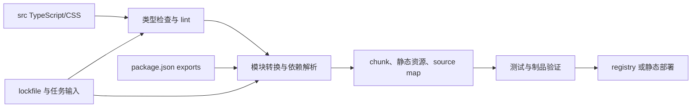

# 前端工具链、Monorepo 与团队 CLI

工具链把源代码变成可运行、可测试、可发布的软件；Monorepo 管理多个有依赖关系的包；团队 CLI 把重复且有风险的操作变成受约束的命令。这三者的目标不是使用更多工具，而是让输入、依赖、输出和失败处理可重复、可验证。

## 前置知识与边界

- [模块、导入导出、错误与异常处理](../03-javascript/05-modules-errors.md)
- [Vite 等开发与构建工具](../04-typescript-frameworks/13-vite-build-tools.md)
- [依赖选择、升级、锁文件与供应链](../04-typescript-frameworks/17-dependencies-lockfiles-supply-chain.md)

本文以一个 TypeScript 组件库和业务应用组成的仓库为例，说明模块边界、构建图、缓存、自动化迁移和发布。它不要求所有项目采用 Monorepo；只有共享代码、原子变更或统一发布的收益高于仓库复杂度时才采用。

## 1. 从源码到发布物：每一层的职责



### 1.1 模块格式不是文件后缀的别名

ESM 使用 `import` 和 `export` 声明依赖；它的静态结构让构建器可在执行前分析导入图。CommonJS（CJS）使用运行时 `require()` 和 `module.exports`。Node 依据最近的 `package.json` 的 `type` 字段以及 `.mjs`、`.cjs` 后缀决定 `.js` 的解释方式；`.mjs` 总是 ESM，`.cjs` 总是 CJS。

两种格式可以在同一个生态中存在，但互操作有成本：CJS 的动态导出会限制静态分析；ESM 中不能直接假定所有 CJS 默认导入的形状；同一库分别加载 ESM 与 CJS 入口时，若入口各自维护模块级可变状态，可能出现两份单例。新库应优先发布 ESM；确实有 `require()` 使用者时，才维护明确的 CJS 入口并测试两者。

| 字段或机制 | 作用 | 关键边界 |
| --- | --- | --- |
| `type` | 决定包内 `.js` 默认按 ESM 还是 CJS 解释 | 不会转换源代码，也不替代 `exports` |
| `main` | 传统默认入口 | 支持 `exports` 的运行时优先使用 `exports` |
| `exports` | 声明公开入口与条件入口 | 出现后，未列出的深层路径会被封装并报错 |
| `types` | 指向 TypeScript 声明入口 | 类型声明必须与运行时代码的公开子路径一致 |
| `sideEffects` | 告诉打包器某些文件导入是否有可观察副作用 | 错标为 `false` 可能让注册、样式等代码被删除 |
| source map | 将编译位置映射回源码 | 应上传到受控错误平台，不应把私有源码无条件公开 |

下面是一份组件库的明确出口；对象键的条件顺序有意义，`default` 放在最后作为未知环境的后备。

```json
{
  "name": "@acme/ui",
  "type": "module",
  "exports": {
    ".": {
      "types": "./dist/index.d.ts",
      "import": "./dist/index.js",
      "require": "./dist/index.cjs",
      "default": "./dist/index.js"
    },
    "./button": {
      "types": "./dist/button.d.ts",
      "import": "./dist/button.js",
      "require": "./dist/button.cjs",
      "default": "./dist/button.js"
    },
    "./package.json": "./package.json"
  },
  "files": ["dist", "package.json", "README.md"],
  "sideEffects": ["./dist/theme.css"]
}
```

`exports` 是公共 API 合同，不是隐藏文件的安全边界。给已有包增加它可能让消费者此前使用的 `@acme/ui/dist/private.js` 立即失败，因此要先从下载记录、代码搜索和迁移窗口确定历史入口；必要时临时显式保留旧子路径，并在下一个主版本删除。

### 1.2 Tree shaking、split 与 chunk 的不同问题

Tree shaking 在静态依赖图中删除未被使用且无副作用的导出；code splitting 把依赖图切成可按路由或动态导入加载的文件；chunk 是构建器最终输出的一个文件单元。三者常一起出现，但不能互相证明：一个动态 chunk 仍可能包含大量活跃代码；一个未使用导出也可能因副作用声明不准确而无法删除。

```ts
// app/routes/report.ts
export async function openReport() {
  const { renderReport } = await import('@acme/reporting');
  return renderReport();
}
```

这段动态导入把 reporting 放到可延后请求的边界。它适用于低频路由或重型编辑器，不适用于首屏必经且很快会点击的控件：额外网络往返可能使交互变慢。用 bundle 分析、真实设备网络和关键路径指标决定边界，而不是按目录机械切分。

### 1.3 HMR、source map 与插件管线

开发服务器通常先解析入口与模块图，再对请求的模块转换；HMR 在文件变化时只推送可接受的更新边界。HMR 成功不等于生产构建正确：生产会压缩、拆包、替换环境变量并使用不同的资源 URL。插件应定义输入、输出、运行阶段和缓存键；读取环境、系统时间或网络而不声明，会使缓存产生不可靠结果。

AST（抽象语法树）是源代码的结构表示。解析器把文本变成 AST，转换器只修改目标节点，生成器再输出文本。相比正则替换，AST 可区分 `Button` 标识符、字符串中的 `Button` 和属性名中的 `Button`；但 AST 转换仍需处理注释、格式、动态语法和不同 parser 版本。

## 2. Monorepo：让包边界先于任务并行

一个健康的仓库先回答“哪个包可以依赖哪个包”，再讨论缓存与并行。工作区只是在一次安装中识别多个 package；它不会自动禁止 `apps/web` 直接导入 `packages/ui/src/internal.ts`，也不会自动给出正确的构建顺序。

```text
repo/
  apps/
    web/                 # 面向用户的应用
  packages/
    ui/                  # 可版本化的组件 API
    config/              # 可共享配置，不反向依赖 app
    tooling/             # CLI 与 codemod
  package.json
  pnpm-workspace.yaml
  pnpm-lock.yaml
```

```yaml
# pnpm-workspace.yaml
packages:
  - "apps/*"
  - "packages/*"
```

### 2.1 package boundary 与依赖方向

包边界由 `package.json`、公开 `exports`、测试入口和所有者共同构成。共享 `ui` 可以依赖 `config`，业务 `web` 可以依赖 `ui`，反向依赖会把业务规则带回基础层并制造发布耦合。使用 lint 规则、依赖图检查或构建系统约束执行这一规则；仅在架构文档中写箭头不会阻止违规导入。

| 依赖类型 | 示例 | 应如何声明 |
| --- | --- | --- |
| 运行时依赖 | `web` 使用 `@acme/ui` | `dependencies`，并在生产构建验证 |
| 构建/测试依赖 | lint、测试器、TypeScript | `devDependencies`，根或包级按实际所有者放置 |
| 同步版本 API | `ui` 与 `tokens` 必须兼容 | 使用 workspace 协议与 release 规则显式表达 |
| 类型专用依赖 | 只在 `.d.ts` 暴露的类型 | 仍要保证消费者安装时可解析 |

任务图的节点是“包内的具体任务”，边是“此任务需要另一个任务输出”。例如 `web#build` 依赖 `ui#build`，而 `web#test` 未必需要 `ui#build`，可能只需源码转换。把所有任务串行会浪费并行；把所有任务并行又可能读取过期 `dist`。正确做法是声明输入、输出、依赖和缓存失效条件。

### 2.2 缓存与增量构建的安全使用

缓存的键至少应包含：任务命令、相关源码、锁文件、配置、Node/工具版本、环境变量白名单和上游制品摘要。远程缓存能让另一台 CI 机器复用结果，但它不是可信执行边界：不可信 fork 不应写入共享缓存，缓存访问令牌不应暴露到浏览器构建产物或日志。

失败例子：`build` 读取 `API_BASE_URL`，但任务配置没有把它列入输入。预发构建先写入缓存，生产构建命中相同键并部署预发地址。修复不是“清缓存”，而是把影响产物的环境变量声明为输入，或将运行时配置从构建时值分离。

```json
{
  "scripts": {
    "typecheck": "tsc -b --pretty false",
    "test": "vitest run",
    "build": "vite build",
    "verify": "pnpm typecheck && pnpm test && pnpm build"
  },
  "packageManager": "pnpm@10.0.0"
}
```

锁文件、固定包管理器版本和干净安装是可复现的基础。缓存只加速已经定义正确的任务，不能修复浮动版本、未声明生成文件或依赖安装脚本的供应链风险。

## 3. 案例一：把组件库从“可导入源码”升级为可发布包

### 输入与约束

团队有 `packages/ui/src/Button.tsx`，应用通过相对路径导入。需要让外部应用只使用稳定入口，并同时支持现代 ESM 与仍使用 CJS 的 Node 工具。约束是：不改变 Button 行为；深层私有文件不再成为合同；发布前必须验证 tarball，而不是只在仓库内测试。

### 处理过程

1. 列出当前实际导入路径，区分公开组件、主题 CSS 和内部测试工具。
2. 新建 `src/index.ts` 与 `src/button.ts`，只导出承诺维护的符号。
3. 构建 ESM、CJS 和声明文件，并按上述 `exports` 显式列出入口。
4. 在临时目录安装打包后的 tarball；分别执行 `import`、`require()`、类型检查与 CSS 入口测试。
5. 用静态分析确认应用没有再访问 `src/` 或 `dist/` 深层路径；遗留路径给出迁移说明和删除版本。

```ts
// packages/ui/src/button.ts
export { Button, type ButtonProps } from './Button.js';

// packages/ui/src/index.ts
export * from './button.js';
```

```sh
# 在包目录执行；pack 产生本地 tarball，不发布到 registry
pnpm pack
mkdir -p /tmp/ui-consumer && cd /tmp/ui-consumer
pnpm init
pnpm add /absolute/path/to/acme-ui-1.2.0.tgz
node --input-type=module -e "import('@acme/ui/button').then(m => console.log(Boolean(m.Button)))"
node -e "console.log(Boolean(require('@acme/ui').Button))"
```

### 输出与验证

期望两个命令均输出 `true`，消费者 TypeScript 项目能解析 `ButtonProps`，而 `import '@acme/ui/src/Button'` 抛出 `ERR_PACKAGE_PATH_NOT_EXPORTED`。后一个失败是预期边界，不是构建损坏。

失败分支：若 CJS 入口导出 `{ default: Button }` 而 ESM 是命名导出，消费者会得到不同形状。修复是为两个入口定义同一公开 API，并把两种加载方式写进发布前测试。若打包后缺少 `.d.ts` 或 CSS，说明 `files` 白名单或构建输出配置错误；工作区解析成功不能替代 tarball 验证。

## 4. 团队 CLI、migration 与 codemod

CLI 是面向人和 CI 的接口，必须同时支持交互模式和非交互模式。交互模式可以询问项目名；CI 必须能通过参数、stdin 或配置文件提供同样的信息，并在无 TTY 时不阻塞。每个会改文件或调用外部系统的命令至少定义：预检、计划、dry run、执行、可识别日志、退出码和恢复路径。

| 设计点 | 推荐行为 | 失败时的处理 |
| --- | --- | --- |
| 参数 | 校验类型、枚举和互斥关系 | 输出可操作错误，退出码非零 |
| `--dry-run` | 显示将读写的文件和 diff 摘要，不写文件 | 允许 CI 比较计划 |
| 幂等性 | 重复运行不重复插入或破坏状态 | 通过内容检测跳过或报冲突 |
| 日志 | 人类文本写 stderr/stdout；机器模式输出 JSON Lines | 不把令牌、cookie、完整个人数据写入日志 |
| 回滚 | 写入前备份或以 Git diff 作为恢复面 | 失败后报告已完成与未完成文件 |
| exit code | `0` 成功；参数/预检/执行失败不同码可选 | CI 只依据退出码决定成功 |

Codemod 是受约束的源码迁移，不是“全仓库文本替换”。它应该选择 parser，定位语义节点，只改满足前置条件的文件，保留无法安全判断的文件并生成报告。迁移须先在 fixture 上测试，再在真实仓库 dry run，最后小批量提交并由类型检查、测试和人工抽样共同验证。

```ts
// 使用 AST 工具时的核心约束：只转换明确的 import 声明。
// 这是 TypeScript 示例；具体 AST 库的 API 以所选版本文档为准。
function rewriteImport(moduleSpecifier: string): string | null {
  if (moduleSpecifier === '@acme/ui/legacy-button') return '@acme/ui/button';
  return null;
}
```

不要对所有文本运行 `replace('legacy-button', 'button')`：它会改注释、文案、测试快照、动态路径甚至安全规则。无法静态解析的 `import(pathFromServer)` 不应由 codemod 猜测；报告位置并让所有者手工决定。

## 5. 案例二：可回滚的 Button API 迁移命令

### 输入与处理

旧 API 使用 `<Button kind="danger">`，新 API 使用 `<Button tone="critical">`。迁移命令接收 `--root` 和 `--dry-run`：先查找 `.tsx` 文件，解析 JSX AST，只对 `Button` 元素和字面量 `kind="danger"` 改名改值；遇到表达式 `kind={value}` 时记录为 `manual-review`，绝不猜测 `value` 的运行时含义。

```text
$ acme migrate-button --root apps/web --dry-run --json
{"level":"info","file":"apps/web/DeleteDialog.tsx","change":"kind=danger -> tone=critical"}
{"level":"warn","file":"apps/web/Toolbar.tsx","reason":"dynamic kind expression requires manual review"}
{"summary":{"changed":1,"manualReview":1,"written":0}}
```

执行模式把每个原文件写入同目录临时文件，重新解析成功后再原子替换；一个文件失败不应使此前替换的文件成为不可追踪半成品。因此命令在开始前要求干净 Git 工作区，结束时输出可供 `git diff` 审核的变更。Git 本身提供可恢复历史，但它不替代文件级失败报告。

### 验证与失败注入

1. fixture：静态字面量被准确转换；注释和字符串保持不变。
2. fixture：动态表达式不被改写，JSON 报告含行号。
3. 在真实仓库先运行 `--dry-run`，审阅 diff 和未处理清单。
4. 执行后运行格式化、类型检查、组件测试和关键路径 E2E。
5. 人为放入不合法 JSX，断言命令退出非零且不写该文件。

若迁移后类型检查通过但视觉快照失败，说明 API 的类型兼容不代表样式语义兼容；应把视觉与无障碍回归纳入发布门禁。若 dry run 仍写入缓存或临时文件，dry run 的合同就被破坏，必须在实现中将“计算计划”和“提交写入”分开。

## 6. 自动发布不是 `npm publish` 一条命令

发布流程需要将版本、变更记录、制品、测试证据和可回退版本关联。语义版本是沟通兼容性的约定：破坏公开 API 的变更需要主版本；新增向后兼容能力通常是次版本；向后兼容的修复通常是补丁版本。实际判断以已声明的合同和支持策略为准，不能只按代码行数判断。

推荐发布门：从受保护分支读取锁定提交；干净安装；构建；单元/集成/消费者 tarball 测试；生成 changelog；发布带提交 SHA 的制品；创建 tag/release；部署后检查错误和核心路径。对 web 应用，回滚通常是重新部署上一制品；对公开包，已经被下载的版本不应通过覆盖同版本来“回滚”，而应发布修复版本或撤回有明确影响说明的版本。

## 7. 选择、反例与生产边界

| 方案 | 适用条件 | 成本与不适用情形 |
| --- | --- | --- |
| 单仓库多包 | 原子改动、共享开发工具、统一访问控制 | 独立团队和独立发布周期很强时，协调成本可能更高 |
| 多仓库 | 包边界稳定、权限和发布独立 | 跨库改动、版本协调和本地联调更难 |
| 双格式发布 | 确有 CJS 消费者且能持续测试 | 构建、条件出口、状态单例与支持矩阵翻倍 |
| 仅 ESM | 新应用和可控制运行时 | 老工具或 `require()` 消费者需要迁移路径 |
| AST codemod | 语法模式明确、可建 fixture | 运行时语义、动态 import、生成代码需要人工审查 |

工具不应越过权限边界。CLI 不能把服务端密钥写入 `.env.example`、日志或生成代码；构建注入到客户端的变量默认可被用户读取；前端检查不能代替后端授权。远程缓存、包 registry 和 release token 使用最小权限、短生命周期与审计记录。

## 8. 综合练习：建设一个可验证的仓库迁移平台

为一个 `apps/web + packages/ui + packages/tooling` 工作区完成以下能力：

1. `ui` 通过 `exports` 发布根入口和一个子路径入口，并有 ESM/CJS/tarball 消费者测试。
2. `web#build` 声明对 `ui#build` 的依赖；修改 `ui` 后构建必然失效，修改无关文档不触发该构建。
3. 实现 `migrate-button --dry-run --json`，有静态、动态和解析失败 fixture。
4. 为版本发布生成可读变更记录，并把 release、source map 上传、部署版本和错误事件关联。
5. 记录迁移前后耗时、失败数、人工处理数和回滚次数；工具价值以这些可观察结果衡量。

验收：在干净 clone 上仅通过文档命令即可安装、构建、测试和 dry run；任何未声明公开入口都无法被消费者导入；失败报告指出文件、原因和下一步；发布制品可被独立临时项目真实安装。

## 来源

- [Node.js：Packages 与 package.json exports](https://nodejs.org/api/packages.html)（访问日期：2026-07-23）
- [pnpm：Workspace](https://pnpm.io/workspaces)（访问日期：2026-07-23）
- [Turborepo：Caching](https://turborepo.com/docs/crafting-your-repository/caching)（访问日期：2026-07-23）
- [TypeScript：Compiler API](https://github.com/microsoft/TypeScript/wiki/Using-the-Compiler-API)（访问日期：2026-07-23）
