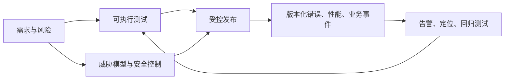

# 前端测试、安全与可观测性闭环

测试回答变更是否仍满足已知合同，安全控制限制不可信输入和跨边界行为，可观测性让线上故障可定位到版本、用户路径和影响范围。三者共同定义“发布后可以相信什么”，而不是三个彼此独立的工具清单。

## 前置知识与边界

- [Fetch、HTTP 方法、状态码与请求错误](../03-javascript/10-json-fetch-http-errors.md)
- [表单状态、校验、URL 与 Web Storage](../03-javascript/09-form-url-storage.md)
- [性能指标、真实用户数据与性能预算](../07-performance/01-performance-metrics-field-data.md)

前端可以验证渲染、交互、客户端数据和浏览器安全边界，但不能成为最终授权者。任何扣费、资源访问、角色判断、审计写入和数据不变量必须由受控服务端再次验证。

## 1. 一个发布闭环中的四种证据



测试是发布前的样本；遥测是发布后真实环境的样本。两者都需要上下文：没有 release 标识的错误无法判断是否由本次发布引入；没有用户状态和权限覆盖的 E2E 不能证明关键路径；只有“请求失败”而没有接口、状态和请求 ID 的日志无法定位责任边界。

## 2. 测试层次：按风险选择，而不是按金字塔背诵

| 层次 | 验证对象 | 适合发现 | 不应代替 |
| --- | --- | --- | --- |
| Unit | 纯函数、状态转换、边界格式化 | 分支、空值、错误映射 | 浏览器行为和真实集成 |
| Component | 可访问名称、事件、局部状态 | 表单提示、禁用态、键盘操作 | 服务端权限 |
| Integration | 多模块与真实/受控 HTTP | 缓存、路由、错误恢复 | 第三方生产稳定性 |
| E2E | 浏览器中的用户旅程 | 登录后路径、导航、上传、支付前确认 | 穷举所有数据组合 |
| Contract | 客户端与 API 的请求/响应合同 | 字段删除、枚举改变、错误形状 | 业务规则本身 |
| Visual regression | 固定状态截图或 DOM 视觉差异 | CSS 回归、字体/布局变化 | 语义和键盘可用性 |
| Accessibility/performance | 自动规则与性能预算 | 常见 ARIA、对比度、资源回归 | 人工辅助技术测试和真实用户指标 |

重复率低、影响高的路径优先写端到端测试，例如“有权限的用户提交订单”“无权限用户看不到导出且 API 被拒绝”“网络中断后草稿恢复”。只对实现细节断言会使重构代价过高；应优先断言用户可观察结果、网络合同和无障碍语义。

### 2.1 重试、隔离与 flake

重试只解决偶发基础设施波动，不能把稳定失败伪装为通过。测试框架的 retry 应记录首次失败、重试次数、trace 和环境；CI 持续出现重试通过的用例应进入待修队列。隔离意味着每个用例建立自身数据、会话和时间条件；共享账户、固定 sleep、依赖测试执行顺序都会制造 flake。

```ts
// 纯函数测试：输入、输出和失败状态都是合同。
type SaveState = 'idle' | 'saving' | 'saved' | 'failed';

export function nextSaveState(state: SaveState, event: 'START' | 'SUCCESS' | 'FAIL'): SaveState {
  if (state === 'idle' && event === 'START') return 'saving';
  if (state === 'saving' && event === 'SUCCESS') return 'saved';
  if (state === 'saving' && event === 'FAIL') return 'failed';
  return state;
}

if (nextSaveState('saving', 'FAIL') !== 'failed') throw new Error('state transition regression');
```

失败分支应同成功路径一样被覆盖。对“保存”功能至少验证：加载中不可重复提交、服务端 `409` 显示可操作提示、网络取消不显示伪成功、重新进入页面恢复服务器状态、无写权限时服务端拒绝而不是仅隐藏按钮。

## 3. 安全模型：输入、浏览器策略和服务端授权

### 3.1 XSS：按输出上下文处理不可信数据

XSS 的条件是攻击者控制的数据进入浏览器可执行上下文。框架默认的文本插值通常会转义 HTML，但 `innerHTML`、富文本渲染、动态 URL、内联事件处理器和“信任”API 是逃逸口。解决方案不是一个全局过滤函数，而是按上下文：文本节点使用安全 DOM API；URL 解析后仅允许预期协议和主机；确实要渲染用户 HTML 时使用经过维护的 sanitizer 和最小允许列表。

```ts
export function safeExternalUrl(value: string): string | null {
  const url = new URL(value, 'https://example.invalid');
  if (url.protocol !== 'https:' && url.protocol !== 'http:') return null;
  return url.href;
}

const target = safeExternalUrl('javascript:alert(1)');
if (target !== null) throw new Error('unsafe protocol accepted');
```

上例只说明链接协议验证；它不把任意 HTML 变安全。CSP 是纵深防御：用 nonce 或 hash 控制脚本来源，设置 `object-src 'none'`，使用 `frame-ancestors` 限制被嵌入；它不能替代上下文编码、输入结构校验和代码审查。`frame-ancestors` 是现代嵌入控制，不能仅依赖旧的 `X-Frame-Options`。

### 3.2 CSRF、Cookie、CORS 与 OAuth 的责任边界

CSRF 利用浏览器自动携带认证 cookie 的特性，让受害者浏览器向受信站点发送非本人意愿的状态变更请求。对 cookie 认证的状态变更请求，服务端应执行 CSRF token 或适当的 Origin/Referer、Fetch Metadata 校验；`SameSite` 是重要缓解层，但不应在复杂跨站、子域或兼容场景中被误当作唯一控制。

| 名称 | 实际作用 | 常见误解 |
| --- | --- | --- |
| `HttpOnly` cookie | 禁止 JavaScript 读取 cookie | 不阻止浏览器在请求中携带它，也不单独防 CSRF |
| `Secure` cookie | 仅在 HTTPS 请求中携带 | 不校验服务端身份或业务权限 |
| `SameSite` | 控制跨站请求的 cookie 发送条件 | 不等于所有 CSRF 场景均已消失 |
| CORS | 浏览器是否允许脚本读取跨源响应 | 不是 API 鉴权；服务端仍必须认证授权 |
| OAuth/OIDC | 委托授权与身份流程协议族 | 前端拿到 token 不等于可跳过服务端校验 |
| CSP | 限制资源加载与脚本执行的策略 | 不能修复注入漏洞根因 |

带凭证的 CORS 响应不能把 `Access-Control-Allow-Origin` 写成 `*`；服务端必须按精确可信 Origin 返回许可并验证认证和授权。token 放在何处是威胁模型选择：可由 JavaScript 读到的持久存储更容易受 XSS 影响；cookie 会引入 CSRF 设计要求。无论选择什么，令牌不进入 URL、错误报告、分析事件、source map 或前端日志。

开放重定向同样需要服务器端允许列表：前端可在导航前解析和限制目标，但攻击者可以直接调用服务端端点。点击劫持使用 `frame-ancestors` 或合适响应头限制 iframe；敏感操作额外采用再认证、明确确认和服务端审计，而不是指望 UI 遮罩层。

### 3.3 前端权限与后端鉴权不同

前端权限用于呈现合适界面和减少误操作。它不能阻止用户修改 DOM、调用 API 或复用请求。服务端在每次受保护操作中根据主体、资源和动作验证授权，并以拒绝结果作为真实边界。前端要测试两件不同的事：无权限 UI 的可理解反馈；无权限 API 的真实 `401/403` 与不泄露资源。

## 4. 案例一：导出报表的端到端、安全回归测试

### 输入与约束

报表页允许 `analyst` 导出自己组织的数据，`viewer` 只能查看。接口是 `POST /api/reports/:id/export`，以 HttpOnly session cookie 认证。风险包括：只隐藏按钮导致越权、CSRF、错误信息暴露、导出任务重复创建。

### 测试设计与处理

1. 测试环境通过服务端 fixture 建立两个组织、两种角色和一个报表；不要从 UI 逐层创建所有前置数据。
2. `analyst` 点击导出，断言按钮进入忙碌态、网络请求含 CSRF header、服务端返回任务 ID，完成后下载可见。
3. `viewer` 访问同一 URL，断言按钮不存在或禁用且说明原因；直接发 API 请求，断言 `403`，响应不含报表数据。
4. 缺失或无效 CSRF token 的请求断言 `403`/`400`；跨组织资源 ID 断言同样不可导出。
5. 双击和网络重放下，服务端 idempotency key 或任务去重保证只创建一个任务。

```ts
// 伪造浏览器 UI 不能证明授权；此测试直接验证服务端返回。
const response = await fetch('/api/reports/other-org-report/export', {
  method: 'POST',
  headers: { 'X-CSRF-Token': validToken }
});
if (response.status !== 403) throw new Error('cross-organization export must be denied');
```

### 验证与失败分支

将发布候选在浏览器中执行上述 E2E，并保存失败 trace、请求 ID 与 release。若 UI 测试通过而 API 测试失败，发布必须阻断：这是授权边界破坏。若 CSRF token 过期，UI 应提示刷新或重试，不应无限重放同一请求。若导出队列超时，事件记录应把用户操作、任务 ID 和后端 trace 关联，但不得记录 session、文件内容或全部查询条件中的个人数据。

## 5. 可观测性：事件模型先于 SDK

可观测性数据通常分为日志、指标、trace 和错误事件。前端还需要用户操作与业务事件，但它们不是任意埋点：每个事件都要有事件名、发生时刻、版本、匿名会话或受控用户标识、页面/路由、结果、关联 ID、数据分类和保留策略。

| 信号 | 适合回答 | 必填或常用维度 | 不应包含 |
| --- | --- | --- | --- |
| Runtime error | 哪个版本、哪个调用栈失败 | release、source map 版本、路由、请求 ID | token、密码、完整表单、未经处理 PII |
| API error | 哪个端点、状态码、是否可重试 | method、稳定错误码、耗时、trace/request ID | authorization、完整响应正文 |
| Web Vitals | 哪些页面/设备体验回归 | metric、value、路由、设备类别、release | 精确身份或敏感 URL query |
| business event | 漏斗在何处中断 | 事件版本、步骤、结果、功能开关 | 用事件代替审计账本 |
| trace | 一次前端操作关联哪些服务 | trace ID、span、采样标记 | 高基数用户输入与 secret |

错误聚合需要 fingerprint：相同根因应聚到同一问题，同时保留 release、浏览器、路由和操作面包屑用来切分。采样需要区分错误、性能和正常业务事件：把所有成功请求全量发送会产生成本与隐私风险；把所有错误随机丢弃又会漏掉低量高严重度问题。关键安全、计费和审计事件由服务端以专用通道记录，前端遥测只提供诊断线索。

```ts
type ClientEvent = {
  name: 'report_export_started' | 'report_export_failed';
  release: string;
  requestId?: string;
  reason?: 'forbidden' | 'network' | 'server';
};

export function sendEvent(event: ClientEvent) {
  const body = JSON.stringify(event);
  if (navigator.sendBeacon) return navigator.sendBeacon('/telemetry', body);
  return fetch('/telemetry', { method: 'POST', body, keepalive: true }).then(() => undefined);
}
```

该函数只表达传输方式。生产采集层还要进行 schema 校验、速率限制、用户同意/区域策略、字段脱敏、失败降级与后端认证；不能让任意页面把未验证 JSON 写进分析系统。

## 6. 案例二：用 release、source map 与 Trace 定位一次线上回归

### 现象和输入

发布 `web@2026.07.23.2` 后，错误平台出现 `TypeError: cannot read properties of undefined`，只发生在 `/checkout` 的 Safari 用户。错误事件包含压缩后的堆栈、release、路由、请求 ID 和匿名会话；source map 已在构建时上传到错误平台，且没有公开部署。

### 处理过程

1. 按 release 过滤，确认错误在新 release 首次出现且回滚版本无同类峰值。
2. source map 将压缩堆栈还原到 `applyCoupon` 的可读源码行，检查该行对应的 API response 字段。
3. 通过 request ID 关联服务端 trace，发现部分区域旧接口返回 `coupon: null`，而新前端假设对象存在。
4. 添加运行时 schema/空值分支，显示“优惠不可用”而非让结算页崩溃；同时修复服务端合同并增加 contract fixture。
5. 在 canary release 中观察错误率、结算成功率、INP 与 API `5xx`；达到阈值才扩大发布。

```ts
type CouponResponse = { coupon: { code: string; amount: number } | null };

export function couponLabel(response: CouponResponse): string {
  return response.coupon ? `${response.coupon.code}: -${response.coupon.amount}` : '优惠不可用';
}
```

### 失败处理和验证

若 source map 未匹配，先检查构建产物、release 名称和上传的 map 是否来自同一 commit；不要上传另一个版本的 map 来“解码”，那会制造错误定位。若遥测事件没有 request ID，则只能猜测前后端关联；应在网关或后端生成稳定 ID，并通过受控响应头暴露给前端。修复后新增 unit（`coupon: null`）、contract（旧响应）、E2E（结算可完成）和发布后告警阈值，防止同一根因再出现。

## 7. 安全和可观测性的常见失败

| 失败做法 | 为什么失败 | 修正 |
| --- | --- | --- |
| 用 DOM 隐藏代替授权 | 攻击者可直接发请求 | 服务端逐请求授权，前端只改善体验 |
| 只设置 CSP | 注入点仍存在，策略也可能过宽 | 上下文编码/安全 sink + CSP 纵深防御 |
| `Access-Control-Allow-Origin: *` 加 credentials | 浏览器规范不允许，且信任边界错误 | 精确 Origin、最小方法/头、服务端认证 |
| 把 token 写入 localStorage、URL 或错误日志 | XSS、历史、referrer、日志都会扩大泄露 | 按威胁模型选择存储；脱敏与禁止写入 |
| E2E 依赖 `sleep(2000)` | 环境波动导致 flake 或假通过 | 等待可观察的请求、元素状态或事件 |
| 全量采集所有事件 | 成本、高基数、隐私和噪声失控 | schema、采样、预算、保留期限与访问控制 |
| 用前端埋点做审计 | 用户可篡改、离线、被拦截 | 服务端记录可追责审计事件 |

## 8. 综合练习：为一个付款前确认页建立发布证据

完成一个“确认订阅”页面并交付以下证据：

1. Unit 测试覆盖金额格式、状态机的成功/失败/取消转移。
2. Component 测试验证错误提示的可访问名称、焦点和键盘恢复。
3. E2E 覆盖成功、网络失败、`409`、无权限与重复提交；不使用固定 sleep。
4. 服务端测试验证金额、产品、用户和幂等 key；前端不被视为授权者。
5. CSP、cookie、CSRF、CORS 和点击劫持策略有明确拥有者与测试环境验证。
6. 每个错误/性能/业务事件带 release 和受控关联 ID；字段清单经过隐私审查。
7. 发布后仪表板能回答：影响多少会话、从哪个版本开始、主要错误、关键转化是否下降、是否需要回滚。

验收：人为删除 CSRF header、模拟越权、注入不可信 URL、制造 `coupon: null` 与断网，测试或监控都能在预期层级发现；上线问题能在不暴露敏感数据的前提下关联到具体 release 和修复提交。

## 来源

- [OWASP：Cross Site Scripting Prevention Cheat Sheet](https://cheatsheetseries.owasp.org/cheatsheets/Cross_Site_Scripting_Prevention_Cheat_Sheet.html)（访问日期：2026-07-23）
- [OWASP：Cross-Site Request Forgery Prevention Cheat Sheet](https://cheatsheetseries.owasp.org/cheatsheets/Cross-Site_Request_Forgery_Prevention_Cheat_Sheet.html)（访问日期：2026-07-23）
- [OWASP：Content Security Policy Cheat Sheet](https://cheatsheetseries.owasp.org/cheatsheets/Content_Security_Policy_Cheat_Sheet.html)（访问日期：2026-07-23）
- [Playwright：Test retries](https://playwright.dev/docs/test-retries)（访问日期：2026-07-23）
- [web.dev：Web Vitals](https://web.dev/articles/vitals)（访问日期：2026-07-23）
