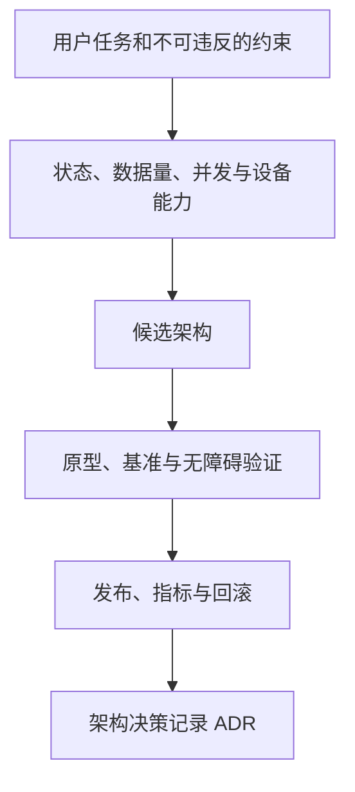
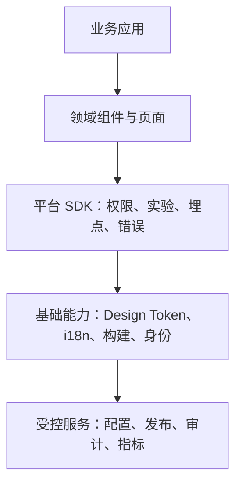
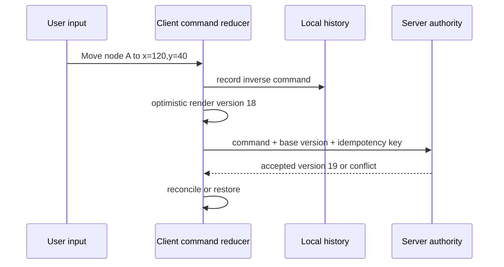
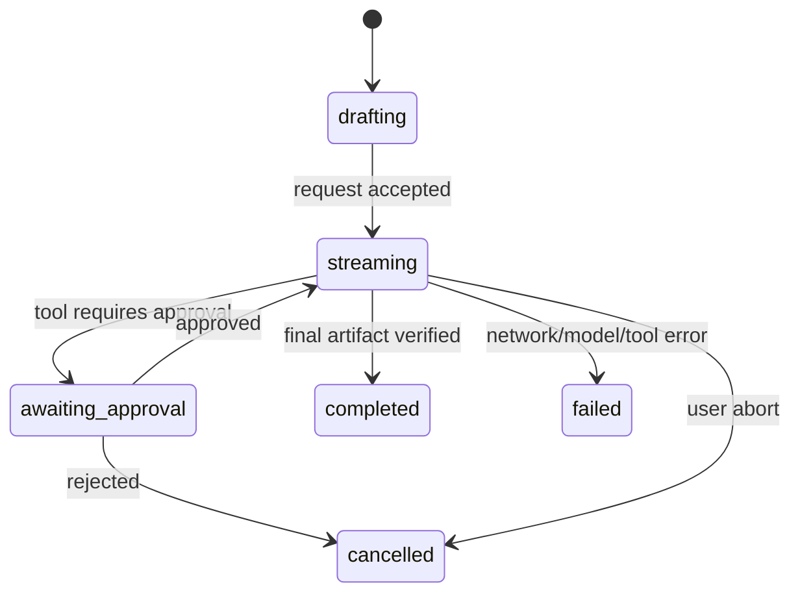

# 专家前端专项的架构选择：平台、复杂交互、AI 与 Web Platform

专家专项不是在技术名词中选一个“更高级”的标签，而是在明确的产品约束下选择架构：哪些状态必须正确、哪些计算不能阻塞主线程、哪些操作能撤销、哪些结果必须经过授权，以及在浏览器能力不具备时怎样安全降级。企业平台、复杂交互、AI Native 与 Web Platform 可以共享同一套选择方法。

## 前置知识与能力边界

- [State Machine 与 Context Boundary](../06-application-architecture/04-state-machine-context-boundary.md)
- [Streams、Structured Clone 与 Transferable Object](../03-javascript/17-streams-structured-clone-transfer.md)
- [Long Task 与 Layout Thrashing](../05-browser-runtime/09-long-task-layout-thrashing.md)
- [前端测试、安全与可观测性闭环](../09-quality-security-observability/01-frontend-quality-security-observability.md)

本文不把前端当作最终数据或权限真相。浏览器负责交互、局部状态、渐进渲染和受控设备能力；服务端负责认证、授权、持久化、协作顺序、模型/工具调用权限、审计和业务不变量。

## 1. 先写决策记录，再选择技术



每次选择至少写下：目标用户动作、正确性不变量、数据规模、延迟预算、离线/弱网行为、浏览器支持范围、无障碍等价操作、数据分级、服务端接口、观测指标以及退出方案。没有这些输入时，“Canvas 还是 DOM”“Worker 还是主线程”“Agent 还是工作流”都只是偏好。

| 约束 | 先问的问题 | 可能改变的选择 |
| --- | --- | --- |
| 正确性 | 是否需撤销、并发合并、审计、事务？ | 命令日志、服务端版本、CRDT/OT、幂等 key |
| 数据量 | 同屏节点、行数、绘制频率、内存上限？ | 虚拟化、Canvas/WebGL、Worker、分页 |
| 交互 | 需要键盘、指针、触屏、读屏等价路径吗？ | 原生控件、焦点模型、替代操作 |
| 安全 | 数据能否发给第三方模型/脚本/扩展？ | 数据最小化、代理、权限审批、CSP |
| 可用性 | 不支持的浏览器如何继续完成任务？ | 特性检测、降级 UI、服务器回退 |
| 运营 | 如何灰度、停止、回滚与定位？ | feature flag、release、事件 schema、kill switch |

## 2. 企业级前端平台：把重复约束做成可执行默认值

前端平台提供的是受约束的能力，而非一个收集组件的仓库。Design System、CLI、权限、国际化、埋点、监控、Feature Flag 和发布平台各有所有者，但应通过稳定 API、版本化配置和审计事件组合起来。

### 2.1 平台分层与责任



| 层 | 输入与输出 | 必须避免的边界错误 |
| --- | --- | --- |
| Design Token | 语义 token 输出 CSS/原生主题值 | 业务页面直接依赖某个色值，无法全局调整 |
| 组件库 | 稳定 props、语义、键盘行为 | 把业务权限、接口请求硬编码到基础组件 |
| 平台 SDK | 受控事件、flag、错误、身份上下文 | SDK 自行决定最终授权或保存 secret |
| 发布平台 | 制品、版本、环境、审批、回滚 | 用 mutable `latest` 覆盖不可追踪制品 |
| 规则与 CLI | 模板、迁移、检查报告 | 自动修改无法审查、没有 dry run 的用户代码 |

Feature flag 需要类型、默认值、所有者、到期日、目标人群与服务端判定位置。UI flag 可以控制实验展示；涉及价格、权限、合规或资源消耗的 flag 必须在服务端重复执行。flag 长期不清理会使组合爆炸，测试矩阵与代码分支都不可维护。

国际化不能只替换字符串。消息格式、复数、日期/数字、文本方向、长度扩张和语言回退要在组件 API 中被建模。用 `Intl` 等平台 API 格式化日期和货币，保留结构化值而非拼接显示字符串；翻译键稳定、带上下文，并禁止把用户输入当作富 HTML 插入。

## 3. 复杂交互工程：状态模型先于画布与拖拽

编辑器、白板、PDF 标注、大表格和可视化都需要回答相同问题：用户意图如何变成一个可验证命令？命令如何影响文档状态？网络失败、并发修改和撤销时如何恢复？DOM、Canvas 和 WebGPU 只决定呈现与计算位置，不替代状态模型。

### 3.1 命令、状态、历史与协作



命令的最小内容是目标、操作、参数、来源、时间和可关联 ID。撤销不是“回到上一个数组快照”这么简单：本地单人场景可存 inverse command；多人场景必须定义撤销的是“我上一次有效操作”还是“全局上一步”，以及远端编辑插入后如何解释。协作算法的选择（OT、CRDT 或服务端串行化）依赖文档类型、离线要求、冲突语义和存储成本；不能因为某个库流行就默认适用。

| 模型 | 适用条件 | 代价与边界 |
| --- | --- | --- |
| 服务端串行版本 | 低并发、必须强审计、允许冲突提示 | 弱网离线体验较差，冲突需要用户处理 |
| OT | 中心化文本协作、已有变换定义 | 变换正确性复杂，需要严格操作协议 |
| CRDT | 离线优先、多副本最终收敛 | 元数据、删除语义、存储压缩与权限撤销更复杂 |
| 本地命令历史 | 单人编辑、局部撤销 | 不解决跨客户端合并 |

### 3.2 DOM、Canvas、Worker 与 GPU 的选择

DOM 适合可访问语义、表单、文本选择和中等数量的交互节点；虚拟列表能控制大表格的已挂载 DOM 数量。Canvas 适合高频绘制与大量图元，但你需要自己实现命中测试、焦点、文本替代、缩放和键盘操作。WebGPU/WebGL 适合需要并行图形计算的高规模场景，增加设备兼容、着色器、资源生命周期和调试成本。Worker 适合可序列化的 CPU 密集任务；它不能直接操作 DOM。

OffscreenCanvas 可以把 Canvas 渲染从主线程移到 Worker，但仍需特性检测和回退。传输 `ArrayBuffer` 后原线程会失去该缓冲区所有权；共享内存需要更严格的跨源隔离和并发设计。不要把每一次指针移动都通过 `postMessage` 发送大对象；合并高频事件、传递紧凑数据并用帧节奏消费。

### 3.3 无障碍不是在 Canvas 外补一个 aria-label

所有鼠标/触屏功能必须有键盘等价路径。对排序列表，提供“选择项目—向上/向下移动—确认”的命令；对白板节点，提供对象列表、名称、位置/层级、可编辑属性和可见焦点；对图表提供摘要、数据表和可导航数据点。ARIA role 是行为承诺：给 `div` 设置 `role="button"` 不会自动拥有原生按钮的键盘行为、禁用语义或焦点管理。

## 4. 案例一：可撤销、可协作的大表格列重排

### 问题与约束

运营人员在 50,000 行虚拟表格中调整列顺序。多人可能同时编辑同一视图；每次更改要可撤销、可审计；鼠标拖拽不是唯一入口；弱网时允许本地预览但不能静默覆盖远端配置。

### 设计与处理

文档状态只保存列 ID 数组和服务器版本：`['name','status','owner']`。一次移动是 `moveColumn { id, beforeId, baseVersion, commandId }`，而不是把整个 50,000 行数据复制进历史。客户端先应用命令并保存 inverse（旧 `beforeId`），服务端按当前版本验证权限和列存在性；成功返回新版本，冲突返回当前顺序和冲突代码。

```ts
type ViewState = { columns: string[]; version: number };

export function moveBefore(state: ViewState, id: string, beforeId: string | null): ViewState {
  const rest = state.columns.filter((column) => column !== id);
  const index = beforeId === null ? rest.length : rest.indexOf(beforeId);
  if (index < 0) throw new Error('target column does not exist');
  return { ...state, columns: [...rest.slice(0, index), id, ...rest.slice(index)] };
}
```

视觉层用虚拟化只渲染可见行；列头仍使用真实 button 与可聚焦菜单。鼠标有 drag handle；键盘用户按“移动列”进入操作模式，以方向键选择目标、Enter 确认、Escape 取消，并用 live region 简短报告结果。读屏用户还可以在列菜单里选择“移到第 N 列”，不需要模拟拖拽。

### 验证与失败分支

1. reducer 测试验证移动到首尾、目标不存在和重复 ID。
2. E2E 验证鼠标、键盘和菜单三种路径产生相同命令。
3. 通过两名测试用户制造版本冲突，断言客户端展示“配置已更新，重新应用或放弃本次移动”，而不是覆盖远端。
4. Performance 面板确认滚动时不创建 50,000 个 DOM 节点；采集 INP 和长任务。
5. 断网时命令保留为 `pending`，恢复后带同一 `commandId` 重发；服务端按幂等性处理。

失败例子：若只把列顺序存入 localStorage，另一设备不会同步也无法审计；若把 drag 的最终像素位置作为协议，窗口大小和列宽变化会使操作不可重放。修复是传递稳定领域 ID 与意图，而非 DOM 或像素细节。

## 5. AI Native Frontend：流、证据、工具和审批状态

AI 界面不是“把 token 逐字显示”。它要把模型输出、外部工具、用户审批、长任务与最终可用制品表达为状态机。模型生成的文本、引用、参数和工具建议都是不可信候选；参数 schema 校验、授权、业务规则、费用上限和副作用控制必须在服务端或受控工具层执行。



| UI 对象 | 应包含的字段 | 不能假设的事 |
| --- | --- | --- |
| message delta | turn ID、序号、文本片段、状态 | 到达顺序永远完整或不会重复 |
| citation | 来源 ID、显示范围、可访问链接/摘要 | 引用自动支持旁边所有事实 |
| tool proposal | 工具名、结构化参数、风险、审批状态 | 模型有权限或参数合法 |
| artifact | 类型、版本、验证结果、下载/预览状态 | 文本生成成功就等于制品安全 |
| long task | 任务 ID、阶段、取消能力、最后心跳 | 请求连接仍在就一定活着 |

流式传输需要处理分片边界、重复连接、取消、最终状态和保存策略。客户端可用 `AbortController` 停止本次请求，但后端任务若已开始，仍必须由任务 API 处理取消或标记“取消请求已接受”。不要把模型输出直接当 HTML 插入 DOM；文本采用安全渲染，Markdown/富文本经过受控 parser 和 sanitizer，外部链接与附件按安全策略处理。

Memory 也不是自动累积聊天记录。定义哪些内容可保存、用户如何查看/删除、保留多久、是否进入后续模型上下文、是否跨工作区共享。敏感数据与第三方模型调用需要数据分类、用户同意、服务端代理和供应商边界说明。

## 6. 案例二：带审批的“生成并发送周报”任务

### 输入与边界

用户请求根据项目数据生成周报并发送邮件。模型可以提出“读取项目、生成草稿、发送邮件”三个步骤，但只有读取当前用户有权限的项目、生成草稿和用户明确批准后的发送可以执行。邮件发送是不可逆副作用，不能由模型文本中的一句“已发送”决定。

### 架构与处理

前端提交意图 `createWeeklyReport(projectId)`，服务端验证项目权限、创建任务并返回 `taskId`。任务流以结构化事件返回：`draft_delta`、`citation`、`tool_proposed`、`tool_result`、`requires_approval`、`completed`、`failed`。前端按 `taskId + sequence` 去重，持久化已确认事件，页面重开后从服务端读取权威任务状态。

```ts
type ToolProposal = {
  name: 'send_email';
  arguments: { reportId: string; recipients: string[] };
  approvalId: string;
};

export function canShowApproval(proposal: ToolProposal): boolean {
  return proposal.name === 'send_email'
    && proposal.arguments.reportId.length > 0
    && proposal.arguments.recipients.every((email) => email.includes('@'));
}
```

上例只是 UI 前置检查；服务端仍校验收件人、组织策略、报告归属和审批主体。批准请求包含 `approvalId` 和任务版本，以防用户在旧页面批准已经被替换的提案。批准后 UI 显示“发送中”，收到服务端邮件 provider 的受控结果才显示成功；超时显示可重试/查看任务，不谎称已发送。

### 验证与失败分支

1. 将事件分成任意大小 chunk，测试 parser 仍重建同一序列。
2. 重复 `sequence=12`，断言 UI 不重复插入正文或再次显示审批框。
3. 在审批框打开时让任务版本变化，断言批准被拒绝并刷新当前提案。
4. 无项目权限时任务创建直接失败；直接调用发送工具端点也被服务端拒绝。
5. 注入模型输出 ``，断言只以文本展示；注入不存在引用 ID，断言不渲染为可信来源。
6. 取消流后查询任务状态，确认是取消、已完成还是仍在执行，避免前端臆测。

失败例子：把 “tool call” 当作模型自带的授权能力，会让提示注入、越权上下文或参数幻觉触发副作用。修复是工具注册表、JSON/schema 校验、服务端授权、审批策略和审计日志的组合；模型只提出候选动作。

## 7. Web Platform：能力检测、隔离与渐进增强

WebAssembly、WebGPU、Worker、PWA、WebRTC 和浏览器扩展并不处于同一权限或兼容层。选择前先分辨“需要更快计算”“需要图形 GPU”“需要离线”“需要点对点通信”还是“需要浏览器外壳能力”。用 user-agent 判断浏览器型号不可靠；检测具体 API，处理权限/设备失败，并提供可完成核心任务的回退。

| 能力 | 合理用途 | 关键限制与验证 |
| --- | --- | --- |
| Web Worker | CPU 密集解析、布局计算、压缩 | 无 DOM；消息序列化、取消、错误通道需设计 |
| OffscreenCanvas | Worker 中 Canvas 渲染 | 需特性检测；仍需无障碍替代层 |
| WebAssembly | 重用已有计算核心、性能敏感算法 | 不是自动更快；JS/wasm 边界和内存传输有成本 |
| WebGPU | 图形/并行计算原型与高规模渲染 | 设备、驱动、权限与回退；不可作为唯一可达路径 |
| PWA/Service Worker | 离线外壳、缓存与安装体验 | 更新、缓存失效、离线写入冲突需明确 |
| WebRTC | 实时音视频或数据通道 | NAT、信令、TURN 成本、权限与录制策略 |
| Extension | 需要浏览器特权/页面集成 | 最小权限、内容脚本隔离、商店策略与升级审计 |

Worker 不是“自动更快”。小任务的消息复制成本可能超过计算收益；先在真实设备测量主线程长任务和 CPU 时间。PWA 缓存也不是离线数据库：对 HTML、JS、API 响应与用户草稿分别定义版本、过期、失效、存储配额、账号切换清理和冲突解决。WebRTC 仍需要信令服务，许多网络需要 TURN 中继；不要把它描述为无需服务器的实时方案。

## 8. 方案权衡与反例

| 候选 | 优先选择它的信号 | 不选择它的信号 |
| --- | --- | --- |
| Design System 平台 | 多应用重复出现 token、可访问组件、发布规范问题 | 只有一页、需求快速试错且维护者不稳定 |
| Canvas/图形渲染 | 图元很多、每帧绘制重、语义可由替代 UI 覆盖 | 表单/文本编辑/原生可访问语义是核心 |
| Worker | 真实 profile 显示 CPU 长任务且输入可结构化传递 | 工作很小、依赖 DOM、取消和错误协议没有设计 |
| CRDT | 离线多端同时编辑且最终收敛语义清晰 | 强顺序业务规则、权限撤销和存储预算无法承担 |
| Agent 任务 | 多步、不确定路径、可明确审批/工具边界 | 单一确定性 API 调用可直接由工作流完成 |
| WebGPU | 已验证的图形/计算瓶颈与可降级体验 | 仅为了“现代感”，没有设备回退和性能数据 |

复杂系统常见的错误是把呈现层选择当成架构。Canvas 白板没有操作协议，协作仍会丢修改；加入 AI streaming 没有任务状态，刷新页面就丢审批；使用 feature flag 没有清理策略，测试组合会失控；启用 service worker 没有版本策略，用户会永久运行旧页面。每项能力都要配套状态、权限、观测和回滚。

## 9. 综合练习：交付一个可灰度的协作 AI 白板

设计一个“团队白板可请求 AI 生成流程图”的小系统，提交以下产物：

1. ADR：说明 DOM/Canvas/Worker 选择、数据规模基准、浏览器回退和无障碍替代路径。
2. 文档命令协议：创建、移动、删除、撤销、远端合并和版本冲突的输入输出。
3. 键盘路径：对象列表、创建、移动、删除、撤销、焦点恢复和状态播报；不依赖鼠标拖拽。
4. AI 任务状态机：流式草稿、引用、工具提案、审批、取消、重连和最终制品验证。
5. 服务端控制：成员授权、工具 allowlist、参数 schema、速率/费用限制、审批与审计。
6. 发布控制：feature flag 目标人群、kill switch、release/trace/error/INP 指标和回滚条件。
7. 测试：命令 reducer、并发冲突、键盘 E2E、XSS 渲染、断网重连、无权限工具调用和低端设备性能。

验收：两个用户并发修改时不会静默覆盖；键盘用户能完成与鼠标相同的核心任务；模型建议不能绕过批准和服务端授权；不支持高级图形能力时仍能查看和编辑核心内容；一次错误能关联到任务、文档版本、release 和服务端 trace。

## 来源

- [MDN：OffscreenCanvas](https://developer.mozilla.org/en-US/docs/Web/API/OffscreenCanvas)（访问日期：2026-07-23）
- [W3C WAI：ARIA Authoring Practices Guide](https://www.w3.org/WAI/ARIA/apg/)（访问日期：2026-07-23）
- [W3C WAI：Using ARIA](https://www.w3.org/TR/using-aria/)（访问日期：2026-07-23）
- [MDN：Using Web Workers](https://developer.mozilla.org/en-US/docs/Web/API/Web_Workers_API/Using_web_workers)（访问日期：2026-07-23）
- [W3C：WebRTC](https://www.w3.org/TR/webrtc/)（访问日期：2026-07-23）
