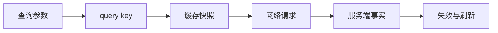

# Server State：缓存远端快照而不是复制数据库

Server State 是由远端系统拥有、客户端异步读取的快照。前端需要处理缓存身份、新鲜度、失效、并发、错误和乐观更新；它不能保证数据库事实永久不变。

## 前置知识与能力边界

- [单一职责与组合](01-single-responsibility-composition.md)
- [Controlled 与 Uncontrolled](02-controlled-uncontrolled.md)
- React State、Context、Effect 与 TypeScript 判别联合
- 浏览器事件、HTTP 和可访问性基础

本文以 HTTP 查询和 TanStack Query 的模型说明服务端状态；GraphQL 规范化缓存与离线同步只比较边界。

## 1. 定义、所有权与数据流

Server State 是由远端系统拥有、客户端异步读取的快照。前端需要处理缓存身份、新鲜度、失效、并发、错误和乐观更新；它不能保证数据库事实永久不变。



Server State 的权威写入者在远端。客户端保存的是按 query key 标识、带新鲜度和生命周期的快照；缓存更新只能改善体验，最终仍需 mutation 响应或重新获取完成对账。

## 2. 关键机制

### 2.1 所有权

服务端拥有事实与授权，客户端缓存只是带时间的观察。

若边界缺失，把缓存修改当作服务端已成功。

验证：在 mutation 成功后用响应或失效对账。

### 2.2 query key

完整、稳定、可序列化地描述资源和参数。

若边界缺失，漏掉筛选条件导致不同请求共用数据。

验证：测试每个输入变化都改变正确 key。

### 2.3 staleTime

决定缓存多久视为 fresh；fresh 不代表永远正确。

若边界缺失，把 staleTime 当缓存保留时长。

验证：模拟时间并观察是否触发后台刷新。

### 2.4 gcTime

无观察者的查询在一定时间后可回收；与 stale 独立。

若边界缺失，误以为 gcTime 控制重新请求。

验证：卸载订阅并检查缓存回收时间。

### 2.5 失效

业务事件使相关 query 变 stale，并在有观察者时重取。

若边界缺失，每次 mutation 清空全部缓存。

验证：按资源层级精确匹配 key。

### 2.6 请求去重

相同 key 的并发观察者共享在途 Promise。

若边界缺失，随机 key 破坏去重并增加流量。

验证：并行挂载组件时网络只出现一次请求。

### 2.7 取消与竞态

queryFn 接收 AbortSignal，参数变化时旧请求可取消。

若边界缺失，旧筛选响应覆盖新结果。

验证：延迟旧请求并断言 signal 被终止。

### 2.8 乐观更新

先快照旧缓存、应用预测、失败回滚、结束后对账。

若边界缺失，没有回滚导致假成功长期存在。

验证：注入 409 并比较回滚后的缓存。

### 2.9 错误分类

网络、认证、限流、校验和业务冲突使用不同恢复路径。

若边界缺失，对 4xx 自动重试放大负载。

验证：retry 函数按错误种类决策。

### 2.10 SSR hydration

服务端预取缓存脱水，客户端恢复并按新鲜度决定刷新。

若边界缺失，把敏感查询缓存序列化到 HTML。

验证：检查脱水内容和每请求 QueryClient 隔离。

## 3. Query key、新鲜度与回收不是同一件事

Query key 必须包含 queryFn 读取的每个变量。staleTime 决定快照多久视为 fresh；gcTime 决定无观察者缓存何时可回收。fresh 查询通常不会因挂载而重取，但它仍可能因服务端外部修改而过时。失效操作把匹配查询标记为 stale，并按观察者状态决定是否后台重取。

## 4. Mutation 的完整对账流程

1. 提交前取消会覆盖乐观结果的相关查询。

2. 保存旧缓存快照和服务端版本。

3. 只更新受影响 query key，保持对象身份结构共享。

4. 失败时按快照回滚；409 冲突不能伪装成网络重试。

5. settled 后使用 mutation 响应更新或精确失效，由服务端事实完成对账。

## 5. 应用案例一：商品列表筛选

1. 从规范化 URL 生成包含 category、sort、page 的 key。

2. queryFn 消费 AbortSignal，切换筛选时取消旧请求。

3. 设置与商品价格容忍度一致的 staleTime，不照搬全局常量。

4. 返回上一页验证缓存复用和后台刷新。

5. 故意从 key 删除 sort，契约测试应检测缓存串数据。

结果：切换筛选取消旧请求，返回上一页可复用缓存，并在过期后后台刷新。

失败分支：若 key 缺少 sort，两个排序会显示同一缓存，契约测试应直接暴露。

## 6. 应用案例二：乐观修改任务

1. onMutate 前取消任务列表查询并保存旧值。

2. 按 id 更新目标任务，其他对象保持引用。

3. 注入 500，回滚并显示可重试错误。

4. 注入 409，回滚并提示刷新版本，不自动重复写。

5. 成功后用服务端返回的 version 对账并精确失效详情。

结果：界面即时响应，同时最终以服务端返回版本对账。

失败分支：409 版本冲突不能简单重试，应回滚并提示重新加载。

## 7. TypeScript 核心实现

下面代码只实现本主题的核心契约；网络、DOM 或存储副作用留在调用边界。

```tsx
type Todo = { id: string; title: string; done: boolean; version: number };
const todoKeys = {
  all: ["todos"] as const,
  list: (filter: "all" | "open") => [...todoKeys.all, "list", filter] as const,
  detail: (id: string) => [...todoKeys.all, "detail", id] as const,
};

export async function fetchTodo(id: string, signal: AbortSignal): Promise<Todo> {
  const response = await fetch(`/api/todos/${encodeURIComponent(id)}`, { signal });
  if (!response.ok) throw new Error(`todo request failed: ${response.status}`);
  return response.json() as Promise<Todo>;
}
```

类型检查用于排除结构错误，运行时仍需校验外部输入、测试时序并执行安全约束。

## 8. 方案选择

| 方案 | 适用条件 | 成本与限制 |
|---|---|---|
| 手写 Effect | 一次性局部请求且无需缓存共享 | 需自行处理取消、竞态和缓存 |
| 查询缓存 | 多个组件共享、刷新和 mutation 对账 | 要设计 key、stale 和错误策略 |
| 规范化缓存 | 对象关系复杂且局部更新收益高 | 实体合并、版本和失效更复杂 |

选择应以所有权、生命周期、订阅范围和失败成本为依据。引入库不能替代这些判断；库只提供实现机制。

## 9. 调试与失败注入

| 现象 | 检查 | 修正 |
|---|---|---|
| 筛选串数据 | query key 是否含全部参数 | 建立 key factory |
| 频繁重取 | staleTime 是否保持默认 0 | 按业务容忍度设置 |
| 数据永久不刷新 | 是否使用 Infinity | 由事件失效或周期对账 |
| 乐观更新不回滚 | onMutate 是否保存快照 | 注入失败并恢复 |
| 登录用户串缓存 | QueryClient 是否跨会话共享 | 登出清理且 SSR 每请求创建 |
| 重试雪崩 | 是否重试所有错误 | 指数退避并尊重 Retry-After |
| 旧响应出现 | queryFn 是否消费 signal | 传递 AbortSignal |
| hydration 泄密 | 脱水是否含敏感数据 | 过滤查询并检查 HTML |

调试顺序是：确认输入事实，再检查所有者和转换，随后检查订阅与渲染，最后检查异步资源。跳过前序证据直接增加 Effect，通常会制造第二个状态源。

## 10. 性能、安全与运维边界

- staleTime 来自业务可容忍旧数据时长，不从统一常量拍脑袋。
- query key 不包含 token、函数或不稳定对象。
- 认证变化时清理或隔离用户缓存。
- mutation 使用服务端幂等键和版本控制。
- 重试设置上限、抖动并尊重限流信号。
- 记录缓存命中、请求次数、取消率、错误种类和刷新耗时。
- 离线恢复需定义冲突策略，不能默认最后写胜出。
- SSR 不共享带用户数据的全局 QueryClient。

生产验证至少记录一次正常路径和一次故障路径；对“Server State”的结论必须能关联到日志、Profile、网络记录或自动化测试。

## 11. 与其他架构模块集成

- URL State 负责查询参数，Server State 负责远端结果。
- Form State 保存未提交草稿，提交成功后使相关查询失效。
- Global State 只保存会话或选择，不复制查询实体。
- 统一请求层提供认证、错误归一和 trace id。

集成时先画出事实所有者，跨边界只传递稳定契约。不要为了减少一层调用而复制同一事实。

## 12. 综合练习

实现任务列表的分页筛选、详情预取、乐观完成、409 回滚、离线提示和缓存指标。

### 验收标准

- [ ] key 覆盖所有查询变量且不含 token。
- [ ] 演示取消旧请求与缓存复用。
- [ ] 乐观更新覆盖成功、500 回滚和409冲突。
- [ ] SSR 每请求创建独立 QueryClient。
- [ ] 记录请求放大率、取消率和缓存命中。

## 13. 并发更新与缓存一致性

同一实体可能同时出现在详情、多个筛选列表和汇总数字中。乐观更新前要明确哪些缓存是该字段的投影，不能只修改当前可见列表。

假设任务 `t-17` 同时出现在 `["todos","list","open"]` 和 `["todos","detail","t-17"]`：

1. `onMutate` 取消两个 key 的在途查询，避免旧响应立即覆盖预测值。
2. 保存两个 key 的旧快照，回滚时按原 key 恢复。
3. 对列表进行按 id 的不可变更新；不存在目标时不凭空插入。
4. 对详情应用相同字段变化，并保留其他字段引用。
5. mutation 响应带回新 `version` 后替换预测版本。
6. `onSettled` 精确失效详情与受影响列表，汇总查询按业务关系另行失效。

如果两个浏览器标签页基于 version 5 同时编辑，前端缓存无法决定谁获胜。服务端使用条件写入或版本字段返回 409，客户端回滚并呈现当前服务器值与用户意图。自动重放同一修改可能覆盖他人的变更，因此 409 不属于普通临时错误。

## 14. 新鲜度策略的计算输入

不同查询不能共享同一个没有业务依据的 `staleTime`：

| 数据 | 外部变化频率 | 用户可容忍旧值 | 建议触发 |
|---|---:|---:|---|
| 商品详情文案 | 低 | 数分钟 | 窗口重新聚焦或明确失效 |
| 库存可售数量 | 高 | 结算前必须重验 | 短 stale、提交时服务端校验 |
| 当前用户权限 | 中 | 权限收回需尽快生效 | 会话事件失效、敏感操作重验 |
| 历史账单 | 低 | 较长 | 新账单事件或手动刷新 |

`staleTime` 只改变客户端何时主动刷新，不改变授权、库存和金额的最终验证位置。即使缓存刚刚 fresh，服务端仍要拒绝已经撤销权限的操作。

调试时在查询开发工具和网络面板同时记录 key、dataUpdatedAt、fetchStatus、观察者数量与请求 ID。只看到组件 render 次数，无法判断是缓存命中、后台刷新还是重复 key。

在开发环境把网络切为 Slow 3G 后连续切换三个筛选，旧请求的 AbortSignal 应变为 aborted，缓存中只保留各自 key 的结果；这个记录同时验证取消与身份隔离。

## 来源

- [TanStack Query：Important Defaults](https://tanstack.com/query/latest/docs/framework/react/guides/important-defaults)（访问日期：2026-07-18）
- [TanStack Query：Query Keys](https://tanstack.com/query/latest/docs/framework/react/guides/query-keys)（访问日期：2026-07-18）
- [TanStack Query：Optimistic Updates](https://tanstack.com/query/latest/docs/framework/react/guides/optimistic-updates)（访问日期：2026-07-18）
- [TanStack Query：Query Cancellation](https://tanstack.com/query/latest/docs/framework/react/guides/query-cancellation)（访问日期：2026-07-18）
