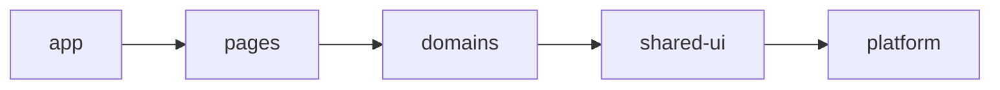

# 单向依赖规则：把架构方向变成可执行约束

单向依赖规则规定高层可以依赖哪些低层公开契约，并禁止反向和横向越界。方向必须由静态检查、包 exports 和构建图执行，不能只存在于架构图。

## 前置知识与能力边界

- [单一职责与组合](01-single-responsibility-composition.md)
- [Controlled 与 Uncontrolled](02-controlled-uncontrolled.md)
- React State、Context、Effect 与 TypeScript 判别联合
- 浏览器事件、HTTP 和可访问性基础

本文处理 TypeScript 前端模块依赖；运行时服务调用拓扑不在本文展开。

## 1. 定义、所有权与数据流

单向依赖规则规定高层可以依赖哪些低层公开契约，并禁止反向和横向越界。方向必须由静态检查、包 exports 和构建图执行，不能只存在于架构图。



单向依赖规则把允许的层间边写成可执行矩阵。检查器必须使用与 TypeScript 和 bundler 相同的路径解析，覆盖 type import、动态导入和测试文件，并在新增违规时让 CI 失败。

## 2. 关键机制

### 2.1 层级

每层有职责和允许下游。

若边界缺失，层名存在但无规则。

验证：依赖矩阵。

### 2.2 公开入口

跨边界仅从 index/package exports。

若边界缺失，深层导入锁目录。

验证：lint fixture。

### 2.3 类型依赖

type-only 仍是架构依赖，可能造成语义耦合。

若边界缺失，忽略类型边。

验证：图同时采集类型。

### 2.4 动态导入

字符串 import 同样需解析和约束。

若边界缺失，用 lazy 绕过规则。

验证：构建 metafile 检查。

### 2.5 别名

tsconfig path 与 bundler alias 保持一致。

若边界缺失，编辑器能编译但构建失败。

验证：多工具配置测试。

### 2.6 例外

例外有 owner、原因、期限。

若边界缺失，eslint-disable 永久化。

验证：CI 清单和到期失败。

### 2.7 协调层

双域用例放上层协调，不让两个域互导。

若边界缺失，互相回调形成环。

验证：提取 orchestration。

### 2.8 生成代码

生成客户端也放在基础设施边界。

若边界缺失，领域直接导入 OpenAPI 类型。

验证：DTO 映射。

### 2.9 测试

测试遵守生产边界，专用 helper 有明确层。

若边界缺失，测试工具成为后门。

验证：lint 包含测试文件。

### 2.10 反馈速度

本地 lint 快速，CI 运行全图与可视化。

若边界缺失，规则太慢被绕过。

验证：增量检查耗时。

## 3. 从矩阵生成可失败的规则

先把每个源文件映射为 app、pages、domains、shared、platform 之一，再解析 import 得到 from→to。矩阵允许 app 向下组合，禁止 platform 反向导入业务。跨领域只能走公开入口；同层并不自动允许互导。测试 fixture 各放一个允许边、反向边、深层导入、alias 导入和 type-only 边，证明 resolver 没有漏报。

## 4. 运行顺序与边界

1. 本地 ESLint 对当前文件快速反馈，错误包含来源层、目标层和允许方向。

2. CI 专用图工具解析全仓，输出完整边与强连通分量。

3. package exports 或 Nx tags 阻止绕过 index 深层导入。

4. 例外写入带 owner、ADR、到期日的清单；到期自动失败。

5. 构建 metafile 与静态图对照，动态 import 和条件 exports 不能成为盲点。

## 5. 应用案例一：五层后台

1. 给五层各创建最小 fixture 并验证全部允许边。

2. 在 platform 导入 domains，断言 lint 指向规则 ID。

3. 用 @/domains alias 重复违规，确保 tsconfig path 被解析。

4. 加入 import type，架构图仍报告语义耦合。

5. 新增规则只阻断新边，旧债按基线和期限清理。

结果：故意越界 import 在本地立即失败。

失败分支：若 alias 未解析，规则会漏报，需用真实 resolver。

## 6. 应用案例二：订单与库存协作

1. 订单与库存互导时先写出两个方向的业务原因。

2. 把 allocateOrder 上移 app/usecases，同时依赖两个端口。

3. 两个领域不再导入彼此 store 或内部类型。

4. 若共同值对象确实稳定，放入有 owner 的 shared kernel。

5. 运行 SCC 检查和用例测试，证明行为未丢失。

结果：订单与库存保持无环。

失败分支：把共享类型提到 shared 之前先确认它是否真是稳定内核。

## 7. TypeScript 核心实现

下面代码只实现本主题的核心契约；网络、DOM 或存储副作用留在调用边界。

```tsx
export const dependencyRules = {
  app: ["pages", "domains", "shared", "platform"],
  pages: ["domains", "shared", "platform"],
  domains: ["shared", "platform"],
  shared: ["platform"],
  platform: [],
} as const;
export type Layer = keyof typeof dependencyRules;
export function mayDepend(from: Layer, to: Layer): boolean {
  return (dependencyRules[from] as readonly string[]).includes(to);
}
```

类型检查用于排除结构错误，运行时仍需校验外部输入、测试时序并执行安全约束。

## 8. 方案选择

| 方案 | 适用条件 | 成本与限制 |
|---|---|---|
| 文档约定 | 探索期 | 无法阻止回归 |
| ESLint 边界 | 单仓 TypeScript 快反馈 | 需正确 resolver |
| 包级约束 | monorepo 与发布包 | 配置和构建成本更高 |

选择应以所有权、生命周期、订阅范围和失败成本为依据。引入库不能替代这些判断；库只提供实现机制。

## 9. 调试与失败注入

| 现象 | 检查 | 修正 |
|---|---|---|
| 规则漏报 alias | resolver 配置 | 用 fixture 验证 |
| type import 成后门 | 是否采集类型边 | 纳入图 |
| 大量 disable | 规则与现实脱节 | 限期例外 |
| 双域成环 | 缺协调层 | 上移用例 |
| 共享层膨胀 | 用它消环 | 重新判断所有权 |
| 动态 import 漏报 | 只扫描 AST 静态语法 | 结合 bundler graph |
| 测试越界 | 排除了 tests | 统一规则 |
| CI 太慢 | 全量分析 | 增量缓存 |

调试顺序是：确认输入事实，再检查所有者和转换，随后检查订阅与渲染，最后检查异步资源。跳过前序证据直接增加 Effect，通常会制造第二个状态源。

## 10. 性能、安全与运维边界

- 规则文件版本化。
- 例外必须自动过期。
- 包 exports 拒绝深层入口。
- 依赖图作为 CI artifact。
- 生产和测试统一边界。
- 构建器与 TS alias 一致。
- 监控边数量和环趋势。
- 迁移分阶段收紧。

生产验证至少记录一次正常路径和一次故障路径；对“单向依赖规则”的结论必须能关联到日志、Profile、网络记录或自动化测试。

## 11. 与其他架构模块集成

- 领域组织提供节点。
- ADR 解释规则例外。
- 循环检测提供全图证据。
- 第三方封装固定 platform 边界。

集成时先画出事实所有者，跨边界只传递稳定契约。不要为了减少一层调用而复制同一事实。

## 12. 综合练习

为五层项目实现依赖矩阵、lint fixture、例外到期和 CI 图，并修复三种越界。

### 验收标准

- [ ] 五层允许矩阵和同层规则均有 fixture。
- [ ] alias、type-only、动态导入与测试文件均被解析。
- [ ] 订单库存环通过上层协调器消除。
- [ ] 例外有 owner、ADR 与自动到期。
- [ ] CI 输出依赖图且新增违规失败。

## 12. Resolver 一致性验收

同一导入路径要由 TypeScript、ESLint、测试运行器和 Vite 解析到同一文件。为 `@domain/orders`、package exports、`.tsx` 扩展和条件入口建立 fixture；任何工具解析不同都阻断合并。

规则性能也需测量。记录冷启动全图、单文件增量与 CI 缓存命中时间。开发者为提速关闭规则会让架构约束失效；可把快速局部检查与较慢全图检查分层，而不是降低覆盖。

允许依赖不代表必须依赖。统计层间边数量、公开 API 数和例外年龄，持续增长通常说明边界过宽。

## 13. ESLint 与全图检查的分工

ESLint 在保存文件时检查当前 import，反馈快，但单文件规则未必能得到完整强连通分量。dependency-cruiser、Nx 或自定义图检查在 CI 分析全仓，适合报告 A→B→C→A 的完整路径。两者使用同一层级配置，避免本地允许而 CI 拒绝。

示例违规：

```text
src/platform/http/client.ts
  -> src/domains/orders/types.ts
```

错误应说明 `platform` 只提供基础能力，不能知道 `domains`；建议把 HTTP DTO 映射放到订单基础设施适配器，而不是只显示“restricted import”。

### 13.1 Type-only 依赖

`import type` 通常不会出现在运行时 bundle，但它仍让一个模块的编译契约依赖另一个模块。若 platform 引用 Order 类型，订单字段变化仍会迫使 platform 修改。因此运行时环检测可以忽略被擦除边，架构边界检查不能忽略。

### 13.2 动态导入

`import("./RefundPanel")` 改变加载时机和 chunk，不改变 RefundPanel 对其 imports 的语义依赖。规则应解析静态可知的动态 import；完全运行时拼接的路径需由 bundler 配置或显式注册表控制。

### 13.3 Barrel

模块外部从公开 index 导入，模块内部直接引用具体内部文件。内部从 index 回导会让 index 同时导出当前模块，容易形成环，也让重构工具难以判断真实方向。

## 14. 迁移已有越界

不要一次启用规则后加入几百条永久 disable。先生成基线，CI 只允许违规数量下降；给每组旧边分配 owner 和截止日期。修复顺序优先处理反向基础设施依赖、跨领域内部导入、再处理低风险深层导入。

每修复一条边运行模块用例测试和 bundle 检查。移动类型可能消除编译错误，却把大依赖引入公共 chunk；依赖正确性与加载性能需要分别验证。

## 15. 失败 fixture 清单

仓库保留一个不参与生产构建的架构 fixture 包：`platform-import-domain.ts`、`domain-deep-import.ts`、`alias-back-edge.ts`、`type-only-back-edge.ts` 和 `dynamic-back-edge.ts`。CI 逐个运行检查器并断言规则 ID、来源层和目标层。这样升级 ESLint、TypeScript resolver 或路径别名时，规则不会悄悄失效。

合法 fixture 同样重要：domain 导入 shared value object、page 导入 domain 公开入口、app 动态导入 page 应通过。只有失败样本会让过宽规则误伤合法开发。

规则报错后的修正优先改变所有权与协调位置。把 import 改为事件、回调或运行时注册表但仍保持双向业务知识，只是隐藏静态边；评审需要检查新协议是否真正单向。

对 monorepo 还要同时检查 package dependency 与源码 import。源码没有越界但 `package.json` 把 domain 声明为 platform 的 dependency，安装和发布图仍然反向。Project References 的 `references`、workspace package 依赖和构建任务图应与源码方向一致。CI 分别输出 package 图与文件图，不能用其中一个代替另一个。

浏览器 bundle 的 chunk 边不等于源码架构边：bundler 可能把共享依赖抽到公共 chunk。评审关注是谁在源码语义上依赖谁，同时用 bundle 图检查该选择的加载成本。

## 来源

- [TypeScript：Project References](https://www.typescriptlang.org/docs/handbook/project-references.html)（访问日期：2026-07-18）
- [ESLint：Configure Rules](https://eslint.org/docs/latest/use/configure/rules)（访问日期：2026-07-18）
- [Node.js：exports](https://nodejs.org/api/packages.html#exports)（访问日期：2026-07-18）
- [Nx：Enforce Module Boundaries](https://nx.dev/features/enforce-module-boundaries)（访问日期：2026-07-18）
