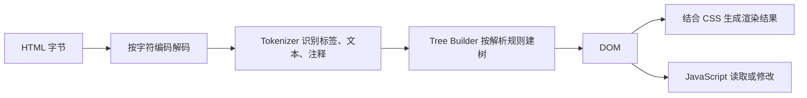
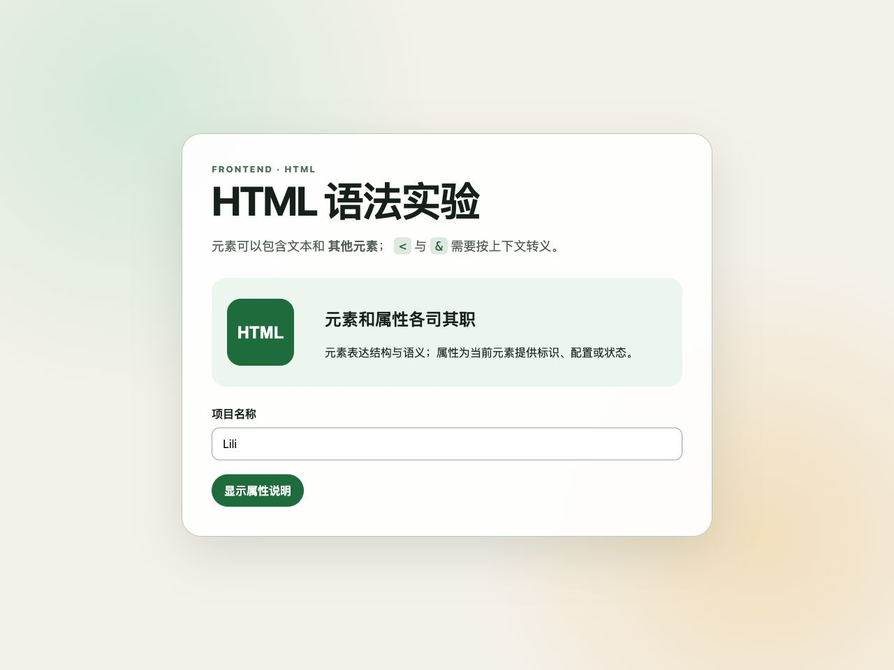

# HTML 基础语法：从源代码到 DOM

HTML（HyperText Markup Language）用于描述 Web 文档的内容和结构。浏览器不会把 HTML 源文件直接画到屏幕上，而是先解析字符，生成 DOM（Document Object Model）树，再结合 CSS、字体、图片和脚本完成渲染。

本文只讨论 HTML 语法本身：文档骨架、元素、标签、属性、嵌套、空元素、注释、空白和字符引用。具体元素的完整用法会在后续笔记中分别展开。

## 1. HTML 在浏览器中怎样生效

HTML 文件是文本。浏览器接收字节后，需要依次完成解码、分词和建树。DOM 才是 JavaScript 实际操作的对象，也是开发者工具 Elements 面板展示的结构。



这个过程带来三个直接结论：

1. 源码、DOM 和最终画面不是同一个东西。
2. 错误 HTML 往往不会使浏览器停止，而会触发标准定义的错误恢复规则。
3. 页面“看起来正常”不能证明 HTML 正确；结构、语义和可访问性仍可能有问题。

## 2. 最小完整文档

```html
<!doctype html>
<html lang="zh-CN">
  <head>
    <meta charset="utf-8">
    <meta name="viewport" content="width=device-width, initial-scale=1">
    <title>HTML 语法练习</title>
  </head>
  <body>
    <h1>HTML 语法练习</h1>
    <p>这是页面内容。</p>
  </body>
</html>
```

逐项说明：

| 代码 | 作用 | 必须注意 |
| --- | --- | --- |
| `<!doctype html>` | 让浏览器按标准模式解析文档 | 它是 doctype，不是 HTML 元素；应放在文档开头 |
| `<html>` | 文档根元素 | 一个文档只有一个根 `html` 元素 |
| `lang="zh-CN"` | 声明页面主要语言 | 帮助屏幕阅读器选择发音规则，也供翻译、拼写检查等功能使用 |
| `<head>` | 保存标题、编码、样式表链接等文档元数据 | 其中大部分内容不会作为页面正文显示 |
| `<meta charset="utf-8">` | 声明字符编码 | 应尽早出现；服务器的 HTTP `Content-Type` 也可能提供编码信息 |
| viewport `meta` | 让移动设备按设备宽度建立布局视口 | 它不是响应式设计的全部，只是常用基础配置 |
| `<title>` | 文档标题 | 常用于浏览器标签、书签和搜索结果候选标题；不同于正文里的 `h1` |
| `<body>` | 文档正文 | 页面内容通常放在这里 |

HTML 标签名在 HTML 语法中不区分 ASCII 大小写，但统一使用小写更容易阅读和维护。SVG、MathML 以及 XML/XHTML 的规则不能直接照搬这一点。

## 3. 元素、标签和内容不是同一个概念

以下代码表示一个 `p` 元素：

```html
<p class="summary">正在学习 <strong>HTML</strong> 语法。</p>
```

```text
┌────────────── p 元素 ──────────────┐
│ <p class="summary">              │ ← 开始标签
│ 正在学习                           │ ← 文本节点
│ <strong>HTML</strong>              │ ← 子元素
│ 语法。                             │ ← 文本节点
│ </p>                               │ ← 结束标签
└────────────────────────────────────┘
```

- 元素是 DOM 中的结构对象，包含开始标签、内容和结束标签；空元素除外。
- 开始标签用于写元素名和属性，例如 `<p class="summary">`。
- 结束标签以 `/` 开头，不能写属性，例如 `</p>`。
- 内容可以是文本、字符引用、注释或其他元素。
- 标签只是源代码中的语法标记，不等于完整元素。

不要把 HTML 元素称为“HTML 标签”来描述所有情况。讨论源码标记时可以说标签；讨论 DOM、父子关系、属性和语义时应说元素。

## 4. 普通元素、空元素和可省略标签

### 4.1 普通元素

普通元素可以有内容，通常同时写开始标签和结束标签：

```html
<button type="button">保存</button>
<section>
  <h2>账户设置</h2>
  <p>修改登录信息。</p>
</section>
```

即使某些结束标签在特定上下文中允许省略，项目代码也建议显式写出，以降低阅读和生成模板时的歧义。

### 4.2 空元素

空元素（void element）由规范规定不能包含子节点，因此没有结束标签。常见空元素如下：

| 元素 | 主要用途 | 常用专属属性示例 |
| --- | --- | --- |
| `area` | 图片热点区域 | `alt`、`coords`、`href`、`shape` |
| `base` | 文档相对 URL 和默认链接目标的基准 | `href`、`target` |
| `br` | 文本内部的必要换行 | 通常不需要专属属性 |
| `col` | 表格列的属性定义 | `span` |
| `embed` | 嵌入外部内容 | `src`、`type`、`width`、`height` |
| `hr` | 段落级主题转换 | 通常通过 CSS 控制外观 |
| `img` | 图片 | `src`、`alt`、`width`、`height`、`loading` |
| `input` | 表单输入控件 | `type`、`name`、`value`、`required` 等 |
| `link` | 当前文档与外部资源的关系 | `rel`、`href`、`as`、`media` 等 |
| `meta` | 文档元数据 | `charset`、`name`、`content`、`http-equiv` |
| `source` | 图片、音频或视频候选资源 | `src`、`srcset`、`sizes`、`type`、`media` |
| `track` | 视频或音频的文本轨道 | `src`、`kind`、`srclang`、`label` |
| `wbr` | 浏览器可以换行的位置 | 通常不需要专属属性 |

正确：

```html

<input type="email" name="email" required>
```

HTML 中的 `` 末尾斜杠不会让元素“更加自闭合”；解析器会忽略这个斜杠。为了避免与 XML 规则混淆，本项目统一写成 ``。

### 4.3 普通元素不能用 `/>` 自闭合

```html
<!-- 错误理解：这不会创建一个已经闭合的 div -->
<div />后面的文本
```

在 HTML 解析中，`div` 不是空元素。上面的 `/` 不会产生 XML 式自闭合效果，后续内容可能成为 `div` 的子节点，直到解析规则遇到能够结束它的位置。

### 4.4 可省略标签不等于元素不存在

规范允许某些元素在特定条件下省略开始或结束标签，例如 `html`、`head`、`body`、`li`、`p` 的部分标签。解析器仍会在 DOM 中创建这些元素。

```html
<ul>
  <li>第一项
  <li>第二项
</ul>
```

这段源码可以形成两个 `li` 元素，但显式写 `</li>` 更适合教学、协作、代码生成和检查结构。

## 5. 属性：元素的配置和状态

属性写在开始标签中：

```html
<a class="external-link" href="https://example.com" target="_blank">
  示例网站
</a>
```

属性包含名称和可选值：

```text
<a class="external-link" href="https://example.com">
   └─┬─┘ └─────┬──────┘
   属性名      属性值
```

### 5.1 基本语法规则

- 属性之间必须由一个或多个空白字符分隔。
- 同一个开始标签中不能出现两个同名属性。
- 属性顺序通常不改变语义，但团队应保持稳定顺序便于审查。
- 属性名在 HTML 元素上通常按 ASCII 大小写不敏感处理，项目中统一使用小写。
- 属性值在 DOM 中通常以字符串暴露，但浏览器会按属性定义解释它。
- 属性只能写在开始标签，不能写在结束标签。

错误示例：

```html
<!-- 缺少属性间空格 -->
<input type="text"name="nickname">

<!-- 重复属性是语法错误；不要依赖浏览器保留哪一个 -->
<button type="button" class="primary" class="large">保存</button>

<!-- 结束标签不能有属性 -->
<p>内容</p class="summary">
```

### 5.2 属性值的三种写法

```html
<input disabled>                 <!-- 空属性语法 -->
<input type=email>               <!-- 不加引号 -->
<input type="email">            <!-- 双引号 -->
<input type='email'>             <!-- 单引号 -->
```

不加引号的属性值不能包含空白、引号、反引号、`=`、`<`、`>` 等字符，修改时很容易越过边界。本项目统一使用双引号；在双引号属性值中需要写双引号时使用 `&quot;`，或在非常局部的场景改用单引号。

```html
<button aria-label="删除 &quot;草稿 1&quot;">删除</button>
```

### 5.3 布尔属性

布尔属性用“是否存在”表达真假。出现就是真，缺失就是假；字符串内容不是 JavaScript 布尔值。

```html
<button disabled>不能点击</button>
<button disabled="">仍然不能点击</button>
<button disabled="disabled">仍然不能点击</button>
<button disabled="false">仍然不能点击</button>
<button>可以点击</button>
```

常见布尔属性包括 `disabled`、`required`、`checked`、`selected`、`multiple`、`readonly`、`autofocus`、`inert` 和 `open`。它们并非可以放在任意元素上；每个属性都有允许使用的元素和语义。

`hidden` 经常被旧教程归入布尔属性，但当前 HTML Living Standard 将它定义为枚举属性。空值、`hidden` 关键字和无效值进入 Hidden 状态，`until-found` 进入 Hidden Until Found 状态。因此 `hidden="false"` 确实仍会隐藏，但应解释为 `false` 是无效关键字并回落到 Hidden 状态，而不是把 `hidden` 当作普通布尔属性。

JavaScript 中应通过属性或对应 DOM 属性修改状态：

```js
const button = document.querySelector("button");
button.disabled = false;              // 推荐：修改 DOM 属性
button.removeAttribute("disabled");  // 也可以：删除 HTML 属性
```

不要用 `setAttribute("disabled", "false")` 取消禁用，因为这仍然保留了属性。

### 5.4 枚举属性

枚举属性从有限关键字中选择状态，但它不是布尔属性。例如 `contenteditable`、`dir`、`draggable`、`spellcheck` 和 `translate` 都有各自的关键字、缺失值默认值和无效值默认值。

```html
<p dir="rtl">مرحبا</p>
<div contenteditable="plaintext-only">这里只编辑纯文本</div>
<p translate="no">Lili</p>
```

不能把所有枚举属性都按 JavaScript 的 `true/false` 处理。必须查看具体属性允许的关键字以及继承规则。

### 5.5 数字、URL 和列表属性仍是文本语法

```html

<a href="/docs/index.html#syntax">查看语法文档</a>
<div class="card featured compact">...</div>
```

- `width="640"` 在源码里是文本，元素定义决定它被解释为非负整数。
- `href`、`src` 会相对文档的基准 URL 解析，不只是普通字符串拼接。
- `class` 是由空白分隔的 token 集合，不是一个不可拆分的名字。
- 无效属性值可能触发默认值、忽略行为或错误状态，具体取决于属性定义。

## 6. 全局属性和元素专属属性

全局属性可以出现在所有 HTML 元素上，但“语法允许”不等于“放在哪里都有实际效果”。元素专属属性只对指定元素或元素类别有定义。

### 6.1 基础阶段必须掌握的全局属性

| 属性 | 做什么 | 典型用法 | 特殊规则和边界 |
| --- | --- | --- | --- |
| `id` | 为元素提供文档内标识 | 锚点、标签关联、DOM 查询 | 值不能含 ASCII 空白；页面内应唯一；不要把易变业务数据直接当 `id` |
| `class` | 给元素分配一个或多个分类 token | CSS 选择、JS 批量查询 | 多个类以空白分隔；类名顺序通常不表达优先级 |
| `style` | 写元素的行内 CSS 声明 | 动态几何值、局部实验 | 可维护性差；普通样式优先放样式表；受 CSP 等安全策略影响 |
| `title` | 提供咨询性信息 | 补充说明 | 不能作为关键操作说明；触屏和键盘用户不一定能可靠获得浏览器 tooltip |
| `lang` | 声明元素内容语言 | `<html lang="zh-CN">`、局部外语片段 | 会继承；值使用有效 BCP 47 语言标签；空字符串表示语言未知 |
| `dir` | 指定文本方向 | `ltr`、`rtl`、`auto` | 语义方向优先用该属性，不要只用 CSS `direction`；会影响双向文本算法 |
| `hidden` | 表示内容当前不相关，或在浏览器“在页面中查找”等功能发现前保持隐藏 | 条件区域、可搜索的折叠内容 | 当前规范中是枚举属性：Hidden 状态与 `until-found` 状态；`hidden="false"` 的 `false` 是无效关键字，仍回落到 Hidden 状态；CSS 可以覆盖部分默认表现，但会造成语义与视觉不一致 |
| `inert` | 使子树不可聚焦、不可点击且通常不进入无障碍树 | 打开模态框时隔离背景 | 不等于只加 `pointer-events: none`；仍要正确管理对话框焦点和关闭流程 |
| `tabindex` | 控制元素能否通过脚本/顺序焦点获得焦点 | `0` 加入自然顺序，`-1` 仅程序聚焦 | 避免正数，它会制造难维护的自定义顺序；不要给非交互元素伪造按钮行为 |
| `data-*` | 保存页面或组件需要的自定义字符串数据 | `data-user-id="42"` | 可通过 `element.dataset.userId` 读取；不是私密存储；不要塞入大型 JSON 或敏感数据 |
| `contenteditable` | 使内容可编辑 | 富文本或纯文本编辑区域 | 是枚举属性；需要处理粘贴、选区、输入法、撤销、清洗和无障碍，不适合代替普通输入框 |
| `draggable` | 控制原生拖放 | 可拖动项目 | 是枚举属性，不是布尔属性；触屏和键盘需要替代操作方式 |
| `spellcheck` | 提示浏览器是否检查拼写 | 编辑器、文本输入 | 是枚举属性；结果取决于浏览器、语言和用户设置，不能保证一定检查 |
| `autocorrect` | 控制可编辑文本是否启用浏览器/系统自动纠错 | 人名字段关闭纠错、正文编辑器开启纠错 | 是枚举属性；截至 2026 年仍不是 Baseline；`email`、`url`、`password` 等输入类型不启用；纠错实现取决于浏览器和操作系统 |
| `writingsuggestions` | 控制浏览器提供的续写建议 | 网站自带建议系统时关闭浏览器建议 | 使用 `true` / `false`；截至 2026 年属于有限可用能力，必须做特性检测和无该能力时的正常降级 |
| `translate` | 指示内容及可翻译属性是否应被翻译 | 品牌名、代码标识 | 使用 `yes` 或 `no`；它是给翻译系统的语义提示，不是安全控制 |
| `inputmode` | 提示虚拟键盘类型 | 数字、邮箱、搜索输入 | 不执行数据校验；仍需使用正确 `type` 和业务校验 |
| `enterkeyhint` | 提示虚拟键盘回车键标签/动作 | `search`、`next`、`done` | 只影响输入体验，不会自动提交、跳转或搜索 |
| `autocapitalize` | 提示自动大小写行为 | 人名、句子、关闭自动大写 | 主要影响虚拟键盘；支持和实际行为取决于平台 |
| `autofocus` | 页面加载或对话框打开时请求焦点 | 少数明确的单任务界面 | 是布尔属性；可能抢走用户当前位置并触发移动键盘，应谨慎使用 |
| `popover` | 把元素声明为 popover | 菜单、非模态提示层 | 有 `auto`、`manual`、`hint` 状态；还需触发器、焦点、关闭和兼容性设计 |
| `slot` | 把节点分配给 Web Component 的命名插槽 | 自定义元素内容分发 | 只在对应 Shadow DOM 插槽存在时有意义 |
| `nonce` | 为 CSP 允许的内联脚本或样式提供一次性值 | 严格 CSP 页面 | 必须由服务端为每次响应生成不可预测值；不能硬编码、复用或暴露给不可信代码 |
| `accesskey` | 给元素声明由浏览器组合键触发的字符 | 极少数受控内部工具 | 操作系统、浏览器和辅助技术的组合键不同且容易冲突；必须显示说明并提供普通操作路径 |
| `headingoffset` | 为元素子树中的标题级别提供偏移 | 嵌入式内容、组件内部标题映射 | 取值限制为 `0`–`8`；这是 2026 Living Standard 已列出的新属性，浏览器支持仍有限，不能用它替代正确源码标题层级 |
| `headingreset` | 重置祖先建立的标题偏移 | 嵌套组件需要独立标题计算时 | 是布尔属性；与 `headingoffset` 同属新机制，使用前必须检查目标浏览器支持和无支持时的语义结果 |
| `is` | 请求把内置元素升级为 customized built-in element | `<button is="x-special-button">` | 依赖 Custom Elements 注册和浏览器支持；Safari 等兼容性限制使它不适合作为无降级方案的通用基础能力 |

以下几组也属于全局机制，但应在相关专题深入：

- `role` 和 `aria-*`：为无障碍语义和状态服务，不能随意覆盖原生元素语义。
- `itemid`、`itemprop`、`itemref`、`itemscope`、`itemtype`：Microdata。
- `part`、`exportparts`：Shadow DOM 外部样式接口。
- `slot`：由 DOM/Shadow DOM 定义的内容分发接口。

MDN 还会列出由其他规范或特定实现提供的 global attributes，例如 `part`、`exportparts`、`virtualkeyboardpolicy`。因此“HTML Living Standard 当前列出的属性”和“浏览器参考页收录的所有属性”可能不是完全相同的集合；使用非 Baseline 能力前必须查看兼容性，而不是只看属性是否出现在参考列表中。

### 6.2 元素专属属性

元素专属属性由元素的功能决定：

```html
<a href="/pricing" target="_self">价格</a>

<input type="email" name="email" autocomplete="email" required>
<button type="submit" name="action" value="save">保存</button>
```

| 元素 | 属性 | 作用 |
| --- | --- | --- |
| `a` | `href` | 链接目标；没有 `href` 的 `a` 不具备普通超链接行为 |
| `a` | `target` | 选择浏览上下文，例如当前页 `_self` 或新上下文 `_blank` |
| `img` | `src` | 图片资源 URL |
| `img` | `alt` | 图片的文本替代；写法取决于图片在当前上下文中的功能 |
| `img` | `loading` | 提示立即加载还是延迟加载 |
| `input` | `type` | 决定控件类型、键盘提示和部分校验行为 |
| `input` | `name` | 表单提交时的字段名 |
| `input` | `required` | 要求控件在约束校验中具有值 |
| `button` | `type` | `submit`、`reset` 或 `button`；表单内应显式写，避免意外提交 |

不能因为某个属性“在 DOM 中能看到”就认为它对任意元素有效。例如 `<div href="/docs">` 会保留一个名为 `href` 的属性，但不会使 `div` 获得链接语义和键盘行为。

## 7. 属性和 DOM Property 的区别

HTML attribute 是标记中的初始配置；DOM property 是 JavaScript 对象当前暴露的状态。两者经常相互反映，但不是永远一一等价。

```html
<input id="nickname" value="初始值">
```

```js
const input = document.querySelector("#nickname");

console.log(input.getAttribute("value")); // 初始标记值："初始值"
console.log(input.value);                 // 控件当前值

input.value = "用户修改后的值";

console.log(input.getAttribute("value")); // 通常仍是 "初始值"
console.log(input.value);                 // "用户修改后的值"
```

表单控件尤其需要区分默认值和当前值；布尔状态还常见 `checked/defaultChecked`、`selected/defaultSelected` 等对应关系。实际行为应查具体 DOM 接口，而不是推断所有属性都同步。

## 8. 嵌套、父子关系和内容模型

HTML 元素构成树。每个元素对允许出现的父元素和子内容都有约束，这套约束称为内容模型。

```html
<article>
  <h2>发布说明</h2>
  <p>本次更新修复了 <strong>登录错误</strong>。</p>
</article>
```

```text
article
├── h2
│   └── "发布说明"
└── p
    ├── "本次更新修复了 "
    ├── strong
    │   └── "登录错误"
    └── "。"
```

### 8.1 按后进先出闭合

正确：

```html
<p>请阅读 <strong>服务条款</strong>。</p>
```

错误：

```html
<p>请阅读 <strong>服务条款</p></strong>
```

可以把未闭合元素看作一组栈状态：最后开始的元素应最先结束。浏览器会尝试修复错误嵌套，但生成结果未必等于作者意图。

### 8.2 不能只检查闭合顺序

闭合顺序正确也可能违反内容模型：

```html
<!-- 错误：ul 的直接列表内容应由 li 表达 -->
<ul>
  <p>第一项</p>
</ul>

<!-- 错误：交互元素通常不能这样嵌套 -->
<button type="button">
  <a href="/details">查看详情</a>
</button>
```

应改为：

```html
<ul>
  <li>第一项</li>
</ul>

<a class="button" href="/details">查看详情</a>
```

第二段是否使用链接还是按钮，应由行为决定：导航到 URL 使用链接，触发当前页面操作使用按钮。

### 8.3 浏览器修复会改变 DOM

```html
<p>段落开始<div>块级内容</div>段落结束</p>
```

浏览器解析到 `div` 时会隐式结束前面的 `p`。因此 DevTools 中看到的 DOM 可能近似为：

```html
<p>段落开始</p>
<div>块级内容</div>
段落结束
<p></p>
```

具体树由 HTML 解析算法和上下文决定。不要依赖错误恢复来组织页面。

## 9. 注释不是秘密存储

```html
<!-- 说明：价格由服务端返回 -->
<p>价格：¥99</p>
```

注释以 `<!--` 开始、以 `-->` 结束。它不会作为普通文本渲染，但会随 HTML 下载，用户可以在查看源代码或开发者工具中看到。

不要在注释中保存：

- 密码、API Key、Token 或内部地址；
- 尚未公开的业务信息；
- 依赖注释隐藏的旧代码；
- 用于条件执行的关键配置。

HTML 注释不能任意嵌套。构建工具、服务端模板和前端框架还可能拥有自己的注释或编译语法，应与最终输出的 HTML 注释区分。

## 10. 空白字符怎样处理

在普通 HTML 文本中，连续的空格、制表符和换行通常会在渲染时折叠为一个空格：

```html
<p>这里有
    很多空白，
但通常显示为连续文本。</p>
```

不要使用大量空格、`&nbsp;` 或重复 `br` 完成页面布局。布局和间距交给 CSS。

空白仍可能影响：

- 行内元素之间是否出现一个可见空格；
- `pre`、`textarea` 等保留空白的元素；
- CSS `white-space` 的处理；
- JavaScript 读取到的文本节点；
- 源码格式化和快照测试。

## 11. 字符引用与转义

当字符会被解析为 HTML 语法，或难以直接输入时，可以使用字符引用。

| 目标字符 | 命名引用 | 数字引用 | 常见场景 |
| --- | --- | --- | --- |
| `<` | `&lt;` | `&#60;` | 在正文展示标签文本 |
| `>` | `&gt;` | `&#62;` | 与 `<` 配对展示；普通文本中通常不会单独造成开始标签 |
| `&` | `&amp;` | `&#38;` | 避免被当作字符引用开头 |
| `"` | `&quot;` | `&#34;` | 双引号属性值内部 |
| `'` | `&apos;` | `&#39;` | 单引号属性值内部 |
| 不换行空格 | `&nbsp;` | `&#160;` | 少量具有不可换行语义的空格，不用于布局 |

```html
<p><code>&lt;button type=&quot;button&quot;&gt;</code> 表示按钮开始标签。</p>
<p>公司名称：A&amp;B</p>
```

UTF-8 文档中的中文、日文、Emoji 等字符可以直接书写，不需要全部转成数字引用。

在文本节点和属性值中需要转义的字符范围不同；在 `script`、`style`、URL、JavaScript 字符串或模板语法中，还要遵循对应语言和上下文的规则。不要使用同一个“全局转义函数”处理所有上下文。

## 12. 一个完整可运行示例

仓库提供了可直接用浏览器打开的示例：[html-syntax-demo.html](../../examples/html/html-syntax-demo.html)。它集中展示普通元素、空元素、全局属性、布尔属性、枚举属性、字符引用和 DOM property。

核心代码：

```html
<article id="lesson" class="lesson-card" lang="zh-CN" data-topic="html-syntax">
  <header>
    <p class="eyebrow">FRONTEND · HTML</p>
    <h1>HTML 语法实验</h1>
  </header>

  <p>
    元素可以包含文本和 <strong>其他元素</strong>；
    &lt; 与 &amp; 需要按上下文转义。
  </p>

  

  <label for="project-name">项目名称</label>
  <input id="project-name" name="projectName" value="Lili" required>

  <button id="toggle" type="button" aria-controls="details" aria-expanded="false">
    显示属性说明
  </button>
  <p id="details" hidden>hidden 属性存在时，此段落不显示。</p>
</article>
```

实际渲染结果：



图片只能说明当前浏览器中的视觉结果。理解语义时还要在 DevTools 中检查 DOM、属性、可访问性树和控制台输出。

## 13. 用 DevTools 验证源码、DOM 和状态

1. 用浏览器打开示例文件。
2. 在 Elements 面板找到 `article#lesson`。
3. 对比源文件和 Elements 面板，确认浏览器生成的 DOM。
4. 在 Console 执行以下代码：

```js
const lesson = document.querySelector("#lesson");
lesson.id;                       // "lesson"
lesson.classList.contains("lesson-card"); // true
lesson.dataset.topic;            // "html-syntax"
lesson.getAttribute("lang");     // "zh-CN"
```

5. 找到 `#details`，比较 `hasAttribute("hidden")` 与 `hidden` property。
6. 修改输入框内容，比较 `getAttribute("value")` 和 `.value`。
7. 将一段故意错误嵌套的 HTML 放进临时文件，再观察浏览器修复后的 DOM。

## 14. 校验方法

HTML 校验器用于发现重复属性、错误父子关系、无效属性值和遗漏的必要属性。校验通过不代表产品语义、文案、交互和无障碍一定正确，但它能排除明确的标记错误。

推荐检查顺序：

```text
格式化工具
→ HTML 语法校验
→ 浏览器 DevTools 检查 DOM
→ 键盘与屏幕阅读器检查
→ 自动化测试
```

可以使用 Nu HTML Checker 的在线服务，或在项目中运行对应的本地/CI 工具。不要把未发布的敏感页面源码提交给未获批准的第三方校验服务。

## 15. 常见错误与第一性分析

### 错误一：把“浏览器能显示”当作语法正确

浏览器必须处理开放 Web 上的大量旧页面，因此包含明确的错误恢复算法。容错是兼容能力，不是作者依赖错误代码的理由。

### 错误二：认为所有属性都有默认值

属性缺失后的行为由每个属性定义。有些具有缺失值默认值，有些表示功能未启用，有些会让元素进入错误或不完整状态。不能统一理解为“没写就是设置了某个默认属性值”。

### 错误三：把布尔属性写成 `false`

布尔属性根据是否存在判断。`disabled="false"` 仍为真。

不要用这条规则解释所有看似开关的属性。`hidden`、`contenteditable`、`draggable`、`spellcheck`、`translate` 等按各自的枚举关键字、缺失值默认值和无效值默认值处理。

### 错误四：认为任意属性都能放在任意元素上

解析器可能把未知或不适用属性保留在 DOM 中，但这不赋予元素对应功能。行为来自元素定义、属性定义和 DOM 接口。

### 错误五：把 `title` 当作完整可访问说明

`title` 的展示和可发现性依赖设备与浏览器，不能承载完成任务所必需的信息。表单说明应使用可见文本、`label`、描述关联和明确错误信息。

### 错误六：为视觉效果选择元素

默认粗体、字号或间距可以被 CSS 改变。HTML 元素应根据内容和行为语义选择，视觉样式由 CSS 控制。

### 错误七：在用户内容中直接拼接 HTML

```js
container.innerHTML = userInput; // 不可信输入可能形成 XSS
```

纯文本优先使用 `textContent`。确实需要接收 HTML 时，应使用经过评估的清洗策略、严格允许列表和合适的 Content Security Policy；“转义一次”不能覆盖所有 DOM XSS 场景。

## 16. 练习与验收

### 练习一：属性分类

为下面每个属性标注“全局属性、元素专属属性、布尔属性、枚举属性或 token 列表”，一个属性可以属于多个分类：

```html
<input
  id="email"
  class="field required-field"
  type="email"
  name="email"
  required
  inputmode="email"
  autocomplete="email"
>
```

### 练习二：修复代码

```html
<div id="card" id="main-card" />
  <p>阅读 <strong>规则</p></strong>
  <button disabled="false">继续</button>
</div>
```

需要指出重复属性、错误自闭合、错误嵌套和布尔属性误用，并在 DevTools 中确认修复后的 DOM。

### 完成标准

- 能解释源代码、标签、元素、DOM 和渲染结果的区别。
- 能独立写出完整 HTML 文档骨架。
- 能区分普通元素、空元素和可省略标签。
- 能解释字符串属性、布尔属性、枚举属性、全局属性和元素专属属性。
- 能说明常用全局属性的用途与边界，而不是只背名称。
- 能正确嵌套元素并使用字符引用。
- 能用校验器和 DevTools 找出浏览器修复后的结构。

## 来源

- [WHATWG HTML：The HTML syntax](https://html.spec.whatwg.org/multipage/syntax.html)（访问日期：2026-07-17）
- [WHATWG HTML：Global attributes](https://html.spec.whatwg.org/multipage/dom.html#global-attributes)（访问日期：2026-07-17）
- [MDN：HTML attribute reference](https://developer.mozilla.org/en-US/docs/Web/HTML/Reference/Attributes)（访问日期：2026-07-17）
- [MDN：Void element](https://developer.mozilla.org/en-US/docs/Glossary/Void_element)（访问日期：2026-07-17）
- [Nu HTML Checker](https://validator.w3.org/nu/)（访问日期：2026-07-17）
