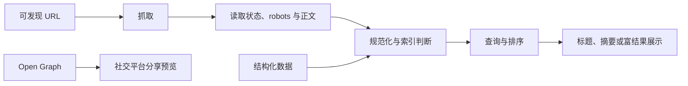

# SEO、Open Graph 与结构化内容基础

## 是什么与为什么需要

SEO 让搜索引擎能抓取、理解并呈现页面；Open Graph 用 `meta property` 描述社交分享对象；结构化数据以机器可读词汇声明实体及属性。它们改善发现与展示，不保证排名或富结果。

## 抓取、索引、规范化、分享和结构化数据规则

- 可抓取的真实正文、语义结构、有效链接和正确 HTTP 状态是基础。
- canonical、robots 和 sitemap 各自解决规范 URL、抓取提示和 URL 发现，不能互相替代。
- Open Graph 面向分享预览，应使用绝对 URL 和可访问图片。
- 结构化数据必须与可见内容一致，并符合目标搜索平台支持的类型和必需字段。
- SEO 配置只能提供信号，不能保证索引、排名、摘要或富结果展示。



| 机制 | 目的 | 重要边界 |
| --- | --- | --- |
| `robots.txt` | 告知遵守协议的爬虫哪些路径可抓取 | 不是鉴权；被禁止抓取的 URL 仍可能因外部链接被发现 |
| robots `meta` / `X-Robots-Tag` | 控制索引与结果展示规则 | 爬虫需要先能抓取响应才能读取规则 |
| canonical `link` | 提示一组重复/近似页面的首选 URL | 是信号，不是跳转或强制指令 |
| sitemap | 提供希望抓取的规范 URL 清单和可选元数据 | 不保证抓取或索引 |
| Open Graph | 描述分享对象和预览候选 | 各平台缓存和裁切策略不同 |
| JSON-LD | 用 schema.org 词汇描述实体 | 符合语法不代表有资格显示富结果 |

## 页面级元数据最小组合

```html
<title>HTML 表单校验指南｜狸力</title>
<meta name="description" content="解释原生约束校验、错误反馈和服务端验证。">
<link rel="canonical" href="https://example.com/html/forms">
<meta property="og:title" content="HTML 表单校验指南">
<meta property="og:type" content="article">
<meta property="og:url" content="https://example.com/html/forms">
<meta property="og:image" content="https://example.com/images/forms-cover.png">
<script type="application/ld+json">
{
  "@context": "https://schema.org",
  "@type": "TechArticle",
  "headline": "HTML 表单校验指南",
  "datePublished": "2026-07-17",
  "author": { "@type": "Person", "name": "justCDQ" }
}
</script>
```

使用描述性标题、语义标题层级、可抓取链接和真实正文；返回正确状态码并提供 sitemap/robots 配置。结构化数据必须与页面可见内容一致、符合所用搜索平台支持类型，并用验证工具检查。

搜索结果的 title link 不一定逐字采用 `title`，平台可能综合页面主标题、Open Graph 和其他信号生成。description 也是摘要候选，不保证采用。标题应描述当前页面而非堆叠重复关键词。

Open Graph 基础属性是 `og:title`、`og:type`、`og:image`、`og:url`。图片 URL 应绝对、公开可抓取且具有合适尺寸；需要无障碍替代时可提供 `og:image:alt`。页面改图后，平台可能继续使用已缓存预览，需要使用平台调试工具重新抓取。

## robots、canonical、关键词与虚假数据边界

`robots.txt` 不是访问控制；敏感资源需鉴权。canonical 是提示。关键词堆砌、隐藏文本和虚假结构化数据可能被忽略或处罚。OG 与标准 meta/结构化数据职责不同，应分别维护绝对 URL 和合适图片。

## JavaScript 内容与平台观测

JavaScript 页面仍需保证爬虫最终能取得主要内容。站点变更后用搜索平台检查抓取、索引、结构化数据错误和实际规范 URL。

## 完整案例：发布一篇可抓取的技术文章

输入是公开文章 URL `https://lili.example.com/frontend/html/forms`，可见标题“HTML 表单校验指南”，发布日期 2026-07-17，作者 justCDQ，分享图位于绝对 HTTPS URL。目标是搜索与分享系统获得一致信号，不承诺排名或富结果。

### 1. 正文和 HTTP 前提

服务器对规范 URL 返回 200 和可解析 HTML，正文中真实存在文章标题、摘要、作者、日期和内容。不存在的旧 URL 返回 301 到唯一新 URL或正确 404，而不是所有路径都返回 200 的空壳。

敏感草稿需要认证，不能靠 robots.txt 隐藏。robots 是遵守协议的爬虫指令，不阻止知道 URL 的用户访问。

### 2. head 元数据

```html
<title>HTML 表单校验指南｜狸力</title>
<meta name="description" content="解释原生约束校验、错误反馈、自动填充和服务端验证。">
<link rel="canonical" href="https://lili.example.com/frontend/html/forms">
<meta name="robots" content="index,follow,max-image-preview:large">

<meta property="og:title" content="HTML 表单校验指南">
<meta property="og:type" content="article">
<meta property="og:url" content="https://lili.example.com/frontend/html/forms">
<meta property="og:description" content="原生约束校验与可访问错误反馈的完整实践。">
<meta property="og:image" content="https://lili.example.com/assets/forms-cover.png">
<meta property="og:image:alt" content="表单字段、错误摘要与提交按钮的界面">
```

canonical、og:url 和实际公开 URL保持一致。description 与 og:description 面向不同消费场景，可以不同但不能误导。图片必须公开可抓取、返回正确媒体类型并满足目标平台尺寸要求。

显式 `index,follow` 通常等同默认允许状态，不是提高排名的指令。若页面使用 noindex，爬虫必须能抓取页面或响应头才可读取它。

### 3. JSON-LD 与可见内容一致

```html
<script type="application/ld+json">
{
  "@context": "https://schema.org",
  "@type": "TechArticle",
  "headline": "HTML 表单校验指南",
  "datePublished": "2026-07-17",
  "dateModified": "2026-07-17",
  "author": {
    "@type": "Person",
    "name": "justCDQ"
  },
  "mainEntityOfPage": "https://lili.example.com/frontend/html/forms",
  "image": "https://lili.example.com/assets/forms-cover.png"
}
</script>
```

JSON 必须语法有效，日期、作者和标题必须在页面上可核对。Schema.org 定义词汇，具体搜索平台另有富结果资格和必需字段；通过通用 schema 验证不等于平台一定展示。

### 4. 发现与规范化输入

文章从栏目页通过普通 `a[href]` 链接可达，并进入 sitemap。所有内部链接使用规范 URL，不同时大量链接带追踪参数版本。若参数页面内容相同，可通过 canonical、重定向和链接规范化保持信号一致。

robots.txt 允许抓取文章和必要 CSS/JS/图片。阻止渲染资源可能影响平台理解页面。sitemap 只列希望索引的规范 200 URL，不放登录页、重定向和 noindex 页面。

### 5. 可观察输出与验证

使用浏览器查看页面源代码，确认主要正文和元数据在响应中。执行：

```js
console.log(document.title);
console.log(document.querySelector('link[rel="canonical"]')?.href);
console.log(document.querySelector('meta[property="og:image"]')?.content);
JSON.parse(document.querySelector('script[type="application/ld+json"]')?.textContent);
```

最后一行无异常仅证明 JSON 可解析。继续用 Schema Markup Validator、目标搜索平台富结果测试、URL 检查和社交分享调试器观察实际结果。

### 6. 失败分支

canonical 指向首页会削弱当前文章作为首选版本的信号；修正 URL 并同步内部链接和 sitemap。robots.txt 禁止文章时，平台无法读取页面 noindex 或更新内容；按目标重新配置抓取。

结构化数据写五星评分但正文没有真实评分属于不一致信息，可能被忽略或触发平台措施。Open Graph 图片返回 403 或需要 Cookie 时，分享抓取器无法生成预览。

标题和摘要可能被搜索平台重写，这不是前端脚本错误。应检查页面信号是否准确、稳定、非重复，不通过隐藏文本或关键词堆叠强迫展示。

### 7. 验收练习

完成标准：HTTP 状态与重定向正确；规范 URL 可抓取；内部链接和 sitemap 一致；JSON-LD 与可见正文一致且可解析；无虚假字段；robots 不阻止必要页面和资源；分享图公开可取；平台工具报告无可操作错误；不把是否收录和排名作为代码确定性验收。

## 来源

- [Google Search Central：SEO Starter Guide](https://developers.google.com/search/docs/fundamentals/seo-starter-guide) — 访问日期：2026-07-17
- [Google Search Central：Robots meta tag](https://developers.google.com/search/docs/crawling-indexing/robots-meta-tag) — 访问日期：2026-07-17
- [Google Search Central：Structured data](https://developers.google.com/search/docs/appearance/structured-data/intro-structured-data) — 访问日期：2026-07-17
- [Open Graph protocol](https://ogp.me/) — 访问日期：2026-07-17
- [Schema.org](https://schema.org/docs/documents.html) — 访问日期：2026-07-17
