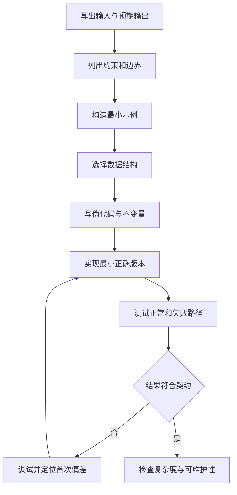

# JavaScript 问题拆解、伪代码与调试

解决程序问题需要先把需求转换为可验证的输入、输出和约束，再选择数据结构与步骤。调试则从一个可重复的失败出发，通过断点、调用栈、作用域、日志和测试收集证据，找到“实际行为第一次偏离预期”的位置。二者都不是凭直觉连续改代码。

## 1. 从需求到可执行问题

一个可实现的问题描述至少包含：

- 输入：数据类型、结构、来源和规模。
- 输出：返回值、状态变化或外部效果。
- 前置条件：调用前必须成立的约束。
- 边界：空输入、重复值、极值、无效值和顺序。
- 失败协议：返回缺失值、结果对象或抛出异常。
- 完成标准：用什么观察或测试证明正确。

“统计学习时长”不够明确。可执行版本可以是：输入为记录数组，每项包含唯一字符串 id、ISO 日期和非负整数分钟；忽略已删除记录；按日期汇总分钟；重复 id 和非法字段抛错；返回按日期升序排列的新数组；不得修改输入。

## 2. 问题拆解流程



先完成可证明正确的版本，再根据证据优化。没有测量就为了“更快”改写代码，容易同时引入错误和不必要复杂度。

### 2.1 写具体示例

示例将抽象需求固定成可比较结果。

```js
const input = [
  { id: 'a', date: '2026-07-16', minutes: 20 },
  { id: 'b', date: '2026-07-17', minutes: 30 },
  { id: 'c', date: '2026-07-16', minutes: 15 },
];

const expected = [
  { date: '2026-07-16', minutes: 35 },
  { date: '2026-07-17', minutes: 30 },
];
```

至少再写空数组、单项、重复日期、重复 id、分钟为零、非法日期和非法分钟。示例不仅用于最终测试，也用于发现需求没有定义的地方。

### 2.2 选择数据结构

若每条记录都在已有日期数组中线性查找，记录数增加时会重复扫描。Map 可以把“日期到累计分钟”建成直接映射，Set 可以记录已见 id。

```text
seenIds = 空 Set
minutesByDate = 空 Map

对每条记录：
  验证结构、id、日期和分钟
  如果 seenIds 已有 id：失败
  将 id 加入 seenIds
  读取该日期已有分钟，缺失时按 0
  写回已有分钟 + 当前分钟

把 Map 条目转换为对象数组
按日期升序排序
返回结果
```

伪代码表达数据流和决策，不受具体语法干扰。它应包含失败路径和最终输出，而不是只写“循环处理数据”。

### 2.3 定义不变量

不变量是在某段执行期间持续成立的条件。上例循环每次迭代结束后：

- `seenIds.size` 等于已成功处理的记录数。
- `minutesByDate` 的每个值都是非负安全整数。
- 每个 Map 值等于已处理记录中对应日期分钟之和。
- 输入数组和记录对象未被修改。

不变量能指导断言和断点观察。如果 Map 首次出现负数，错误一定发生在当前或更早的输入验证与累加步骤。

## 3. 把大任务拆成纯步骤

将解析、验证、转换、计算和展示分开，每一步就有独立输入输出。

```js
function isIsoDate(value) {
  return /^\d{4}-\d{2}-\d{2}$/.test(value);
}

function assertRecord(record, index) {
  if (record === null || typeof record !== 'object') {
    throw new TypeError(`records[${index}] 必须是对象`);
  }
  if (typeof record.id !== 'string' || record.id === '') {
    throw new TypeError(`records[${index}].id 无效`);
  }
  if (!isIsoDate(record.date)) {
    throw new TypeError(`records[${index}].date 格式无效`);
  }
  if (!Number.isSafeInteger(record.minutes) || record.minutes < 0) {
    throw new RangeError(`records[${index}].minutes 无效`);
  }
}
```

正则只证明字符串形状，不能证明 `2026-02-31` 是真实日历日期。若契约要求真实日期，应继续做字段级日历校验或使用明确日期模型。问题拆解需要区分“格式验证”和“语义验证”。

## 4. 复杂度是规模关系

时间复杂度描述输入规模增长时操作数量如何增长；空间复杂度描述额外内存如何增长。它不是精确运行毫秒，也不能替代真实性能测量。

| 操作 | 常见规模关系 | 说明 |
| --- | --- | --- |
| 一次数组遍历 | O(n) | 每项处理一次 |
| 嵌套完整遍历 | O(n²) | 每项再扫描全部项 |
| Map/Set 平均查找 | 次线性、通常近似常数 | 规范要求平均访问时间次线性，不承诺具体实现 |
| 比较排序 | O(n log n) 量级 | 实现与数据仍影响常数和表现 |
| 复制数组 | O(n) 时间与空间 | 展开/切片需创建新结构 |

先确认 n 的实际范围。20 项配置的双循环通常不是问题；10 万条交互数据的同步多次排序可能阻塞主线程。性能结论应有生产规模、性能面板或基准证据。

## 5. 调试从可复现失败开始

调试记录应包含：

- 环境：浏览器/Node 版本、操作系统、构建版本和功能开关。
- 前置状态：登录身份、缓存、存储、网络或数据版本。
- 最短操作步骤。
- 精确输入。
- 预期结果与实际结果。
- 发生频率。
- 控制台、堆栈、请求或测试输出。

“偶尔不工作”不能稳定验证修复。若失败确实不稳定，先记录时间、请求 id、随机种子和状态转移，缩小影响条件。

### 5.1 最小复现

最小复现只保留仍能触发问题的代码与数据。缩减时一次只去掉一个因素并重复运行：

1. 固定输入，移除网络或随机性。
2. 去掉无关 UI、样式和模块。
3. 缩短数据，直到再删一项就不再失败。
4. 在独立函数或文件中运行。
5. 记录最小输入为什么仍失败。

最小复现既能暴露根因，也能成为回归测试。

## 6. 假设驱动调试

观察事实后提出可证伪假设，再选择最小观察点。

```text
事实：输入 5 和 1，界面显示 51。
假设：两个输入仍是 String，+ 执行了连接。
预测：断点处 typeof left 和 typeof right 都是 "string"。
验证：在计算前暂停并查看 Scope/Watch。
```

若观察与预测不一致，放弃或修改假设。不要只寻找支持原想法的证据。

## 7. 断点类型与使用位置

### 7.1 行断点

在确定代码位置时，于该行执行前暂停。适合检查分支条件、函数参数和状态更新前后。

### 7.2 条件断点

仅在表达式为真时暂停，适合循环中的特定 id 或边界值。

```js
record.id === 'problem-id' && total < 0
```

条件表达式会在运行过程中求值；避免放入修改状态的函数调用，否则调试本身会改变行为。

### 7.3 日志点

日志点不暂停程序，而是在命中时输出表达式，适合高频路径和不想改源码的观察。仍需注意对象展示、频率和敏感数据。

### 7.4 异常断点

可选择在未捕获或已捕获异常处暂停。异常被上层统一处理后，控制台可能只显示通用信息；在抛出点暂停可以看到原始作用域和调用栈。

### 7.5 DOM、事件与请求断点

浏览器调试器还能在 DOM 子树变化、特定事件监听器、XHR/fetch URL 匹配等位置暂停。它们回答“是谁触发了变化”，比在大量调用位置逐个猜测更直接。

## 8. 单步执行、调用栈和作用域

暂停后常用控制：

- Step over：执行当前行，不进入其中调用的函数。
- Step into：进入当前行将调用的函数。
- Step out：运行到当前函数返回。
- Resume：运行到下一个断点或结束。
- Restart frame：在调试器支持时重新执行当前栈帧；它可能再次触发副作用。

Call Stack 显示当前函数为何被调用。点击较早栈帧可检查其参数和局部状态。Scope 显示当前局部、闭包、模块和全局绑定。Watch 会在每次暂停时重新计算表达式。

Watch 表达式也不应包含副作用：

```js
// 安全观察
typeof total
records.length
current?.id

// 不安全观察
queue.shift()
counter += 1
```

调试器中临时编辑变量可验证假设，但不等于源码修复。最终必须修改仓库文件、重新构建并运行回归测试。

## 9. `debugger` 语句

`debugger;` 在调试功能可用时请求暂停，相当于程序化断点；调试器未启用时通常没有可见效果。

```js
function calculate(records) {
  debugger;
  return records.length;
}
```

它适合难以在生成代码或短时路径上点选断点的本地调试，但提交前通常应删除。lint 可阻止生产代码残留 debugger。

## 10. 控制台与结构化日志

Console 可执行当前暂停上下文中的表达式，也展示日志、警告和异常。常用 API：

| API | 用途 |
| --- | --- |
| `console.log()` | 一般诊断信息 |
| `console.info()` | 信息事件 |
| `console.warn()` | 可恢复但值得关注的状态 |
| `console.error()` | 错误与失败上下文 |
| `console.table()` | 查看同结构数组/对象 |
| `console.group()` / `groupEnd()` | 组织相关输出 |
| `console.time()` / `timeEnd()` | 标签对应的区间耗时 |
| `console.trace()` | 输出当前位置调用栈 |
| `console.assert(condition, ...data)` | 条件为假时报告 |

控制台 API 由宿主提供，格式和精确行为可能不同。日志不能代替断言、测试或性能分析器。

```js
console.info('learning_summary_started', {
  recordCount: records.length,
  runId,
});
```

日志事件应有稳定名称和相关 id，避免把完整对象随意打印。口令、token、Cookie、身份证明、完整请求体和私人内容不能进入日志。

### 10.1 对象日志的时间问题

开发者工具可能保留对象引用并在展开时显示较新的状态，而不是日志调用瞬间的深快照。若必须保存当时值，选择明确字段或在数据可结构化克隆时创建快照。

```js
console.log('before', {
  id: record.id,
  minutes: record.minutes,
});
```

序列化快照会丢失或改变 `undefined`、BigInt、循环引用、Date、Map 等结构，不能盲目用 `JSON.stringify()` 当通用深复制。

### 10.2 日志会影响行为

高频日志增加 I/O、内存与渲染开销，可能改变竞态和性能表现。调试时控制范围，完成后移除临时日志；生产日志使用级别、采样和脱敏策略。

## 11. Network、Elements 与 Performance 证据

错误不一定来自 JavaScript 计算：

- Network：核对 URL、方法、状态、请求/响应头、请求体、响应体、缓存和时序。
- Elements：核对实际 DOM、属性、类、事件监听器和计算样式。
- Application：核对存储、缓存、Service Worker 等状态。
- Performance：核对长任务、脚本执行、样式布局和渲染，不用 `console.time` 推断完整页面性能。
- Memory：核对对象保留路径和分配，不以任务管理器单个瞬时值认定泄漏。

选择面板的原则是观察最接近失败层的事实。HTTP 500 不应先在 DOM 渲染函数里猜测。

## 12. Source Map 与构建代码

生产构建可能压缩、合并和转换源码。Source Map 将生成位置映射回原始源码，使断点和堆栈更可读。

调试时确认：

- 浏览器实际加载的构建版本与提交一致。
- Source Map 与产物匹配，没有旧缓存。
- 是否公开 Source Map 符合安全和部署策略。
- 原始异常仍保留生成文件位置，便于映射失败时诊断。

映射只改善定位，不保证运行语义与未构建源码完全相同。构建模式、环境变量和优化仍可能改变行为。

## 13. VS Code 调试配置的核心字段

VS Code 调试会话由调试器扩展/内置调试支持和 `.vscode/launch.json` 配置驱动。常见概念：

- `type`：使用哪种调试器。
- `request: "launch"`：启动新进程。
- `request: "attach"`：连接到已有进程。
- `program`：入口文件。
- `cwd`：工作目录。
- `args`：命令行参数。
- `env`：仅为调试会话提供的环境变量；不能提交秘密。
- `skipFiles`：单步时忽略库或运行时内部文件。

示例需按项目实际 Node 模块模式和路径调整：

```json
{
  "version": "0.2.0",
  "configurations": [
    {
      "type": "node",
      "request": "launch",
      "name": "Debug summary",
      "program": "${workspaceFolder}/debug-summary.js",
      "cwd": "${workspaceFolder}",
      "skipFiles": ["<node_internals>/**"]
    }
  ]
}
```

条件断点、Logpoint、Watch、Call Stack 和变量检查与浏览器调试器概念一致；具体能力取决于调试器。

## 14. 完整案例：定位日期汇总错误

失败报告：三条记录应汇总为 65 分钟，实际得到字符串 `'0203015'`；按日期排序结果偶尔反向。

### 14.1 有缺陷的实现

```js
function summarizeBuggy(records) {
  const totals = {};

  for (const record of records) {
    totals[record.date] = (totals[record.date] ?? '0') + record.minutes;
  }

  return Object.entries(totals)
    .map(([date, minutes]) => ({ date, minutes }))
    .sort((left, right) => left.date < right.date);
}
```

最小复现：

```js
const records = [
  { id: 'a', date: '2026-07-16', minutes: 20 },
  { id: 'b', date: '2026-07-17', minutes: 30 },
  { id: 'c', date: '2026-07-16', minutes: 15 },
];

console.log(summarizeBuggy(records));
```

### 14.2 假设与断点

在累加行设置条件断点 `record.id === 'a'`，将以下表达式加入 Watch：

```js
typeof totals[record.date]
typeof record.minutes
(totals[record.date] ?? '0') + record.minutes
```

第一次迭代预测并观察到已有值回退为 String `'0'`，所以 `+` 执行字符串连接。排序比较函数又返回 Boolean，而比较器要求负数、零或正数；`false` 会数值化为 0，不能表达完整顺序。

### 14.3 修复实现

```js
function assertLearningRecord(record, index) {
  if (record === null || typeof record !== 'object') {
    throw new TypeError(`records[${index}] 必须是对象`);
  }
  if (typeof record.id !== 'string' || record.id === '') {
    throw new TypeError(`records[${index}].id 无效`);
  }
  if (!/^\d{4}-\d{2}-\d{2}$/.test(record.date)) {
    throw new TypeError(`records[${index}].date 格式无效`);
  }
  if (!Number.isSafeInteger(record.minutes) || record.minutes < 0) {
    throw new RangeError(`records[${index}].minutes 无效`);
  }
}

function summarize(records) {
  if (!Array.isArray(records)) {
    throw new TypeError('records 必须是数组');
  }

  const seenIds = new Set();
  const totals = new Map();

  records.forEach((record, index) => {
    assertLearningRecord(record, index);
    if (seenIds.has(record.id)) {
      throw new RangeError(`记录 id 重复：${record.id}`);
    }
    seenIds.add(record.id);

    const nextTotal = (totals.get(record.date) ?? 0) + record.minutes;
    if (!Number.isSafeInteger(nextTotal)) {
      throw new RangeError(`${record.date} 的累计分钟溢出`);
    }
    totals.set(record.date, nextTotal);
  });

  return [...totals]
    .map(([date, minutes]) => ({ date, minutes }))
    .sort((left, right) => left.date.localeCompare(right.date));
}
```

### 14.4 可运行回归检查

以下代码可直接在 Node.js 24 中运行：

```js
function assertDeepEqual(actual, expected, label) {
  const actualText = JSON.stringify(actual);
  const expectedText = JSON.stringify(expected);
  if (actualText !== expectedText) {
    throw new Error(`${label}\nactual=${actualText}\nexpected=${expectedText}`);
  }
}

assertDeepEqual(summarize(records), [
  { date: '2026-07-16', minutes: 35 },
  { date: '2026-07-17', minutes: 30 },
], '应按日期汇总和排序');

assertDeepEqual(summarize([]), [], '空输入应返回空数组');

console.log('summary regression: PASS');
```

这个简化断言只适合本案例中的 JSON 兼容结构；正式项目使用测试框架的深相等断言，避免 JSON 对键顺序、undefined、特殊数值和循环引用的限制。

### 14.5 失败注入

```js
const failures = [
  null,
  [{ id: '', date: '2026-07-17', minutes: 1 }],
  [{ id: 'a', date: '17/07/2026', minutes: 1 }],
  [{ id: 'a', date: '2026-07-17', minutes: '1' }],
  [
    { id: 'a', date: '2026-07-17', minutes: 1 },
    { id: 'a', date: '2026-07-18', minutes: 1 },
  ],
];

for (const input of failures) {
  try {
    summarize(input);
    throw new Error('预期失败但成功');
  } catch (error) {
    console.log(error.name, error.message);
  }
}
```

注意这个演示 catch 也会捕获“预期失败但成功”的断言错误。正式测试应使用 `assert.throws()` 或测试框架明确区分被测异常与测试自身异常。

## 15. 根因、修复与回归

一个完成的缺陷记录应区分：

- 症状：用户看到字符串累计和错误顺序。
- 直接原因：初始累计值是 String；排序器返回 Boolean。
- 根因：输入/中间值契约未验证，排序 API 契约未被测试。
- 修复：使用数值初始值、Map、合法比较器和边界验证。
- 防复发：增加正常、空输入、重复 id、错误类型和顺序回归测试。

只把 `'0'` 改成 `0` 修复了一个症状，却没有防止字符串 minutes 再次触发连接；输入验证是根因层修复的一部分。

## 16. 调试完成清单

1. 在目标环境稳定复现，记录版本与输入。
2. 写出预期和实际差异，不使用模糊描述。
3. 缩小到最小失败案例。
4. 提出可证伪假设，并选择最接近首次偏差的观察点。
5. 使用 Scope、Watch 和 Call Stack 验证类型、值与调用来源。
6. 对网络、DOM、性能问题切换到对应面板收集证据。
7. 修复根因，不保留仅修改运行时的 DevTools 临时编辑。
8. 为最小复现增加回归测试，并运行相关测试集。
9. 删除 `debugger`、临时日志和测试秘密。
10. 记录根因、影响范围、修复证据和仍未覆盖的风险。

## 17. 练习与完成标准

选择一个真实或故意注入的缺陷完成完整调试报告：

- 固定输入、预期、实际与环境。
- 将复现缩减为一个函数和不超过五条数据。
- 写伪代码、不变量和至少两个候选假设。
- 分别使用条件断点、Watch、Call Stack 和一条结构化日志。
- 给出首次偏差的截图或文本证据。
- 写正常、边界与失败回归测试。
- 说明修复前后复杂度和输入可变性是否改变。

完成标准是：其他人能按记录复现旧问题、观察同一根因、运行修复并得到稳定 PASS；报告不包含口令、令牌或私人数据。

## 来源

- [Chrome for Developers：Debug JavaScript](https://developer.chrome.com/docs/devtools/javascript/)（访问日期：2026-07-17）
- [Chrome for Developers：Console overview](https://developer.chrome.com/docs/devtools/console/)（访问日期：2026-07-17）
- [MDN：JavaScript debugging and error handling](https://developer.mozilla.org/en-US/docs/Learn_web_development/Core/Scripting/Debugging_JavaScript)（访问日期：2026-07-17）
- [Visual Studio Code：Debug code with Visual Studio Code](https://code.visualstudio.com/docs/debugtest/debugging)（访问日期：2026-07-17）
