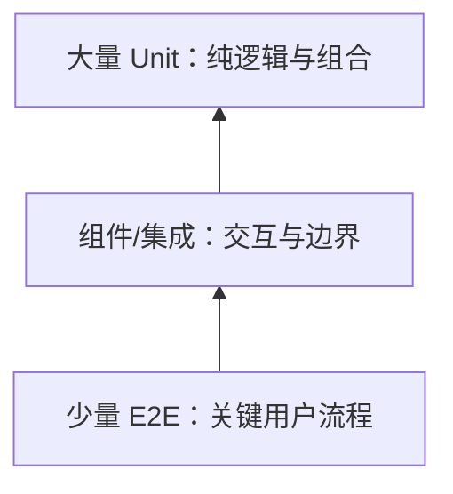

# Unit、Component 与 E2E 测试

测试层级按运行边界区分：unit 隔离纯逻辑，component 在 DOM 环境验证组件交互，E2E 在真实浏览器和部署形态验证关键流程。有效测试关注可观察行为和失败风险，不以覆盖率数字代替场景设计。

## 1. 测试金字塔不是配额



数量取决于产品：复杂算法需要更多 unit；大量浏览器集成需要 component/E2E。每个 bug 应落在最便宜且能真实复现的层。

## 2. Unit Test

适合纯函数、parser、reducer、金额、日期和状态转移：

```ts
import { describe, expect, it } from "vitest";

describe("calculateTotal", () => {
  it("按分计算并保留整数", () => {
    expect(calculateTotal([
      { quantity: 2, unitCents: 1990 },
      { quantity: 1, unitCents: 500 },
    ])).toBe(4480);
  });

  it("拒绝负数量", () => {
    expect(() => calculateTotal([{ quantity: -1, unitCents: 100 }])).toThrow(/数量/);
  });
});
```

一个测试包含具体输入、行为和输出。边界包括 0、最大值、空、非法类型和溢出。不要只测试实现中的每个 if 而没有业务断言。

## 3. Component Test

组件测试渲染真实组件，按用户角色、名称和文本操作：

```tsx
it("提交失败后关联标题错误并保留值", async () => {
  const user = userEvent.setup();
  render(<CourseForm save={async () => ({ ok: false, field: "title", message: "标题已存在" })} />);

  await user.type(screen.getByRole("textbox", { name: "标题" }), "TypeScript");
  await user.click(screen.getByRole("button", { name: "保存" }));

  expect(await screen.findByRole("alert")).toHaveTextContent("标题已存在");
  expect(screen.getByRole("textbox", { name: "标题" })).toHaveValue("TypeScript");
});
```

优先查询语义，避免 `.card > div:nth-child(2)`。测试用户结果，不读取组件内部 state 或调用私有方法。

### 3.1 DOM 模拟与真实浏览器

jsdom/happy-dom 快、适合多数 DOM 逻辑，但不完整实现 layout、CSS、导航、canvas、真实焦点和浏览器事件。Vitest Browser Mode 或 Playwright component test 使用真实浏览器，适合布局、拖放、selection、Popover/Dialog 和兼容性。

## 4. E2E

```ts
import { expect, test } from "@playwright/test";

test("用户创建课程", async ({ page }) => {
  await page.goto("/courses/new");
  await page.getByRole("textbox", { name: "标题" }).fill("TypeScript 基础");
  await page.getByRole("spinbutton", { name: "课时" }).fill("12");
  await page.getByRole("button", { name: "保存" }).click();

  await expect(page).toHaveURL(/\/courses\/[^/]+$/);
  await expect(page.getByRole("heading", { name: "TypeScript 基础" })).toBeVisible();
});
```

E2E 覆盖浏览器、路由、网络、服务端和数据库。关键流程包括登录、权限、核心创建/支付、恢复和错误。不是每个字段组合都用 E2E 穷举。

## 5. 测试替身

- stub：返回固定结果；
- spy：记录调用；
- fake：具有简化实现，如内存仓库；
- mock：预先规定交互并验证。

替身放在真实边界。不要 mock 被测函数内部每个模块，使重构就全失败。网络层可用 Mock Service Worker 按 HTTP 契约拦截；E2E 可连接隔离测试后端或精准 route mock。

## 6. 时间、随机和网络

定时器测试用 fake timers，并在测试后恢复；随机 ID 注入生成器或固定 seed；日期注入 clock。不要让测试依赖真实等待 5 秒。

网络测试覆盖：成功、400 validation、401、403、404、409、500、超时、取消、无效 JSON 和慢响应。对 AbortError 与真实失败分开断言。

## 7. 异步等待

等待用户可观察条件，不写固定 sleep：

```ts
await expect(page.getByRole("status")).toHaveText(/已保存/);
```

测试库的 retry assertion 能等待 DOM 达到状态。若操作触发导航，等待 URL/响应/可见结果。任意 `waitForTimeout(2000)` 容易在慢 CI flake。

## 8. 测试数据与隔离

每个测试拥有数据或唯一 namespace；结束后清理。并行 E2E 不共享同一用户名和记录。数据库策略：事务回滚、API fixture、每 worker schema 或容器。

fixture 提供最小默认值，测试覆盖关心字段。巨大共享 fixture 会隐藏依赖。生产数据不得复制进测试而未脱敏。

## 9. 可访问性测试

自动扫描可发现部分规则，但不能证明完整无障碍。组件/E2E 还要测试：键盘顺序、焦点返回、可访问名称、错误关联、动态播报、缩放和对比。

```ts
await page.keyboard.press("Tab");
await expect(page.getByRole("button", { name: "保存" })).toBeFocused();
```

屏幕阅读器人工测试用于关键流程；ARIA 规则通过不代表交互模式正确。

## 10. Visual Regression

截图测试适合设计系统、跨断点和复杂视觉，但容易受字体、OS、动画和时间影响。固定浏览器镜像、字体、viewport、locale、timezone 和动画；差异 review 不能自动全部更新基线。

截图不替代功能断言。按钮看起来存在但可能无可访问名称或点击无效。

## 11. 覆盖率

line/branch/function coverage 表示哪些代码执行过，不表示断言正确。设合理基线防止无测试下降，但关键领域要求场景表而不是追 100%。忽略生成代码和不可控 vendor，不能忽略困难业务分支。

Mutation testing 可改变运算符/条件，检查测试是否能杀死变异；适合关键纯逻辑，不必全仓运行。

## 12. 完整案例：删除任务

风险：权限、确认、重复提交、409 版本冲突、网络失败、焦点恢复。

测试分层：

- unit：reducer 只允许 idle→confirming→submitting→success/failure；
- component：打开 dialog、取消返焦点、确认 pending、失败保留可重试；
- integration：API adapter 解析 204/403/404/409/500；
- E2E：授权用户删除并从列表消失；无权限用户看不到动作；冲突显示刷新选择。

成功输入为 version=3 的任务，服务端 204，列表移除。失败输入为旧 version=2，服务端 409，UI 不假装删除成功并提供刷新。

验证还包括快速双击只发一个 mutation；按 Escape 取消；网络断开后 dialog 保留上下文；重新加载后服务端数据为最终权威。

## 13. Flaky Test 处理

不允许无限 retry 掩盖 flake。收集 trace、video、console、network 和 seed；按失败条件分类：异步等待、共享数据、动画、时区、资源不足、真实产品竞态。修复后保留回归。

Playwright trace 可在首次 retry 记录；CI artifact 需控制敏感数据和保留期。

## 14. CI 分层

- PR：unit/component + 核心 E2E；
- merge/main：完整浏览器矩阵；
- nightly：长耗时视觉、兼容、mutation；
- deploy smoke：实际域名核心读路径；
- production synthetic：无副作用或隔离账户。

并行提高速度但要求数据隔离。shard 的总结果必须合并，不能因某 shard 取消而误报成功。

## 15. 常见错误

1. 测实现细节和 className，不测用户行为。
2. 全部网络 mock，契约漂移未发现。
3. 固定 sleep。
4. 测试共享账户与记录。
5. 快照巨大，review 直接更新。
6. 只写 happy path。
7. 用 E2E 测所有纯函数组合，速度慢定位差。
8. 认为 100% coverage 等于正确。

## 16. 练习

为课程编辑流程建立测试计划。验收：

1. 至少 8 个 unit 边界；
2. 组件测试覆盖键盘、字段错误、pending 与 retry；
3. E2E 覆盖成功、403、409、500；
4. 无固定 sleep；
5. 并行数据隔离；
6. 真实浏览器检查 Dialog 与焦点；
7. CI flake 率可观测且失败有 trace；
8. mutation 或审查证明断言不是空执行。

## 来源

- [Vitest Guide](https://vitest.dev/guide/)（访问日期：2026-07-17）
- [Vitest Browser Mode](https://vitest.dev/guide/browser/)（访问日期：2026-07-17）
- [Testing Library：Guiding Principles](https://testing-library.com/docs/guiding-principles/)（访问日期：2026-07-17）
- [Playwright：Best Practices](https://playwright.dev/docs/best-practices)（访问日期：2026-07-17）
- [Playwright：Trace Viewer](https://playwright.dev/docs/trace-viewer)（访问日期：2026-07-17）
