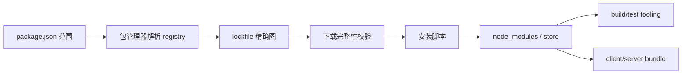

# 依赖选择、升级、锁文件与供应链

安装一个包会引入源码、传递依赖、安装脚本、维护者权限和发布基础设施。供应链管理的目标是最小化信任面、可重现安装、及时修复漏洞，并保证升级可验证和可回滚。

## 1. 依赖从哪里进入产物



devDependency 不一定无风险：构建插件可读源码和 CI 环境。没有进入浏览器 bundle 仍可能在构建时执行。

## 2. dependencies 分类

- `dependencies`：应用运行/构建产物需要；
- `devDependencies`：开发、测试、构建工具；
- `peerDependencies`：库要求消费项目提供的宿主版本；
- `optionalDependencies`：安装失败可继续，代码需处理缺失；
- `bundledDependencies`：随包 tarball 一起发布。

分类影响安装和发布，不是安全等级。库把 React 错放 dependencies 可能打包双实例；peer 范围过窄使升级困难，过宽则承诺未测试版本。

## 3. SemVer 与范围

`1.2.3` 固定版本；`^1.2.3` 通常允许同 major；`~1.2.3` 允许 patch。0.x 的 caret 范围更窄。SemVer 是发布者承诺，不保证每个包都无行为回归。

应用依赖范围用于表达可接受版本，lockfile 固定当前解析。库发布时不能把 lockfile 当作消费者会安装同一传递版本，必须测试声明范围边界。

## 4. Lockfile

lockfile 记录精确版本、来源、完整性和依赖图，使同一包管理器版本与平台下更可重现。

规则：

- 应用和仓库提交 lockfile；
- CI 使用 `--frozen-lockfile`；
- package.json 变化必须伴随 lockfile review；
- 不手工编辑 lockfile；
- 固定 package manager/version；
- 合并冲突后重新运行安装与测试，不只保留两边文本。

lockfile 不是绝对可重现：原生二进制、平台 optional、生命周期脚本、registry 重打包、Node 版本和环境仍会影响结果。

## 5. 选择依赖的证据

检查：

1. 功能是否可用少量平台代码实现；
2. 维护者和治理是否持续；
3. release/security policy 和漏洞响应；
4. 下载 tarball 实际内容、体积和依赖数；
5. ESM/CJS/exports/类型是否匹配工具链；
6. browser/server/SSR 行为；
7. license；
8. 无障碍与国际化；
9. 替换和迁移成本；
10. 是否需要安装脚本、原生代码或网络访问。

下载量和 stars 只能作为线索，不能证明质量和安全。

## 6. 安装脚本

preinstall/install/postinstall 可执行任意安装用户权限下的代码。CI token、SSH key 和云凭证因此暴露在风险中。

包管理器可禁用或批准构建脚本。默认拒绝时对确需脚本的包建立 allowlist，记录原因与版本。禁用脚本可能让原生模块不能用，必须运行功能测试。

## 7. 完整性、签名与来源

lockfile integrity 校验下载内容与解析记录一致，但不能证明维护者发布的是安全代码。来源可信还涉及 registry 身份、2FA、provenance、签名和仓库—包对应关系。

高风险依赖可验证 npm provenance、发布工作流和源码 tag。git URL、任意 tarball 和 install 时下载二进制会绕开部分 registry 保障，应谨慎。

## 8. Audit 的边界

漏洞扫描把版本与 advisory 匹配，会有误报、不可达路径和缺失公告。处理顺序：确认受影响范围 → 是否在生产路径 → 攻击前提 → 可修版本 → 测试升级 → 部署与监控。

不要无 review 运行强制 audit fix 跨 major。扫描未报不代表安全；恶意包、业务漏洞和零日可能无 CVE。

## 9. 升级策略

- 自动机器人提交小批依赖；
- patch/minor 与 major 分组策略不同；
- lockfile maintenance 定期进行；
- 框架、路由、构建和测试核心依赖分开升级；
- 阅读官方 changelog/migration；
- 生产构建、类型、E2E 和性能复验；
- 发布后按 release 监控。

不要同时升级 50 个核心包，使回归无法定位。

## 10. TypeScript 7 迁移示例

TypeScript 7.0 无 Compiler API。应用可采用双版本：

```json
{
  "devDependencies": {
    "@typescript/native": "npm:typescript@7.0.2",
    "typescript": "npm:@typescript/typescript6@^6.0.2"
  },
  "scripts": {
    "typecheck": "tsc --noEmit",
    "typecheck:tooling": "tsc6 --noEmit"
  }
}
```

升级验收包括 CLI、IDE/LSP、typescript-eslint、Vue/Svelte/MDX/Angular 模板、测试转换和声明生成。仅 `tsc` 快 10 倍不是完整迁移证据。

## 11. Overrides 与 Patch

override/resolution 可强制传递版本，适合紧急修复，但可能违反上游范围。记录：原因、影响包、测试、移除条件和上游 issue。

本地 patch 修改第三方代码同样需版本绑定、diff review、license 检查和升级冲突处理。不能让 patch 永久无人维护。

## 12. SBOM 与许可证

SBOM 记录组件名、版本、来源和关系，用于漏洞响应和客户合规。它必须从实际 artifact 生成或关联，不能只扫描 package.json。

license 扫描检查生产和分发场景；dev 工具 license 也可能影响交付流程。法律结论交由组织流程，工程需提供准确依赖和归属信息。

## 13. Monorepo 与 Workspace

workspace 协议连接本地包。风险包括幽灵依赖：包未声明却因根 node_modules 能导入。使用严格包管理布局、每包 manifest 和独立打包消费测试。

发布库前用 tarball 安装到空项目，验证 exports、types、peer、CSS 和 license 文件。workspace 源码直接导入通过不等于发布包正确。

## 14. 完整案例：引入 Markdown 渲染器

需求：显示用户提交 Markdown。候选包功能丰富，但允许原始 HTML 和插件。

评估：

1. tarball、依赖图、维护、安全与 license；
2. 默认是否解析原始 HTML；
3. URL scheme 是否过滤 javascript/data；
4. SSR、bundle 和类型；
5. 插件是否执行任意代码；
6. 真实恶意样本测试。

方案：默认禁止原始 HTML；渲染后使用允许列表 sanitizer；外链加安全属性；服务端和客户端一致；锁定版本并监控 advisory。

成功样本渲染标题、列表和代码。失败样本 `<script>`、事件属性、`javascript:` link、恶意 SVG 必须被移除或拒绝。验证在真实浏览器检查 DOM，不能只比较字符串。

若依赖升级改变 sanitizer AST 顺序，snapshot 变化需安全 review；如果维护停止，替换层封装在 `renderMarkdown()` adapter，业务不直接调用 vendor API。

## 15. 事件响应

发现供应链漏洞：冻结新发布 → 确认受影响版本/环境 → 撤销并轮换可能暴露凭证 → 锁定安全版本或移除包 → 重新构建 artifact → 部署 → 扫描历史和日志 → 更新 SBOM → 事后复盘。

仅更新 lockfile 不会替换已部署 artifact。若 install script 可能窃取 secret，必须按泄露处理，不只升级包。

## 16. 常见错误

1. 不提交 lockfile。
2. CI 非 frozen 安装，每次解析不同。
3. `audit fix --force` 无 review。
4. 只看直接依赖，忽略 install script 与传递图。
5. devDependency 被认为无安全风险。
6. override 永久保留无追踪。
7. workspace 隐藏未声明依赖。
8. 升级只跑 unit，不跑 build/E2E/性能。

## 17. 练习

对项目依赖做一次审计。验收：

1. 分类直接/传递、client/server/build；
2. 列出 install scripts 与批准理由；
3. frozen lockfile 干净安装；
4. 生成 artifact SBOM；
5. 选择一个核心依赖按 patch/minor/major 升级并验证；
6. 模拟恶意发布事件并完成凭证轮换流程；
7. tarball 消费测试发现幽灵依赖；
8. 每个 override/patch 有 owner 和移除条件。

## 来源

- [npm Docs：package.json](https://docs.npmjs.com/cli/configuring-npm/package-json)（访问日期：2026-07-17）
- [pnpm：Settings](https://pnpm.io/settings)（访问日期：2026-07-17）
- [SLSA：Supply-chain Levels](https://slsa.dev/spec/v1.1/levels)（访问日期：2026-07-17）
- [OpenSSF：Scorecard](https://scorecard.dev/)（访问日期：2026-07-17）
- [TypeScript Team：Announcing TypeScript 7.0](https://devblogs.microsoft.com/typescript/announcing-typescript-7-0/)（访问日期：2026-07-17）
