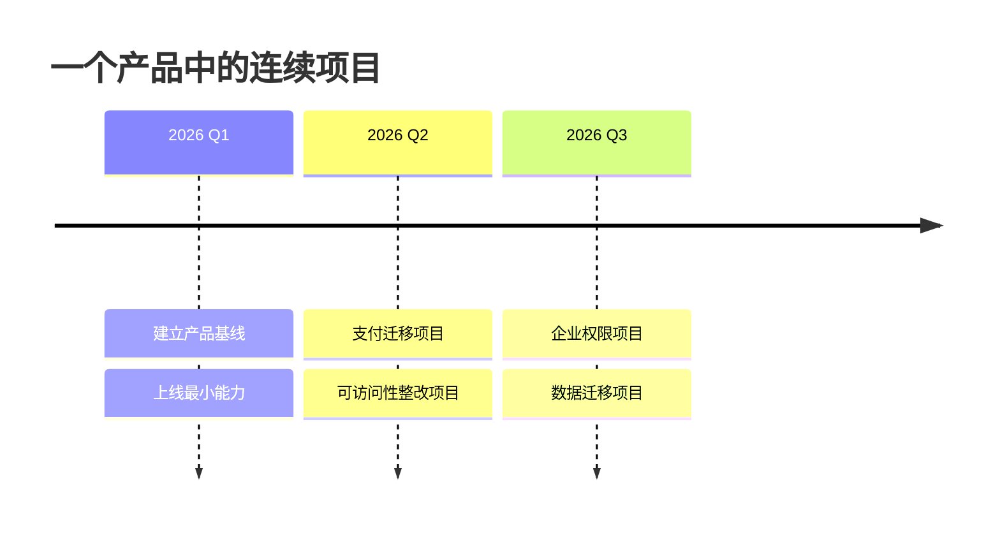
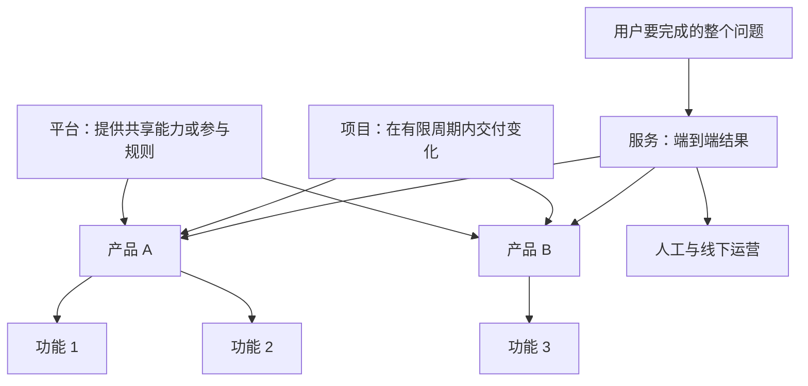

# 产品、项目、功能、服务与平台

产品、项目、功能、服务和平台描述的不是同一种对象。区分它们的目的，是让团队明确当前要管理的是长期结果、临时交付、局部能力、端到端过程，还是可被多方复用或参与的基础。

## 五个概念的核心区别

| 概念 | 管理对象 | 时间边界 | 主要成功证据 | 典型输出 |
| --- | --- | --- | --- | --- |
| 产品 | 一类用户持续获得的价值和承担该价值的系统 | 持续运营，可能最终退役 | 采用、任务结果、留存、收入、成本、风险 | 产品能力、版本、运营机制 |
| 项目 | 为产生特定结果而组织的临时工作 | 有开始和结束条件 | 约定交付物与结果在约束内完成 | 发布、迁移、建设、活动 |
| 功能 | 产品中支持某项任务的具体能力 | 随产品演进、替换或删除 | 目标任务得到改善 | 搜索、导出、审批、通知 |
| 服务 | 用户为完成一个目标经历的端到端过程 | 持续提供并持续改进 | 跨触点完成整个问题 | 线上流程、人工支持、规则、通知 |
| 平台 | 让多方在统一能力和规则上开发、交易或协作的基础 | 持续运营并治理 | 复用、参与、匹配、生态质量或网络效应 | API、扩展机制、市场、共享基础能力 |

同一个组织可以同时管理这五类对象。分类不是给公司或软件贴一个永久标签，而是确定一次决策的分析层级。

## 产品

### 定义

在本路线中，产品指面向明确使用者或客户、持续解决一组相关问题、能够被交付和运营，并根据结果持续调整的价值载体。产品可以是软件、硬件、内容、数据能力或它们的组合。

判断一个对象是否应按产品管理，需要回答：

1. 谁持续使用、购买、管理或受它影响？
2. 它持续解决什么问题？
3. 用户通过什么方式获得结果？
4. 组织为什么持续投入？
5. 用什么结果指标判断它仍有价值？
6. 谁负责运行、支持、改进和最终退役？

产品不等于应用程序边界。一项产品可能包含网页、移动端、API、人工支持和线下流程；一个大型应用也可能承载多个拥有不同用户、目标和生命周期的产品。

### 产品的输入与输出

产品工作的输入包括问题证据、业务目标、约束、风险、使用数据和运营反馈。输出不只是功能，还包括产品边界、优先级、服务水平、定价、支持方式、数据政策和退役策略。

产品成功不能只用“是否按期上线”判断。上线是交付事件，产品结果还要观察：

- 目标用户是否采用；
- 核心任务是否成功完成；
- 问题是否减少；
- 用户和组织获得的价值是否覆盖成本；
- 是否产生不可接受的安全、合规或负面影响。

## 项目

### 定义

项目是为创造独特产品、服务或结果而开展的临时工作。临时表示存在结束条件，不表示工期一定很短。独特表示结果在范围、环境或约束上具有特定性，不表示其中每项任务从未做过。

项目通常需要明确：

- 要产生的结果和交付物；
- 开始条件与完成条件；
- 范围和非范围；
- 时间、预算、人员和质量约束；
- 依赖、风险和负责人；
- 验收与移交方式。

### 项目与产品的关系

项目可以创建、迁移或改进产品，产品也可以连续包含多个项目：



每个项目结束后，产品的运营、支持、度量和迭代仍继续。把“项目完成”当成“产品成功”会漏掉采用率低、运营成本过高、任务仍失败等问题。

一个项目也可能不产生长期产品，例如一次办公地点搬迁、一次数据清理或一次法规切换。

## 功能

### 定义

功能是产品提供的、支持一个或多个用户任务的具体能力。功能必须能用行为描述，而不只是界面名词。

例如：

- “搜索框”是界面对象；“按订单号查找订单”是功能能力；
- “导出按钮”是操作入口；“按当前筛选条件生成 CSV”是功能；
- “AI”不是功能定义；“把客服工单分类为既定类别并交由人工确认”才描述了能力、输入和结果。

一项功能至少应明确：

| 项目 | 要回答的问题 |
| --- | --- |
| 使用者 | 谁可以使用，谁受结果影响？ |
| 触发 | 用户在什么条件下开始？ |
| 输入 | 需要哪些数据、权限和前置状态？ |
| 行为 | 系统执行什么规则或计算？ |
| 输出 | 用户得到什么可观察结果？ |
| 失败 | 哪些错误、冲突和权限情况可能发生？ |
| 价值 | 它改善了哪个任务或结果？ |
| 度量 | 怎样判断它被正确使用并产生效果？ |

### 功能不是价值本身

功能上线只证明系统具备某种能力。若用户找不到入口、没有权限、无法理解结果、任务没有改善或运营成本不可接受，功能仍未形成预期价值。

删除功能也可能改善产品：减少错误入口、维护成本、认知负担和不受支持的流程。功能数量不能作为产品成熟度的替代指标。

## 服务

### 定义

服务是用户为取得结果而经历的端到端过程。服务可以跨越多个产品、组织、渠道和人工环节。它的边界应尽量从用户要完成的问题定义，而不是从某个团队拥有的页面定义。

一个报销服务可能包括：

1. 查询报销政策；
2. 收集发票和行程证明；
3. 创建并提交申请；
4. 主管和财务审批；
5. 处理退回与补充材料；
6. 付款；
7. 通知结果；
8. 处理查询、申诉和更正。

其中“上传发票”只是功能，“报销系统”可能是产品，而用户真正需要完成的是从确认资格到收到正确款项的完整服务。

### 服务触点

服务触点不只包括界面：

- 搜索结果和公开说明；
- 邮件、短信和站内通知；
- 表单、网页、移动端和 API；
- 客服、运营、审批人和线下窗口；
- 政策、资格规则和法律要求；
- 支付、物流或第三方身份服务；
- 异常处理、投诉、退款和恢复。

优化单个页面可能把成本转移给另一个触点。例如减少表单字段但让客服人工补录，不一定改善整个服务。

## 平台

“平台”至少有三种常见含义，分析时必须写清使用哪一种。

### 技术平台

技术平台向内部或外部开发者提供可复用基础能力，例如身份认证、部署、日志、数据管道、支付 SDK 或组件系统。

判断要点：

- 是否存在多个独立使用方；
- 是否提供稳定的接口、文档和服务水平；
- 是否减少重复建设；
- 是否有版本、兼容性、权限和支持机制；
- 平台团队是否把使用方当作自己的用户。

一个只有原团队能修改、没有稳定接口和支持承诺的公共代码库，可能只是共享基础设施，尚未具备可独立消费的平台能力。

### 开发者或扩展平台

开发者平台允许第三方或其他团队在宿主产品上构建集成、应用或扩展，例如公开 API、插件机制和应用市场。

除技术能力外，还需要：

- 开发者注册与认证；
- 权限范围和用户授权；
- 版本与弃用策略；
- 审核、分发和安全治理；
- 配额、计费、支持和违规处理。

只有 API 不一定构成完整开发者平台。若接口不稳定、没有接入流程、没有权限和生命周期治理，外部开发者无法可靠构建产品。

### 多边市场平台

多边平台连接两类或以上相互依赖的参与方，让他们直接互动或交易，并通过规则治理匹配、信任和风险。电商市场可连接商家与买家，出行平台可连接司机与乘客。

此类平台需要分析：

- 每一方获得什么价值、承担什么成本；
- 一方数量或质量如何影响另一方；
- 搜索、匹配、排序和交易规则；
- 身份、支付、评价、争议和欺诈治理；
- 平台、供应方和需求方各自控制什么并承担什么责任。

不是所有在线业务都是多边平台。商家买断商品再向消费者销售，更接近零售或转售模式；它与允许独立商家直接向买家交易的市场平台具有不同控制权和责任结构。

## 五者怎样连接



服务按用户结果组织；产品按持续价值和责任组织；功能按任务能力组织；项目按临时交付组织；平台按复用、参与和治理组织。

## 判断步骤

面对一个被称作“平台”或“项目”的对象，按以下顺序分析。

### 第一步：写出对象和边界

不要先使用抽象名词。写出具体对象，例如：

- “为企业财务人员提供的费用管理产品”；
- “2026 年旧报销数据迁移项目”；
- “按发票号码检测重复报销的功能”；
- “从查询政策到收到款项的报销服务”；
- “供多个业务团队复用的支付与记账技术平台”。

### 第二步：检查时间和责任

- 有明确完成与移交条件：按项目管理；
- 需要持续运营、支持和改进：按产品或服务管理；
- 两者同时存在：分别建立项目交付指标和产品结果指标。

### 第三步：检查用户结果范围

- 只完成任务中的局部动作：功能；
- 跨触点帮助用户完成整个问题：服务；
- 持续承载一组相关能力与价值：产品。

### 第四步：检查平台条件

明确平台类型，再检查：

- 技术平台是否有多个可独立消费方和稳定契约；
- 开发者平台是否有扩展接口、接入与治理；
- 多边平台是否有不同参与方、直接互动和跨边网络效应。

### 第五步：分别定义成功

不要复用同一个“上线”指标：

```text
项目成功：迁移在窗口内完成，数据校验通过，可回滚。
功能成功：重复报销识别率提高，误报不超过守护线。
产品成功：目标企业持续使用，费用处理时间和总成本下降。
服务成功：员工从提交到收款的完成率提高，查询和退回减少。
平台成功：多个团队可靠复用，接入时间下降，兼容性事故受控。
```

## 完整案例：企业费用与报销

### 输入与证据

某公司已有费用管理软件。公开帮助文档显示员工可以提交报销，主管审批，财务付款；状态页显示付款依赖第三方银行接口；更新日志宣布将增加自动发票识别；内部任务数据表明大量申请因缺少成本中心被退回。

本案例不把未公开的架构当成事实。可确认输入包括帮助文档中的流程、状态页中的依赖、更新日志中的计划和任务数据中的退回原因。

### 分析过程

#### 1. 产品边界

产品是持续提供给企业员工、审批人和财务人员的费用管理能力。它需要长期运营、权限、支持、计费和迭代，不会在一次发布后结束。

产品结果可观察：活跃企业、报销任务完成率、处理周期、退回率、支持成本与合规风险。

#### 2. 项目边界

“在第三季度完成自动发票识别上线”是一个项目。它需要范围、预算、数据准备、测试、发布和结束条件。

项目按期交付仍不等于产品结果改善。若识别误报导致退回率上升，项目可以完成而产品结果失败。

#### 3. 功能边界

自动发票识别功能接收图片，提取商家、金额、日期和税号，展示给用户确认，再写入报销单。

功能不能只定义“接入 OCR”。还要定义：支持的文件、字段、置信度、人工确认、错误状态、敏感数据、重复检测和不可接受错误。

#### 4. 服务边界

报销服务从员工确认费用是否可报销开始，到正确款项到账并可查询为止。它包括软件之外的公司政策、审批人员、财务操作、银行付款和异常处理。

如果 OCR 减少录入时间但付款仍因审批职责不清延迟，局部功能改善没有解决完整服务问题。

#### 5. 平台边界

若公司提供统一费用 API 给多个业务系统接入，它可能是技术平台；若允许第三方会计软件开发集成，并提供 OAuth、版本和审核，它形成开发者平台；若连接独立服务商与企业直接交易并治理市场，它才涉及多边市场平台。

三个判断不能只凭产品名称中的“平台”得出。

### 输出

| 层级 | 当前对象 | 负责人需要回答的下一问题 |
| --- | --- | --- |
| 产品 | 企业费用管理 | 哪些企业和角色的核心结果优先改善？ |
| 项目 | 自动发票识别上线 | 交付范围、风险、验收与回滚是什么？ |
| 功能 | 发票字段提取和确认 | 哪些字段、错误和确认状态必须覆盖？ |
| 服务 | 从查询政策到款项到账 | 延迟和退回发生在哪个跨渠道触点？ |
| 平台 | 费用 API 或集成生态 | 谁复用、契约是什么、怎样治理版本与权限？ |

### 验证

1. 用帮助文档和实际流程图核对服务是否漏掉人工、通知和付款环节。
2. 分别建立项目交付指标与产品结果指标，检查是否被“上线”混用。
3. 为功能制造图片模糊、字段缺失、重复发票和权限不足等失败输入。
4. 让每个平台使用方完成一次接入，记录依赖、非公开约定和兼容问题。
5. 上线后比较录入时间、确认修改率、退回率、付款周期和支持请求。

### 失败分支

- OCR 上线但大多数结果需要修改：项目完成，功能质量未达标。
- 录入更快但付款没有变快：功能改善，服务瓶颈仍在审批或付款。
- 多个团队复制费用代码却无法独立升级：存在共享代码，不一定形成可用平台。
- API 接入增长但越权事故增加：复用指标改善，平台治理失败。
- 报销量增加但员工重复提交：不能只看使用量，需要任务结果和守护指标。

## 常见错误与修正

### 把项目期限当成产品路线

错误：产品目标写成“六月上线 20 个功能”。

修正：项目计划记录交付日期，产品路线记录要改善的用户和业务结果，再说明候选能力。

### 把界面组件当成功能

错误：需求只写“增加一个弹窗”。

修正：写清触发条件、用户任务、输入、系统行为、输出、失败和完成标准，再决定使用什么界面。

### 把软件流程当成完整服务

错误：流程在“提交成功”结束，但用户还需等待审批、付款和处理失败。

修正：从用户目标确定结束点，纳入其他组织、渠道、人工和异常触点。

### 把所有共享系统称为平台

错误：只因为多个模块导入同一库，就把它称为平台。

修正：明确平台类型，并检查独立使用方、稳定契约、生命周期、支持和治理。

### 用一个指标评价五类对象

错误：所有层级都用“是否上线”或“使用次数”。

修正：项目看受约束交付，功能看任务能力，产品看持续结果，服务看端到端完成，平台看复用或参与及治理质量。

## 无需访谈的分析材料

个人学习时可以使用：

- 产品页、定价页和服务条款：确认目标客户和商业边界；
- 帮助中心与操作文档：还原功能和服务流程；
- 状态页与已知问题：识别运营依赖和失败边界；
- 更新日志与公开路线：区分持续产品演进和具体项目；
- API、SDK 与开发者政策：检查平台契约和治理；
- 公开指标、评论、Issue 和任务日志：验证结果与问题；
- 自己完整执行一个任务：记录入口、耗时、错误、人工和恢复路径。

证据只能支持其可观察范围。界面存在某个入口不能证明内部架构；一次个人体验不能证明所有用户都遇到相同问题。

## 练习与完成标准

选择一个你能实际使用的产品，完成五层分析表。

### 必须产出

1. 一句话产品边界：目标角色、持续问题和价值；
2. 一个有开始、结束和交付物的项目；
3. 一个功能的触发、输入、行为、输出和失败；
4. 一张从入口到用户获得结果的服务流程图；
5. 对“平台”类型的明确判断及支持证据；
6. 五类对象各自的成功指标；
7. 至少一个“项目完成但产品或服务失败”的分支。

### 验收标准

- 没有用“做完”“体验好”“平台化”等不可验证表述代替定义；
- 功能不是按钮或页面名称，而是完整任务能力；
- 服务结束点是用户获得结果，不是团队系统边界；
- 平台明确区分技术、开发者和多边市场含义；
- 每个判断有公开材料、实际操作或数据支持；
- 无法确认的内部事实明确保持未知；
- 项目交付指标与产品结果指标没有混用。

## 来源

- [PMI：What is a Project](https://www.pmi.org/about/what-is-a-project)（访问日期：2026-07-17）
- [GOV.UK Service Standard：Solve a whole problem for users](https://www.gov.uk/service-manual/service-standard/point-2-solve-a-whole-problem)（访问日期：2026-07-17）
- [GOV.UK Service Manual：What each role does in a service team](https://www.gov.uk/service-manual/the-team/service-manager.html)（访问日期：2026-07-17）
- [OECD：Digitalisation, business models and value creation](https://www.oecd.org/en/publications/tax-challenges-arising-from-digitalisation-interim-report_9789264293083-en/full-report/component-4.html)（访问日期：2026-07-17）
