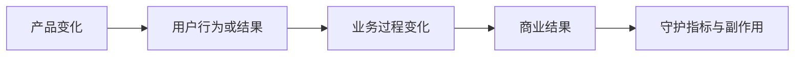

# 用户价值、商业价值、实现成本与机会成本

产品决策不是判断一个想法“有没有价值”，而是比较从当前时点开始，不同选择能为谁改善什么结果、组织怎样获得回报、需要承担哪些全生命周期成本，以及选择它会放弃什么更好的机会。

## 四个概念

| 概念 | 定义 | 必须说明 |
| --- | --- | --- |
| 用户价值 | 用户任务、结果或风险相对当前做法的改善 | 受益角色、基线、改善单位和证据 |
| 商业价值 | 用户结果通过可解释路径对收入、留存、成本、风险或战略能力的贡献 | 作用路径、时间范围和反证 |
| 实现成本 | 从发现、设计、建设到运行、支持和退役所需的全部资源与风险 | 一次性、固定、变量和风险成本 |
| 机会成本 | 选择当前方案而放弃的最佳可执行替代方案的预期价值 | 具体备选、资源冲突和比较期限 |

四者不能压缩成一个未经解释的总分。单位、证据质量和风险容忍度不同，决策记录需要保留原始假设与区间。

## 用户价值

用户价值必须相对当前基线表达。常见结果包括：

- 更快完成任务，减少等待、切换与返工；
- 提高准确性、完整性和一致性；
- 降低金钱、隐私、安全或合规风险；
- 让原本无法完成的人能够完成；
- 减少学习、记忆和协调负担；
- 增强控制，例如撤销、解释、确认和恢复；
- 改善可访问性和不同渠道的连续性。

“用户喜欢”“使用量高”和“功能先进”都不是最终价值。它们最多是中间信号。需要继续验证用户是否更好地完成目标，以及价值是否大于新增成本。

### 价值单位

不同任务使用不同单位：分钟、错误数、成功率、等待天数、损失金额、风险事件、需要协作的人数或原本无法完成的任务比例。单位应能从输入数据复算。

例如自动摘要节省阅读时间，但增加核验时间。净时间价值为：

```text
每份净节省时间 = 原阅读时间 - 使用摘要后的阅读时间 - 额外核验时间
```

若原阅读 18 分钟，摘要阅读 5 分钟，核验 10 分钟，则净节省为 `18 - 5 - 10 = 3` 分钟，而不是宣传“节省 13 分钟”。

### 价值分布

平均改善可能掩盖不同角色和场景。新手节省 10 分钟，专家反而多花 3 分钟；正常任务更快，高风险任务错误增加。至少按角色、频率、任务复杂度和风险切片。

## 商业价值

商业价值不是用户价值的同义词。它描述组织为什么持续投入以及如何维持交付：

- 收入：新增购买、升级、用量、交易或续约；
- 留存：降低流失、提高持续使用和扩展；
- 获客：降低体验、销售、实施或迁移阻力；
- 成本：减少人工处理、支持、基础设施或错误返工；
- 风险：减少事故、欺诈、退款、监管和声誉损失；
- 战略能力：建立可复用平台、数据能力或进入新市场的条件。

每条商业价值都要写作用链：



例如“批量导出 → 财务更快完成月结 → 企业使用关键流程的频率增加 → 续约风险降低”仍是假设。需要检查导出是否真的缩短月结，以及月结使用与续约的关系是否存在。不能直接把功能点击归为收入贡献。

### 商业价值的时间边界

短期收入可能造成长期支持成本和信任损失。记录观察期限：发布周、季度、续约周期或多年运营。基础设施投资可能首期成本高、多个产品长期复用；促销可能当期转化高但后续流失增加。

## 实现成本

实现成本覆盖整个生命周期，不只是工程工时。

### 一次性建设成本

- 问题研究、方案设计和原型；
- 开发、测试、安全评审和无障碍检查；
- 数据准备、模型评测和迁移；
- 文档、培训、销售与支持准备；
- 灰度、回滚、合同和合规工作。

### 持续固定成本

- 值班、监控、支持和运营人员；
- 基础设施最低容量和供应商合同；
- 安全、权限、审计和定期评测；
- 文档、依赖、兼容性和政策维护；
- 即使使用量不增长也必须承担的维护。

### 变量成本

- 每次 API、模型、存储、带宽和支付费用；
- 按工单、交易或用户增长的人工处理；
- 退款、争议、内容审核和欺诈损失；
- 随数据量增加的索引、备份和保留成本。

### 风险成本

风险不能简单用最坏损失相加。记录发生概率区间、影响范围、可检测性和恢复能力。高影响、不可逆或合规风险即使发生率低，也可能成为硬门槛而非平均成本项。

### 退役和迁移成本

功能停止时仍需通知、导出、数据删除、替代流程、合同处理和历史兼容。没有退役方案的功能会形成长期锁定。

## 机会成本

机会成本是被放弃的最佳可执行选择，不是所有未做想法之和。计算它需要先明确受约束资源，例如同一两名工程师、一个季度预算、有限发布窗口或安全评审容量。

假设团队只能做一个项目：

| 选择 | 预期季度净价值 | 证据置信度 |
| --- | ---: | --- |
| 自动摘要 | ¥120,000 | 低 |
| 搜索改进 | ¥90,000 | 高 |
| 账单错误修复 | ¥70,000 | 高，且风险硬门槛 |

选择摘要的机会成本通常是搜索改进的预期价值，但若账单错误属于必须修复的风险约束，则它不是普通可选项。决策顺序应先满足不可接受风险，再比较可选投资。

“什么都不做”也是方案。它可能保留资源、等待信息或避免迁移，但会继续承担当前损失。

## 沉没成本与增量比较

已经发生且无法收回的投入是沉没成本，不应成为继续投入的理由。决策从当前时点比较未来增量价值和未来增量成本。

错误表达：“已经开发两个月，所以必须上线。”

正确比较：“从现在开始还需 6 周、¥80,000 和持续每月 ¥12,000；继续方案的预期未来净价值是否高于停止、缩小或转向的替代方案？”

历史投入仍可用于学习和资产复用，但不能改变未来资源的机会成本。

## 建立决策表

```json
{
  "option": "assisted-summary-v1",
  "user_outcome": {
    "metric": "net_minutes_saved_per_document",
    "baseline": 18,
    "target_range": [3, 6]
  },
  "business_path": "time_saved -> repeated_use -> paid_upgrade",
  "one_time_cost_range_cny": [180000, 260000],
  "monthly_fixed_cost_range_cny": [18000, 26000],
  "variable_cost_cny_per_document": [0.08, 0.22],
  "major_risks": ["unsupported_claim", "sensitive_data_exposure"],
  "best_alternative": "search-relevance-improvement",
  "confidence": "low",
  "reversal_condition": "median_verification_time_above_12_minutes"
}
```

区间比单点更诚实。每个字段附来源、日期和责任人；事实、估算和判断分开。

## 敏感性分析

敏感性分析检查哪些假设会改变选择。基本步骤：

1. 找出不确定且影响大的变量；
2. 为变量设置合理低、中、高值；
3. 重新计算净结果；
4. 找出结论反转的阈值；
5. 优先验证最接近反转阈值的假设。

例如每月 50,000 份文档，单份变量成本可能为 ¥0.08–¥0.22，则月变量成本为 ¥4,000–¥11,000。若付费增量只有 ¥8,000，高成本情形下商业价值可能为负。下一步应先用小规模实际 Usage 测量，而不是继续优化宣传页。

## 证据来源与验证方法

- 行为数据：完成时间、错误、重试、撤销、采用和留存；
- 日志与成本账单：计算调用量、存储、带宽、支持和失败成本；
- 公开评论与客服材料：识别任务后果和核验负担；
- 帮助文档与状态页：发现流程限制、已知问题和运营要求；
- 定价、财报和公开采购材料：理解收费对象与商业路径；
- 竞品拆解：比较替代方案的价值单位、价格和迁移成本；
- Dogfooding 与任务计时：建立当前流程基线；
- 小流量原型或人工模拟：在完整建设前测量结果。

行为相关不等于因果。付费用户更常使用某功能，可能因为他们本来任务更多。需要配对比较、分阶段发布、实验或其他证据排除解释。

## 完整案例：文档自动摘要

### 输入与证据

团队考虑为企业文档产品增加摘要。现有证据：

- 60 次授权任务计时中，阅读一份文档中位数 18 分钟；
- 搜索日志显示长文档打开后 35% 在 30 秒内离开；
- 24 条客服记录提到“难以快速判断是否相关”；
- 竞品有摘要，但定价和核验方式不同；
- 模型离线评测在 100 份去标识文档中有 8 份出现不支持结论；
- 搜索改进是同一团队当前最佳备选，预计能减少无结果查询。

### 步骤一：定义用户价值

目标不是“生成摘要”，而是帮助用户更快判断文档是否相关并定位需阅读全文的部分。价值指标为每份净节省时间、相关判断准确率和遗漏关键风险率。

### 步骤二：建立商业路径

假设链为：判断更快 → 更多任务在产品内完成 → 团队持续使用 → 高级套餐采用。每一段单独验证，不能用摘要点击直接证明升级收入。

### 步骤三：估算成本

一次性成本包括设计、实现、1000 份评测、权限检查和上线支持，区间 ¥180,000–¥260,000。月固定成本 ¥18,000–¥26,000。单文档变量成本 ¥0.08–¥0.22；另有人工抽检和错误支持。

### 步骤四：比较四个方案

| 方案 | 用户结果 | 一次性成本 | 持续成本 | 风险 |
| --- | --- | ---: | ---: | --- |
| 不做，保留现状 | 无改善 | 0 | 当前损失继续 | 流失问题持续 |
| 改善目录与搜索片段 | 更快定位相关段落 | 中 | 低 | 召回错误 |
| 仅生成抽取式关键句 | 节省有限但可追溯 | 中 | 低至中 | 关键句遗漏 |
| 生成式摘要并引用 | 潜在节省最高 | 高 | 中至高 | 不支持结论与隐私 |

先选择“生成式摘要 + 段落引用 + 明确非权威提示”的受控原型，与搜索片段方案并行小样本比较，不立即全面上线。

### 输出

决策卡记录：目标用户为需要判断文档相关性的知识工作者；非目标为法律和财务最终判断；发布门槛为净节省中位数至少 4 分钟、关键结论支持率至少 98%、高风险文档自动摘要默认关闭；单位成功任务成本低于 ¥0.30。

### 验证

用 80 份未参与 Prompt 调试的文档做配对任务。方案 A 为搜索片段，方案 B 为摘要与引用。每位测试者在受控任务中核对相关性和关键事实，记录阅读、核验、错误与放弃。

假设 B 的中位摘要阅读 5 分钟、核验 11 分钟，则净节省 `18 - 5 - 11 = 2` 分钟，低于 4 分钟门槛；关键支持率为 `156/160 = 97.5%`，也低于 98%。即使摘要打开率高，也不能全面发布。

### 失败分支

- 核验时间超过 12 分钟：净用户价值接近或低于零，停止扩大；
- 高风险切片出现不支持结论：默认关闭并改用抽取或人工流程；
- 使用高但任务结果无改善：把采用视为探索行为，不宣称价值成立；
- 付费相关性无法排除用户规模差异：不归因于摘要；
- 变量成本超过收入增量：降低调用、调整包装或停止；
- 搜索改进以更低成本达到同等结果：机会成本使摘要降级。

## 决策检查

- 用户价值是否有角色、场景、基线和单位；
- 商业价值是否写出完整作用路径；
- 成本是否包含建设、运行、支持、风险和退役；
- 变量成本是否按真实用量计算；
- 是否与不做、轻量方案和最佳备选比较；
- 是否排除沉没成本；
- 是否报告区间、置信度和反转阈值；
- 高风险是否使用单独门槛；
- 验证指标是否衡量结果而不是点击；
- 失败时是否可以缩小、转向或停止。

## 练习

### 练习一：全成本表

选择一个 AI 功能，列出一次性、固定、变量、风险和退役成本，并用低中高三种用量计算月成本。

验收：所有数字有单位和来源；子项不重复；至少一个成本随使用量增长；能指出哪个变量最可能使结论反转。

### 练习二：机会成本比较

为同一资源约束下的三个候选项目写用户价值、商业路径和成本区间，包含“不做”。

验收：机会成本指向最佳可执行备选；沉没成本不参与未来比较；硬风险先于普通收益；最终选择附停止条件。

## 来源

- [UK Government：The Green Book](https://www.gov.uk/government/publications/the-green-book-appraisal-and-evaluation-in-central-government)（访问日期：2026-07-17）
- [GOV.UK：Define what success looks like](https://www.gov.uk/service-manual/service-standard/point-10-define-success-publish-performance-data)（访问日期：2026-07-17）
- [AWS Well-Architected：Cost Optimization](https://docs.aws.amazon.com/wellarchitected/latest/cost-optimization-pillar/welcome.html)（访问日期：2026-07-17）
- [FinOps Foundation：FinOps Framework](https://www.finops.org/framework/)（访问日期：2026-07-17）
