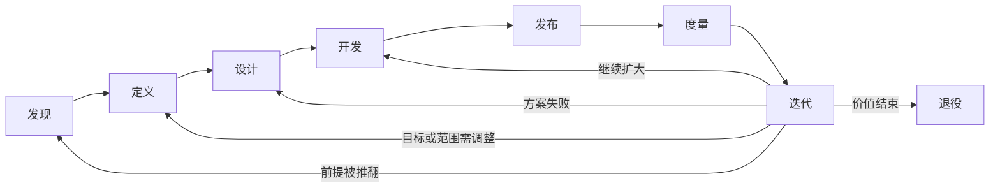

# 产品生命周期：发现、定义、设计、开发、发布、度量与迭代

产品生命周期是从识别问题到持续交付、度量、调整和退役的一组活动。它不是必须依序完成的瀑布阶段，也不是上线前的项目清单。每项活动以风险是否降低、证据是否足够和结果是否可验证作为推进条件。

## 七项核心活动

| 活动 | 关键问题 | 退出证据 |
| --- | --- | --- |
| 发现 | 问题是否真实、重要并值得处理？ | 场景、当前流程、损失和约束证据 |
| 定义 | 要改善什么，范围和风险是什么？ | 目标、指标、非目标、假设与决策 |
| 设计 | 哪种机制最适合，怎样失败和恢复？ | 候选比较、流程、原型和关键风险验证 |
| 开发 | 能否可靠、安全、可维护地实现？ | 验收、测试、迁移和可发布状态 |
| 发布 | 怎样受控交付并在异常时回退？ | 灰度、监控、支持、回滚与责任人 |
| 度量 | 用户与组织结果是否改善？ | 核心、守护指标和定性故障证据 |
| 迭代 | 应扩大、保持、调整、停止还是退役？ | 基于门槛的下一决策与复查日期 |

生命周期持续循环：



## 发现

发现阶段建立问题证据，不以收集功能愿望为目标。输入可以来自公开评论、客服与 FAQ、行为数据、日志、任务观察、竞品拆解、政策材料、状态页和当前人工流程。

需要回答：谁在什么场景遇到问题；现在怎样完成；问题频率、严重度和影响范围；为什么现有替代不足；组织为何要投入；最大不确定性是什么。

个人研究无需把用户访谈设为必经路径。公开材料与可复现行为可以建立初始问题模型，但要区分事实、观察和推断，并主动寻找反例。

发现的错误退出条件是“写完调研报告”。正确条件是关键问题有足够证据，可以决定停止、继续验证或进入定义。

## 定义

定义把问题转成可检验决策边界：

- 目标用户、场景和当前基线；
- 要改善的结果与期限；
- 核心指标和不得恶化的守护指标；
- 范围、非目标与责任边界；
- 关键假设、依赖和风险；
- 发布、停止和回退条件。

目标不能写成“上线功能”。例如“将有权限用户的账单导出成功率从 82% 提高到 95%，同时不增加数据越权事件”比“重做导出”更可验证。

## 设计

设计不只产生界面。它比较流程、规则、内容、人工服务和软件机制，明确正常路径、权限、状态、边界、失败和恢复。

至少生成三个机制不同的候选，针对最大风险选择验证方法：可用性风险用任务原型，价值风险用低成本服务模拟，技术风险用 Spike，数据风险用固定 Fixture，运营风险用服务蓝图与演练。

设计退出前应确认最危险假设已降低到可接受范围，而不是所有页面达到高保真。

## 开发

开发把方案变成可运行、可测试、可观测和可回退的系统。除正常功能外还包括：

- 权限、隐私、安全和审计；
- 状态、并发、幂等、超时和恢复；
- 数据迁移、兼容和删除；
- 监控、告警、日志与成本上限；
- 无障碍、内容、帮助和支持准备；
- 单元、集成、端到端和故障测试。

“代码完成”不等于可发布。验收需要覆盖用户结果和系统边界。

## 发布

发布是把变化交付给真实环境并管理影响。计划至少包含：

| 项目 | 内容 |
| --- | --- |
| 受众 | 谁先获得，哪些人排除 |
| 灰度 | 比例、时间和扩大条件 |
| 迁移 | 数据、权限、兼容和回退 |
| 监控 | 核心、守护、可靠性与成本 |
| 支持 | 文档、客服、状态和责任人 |
| 回滚 | 触发、执行者、数据处理 |
| 通知 | 对用户和运营角色说明什么 |

部署成功只表示代码进入环境。用户是否发现、理解、采用并完成任务仍需验证。

## 度量

度量连接发布变化与结果。至少区分：

- 输入：发布覆盖、配置和数据版本；
- 采用：符合条件的人是否开始使用；
- 任务：是否完成目标、耗时和错误；
- 质量：准确、完整、恢复和满意度；
- 商业：收入、续约、成本或风险路径；
- 守护：负面影响、安全、公平和支持量。

指标变化不自动证明由发布导致。检查同期活动、用户构成、季节性和测量口径变化。小流量、分阶段发布、配对任务和固定回归可以增强判断。

## 迭代与退役

迭代有五种合法决策：扩大、保持、调整、停止新增、退役。不能默认每轮继续增加功能。

退役同样是生命周期活动，需要：使用和依赖清单、替代路径、通知期限、数据导出与删除、合同和 API 弃用、支持安排、最终监控和责任人。

沉没成本不应阻止停止。决策比较未来增量价值、成本和机会成本。

## 生命周期证据记录

```json
{
  "initiative": "async-billing-export",
  "current_activity": "controlled-release",
  "problem_evidence": ["export-timeout-log-v3", "support-cluster-18"],
  "target": "eligible_export_success_rate >= 0.95",
  "guardrails": ["cross-tenant-access = 0", "support_rate <= 0.03"],
  "release_scope": "10_percent_eligible_accounts",
  "rollback": "disable_async_export_and_keep_legacy_path",
  "decision_date": "2026-07-17",
  "next_review": "2026-07-24"
}
```

记录引用具体证据与版本。环境别名、当前页面或口头结论不足以重建历史决策。

## 完整案例：异步账单导出

### 输入与证据

日志显示过去 30 天有 2,000 次大账单导出，其中 360 次超时，成功率 `1640/2000 = 82%`；客服有 74 条相关记录；任务观察发现用户失败后重复点击，造成重复任务。权限文档要求只能导出当前组织账单。竞品采用后台任务、进度和邮件通知。

### 发现与定义

问题是大文件同步生成超过请求时限，用户无法判断进度并重复提交。目标是将符合条件的导出成功率提高到 95%，重复任务率低于 2%，跨组织数据事件为 0。非目标是重做账单查询和支持任意格式。

### 设计

比较提高超时、拆分文件、异步任务三种方案。提高超时仍占用连接；拆分改变用户工作；异步任务可保存进度但增加状态和通知复杂度。选择异步任务，状态为 `queued/running/completed/failed/expired/cancelled`，写明权限、幂等、过期和重试。

### 开发

实现任务 ID、当前组织权限校验、同一请求幂等键、受控下载链接、进度、取消和失败原因。用固定 Fixture 测试正常、空数据、超大数据、权限变更、重复提交、Worker 重启和链接过期。

### 发布

先向 10% 符合条件组织开放，保留旧路径。监控成功率、排队、完成时间、重复任务、权限拒绝、支持量和成本。若跨租户访问不为 0、成功率低于 90% 或队列 P95 超过 20 分钟，立即关闭新路径。

### 输出与验证

首周新路径 300 次导出，成功 291 次，成功率 `291/300 = 97%`；重复任务 3 次，比例 1%；权限越界 0；队列 P95 8 分钟；支持率 2%。达到预设门槛，可扩大到 30%。仍保留失败样例回归，不直接全量。

### 失败分支

- 成功率提高但完成时间过长：调整容量或限制范围，不用成功率掩盖等待；
- 重复任务仍高：检查状态可见性和幂等，而非只加提示；
- 支持量上升：检查通知、下载过期和旧新路径差异；
- 权限在排队期间变化：执行时再次授权，不能只在创建时检查；
- 成本超过预算：优化批处理或设置上限，不静默降低质量；
- 使用下降：区分任务减少、入口不可见和用户转向旧路径。

## 常见错误

- 把生命周期当线性瀑布；
- 用文档完成代替证据退出；
- 发现只收集功能请求；
- 定义目标写成按时上线；
- 设计只画正常界面；
- 开发忽略迁移、支持和恢复；
- 发布等同部署；
- 度量只看点击和总平均；
- 迭代默认继续增加功能；
- 没有停止与退役路径。

## 练习

选择一个已上线功能，重建七项活动证据链。验收：每项有输入、产出、决策和日期；至少使用公开材料、行为或数据三类证据；目标包含核心与守护指标；设计含三个候选；发布有灰度和回滚；明确扩大、调整、停止与退役条件。

## 来源

- [GOV.UK：Agile delivery phases](https://www.gov.uk/service-manual/agile-delivery)（访问日期：2026-07-17）
- [GOV.UK：How the discovery phase works](https://www.gov.uk/service-manual/agile-delivery/how-the-discovery-phase-works)（访问日期：2026-07-17）
- [GOV.UK：Iterate and improve frequently](https://www.gov.uk/service-manual/service-standard/point-8-iterate-and-improve-frequently)（访问日期：2026-07-17）
- [GOV.UK：Define success and publish performance data](https://www.gov.uk/service-manual/service-standard/point-10-define-success-publish-performance-data)（访问日期：2026-07-17）
