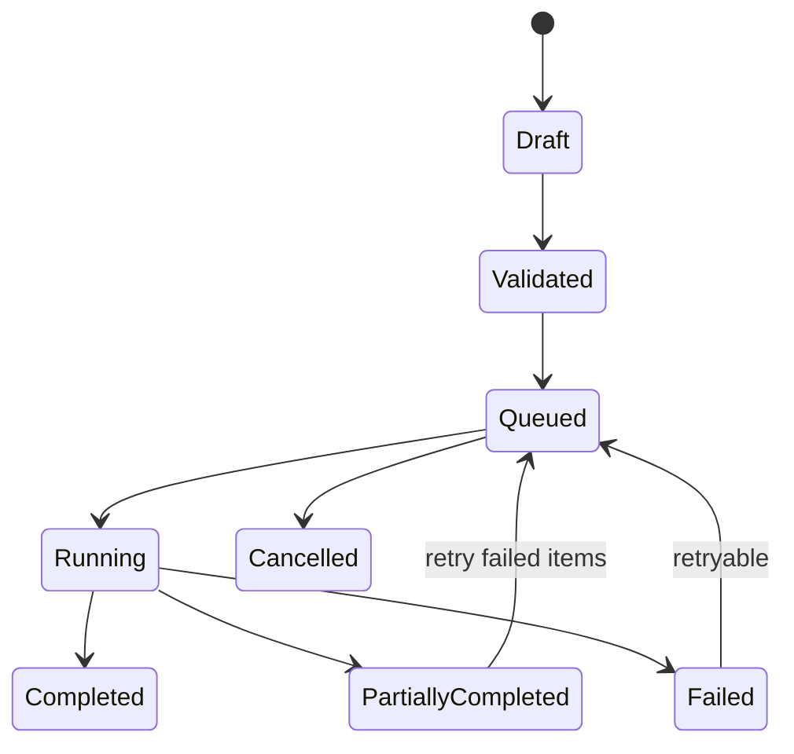

# 主流程、分支、失败、权限与恢复路径

产品拆解不能只记录最顺利的一条操作路径。真实任务会因角色、输入、状态、网络、并发和外部依赖进入不同分支。完整拆解要说明每个状态怎样进入、谁可以触发、失败后哪些数据已改变，以及用户怎样回到安全且可理解的状态。

## 从状态而不是页面开始

页面会重排，状态和业务事件更接近任务本质。用以下结构记录一次转换：

```text
当前状态 + 角色 + 用户事件
→ 输入与权限校验
→ 系统或外部处理
→ 新状态或错误
→ 用户反馈与恢复动作
```

例如批量邀请不是“名单页 → 弹窗 → 成功页”，而是：草稿 → 已校验 → 处理中 → 全部成功、部分成功或失败 → 接受、过期、撤销等后续状态。

## 主流程

主流程是在目标场景中最常见、满足前置条件并最终成功的路径。它至少包含：

- 起始与完成状态；
- 适用角色和权限；
- 输入及校验；
- 用户动作和系统反馈；
- 中间持久化状态；
- 最终结果的验证方式。

主流程不等于只画正常界面。异步任务必须包含请求接受、处理中和最终完成；涉及第二角色时，要包含对方实际获得结果。

## 分支

分支来自可枚举的条件：

| 分支来源 | 示例 | 拆解要求 |
| --- | --- | --- |
| 角色 | 管理员、成员、外部对象 | 权限和可见信息分别验证 |
| 输入 | 空值、重复、无效、超限 | 指出触发字段和修正方式 |
| 对象状态 | 已存在、已删除、处理中 | 防止重复和冲突 |
| 用户选择 | 全部、部分、稍后处理 | 说明不同结果和撤销 |
| 组织规则 | 域名、套餐、审批策略 | 在操作前可发现 |
| 渠道 | Web、移动、邮件深链、API | 最终规则应一致 |
| 外部依赖 | 邮件、支付、身份服务 | 区分本系统与第三方完成 |

分支数量不是越多越好。分析目标是覆盖会改变结果、风险或恢复方式的条件。

## 失败分类

### 输入与校验失败

格式、缺失、重复和范围错误应定位到具体对象，并尽可能在提交前发现。错误提示说明发生什么、怎样修正，且保留其他合法输入。

### 权限失败

用户没有读取、修改、批准或执行权限。隐藏按钮只能降低误操作，不能证明服务端强制授权。拆解只能记录可见行为和公开权限；没有证据时不推断后端实现。

### 状态冲突

对象已被其他人修改、删除或处理。产品需要保护最新状态、显示冲突并避免静默覆盖。跨设备和多窗口尤其容易暴露问题。

### 网络与超时

请求可能根本未到达，也可能已经执行但响应丢失。结果未知时，直接重试可能重复扣款、邀请或创建。产品应提供状态查询或幂等恢复。

### 限流与容量

限流、配额、文件大小、并发和队列容量需要明确单位、重置时间和恢复。永久限制与临时限流不能共用含糊的“稍后重试”。

### 外部依赖失败

本系统已接受请求，不代表邮件送达、银行完成退款或第三方身份验证成功。产品应展示责任边界和最终状态。

### 部分成功

批量任务中部分对象成功、部分失败。必须逐项记录，重试只针对失败项，并防止成功对象重复执行。

## 权限

权限拆解包含主体、对象、动作和条件：

```text
谁（主体）在什么组织和会话中
可以对哪个资源（对象）
执行什么动作
在什么条件下生效
```

同一“管理员”可能只有账单、成员、安全或内容权限。产品应遵循最小权限，并在执行时使用当前身份重新校验。模型输出、客户端角色字段和隐藏控件都不能授予权限。

### 权限错误的反馈

反馈既要可行动，也不能泄露用户不该知道的资源存在、成员信息或安全配置。常见恢复是申请权限、切换组织、联系管理员或使用允许的替代路径，而不是重复提交。

## 恢复路径

恢复让用户从失败回到安全状态：

- 修正：修复具体输入并保留其他内容；
- 重试：仅用于可重试错误，有限次数并防重复；
- 查询：结果未知时先查询权威状态；
- 撤销：恢复到先前状态，说明有效期限；
- 补偿：不可直接撤销时执行反向业务动作；
- 降级：使用较小批次、离线导出或人工流程；
- 转介：权限、政策或复杂风险交由管理员或支持；
- 继续：部分成功后从失败对象继续。

“返回上一页”只改变导航，不一定恢复数据、权限或业务状态。

## 幂等与重复操作

幂等表示同一个业务意图重复执行，不产生额外副作用。支付、退款、邀请和订单创建尤其需要。

界面禁用按钮只能减少快速双击，无法覆盖刷新、网络重试、多个设备和客户端。具体实现由服务端决定；拆解从行为验证：重复相同请求后，最终只有一个业务结果。

## 异步任务

异步操作至少包含：



用户关闭页面后仍应能重新找到任务；状态必须有时间、对象和结果；失败原因要区分可重试与永久错误。

## 证据分级

- 观察事实：指定测试中 5 个邀请有 3 个成功、2 个无效；
- 推断：产品可能按对象支持部分成功；
- 假设：展示逐项结果会减少全量重试。

推断需要再次查询最终状态验证。假设需要指标和可逆改动。不能根据加载动画断言使用队列，也不能根据隐藏按钮断言后端权限安全。

## 路径记录

```json
{
  "path_id": "batch-invite-partial-v1",
  "from": "validated",
  "event": "submit_batch",
  "role": "organization-admin",
  "inputs": {"valid": 2, "invalid": 2, "existing": 1},
  "result": "partially_completed",
  "successful": 2,
  "failed": 2,
  "skipped_existing": 1,
  "recovery": "correct_and_retry_failed_only",
  "invariant": "successful_recipients_are_not_invited_twice"
}
```

## 完整案例：批量邀请成员

### 输入与证据

使用自己控制的测试组织、管理员和普通成员账号。准备 5 个测试地址：2 个有效新地址、2 个格式无效、1 个已有成员。公开角色文档说明谁能邀请；帮助页说明邀请状态和限制。测试记录环境、日期和最终成员列表。

观察事实是公开权限和实际结果；“逐项校验减少管理员返工”是推断；“新增结果表会提高批量任务完成率”是待验证假设。

### 步骤一：画主流程

管理员打开邀请入口，输入地址，产品校验，用户确认，系统发送，管理员查看结果，收件人接受后进入成员状态。最终完成不仅是“邮件已发送”，还包括邀请可查询、可撤销以及目标对象能加入。

### 步骤二：枚举分支

覆盖单个与批量、已有成员、外部域名、需要审批、邀请过期、成员上限和不同角色。每个分支记录起始状态与最终状态。

### 步骤三：验证权限

普通成员从导航和直接 URL 尝试邀请；管理员执行同一任务；在提交前后撤销管理员权限。记录产品行为，不把前端结果外推为完整服务端机制。

### 步骤四：执行混合批次

提交 5 个地址，记录校验是在提交前还是后发生、合法输入是否保留、结果是整体失败还是部分成功。查询待邀请和成员列表验证每个对象。

### 步骤五：测试恢复

修正 2 个无效地址，只重试失败项；重复提交原批次；断网后恢复并先查询状态；撤销一个已发送邀请；让一个邀请过期。

### 输出

输出主状态图、路径矩阵、权限表和恢复表。结果必须逐项说明成功、失败、跳过和未知；错误包含影响范围、是否持久化、下一步和可否重试。

### 验证

- 最终列表与逐项提示一致；
- 有效对象只收到一个活动邀请；
- 修正失败项不会重复成功项；
- 普通成员不能通过直接链接执行；
- 断网结果未知时可以查询；
- 撤销和过期后目标对象不能加入；
- 关闭页面后管理员能重新找到任务。

### 失败分支

- 无法查询最终状态：请求接受不能记为完成；
- 混合批次整体失败：记录原子行为，不假设部分已处理；
- 统一错误没有对象信息：原因只能保持未知；
- 重复提交产生两个活动邀请：幂等守护失败；
- 邮件未到但深链可加入：分开投递与成员结果；
- 权限在处理中撤销：若无法验证执行时授权，记录为风险；
- 限流没有恢复时间：用户无法选择等待、缩小批次或转人工。

## 非软件替代

管理员可以用表格收集名单后逐个添加，或提交 IT 工单。人工流程较慢，但能在低频高风险场景增加复核。比较批量功能时使用相同名单，记录总时间、误邀请、权限、撤销、审计和持续人工成本。

## 拆解检查表

- 是否使用状态而不是页面名；
- 主流程是否达到用户结果；
- 角色、输入、状态和依赖分支是否覆盖；
- 权限是否在直接入口和执行阶段测试；
- 错误是否区分可重试与永久；
- 结果未知时是否先查询；
- 部分成功是否逐项保存；
- 重试是否避免重复副作用；
- 异步任务是否可重新找到；
- 恢复是否回到安全状态；
- 事实、推断和假设是否分开；
- 是否比较人工和逐个处理方案。

## 路径覆盖与结果指标

拆解完成后建立覆盖表，避免路径很多但关键风险未测试：

| 指标 | 计算方式 | 解释边界 |
| --- | --- | --- |
| 路径覆盖 | 已执行路径 / 预先定义路径 | 只表示测试覆盖，不代表生产发生率 |
| 主流程成功率 | 达到用户结果的主流程次数 / 主流程试验 | 需固定环境和输入 |
| 恢复成功率 | 恢复后完成的失败任务 / 可恢复失败任务 | 永久错误不进入分母 |
| 重复副作用率 | 产生重复业务结果的重试 / 重试任务 | 支付、邀请等应设硬门槛 |
| 未知结果率 | 无法确认最终状态的任务 / 已提交任务 | 不能从分母中删除 |
| 权限越界数 | 未授权角色成功执行次数 | 通常要求为 0 |
| 部分成功可恢复率 | 正确续跑失败项的任务 / 部分成功任务 | 同时核对成功项未重复 |

个人复现报告原始计数，例如 14 条预定义路径已执行 14 条，其中 2 条进入未知结果。不能把 `12/14` 解释为真实用户成功率，但可以明确产品还有哪些状态不可确认，并用于同版本回归。

路径优先级按失败影响、可恢复性和发生证据决定。权限越界、重复扣款和数据丢失即使在个人测试中只出现一次，也不能被大量正常路径平均掉。低影响文案差异则可以先记录而不阻止整个任务判断。

## 练习

选择批量导入、批量删除或付款任务，画状态转换并建立至少 12 条路径。

验收：包含主流程、两类角色、三类输入分支、权限、网络未知、部分成功、重复提交、异步状态和不可逆动作；每条路径有最终状态、证据和恢复；至少一个非软件替代；所有推断给出验证条件。

## 来源

- [GOV.UK Design System：Error message](https://design-system.service.gov.uk/components/error-message/)（访问日期：2026-07-17）
- [GitHub Docs：Repository roles](https://docs.github.com/en/organizations/managing-user-access-to-your-organizations-repositories/repository-roles-for-an-organization)（访问日期：2026-07-17）
- [Stripe API：Idempotent requests](https://docs.stripe.com/api/idempotent_requests)（访问日期：2026-07-17）
- [MDN：HTTP response status codes](https://developer.mozilla.org/en-US/docs/Web/HTTP/Reference/Status)（访问日期：2026-07-17）
