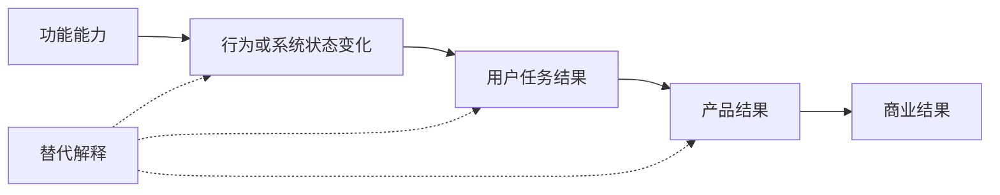

# 功能的用户价值与产品目标作用

功能拆解不能以“产品提供了什么”结束。需要说明特定角色在特定场景中的任务结果是否相对当前做法改善，以及这种改善怎样支持产品在限定时间内希望达到的结果。功能、行为、用户结果、产品目标和商业结果之间必须逐层验证。

## 用户价值

用户价值是任务结果相对基线的净改善。它至少包含：

| 字段 | 要回答的问题 |
| --- | --- |
| 受益角色 | 谁获得改善，谁可能受损？ |
| 场景 | 在什么触发和约束下发生？ |
| 当前基线 | 现在的成功率、耗时、错误或风险是什么？ |
| 变化机制 | 功能具体改变什么行为或状态？ |
| 结果单位 | 时间、成功、质量、成本、控制或风险怎样变化？ |
| 新成本 | 学习、配置、核验、迁移和副作用是什么？ |

价值不是点击、曝光、停留或功能使用量。它们可以是过程信号，但只有连接到任务结果后才能支持价值判断。

### 净价值

功能可能减少操作，同时增加核验和错误恢复。以时间为例：

```text
净节省时间 = 原任务时间 - 新任务执行时间 - 新增核验与恢复时间
```

批量编辑把 20 次操作降为 3 次，但若错误后需要逐项复查 30 分钟，不能只用操作数证明价值。

### 价值分布

平均改善会掩盖受损群体。拆解至少按角色、组织规模、新老用户、设备、地区、任务复杂度和风险切片。管理员更快不应以普通成员权限错误增加为代价。

## 产品目标

产品目标是产品在明确时间范围内希望影响的结果。它不应写成“上线功能”“完成改版”或“增加 AI”。

合格目标包含：

- 目标用户和场景；
- 当前基线；
- 结果指标与目标值；
- 截止或观察窗口；
- 守护指标和不可接受结果；
- 适用范围与非目标。

例如：“在第三季度，把符合条件组织 7 日内正确完成权限配置的比例从 54% 提高到 65%，同时配置错误率不高于 3%、权限越界为 0。”

## 功能到目标的因果链



### 功能能力

说明输入、行为和输出。例如“选择多个成员并一次应用同一权限”，而不是“批量功能”。

### 行为变化

用户减少重复输入、系统减少等待、管理员增加复核等。行为改变仍不等于任务完成。

### 用户结果

任务是否更快、更准确、更可恢复或更低风险。必须使用当前基线比较。

### 产品结果

更多目标用户完成激活、持续使用关键任务或减少问题。产品结果往往受入口、支持、数据和其他功能影响。

### 商业结果

收入、留存、成本或风险进一步变化。距离功能最远，不能把同期增长直接归因单一功能。

## 每个箭头如何验证

为每个箭头记录：

1. 观察证据；
2. 推断机制；
3. 待验证假设；
4. 替代解释；
5. 指标和数据源；
6. 失败门槛。

例如批量编辑发布后完成率提高，替代解释包括同期培训、组织规模变化和任务定义变更。只有控制或检查这些因素，才能增强因果判断。

## 事实、推断与假设

- 观察事实：帮助文档存在批量编辑；受控任务操作从 42 步降至 15 步；
- 推断：重复操作减少可能降低管理员负担；
- 假设：7 日正确配置完成率将提高且错误不增加。

营销主张、产品设计意图和用户实际结果也应分开。产品说“提高效率”只证明公开主张，不证明效果。

## 指标层级

### 能力指标

结构是否可用、请求是否成功、延迟和错误。它验证产品能运行。

### 过程指标

入口到达、功能开始、步骤、操作和放弃。它解释路径。

### 用户结果指标

任务成功、时间、错误、完整和恢复。它更接近价值。

### 产品结果指标

激活、关键任务持续完成、留存和支持量。需要明确行为定义。

### 守护指标

质量、安全、隐私、公平、成本和受损任务。守护阈值必须在发布前决定。

## 指标契约

```json
{
  "name": "seven_day_correct_configuration_rate",
  "formula": "eligible_orgs_correctly_completed_within_7d / eligible_orgs_started",
  "subject": "organization",
  "window": "7_days_after_first_configuration_start",
  "data_source": "configuration_events_v4",
  "baseline": 0.54,
  "target": 0.65,
  "segments": ["organization_size", "new_vs_existing", "plan"],
  "guardrails": {
    "configuration_error_rate": "<=0.03",
    "unauthorized_change_count": "=0",
    "support_rate": "no_increase_above_0.01"
  }
}
```

指标需要固定主体、事件、窗口、分母、数据源和版本。结果出现后改变“正确完成”定义会破坏比较。

## 非访谈证据

- 帮助、权限和发布文档确认产品公开能力；
- 自己控制的账号复现任务、错误和权限；
- 公开评论、Issue、客服材料发现失败与后果；
- 授权事件和日志建立任务基线与分群；
- 竞品拆解比较机制和结果；
- 表格、人工工单和逐项操作作为非软件或低自动化基线；
- 灰度、配对任务和固定回归验证变化。

个人复现不能代表总体分布，公开评论不能直接当频率。结论保持在证据层级。

## 完整案例：批量编辑团队权限

### 输入与证据

目标产品允许管理员逐项修改成员权限。官方权限文档确认角色；使用自己控制的 20 名测试成员复现，逐项配置需要 42 次操作、8 分钟；授权漏斗显示 100 个符合条件的新组织中 54 个在 7 天内完成正确配置；18 条支持记录涉及重复配置和漏改。竞品提供批量选择，当前非软件替代是表格确认后提交 IT 工单。

观察事实：步骤、耗时、基线和支持记录。推断：重复操作是阻碍之一。假设：多选、预览和一次应用将提高正确完成率。

### 步骤一：写能力和边界

能力为“管理员选择同一组织内多个成员，预览后应用同一项目权限”。非目标是跨组织修改、批量改变组织所有者和绕过成员资格。

### 步骤二：建立因果链

多选与批量应用 → 重复输入减少 → 配置任务更快 → 更多组织在 7 日内正确完成 → 部署阻力下降。每个箭头使用操作、耗时、正确完成和支持量验证。

### 步骤三：设置门槛

- 正确配置完成率至少从 54% 提高到 65%；
- 任务中位时间降低至少 30%；
- 配置错误率不高于 3%；
- 未授权变更为 0；
- 撤销率和支持率不得明显上升。

### 步骤四：执行受控任务

在相同 20 人名单上比较逐项和批量流程。包含同权限、混合权限、无权限管理员、成员被移除、网络中断和部分失败。由第二管理员查询最终状态，不只读界面提示。

### 步骤五：灰度

向 10% 符合条件组织开放，固定版本和事件定义；按组织规模与新老组织切片；保留旧流程和回滚开关。

### 输出

输出能力边界、因果链、指标契约、证据分级、灰度门槛和失败回滚。产品目标仍是正确配置完成，不是批量按钮点击。

### 验证

候选 100 个组织中 68 个正确完成，完成率 68%；对照 100 个中 56 个完成。受控任务中位时间从 8 分钟降至 4.5 分钟。但配置错误从 2% 升至 5%，超过 3% 守护门槛。

结论是暂停扩大并改进范围预览和撤销。核心结果提高不能覆盖质量守护失败。

### 失败分支

- 事件只记录点击：不能验证正确完成；
- 候选组织更小：按规模分组，不能直接归因；
- 完成提高但支持量大增：净价值未成立；
- 收入同期增长：检查销售、套餐和客户构成；
- 使用少：区分低频、入口不可见和价值不足；
- IT 工单错误更低：比较总时间与风险，不默认自动化优胜；
- 批量修改造成越权：硬门槛失败，立即回滚。

## 常见错误

- 把功能存在当价值；
- 用使用量代替任务结果；
- 产品目标写成上线；
- 从点击直接跳到收入；
- 没有保存改动前基线；
- 结果出现后改变分母；
- 只看平均值，忽略受损切片；
- 守护指标没有事前阈值；
- 把相关变化写成因果；
- 不比较人工和现有流程。

## 证据强度与决策范围

不同证据支持不同层级的结论：

| 证据 | 能支持 | 不能单独支持 |
| --- | --- | --- |
| 官方功能文档 | 能力、规则和公开边界 | 用户是否采用、是否有价值 |
| 受控任务复现 | 指定环境的步骤、时间和错误 | 总体频率和长期行为 |
| 公开评论与工单 | 某类问题和语言确实出现 | 发生率、代表性和根因 |
| 授权行为数据 | 事件、路径、分群和变化 | 动机与因果机制 |
| 灰度或随机对照 | 候选与结果差异 | 未覆盖人群和长期效果 |
| 账单与续约数据 | 商业结果变化 | 单一功能造成变化 |

拆解建议必须匹配证据强度。只有公开文档和个人复现时，可以说明功能怎样工作、提出价值假设并设计验证，不能声称它提高了留存。拥有任务基线和灰度结果后，可以在限定样本与窗口内比较，但仍需报告样本构成、事件质量和外部因素。

### 反事实问题

每条因果链都问：“如果没有这个功能，结果可能怎样变化？”可使用旧流程、未获得功能的同时期群体、同一任务的非软件方案或分阶段发布作为近似反事实。不同群体基础差异较大时，不能直接把结果差归因于功能。

### 决策范围

证据不足不代表不能行动，而是选择更小、更可逆的动作：低置信度先做任务原型；中置信度做受控灰度；高风险即使置信度较高也保留硬守护、人工确认和回滚。决策记录要写清当前证据允许“继续验证、扩大、保持或停止”中的哪一种。

### 长期结果

短期任务更快可能伴随长期理解下降、错误积累或对自动化依赖。对于权限、财务、健康和内容推荐，除了即时完成，还应检查一段时间后的纠错、申诉、支持、撤销与信任。观察窗口必须与产品目标匹配，不能用发布首日点击证明季度留存。

## 拆解检查表

- 价值是否有角色、场景、基线和净结果；
- 功能是否说明输入、行为和输出；
- 因果链是否逐层而非跳跃；
- 每个箭头是否有替代解释；
- 指标是否有公式、主体、窗口和数据源；
- 核心与守护门槛是否事前确定；
- 是否按角色和场景切片；
- 事实、推断和假设是否分开；
- 软件与非软件替代是否同标准比较；
- 失败是否触发暂停、调整或回滚。

## 练习

选择一个真实功能，画五层因果链并建立指标契约。

验收：使用公开文档和一次受控任务作为事实；每个箭头写推断、替代解释和假设；至少一个用户结果、一个产品结果和三个守护指标；提供当前非软件替代；构造“核心通过但守护失败”的结果并给出发布结论。

## 来源

- [GOV.UK：Define what success looks like](https://www.gov.uk/service-manual/service-standard/point-10-define-success-publish-performance-data)（访问日期：2026-07-17）
- [GOV.UK：Measuring service performance](https://www.gov.uk/service-manual/measuring-success)（访问日期：2026-07-17）
- [Google Analytics：Funnel exploration](https://support.google.com/analytics/answer/9327974)（访问日期：2026-07-17）
- [NIST AI RMF Core：Measure](https://airc.nist.gov/airmf-resources/airmf/5-sec-core/)（访问日期：2026-07-17）
