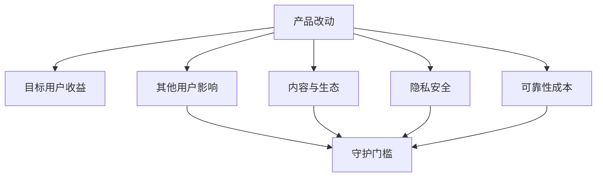

# 核心指标、守护指标与负面影响

功能拆解不仅要说明希望提升什么，还要说明不能以什么代价提升。核心指标反映目标用户结果或产品结果；过程指标解释路径；守护指标监控不可接受的副作用。三者共同形成发布判断，任何一个都不能由点击量或总平均替代。

## 从目标开始

先写目标用户、任务、基线和期望变化，再选择指标。若目标是帮助用户找到并完成有效阅读，曝光量不是核心结果；若目标是正确完成权限配置，批量按钮点击也不是成功。

目标至少包含：

- 谁在什么场景；
- 当前结果和测量窗口；
- 希望改变的结果；
- 不得恶化的质量、风险和受损群体；
- 何时扩大、停止或回滚。

## 指标层级

### 核心指标

核心指标是当前决策最重要的结果信号。它要能连接用户价值或产品目标，并有稳定定义。例如“符合条件用户中完成一次有效阅读的比例”。

核心指标不必唯一代表产品全部价值，但在一次改动中必须明确主判断。多个相互冲突的核心指标会让任何结果都能被解释为成功。

### 过程指标

过程指标描述核心结果怎样形成：曝光、到达、点击、开始、滚动、重试和放弃。它适合定位瓶颈，不能自动证明最终价值。

### 守护指标

守护指标定义不能接受的代价：

- 质量：错误、遗漏、误点、撤销和返工；
- 安全与隐私：越权、泄露、滥用和不可删除；
- 用户控制：无法退出、默认改变和通知过量；
- 公平：语言、设备、地区或角色系统性受损；
- 生态：垃圾供给、欺诈、收入集中和操纵；
- 可靠性：错误、延迟、数据丢失和恢复失败；
- 运营：支持、审核、基础设施和人工成本；
- 其他任务：局部优化挤压更重要任务。

守护阈值必须在结果出现前确定。高风险指标可以要求事件数为 0，而不是被总平均稀释。

## 指标契约

每项指标写清：

| 字段 | 说明 |
| --- | --- |
| 名称 | 稳定且可区分版本 |
| 公式 | 分子、分母和排除规则 |
| 主体 | 用户、会话、组织、任务或内容 |
| 事件 | 怎样算一次有效行为 |
| 窗口 | 日、周、任务周期或发布后期限 |
| 数据源 | 事件、数据库、日志或人工评分 |
| 分群 | 新老、语言、设备、角色和版本 |
| 基线 | 改动前同口径结果 |
| 门槛 | 发布、停止和回滚条件 |

```json
{
  "name": "valid_read_rate_v1",
  "formula": "users_with_valid_read / eligible_exposed_users",
  "subject": "user",
  "window": "daily",
  "valid_read": "foreground_seconds>=30_and_scroll>=50_percent",
  "data_source": "client_events_v4",
  "segments": ["new_vs_returning", "locale", "device"],
  "baseline": 0.40,
  "target": 0.42,
  "guardrails": {
    "report_rate": "<=0.003",
    "p95_first_screen_seconds": "<=1.6"
  }
}
```

“有效阅读”仍只是代理。需要抽样核对 30 秒与滚动是否代表相关阅读，而非页面难懂、找不到退出或后台计时。

## 分母与主体

指标最常见错误来自分母。推荐点击率可以用曝光、会话或用户作分母，含义不同。选择与决策相匹配的主体，并保留失败和缺失事件。

总量增长可能来自流量增长。率提高也可能来自不符合条件的用户被排除。报告原始计数、分子、分母和筛选变化。

## 时间窗口

即时点击、当日任务完成、周留存和季度续约不能混用。窗口越长，外部因素越多。发布初期只能支持短期行为结论，不能直接宣称长期商业结果。

尾部延迟和高风险错误不适合只看平均值。使用 P50/P95/P99、最大影响和错误切片。

## 分群

平均值会掩盖受损群体。至少检查：

- 新用户与熟练用户；
- 高低资源设备和网络；
- 语言、地区和内容类别；
- 权限角色和组织规模；
- 正常、边界和高风险任务；
- 版本、渠道和入口。

分群要在看到结果前规划，避免只挑对候选有利的切片。

## 指标被优化但价值不增加

### 曝光量

可以通过增加推荐位提高，但用户可能没有完成任务。

### 点击率

标题夸张、误触或隐藏关闭会提高点击。

### 停留时间

内容有价值会增加，也可能因页面难懂、加载慢或无法退出增加。

### 完成率

删除必要校验或缩小分母会提高，但错误和风险增加。

### 活跃用户

必须定义有效行为和窗口。仅登录、收到通知或后台请求不一定代表价值。

每项指标都要写“怎样被操纵或误读”。

## 负面影响地图



拆解时问：谁没有获得收益，谁承担额外工作，错误能否恢复，成本是否转移给客服、审核者或供应方。

## 事实、推断与假设

- 观察事实：基线 10,000 个符合条件用户中 4,000 个达到事件定义；
- 推断：事件可能表示完成有效阅读；需抽样校准；
- 假设：排序改版会提高有效阅读且举报不增加。

产品公开说“更相关”只能证明主张。没有内部数据时，拆解提出可能指标与验证方案，不写实际效果。

## 个人可执行证据

- 帮助、规则和公开指标说明确认产品行为；
- 自己控制的账号复现推荐、隐藏、举报和退出；
- 公开评论、社区和状态页发现负面影响；
- 竞品与编辑精选、订阅源等非软件/人工替代比较；
- 授权数据核对事件、分母、失败和分群；
- 固定任务人工抽样验证代理指标；
- 灰度或对照比较改动前后。

不要通过自动化制造曝光、点击或举报，也不要测试未获授权的数据。

## 完整案例：信息流推荐改版

### 输入与证据

授权基线：10,000 个符合条件用户中 4,000 个达到有效阅读，比例 40%；举报 20 次，比例 0.2%；隐藏 300 次；首屏 P95 1.4 秒。公开帮助说明隐藏和举报；自己控制的账号可复现推荐、隐藏、刷新和退出。

观察事实是事件计数与行为。推断是有效阅读代理相关性。假设是新排序提高有效阅读，但可能增加争议内容。

### 步骤一：定义指标

核心为有效阅读率。过程为曝光、点击、滚动和后续阅读。守护为举报率、隐藏率、误点、首屏延迟、低资源设备和语言切片。

### 步骤二：固定门槛

- 有效阅读至少从 40% 提升到 42%；
- 举报率不高于 0.3%；
- 隐藏率不得增加超过 0.5 个百分点；
- 首屏 P95 不高于 1.6 秒；
- 任一语言切片不得下降超过 2 个百分点。

### 步骤三：校准事件

抽取固定任务和内容，由人工判断相关性与是否完成阅读，检查 30 秒+滚动代理的精确度。事件不可靠时先修指标，不启动发布比较。

### 步骤四：灰度

对 10% 符合条件流量随机分配，固定内容供给窗口和客户端版本。保存所有成功、失败和遥测缺失。

### 输出与验证

候选 10,000 用户中 4,300 个有效阅读，43%；举报 45 次，0.45%；隐藏从 3% 升到 3.2%；首屏 P95 1.55 秒。核心、隐藏和延迟通过，举报守护失败。

结论为暂停扩大，检查高举报内容类别和排序特征。不能用核心增长覆盖守护失败。

### 失败分支

- 事件丢失导致分母下降：先修数据；
- 平均提升只来自高端设备：检查并保护受损切片；
- 举报绝对量增加、比例稳定：评估审核容量并同时报告量和率；
- 停留增加因难退出：用返回、误点和任务抽样反证；
- 样本不足或窗口过短：保持灰度；
- 同期内容供给改变：不能把差异全归因算法；
- 编辑精选以更低风险达到同等结果：比较人工成本和覆盖。

## 统计与解释边界

统计显著不等于产品意义。报告效应大小、原始计数、样本量、持续时间和实际风险。多次尝试不同指标或切片后只选择最好结果会产生偏差。

非随机发布中，候选用户可能与旧用户不同。结论应写“在该样本和窗口观察到差异”，并列出替代解释。

## 数据质量与事件审计

指标判断前先验证遥测本身：

| 检查 | 方法 | 失败后果 |
| --- | --- | --- |
| 事件完整性 | 对固定任务逐步核对事件是否产生 | 漏报使分子或分母错误 |
| 去重 | 重复点击、重试和离线回传测试 | 重复事件制造增长 |
| 身份 | 匿名到登录、跨设备合并测试 | 同一人被多次计数 |
| 时间 | 客户端时钟、时区和迟到事件 | 窗口归属错误 |
| 版本 | 事件 Schema 与客户端版本关联 | 新旧含义混在一起 |
| 资格 | 符合条件对象能否稳定识别 | 分母被选择性缩小 |
| 隐私 | 是否只采集必要字段并限制访问 | 观测本身产生风险 |

发布前用一组可预测固定任务计算期望事件，再与实际日志逐条比较。若 20 次任务应产生 20 个开始和 20 个结束，但只有 17 个结束，不能直接用完成率判断产品变化。先修复或量化缺失，并同时重算候选与基线。

### 指标版本

事件或公式改变时建立新版本，保存旧结果。把 `30 秒前台` 改为 `60 秒前台` 会重写有效阅读定义；新旧指标不能直接连接成同一时间序列。报告中明确生效时间和可比较范围。

### 人工与模型评分

开放内容的相关、质量和伤害可能需要人工或模型评分。Rubric 要拆成可判断维度，并用领域人员样例校准。评分器版本、输入证据和不确定状态必须保存。模型评分不能替代权限、事件计数和确定性业务规则。

## 决策表

| 核心 | 守护 | 数据质量 | 决策 |
| --- | --- | --- | --- |
| 未达到 | 通过 | 通过 | 不扩大，检查价值与机制 |
| 达到 | 失败 | 通过 | 暂停或回滚，处理负面影响 |
| 达到 | 通过 | 失败 | 无法判断，先修测量 |
| 达到 | 通过 | 通过 | 进入下一阶段并持续监控 |

守护通过不表示没有未知风险；它只说明被定义且正确测量的风险在当前窗口内未越界。新投诉、事件或受损群体出现后需要补充指标和回归。

## 常见错误

- 先选容易增长的指标再写目标；
- 核心指标只是曝光或点击；
- 活跃没有行为与窗口定义；
- 分母变化未披露；
- 守护门槛事后决定；
- 只看平均值；
- 遥测未经抽样核对；
- 快速失败让平均延迟变好；
- 相关写成因果；
- 忽略客服、审核和其他用户成本。

## 拆解检查表

- 目标是否先于指标；
- 核心是否连接用户结果；
- 指标是否有公式、主体、窗口、分母和数据源；
- 过程指标是否只用于解释；
- 守护是否覆盖质量、风险、群体和成本；
- 门槛是否事前确定；
- 是否报告原始计数与切片；
- 代理指标是否人工校准；
- 是否列出操纵和替代解释；
- 失败是否触发明确停止或回滚。

## 练习

为一个推荐、通知或发布功能定义 1 个核心、3 个过程和 5 个守护指标。

验收：每项有完整指标契约；至少覆盖质量、隐私或安全、延迟、成本和受损群体；用固定任务校准一个代理指标；构造核心通过但守护失败的可复算结果；给出继续、暂停或回滚结论，并标注事实、推断和假设。

## 来源

- [GOV.UK：Measuring service performance](https://www.gov.uk/service-manual/measuring-success)（访问日期：2026-07-17）
- [Google Analytics：Funnel exploration](https://support.google.com/analytics/answer/9327974)（访问日期：2026-07-17）
- [NIST：AI Risk Management Framework](https://www.nist.gov/itl/ai-risk-management-framework)（访问日期：2026-07-17）
- [W3C WAI：Evaluating Web Accessibility Overview](https://www.w3.org/WAI/test-evaluate/)（访问日期：2026-07-17）
