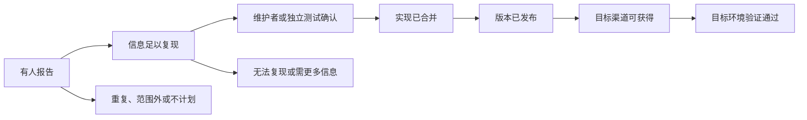

# GitHub Issue、Discussion、公开 Roadmap 与 Release Notes

Issue、Discussion、Roadmap 和 Release Notes 分别记录问题报告、开放讨论、未来计划与已发布变化。它们能连接成证据链，但任何单一状态都不能代替最终验证：Issue 存在不等于缺陷已确认，Issue 关闭不等于已修复，Roadmap 状态不等于交付承诺，Release Notes 也不证明目标环境的问题已经解决。

## 一、四类材料的证据边界

### Issue

Issue 是项目中的工作或问题条目。其正文可能包含环境、复现步骤、期望和实际结果；标签、负责人、里程碑与关联开发反映维护流程。公开提交只证明有人报告，内容可能不完整、重复、过时或误诊。

### Discussion

Discussion 用于问答、观点、公告和开放讨论。GitHub 支持回答标记、投票与评论；这些机制提高内容可见性，却不是总体用户抽样。高票可说明参与该社区的人关注某话题，不能换算市场需求比例。

### Roadmap

Roadmap 展示产品或项目计划。字段含义由维护方定义，日期可能是目标、预期或自定义元数据。GitHub 自己的公开 Roadmap 明确声明，前瞻内容不构成交付产品、能力或日期的承诺，也不应作为购买依据。分析其他 Roadmap 时同样先读免责声明。

### Release Notes

Release Notes 记录发布方宣称交付的变化。GitHub Release 基于 Git tag，tag 日期可能与 release 日期不同。发布说明能证明某版本被声明包含变化，不能证明所有安装渠道已分发、部署已启用、配置满足或问题在你的环境消失。

## 二、建立证据状态机



每个节点回答不同主张，不能跳级：

| 状态 | 能支持的主张 | 仍不能支持 |
| --- | --- | --- |
| 有报告 | 至少有一人公开描述 | 问题真实、普遍 |
| 可复现 | 条件足以尝试重复 | 已被维护者确认 |
| 已确认 | 指定条件下问题成立 | 已经实现修复 |
| 已合并 | 代码进入某分支 | 已进入用户版本 |
| 已发布 | 发布方声明版本包含变化 | 已部署到所有渠道 |
| 已验证 | 目标环境测试成功 | 所有环境都解决 |

## 三、Issue 状态与关闭原因

“Open/Closed”只是容器状态。关闭可能表示：

- 修复已经合并或发布；
- 与另一个条目重复；
- 不在项目范围；
- 维护方不计划实施；
- 无法复现或缺少信息；
- 问题已过期；
- 迁移到 Discussion 或外部系统；
- 由配置、文档或支持流程解决。

判断时读取关闭评论、关联 Issue、PR、commit、里程碑和发布版本。标签由仓库自行定义，`bug`、`confirmed`、`planned` 的语义不能跨仓库假定一致。

### 重复 Issue 的处理

重复条目不应直接删除。它可能提供不同设备、版本、错误文本或后果。研究时：

1. 找到维护者指定的主条目；
2. 保存重复关系；
3. 把独有环境信息合并到证据表；
4. 同一发帖者或转载不重复计数；
5. 用“独立报告数”和“唯一环境组合数”分别计量。

## 四、复现质量

高质量报告至少包含：

- 目标任务与期望结果；
- 实际症状和完整错误文本；
- 最小复现步骤或仓库；
- 产品、依赖、操作系统和运行时版本；
- 账号、权限、配置与网络条件；
- 发生时间与时区；
- 是否稳定复现；
- 删除敏感信息后的日志；
- 已尝试的变通方案。

没有复现条件的点赞很多，仍只是高互动线索。一个无点赞但含最小复现和失败测试的 Issue，通常更适合技术验证。

## 五、Roadmap 状态不是承诺

Roadmap 中的 `exploring`、`in design`、`preview`、`GA` 等词，必须按维护方定义解释。以 GitHub 公共 Roadmap 为例：exploring 表示考虑并收集反馈，in design 表示已决定建设但仍在设计，preview 与 GA 又有不同可用性和支持边界。即使进入某季度，免责声明仍说明时间会变化。

记录 Roadmap 时保存：

```json
{
  "item": "roadmap-1151",
  "captured_on": "2026-07-17",
  "status_label": "preview",
  "target_window": "Q2 2026",
  "status_definition_url": "https://github.com/github/roadmap",
  "disclaimer": "计划可能变化，不构成交付承诺",
  "product_scope": ["Cloud", "Team"],
  "fact": "该日页面显示此状态与窗口",
  "unsupported_claim": "该功能必定在季度末向所有套餐交付"
}
```

截图会过时，应同时保存永久链接和采集日期。计划变化不是数据错误，应该保留历史版本，形成状态迁移时间线。

## 六、Release、tag、部署与功能开关

发布验证至少区分：

1. PR 合并到哪个分支；
2. 哪个 commit 被哪个 tag 包含；
3. release 的创建与发布日期；
4. 资产是否为正式版、预发布版或草稿；
5. 包管理器、应用商店或自托管镜像是否可获得；
6. 云服务是否完成部署；
7. 功能开关、套餐、地区和管理员策略是否启用；
8. 目标环境是否重跑原复现。

自动生成 Release Notes 也可能按合并记录生成，不能保证每条描述准确覆盖行为边界。安全或回滚发布还可能改变原计划。

## 七、检索和记录方法

### 搜索

组合使用：完整错误文本、同义任务词、旧功能名、版本号、操作系统、组件名、`is:issue`、`is:discussion`、`label:` 与时间条件。只搜解决请求会漏掉用症状语言描述的问题。

### 记录

| 字段 | 内容 |
| --- | --- |
| 仓库与编号 | 稳定定位，避免只存标题 |
| 类型 | Issue、Discussion、Roadmap、PR、Release |
| 作者角色 | 用户、维护者、自动化账号；只按公开权限判断 |
| 环境 | 版本、平台、配置、权限 |
| 复现质量 | 完整、部分、缺失 |
| 状态与原因 | 原始值、定义、更新时间 |
| 关联对象 | 重复条目、PR、commit、release |
| 主张 | 这条证据实际支持什么 |
| 反证 | 哪些信息不支持当前解释 |
| 访问日期 | 页面状态的时间边界 |

不要复制密钥、私有仓库地址、客户数据和个人联系方式。公开仓库仍可能有人误贴敏感信息；研究笔记应脱敏，并按平台机制报告泄露。

### 状态快照与事件记录

网页状态会被编辑，单独保存最终页面会丢失研究过程。证据库应把对象身份与状态事件分开：对象表保存仓库、编号和永久链接；事件表追加每次标签、标题、关闭原因、关联 PR、目标版本和 Roadmap 窗口变化。不要用新值覆盖旧值。

```text
对象：owner/repo#240
事件 1：2026-07-02 opened，来源为 Issue 时间线
事件 2：2026-07-05 label=confirmed，来源为维护者操作
事件 3：2026-07-08 linked_pr=#251，来源为开发关联
事件 4：2026-07-12 closed，关闭原因=completed
事件 5：2026-07-14 target_environment_verified=true
```

访问日期不是事件发生日期。研究者在 7 月 17 日读取“7 月 5 日添加标签”，需要同时保存 `occurred_at=07-05` 与 `captured_at=07-17`。若平台只显示相对时间或状态没有历史，标记时间精度，不自行补全。

删除或编辑会影响可复核性。允许的情况下保存最小必要摘要和内容哈希；但不要用归档手段绕过作者删除、仓库权限或平台限制。无法再次访问时，将证据状态改为“链接不可用，保留既有摘要”，而不是继续当可公开核查的一手材料。

### 自动化账号与生成内容

Issue、Release Notes 和 Roadmap 更新可能由机器人创建。自动化不降低证据价值，也不自动提高可信度。应追踪它引用的 commit、工作流或维护规则。AI 生成的摘要同样只能作为导航，必须回到原始时间线和代码变更。

下载次数、表情反应和订阅量属于平台行为计数。它们可能受机器人、缓存、重复下载和可见性影响；除非平台给出口径，否则不能推导唯一用户数或采用率。

### 多仓库和分发渠道

问题可能在客户端仓库报告、核心库修复、打包仓库发布、商店渠道分发。只在一个仓库搜索会断开证据链。记录组件依赖和版本映射，例如客户端 4.8.1 包含认证库 2.3.4，而修复 commit 属于认证库。若无法证明映射关系，就不能仅凭相近发布日期关联。

云服务没有可下载版本时，可以用官方变更日志、部署状态、响应头或功能可见性证明目标渠道变化，但不得猜内部部署 commit。分阶段发布还需记录租户、地区和功能开关。

## 八、完整案例：升级后认证循环

### 1. 初始主张

待验证主张为：“桌面客户端 4.8.0 在企业代理下会进入重复登录循环，4.8.1 已修复。”

### 2. 收集到的教学场景证据

- Issue #240：用户报告 4.8.0、Windows、企业代理，复现步骤完整；
- Issue #244：相似标题，但为 macOS 且错误码不同，被关闭为重复；
- Discussion #91：37 个投票、12 条回复，包含多种代理配置；
- 维护者评论：确认 #240 中的代理头处理问题；
- PR #251：测试和修复合并到 release 分支；
- Roadmap：目标为本季度稳定版；
- Release 4.8.1：说明包含认证代理修复；
- 目标企业环境尚未验证。

这些编号和数字是教学场景，不对应真实项目。

### 3. 建立时间线

```text
07-02  Issue 提交：证明有人报告
07-03  最小复现补齐：证明条件可执行
07-05  维护者确认：提高根因可信度
07-08  PR 合并：证明实现进入指定分支
07-10  Roadmap 更新：仅表示当日计划
07-12  4.8.1 发布：证明发布方宣称交付
07-13  包管理器可获得：证明目标渠道有版本
07-14  企业代理回归通过：支持目标环境已解决
```

### 4. 对重复与互动的解释

#244 虽被标记重复，仍保留 macOS 和错误码差异，不能自动并入同一根因。Discussion 的 37 票只说明至少这些参与账号表达关注，不能写“37 个受影响客户”，更不能换算发生率。

### 5. 最终结论

**事实**：#240 条件下问题被维护者确认，相关 PR 已合并，4.8.1 发布说明宣称包含修复，目标企业环境回归通过。

**推断**：#240 所述代理场景很可能已由该变化解决。

**未支持**：所有代理、macOS 错误码和全部部署渠道均已解决。

### 6. 失败分支

- 若 Issue 关闭原因为 `not planned`，停止写“修复完成”；
- 若 PR 只进主分支而未进 release tag，状态停在“已实现未发布”；
- 若 release 是 prerelease，不能当稳定渠道已交付；
- 若功能受套餐或开关限制，记录为“版本包含但当前账号不可用”；
- 若原复现仍失败，保留发布事实，同时将验证状态标为失败并检查配置、回滚或错误根因；
- 若 Roadmap 日期移动，新增历史状态，不指控或猜测原因。

## 九、个人学习中的非访谈路径

无需访问内部团队，也可以：

1. 选择一个公开仓库的已关闭 Issue；
2. 重建报告、确认、实现、发布、验证时间线；
3. 检查关闭原因和重复链；
4. 在安全测试环境运行最小复现；
5. 对照 tag、release 和目标包版本；
6. 写出证据支持与不支持的主张。

不要为了验证而在维护者仓库制造重复 Issue。已有材料不足时，可以在本地保留“未知”，而不是要求社区为学习任务提供服务。

## 十、完成检查与练习

完成前确认：

- 四类材料的证据边界分开；
- Issue 关闭原因、标签定义和重复关系已核对；
- 投票与回复只作社区互动信号；
- Roadmap 状态引用维护方定义和免责声明；
- PR 合并、tag、release、渠道与目标验证没有混为一谈；
- 版本、平台、套餐、地区和配置明确；
- 敏感日志与个人信息已移除；
- 事实、推断、假设和未知分别记录。

练习：选择一个已发布修复，建立至少六节点证据链，并在目标环境重跑原复现。完成标准是每个节点有永久链接、日期和主张边界；即使删除 Roadmap 证据，最终是否解决的结论仍由发布与验证支持。

## 来源

- [GitHub Docs：About issues](https://docs.github.com/en/issues/tracking-your-work-with-issues/learning-about-issues/about-issues)（访问日期：2026-07-17）
- [GitHub Docs：About discussions](https://docs.github.com/en/discussions/collaborating-with-your-community-using-discussions/about-discussions)（访问日期：2026-07-17）
- [GitHub Docs：About releases](https://docs.github.com/en/repositories/releasing-projects-on-github/about-releases)（访问日期：2026-07-17）
- [GitHub Public Roadmap：Guide and disclaimer](https://github.com/github/roadmap)（访问日期：2026-07-17）
