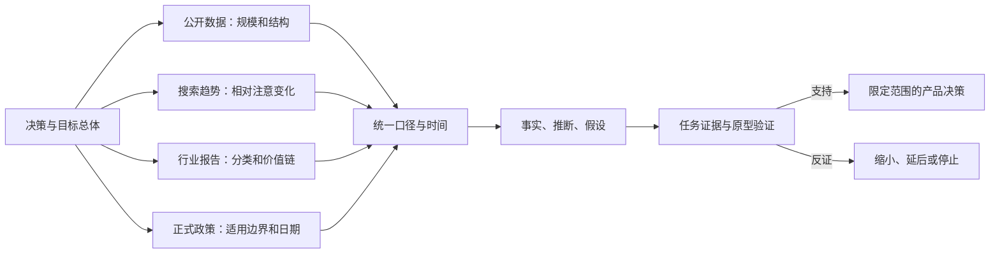

# 行业报告、公开数据、搜索趋势与政策变化

行业报告、公开统计、搜索趋势和正式政策描述的是产品外部环境。它们可以限定市场结构、变化方向和合规边界，却不能单独证明某个用户任务值得开发，也不能替代产品内行为证据。

## 一、四类外部证据回答不同问题

### 行业报告

行业报告通常把供应商、客户、技术和收入按某套分类组织起来，适合回答“这个领域包含哪些角色、价值链和商业模式”。它可能来自政府、行业协会、研究机构、咨询公司或供应商。

报告中的市场规模和预测依赖分类、样本、估算模型与资助关系。没有方法说明时，图表只能作为主张，不能当作可复算的事实。

### 公开数据

公开数据是机构按明确方法发布的数据集、统计表或行政记录。它适合回答“在指定总体、时间、地域和定义下，观察值是多少”。公开不代表没有限制：缺失值、抽样误差、分类变更、修订和发布日期都影响解释。

### 搜索趋势

搜索趋势表示特定搜索系统中、特定时间和地域的相对搜索兴趣。Google Trends 使用搜索样本，将每个数据点除以该地域和时间段的全部搜索，再按查询范围内的相对峰值缩放到 0–100。

因此，趋势值不是绝对搜索量、独立人数、购买量或市场份额。不同查询时间窗、地域、关键词与主题选项会改变分母和峰值，两个单独导出的 `100` 不能直接比较。

### 政策变化

政策证据包括法律法规、监管规则、标准、实施法案、正式指南与执法决定。它适合回答“哪个主体在什么地域和日期承担什么义务”。提案、征求意见稿、正式通过、公布、生效、适用和开始执法是不同状态。

新闻、博客和律师解读可以帮助发现问题，但不能替代正式文本。高风险判断需要合格专业人员结合具体业务确认。

## 二、先定义决策，再找外部数字

“行业正在增长”不是产品决策。先写清楚准备决定什么：

- 是否继续研究某个目标行业；
- 是否支持某个地区、语言或企业规模；
- 是否需要在某日期前修改数据、透明度或无障碍流程；
- 是否调整定价、销售或上线节奏；
- 是否停止一个无法满足政策约束的方案。

每个决策都需要一个最小主张。例如：

> 2026 年第三季度是否应继续验证面向欧盟中小企业的 AI 文本分析功能，而不是直接立项？

这个问题至少包含三个独立判断：目标总体是否采用相关技术、外部兴趣是否变化、产品可能承担哪些正式义务。任何一项都不能替代具体任务证据。

## 三、公开数据必须带着口径使用

一个统计值至少由下列字段组成：

| 字段 | 要回答的问题 | 缺失后的风险 |
| --- | --- | --- |
| 指标定义 | 到底测量了什么行为或对象 | 同名指标含义不同 |
| 统计总体 | 哪些单位有机会进入数据 | 把企业数据写成全部企业 |
| 观察单位 | 人、户、企业、席位还是交易 | 分母混乱 |
| 覆盖范围 | 行业、年龄、规模、地域 | 错误外推 |
| 时间参照 | 行为发生期还是发布日期 | 把旧状态写成当前状态 |
| 单位 | 人数、比例、百分点、金额或指数 | 算术和表达错误 |
| 数据来源 | 抽样调查、行政记录或传感器 | 忽略来源偏差 |
| 方法 | 采样、加权、估算和缺失处理 | 无法判断不确定性 |
| 修订状态 | 初值、修订值还是最终值 | 同一事实出现多个值 |
| 版本 | 数据集代码、下载日和表版本 | 不能复现 |

### 总体与样本

如果调查覆盖“至少 10 名雇员和自雇人员的企业”，它不包含微型企业。若行业只覆盖特定 NACE 分类，也不能写成“全部欧盟企业”。

样本比例用于估计统计总体时，要检查权重、抽样设计与误差。行政记录可能接近全量，但只覆盖进入该行政过程的单位，并不天然代表目标市场。

### 存量与流量

- **存量**是在某一时点存在的总量，例如当前付费席位；
- **流量**是在一段时间发生的新增或流失，例如月新增订阅；
- **累计量**把多个时期的事件相加，但可能包含已退出对象。

不能用“年度新增企业”替代“当前企业总数”，也不能把累计下载量当月活跃人数。

### 百分点与相对变化

比例从 13.5% 变为 20.0%：

- 绝对变化是 `20.0% - 13.5% = 6.5 个百分点`；
- 相对变化是 `(20.0 - 13.5) / 13.5 ≈ 48.1%`。

“增长 6.5%”会混淆这两个含义。报告增长时应明确单位。

### 名义值与实际值

金额跨年比较时，名义值包含价格水平变化。若问题是实际购买能力或真实产出，应寻找不变价、价格指数或明确的折算方法。不同币种还需记录汇率日期和来源。

### 分类变化与断点

问卷新增一个答案类别、行业分类调整或数据采集方式变化，会造成时间序列断点。新类别在上一年不存在时，不能把空值当作零，也不能声称该类别从零增长。

## 四、判断来源质量，不用“权威”代替检查

来源质量取决于它是否适合当前用途。检查顺序如下：

1. 找到原始数据集和方法说明，而不是只读新闻摘要；
2. 确认发布机构是否对数据负责；
3. 检查统计总体、样本、覆盖行业和时间；
4. 检查缺失、低可靠性标记、置信区间和估算值；
5. 检查历史修订、分类变化和下次发布时间；
6. 记录资助方、商业目的和可能的利益冲突；
7. 用第二个独立来源检查方向，而不是强求数字完全相同。

两个数字不同不一定有一个错误。可能原因包括总体不同、观察期不同、行为定义不同、加权方式不同或发布时间不同。先解释口径，再比较数值。

建议把每个数值保存为证据卡：

```json
{
  "claim_id": "EXT-2026-01",
  "indicator": "enterprises_using_ai_technologies",
  "value": 20.0,
  "unit": "percent",
  "reference_period": "2025",
  "published_at": "2025-12-11",
  "population": "EU enterprises with at least 10 employees or self-employed persons in stated NACE coverage",
  "dataset": "isoc_eb_ai",
  "geography": "EU",
  "revision_status": "as published on access date",
  "accessed_at": "2026-07-17",
  "unsupported_inference": "20% of all EU businesses are target customers"
}
```

最后一项专门记录这张证据不能支持的外推，防止数值脱离口径后被复用。

## 五、搜索趋势的正确读取方法

### 1. 固定查询条件

一次可复现的 Trends 观察应记录：

- 搜索词还是 Google 定义的主题；
- 精确拼写、语言和同义词；
- 地域；
- 开始、结束日期；
- 搜索类型，如网页、新闻或 YouTube；
- 分类；
- 导出日期；
- 查询是单独运行还是与对照词一起运行。

同一词可能有多重含义。主题可合并多语言概念，搜索词只匹配输入表达；两者不能混写。

### 2. 理解 0–100

Google 的说明表明，每个点先按该地域和时间的全部搜索归一化，再把查询结果中的相对峰值缩放为 100。由此得到：

- `100` 表示当前查询范围内的相对峰值，不是 100 次或 100%；
- `50` 表示相对比例约为峰值的一半，不代表搜索人数减半；
- `0` 可能表示搜索量不足以显示，不必然是没有搜索；
- 相同值在不同地域不保证绝对搜索量相同；
- 查询范围改变后，全部历史点可能重新缩放。

Google 还会过滤短时间内同一人的重复搜索，并指出低兴趣查询可能受统计噪声影响。单次尖峰应先检查事件、媒体曝光、自动化流量和采样波动。

### 3. 建立对照

为了减少“峰值缩放”误读，可在同一查询中加入稳定对照词，并保持时间和地域一致。对照只能帮助理解相对变化，不会把 Trends 转换成绝对需求。

若要判断商业规模，需要再找广告搜索量、站点流量、注册、付费、任务频率或政府统计。它们的总体仍不同，联合证据只用于限定结论。

### 4. 不把搜索原因写成事实

搜索增加可能来自：

- 新需求；
- 新闻、事故或争议；
- 产品改名；
- 教程或课程传播；
- 现有用户排障；
- 机器人或异常活动；
- 季节性。

趋势只能证明“在该查询口径下相对搜索兴趣变化”。原因必须用事件时间线、落地页查询、产品数据或其他证据验证。

## 六、行业报告与预测的拆解方法

行业报告中的数字通常包含观测值和模型估计。阅读时把它拆为：

1. **分类边界**：收入包含软件、服务、硬件还是实施；
2. **基期值**：来自公开财报、调查还是推算；
3. **预测期**：哪几年是实际值，哪几年是预测值；
4. **增长算法**：同比、复合年增长率或其他模型；
5. **情景假设**：价格、渗透率、政策和宏观条件；
6. **不确定性**：区间、敏感性或模型误差；
7. **利益关系**：资助、销售线索或供应商宣传目的。

复合年增长率的计算为：

```text
CAGR = (期末值 / 期初值) ^ (1 / 年数) - 1
```

它把整个区间压缩成平滑年率，不表示每年真实增长相同。若期初值很小、分类中途改变或期末是预测值，CAGR 会产生强烈但不稳定的叙事。

没有原始数据和方法时，可用报告了解术语与参与者，不应用单个预测值驱动容量、收入或招聘承诺。

## 七、政策必须建立正式状态时间线

### 1. 区分文本状态

| 状态 | 含义 | 产品动作 |
| --- | --- | --- |
| 提案或咨询 | 规则仍可能变化 | 监测、建立情景，不写成现行义务 |
| 正式通过 | 立法机构完成表决或签署 | 找正式文本和后续公布信息 |
| 公布 | 正式期刊发布可核对文本 | 记录编号、版本和公布日 |
| 生效 | 法律进入法律秩序 | 不等于全部条款当日适用 |
| 适用 | 指定条款开始约束相应主体 | 按主体、用途和条款做差距分析 |
| 过渡期 | 部分主体或系统延后适用 | 记录结束日期与条件 |
| 指南或实施法案 | 解释或补充具体执行 | 检查法律效力和适用层级 |
| 执法决定 | 主管机构对具体事实作出处理 | 不自动外推到不同事实 |

### 2. 提取适用条件

不要只摘录义务名称。至少回答：

- 哪个司法辖区；
- 哪类提供者、部署者、进口商或其他主体；
- 哪种产品、用途和风险分类；
- 是否有规模、行业或既有系统例外；
- 条款从哪一天适用；
- 需要哪些记录、通知、评估或技术控制；
- 谁负责，违反后果是什么；
- 是否有成员国实施、主管机构指南或待发布模板。

### 3. 分开法律事实与产品解释

**法律事实**来自正式文本，例如条款的适用日期。

**产品推断**是“当前功能可能落入某类用途”。它取决于真实功能、客户、数据流和控制权。

**待确认假设**是“增加某控制即可满足要求”。这类结论需要法律、隐私、安全和业务人员对具体实现确认。

产品笔记应保留这种分层，避免把学习材料当作法律意见。

## 八、联合证据链

四类外部证据进入产品判断的顺序如下：



宏观数据只到环境层。要进入开发，还需要任务证据：当前流程、频率、失败后果、替代方案、付费边界和可验证的产品改进。

## 九、完整案例：是否继续验证欧盟企业 AI 文本分析功能

### 1. 决策和输入证据

决策日期为 2026-07-17。问题是“是否投入下一轮问题验证”，不是“是否立即开发和销售”。

公开数据输入来自 Eurostat 2025 年企业 ICT 调查：

- 2025 年，20.0% 的欧盟企业在业务中使用至少一种列明的 AI 技术；
- 2024 年对应比例为 13.5%，变化为 6.5 个百分点；
- 总体限定为至少 10 名雇员或自雇人员、且位于方法说明所列 NACE 范围内的企业；
- 文本分析是 2025 年最常见的用途之一，Eurostat 页面给出的比例为 11.8%；
- “生成图片、视频、声音”是 2025 问卷新增类别，不能与 2024 做同项比较；
- 数据集代码为 `isoc_eb_ai`。

趋势输入仅有一个待执行查询协议：主题/搜索词尚未确定，地域拟设欧盟成员国，时间拟设过去五年。因为没有保存可复核的 Trends 导出，本案例**不声称搜索兴趣上升或下降**。

政策输入来自《欧盟人工智能法》正式文本：

- 法规一般适用日为 2026-08-02；
- 第一章和第二章自 2025-02-02 起适用；
-第三章第四节、第五章、第七章、第十二章和第 78 条自 2025-08-02 起适用，但第 101 条除外；
- 第 6(1) 条及相应义务自 2027-08-02 起适用。

这些日期是法规事实；某个文本分析功能属于什么角色和风险分类，仍取决于用途、客户、控制方式和具体实现。

### 2. 处理步骤

第一步，纠正总体表述。输出不得写“20% 的欧洲公司都是潜在客户”，因为统计不覆盖少于 10 人的企业，也没有测量购买意向或目标任务。

第二步，计算变化：

```text
百分点变化 = 20.0 - 13.5 = 6.5 个百分点
相对变化 = 6.5 / 13.5 ≈ 48.1%
```

正文使用“增加 6.5 个百分点”；若使用 48.1%，必须写为相对变化并保留基期。

第三步，限定用途。11.8% 是统计总体内使用文本分析技术的企业比例，不证明它们使用相同供应商、相同数据或相同任务，也不证明未采用者需要该功能。

第四步，暂停趋势主张。没有固定查询和导出时，不用截图印象补数字。后续查询必须同时保存词/主题、地域、时间、分类、搜索类型和对照项。

第五步，建立政策状态卡：

| 条目 | 正式事实 | 产品推断 | 待确认 |
| --- | --- | --- | --- |
| 一般适用日期 | 2026-08-02 | 上线计划需检查届时适用条款 | 产品角色、客户地域 |
| 禁止做法相关章节 | 已在 2025-02-02 起适用 | 某些用途不能以“仍在过渡期”处理 | 具体用途是否落入禁止范围 |
| 高风险分类相关时间 | 部分条款分阶段适用 | 风险分类影响控制和文档成本 | 是否构成高风险系统 |
| 既有系统 | 正式文本含特定过渡条件 | 已上线不必然永久豁免 | 是否发生重大设计变更 |

第六步，把外部环境转成待验证任务，而不是功能清单：企业当前如何分析文本、数据从哪里来、人工复核承担什么责任、错误后果是什么、哪些材料不能交给外部服务、现有表格或人工流程成本是多少。

### 3. 输出

最终证据卡如下：

**事实**：在 Eurostat 指定企业总体和 2025 年口径中，AI 技术采用比例为 20.0%，较 2024 年增加 6.5 个百分点；文本分析比例为 11.8%。《欧盟人工智能法》存在分阶段适用日期。

**推断**：相关技术已进入一部分目标企业的实际业务，继续验证具体文本任务具有合理的环境依据；政策分类和控制成本可能显著影响方案边界。

**假设**：有一类企业需要在明确人工复核、来源追踪和删除控制下处理内部文本，并愿意替换当前人工或多工具流程。

**当前决策**：只批准任务研究和受控原型，不批准市场规模、收入目标或正式上线。

**明确不支持的结论**：欧盟全部企业都在快速采用；搜索需求正在上升；文本分析一定属于某一风险分类；20% 企业会购买该产品。

### 4. 验证

1. 从 `isoc_eb_ai` 下载目标国家、企业规模和行业分段，保留下载日期和标记；
2. 检查目标细分是否仍有足够样本和可比较口径；
3. 按协议导出 Trends 数据，并在相同查询内设置对照，观察更改时间窗后结论是否稳定；
4. 用公开工作流、自己的真实任务和可合法访问的支持材料验证文本处理步骤；
5. 设计带人工复核与来源记录的原型，测量完成时间、纠错率和放弃率；
6. 请合格人员根据真实用途、数据流和客户角色完成政策适用性评估；
7. 将结论限定到已验证的行业、规模、地域和任务。

### 5. 失败分支

若细分数据表明目标行业的采用显著低于总体，不能继续引用 20.0% 作为细分依据，应缩小方案或重新选择目标群体。

若 Trends 的变化只出现在新闻事件一周，长期对照不支持持续兴趣，则删除“需求增长”推断。

若任务观察显示现有人工流程虽慢但提供必要审批、来源追踪和责任确认，自动化方案必须保留这些控制，不能只优化处理速度。

若正式评估显示预期用途承担团队无法实现的义务，应限制用途、延后上线或停止方案，而不是把义务留给提示文案。

若 Eurostat 修订历史数据或下一年度问卷改变 AI 定义，应保留旧版本证据卡，并重新计算时间序列，不能静默覆盖。

## 十、个人学习者的非访谈路径

个人不做访谈也能形成合格的外部证据分析：

1. 从自己能够执行的任务出发，先写完成结果和现有替代；
2. 找一个政府或统计机构的原始数据集，完成总体、单位、时间和修订卡；
3. 用 Trends 运行固定条件查询，只报告相对兴趣；
4. 阅读正式政策文本，建立提案、公布、生效和适用时间线；
5. 亲自执行当前流程，记录处理时间、等待、错误和人工控制；
6. 对照官方产品文档与公开社区，寻找反证；
7. 只输出“继续验证、缩小范围、等待证据或停止”之一。

这条路径不会产生代表性需求比例，但能过滤大量由宏观数字直接跳到功能开发的错误判断。

## 十一、检查表与练习

### 数据检查

- [ ] 指标定义、总体、单位和覆盖行业完整。
- [ ] 观察期与发布日期分开。
- [ ] 百分比和百分点没有混用。
- [ ] 存量、流量、累计量没有混用。
- [ ] 分类变化、缺失值和修订已检查。
- [ ] 数据集代码和下载日期可复现。

### 趋势检查

- [ ] 词/主题、地域、时间、分类和搜索类型固定。
- [ ] 0–100 没有解释为绝对搜索量。
- [ ] 单次尖峰已检查事件和噪声。
- [ ] 趋势原因仍标为推断。

### 政策检查

- [ ] 使用正式文本而非新闻摘要。
- [ ] 提案、公布、生效和适用状态分开。
- [ ] 主体、地域、用途、例外和日期明确。
- [ ] 法律事实、产品推断和待确认假设分开。

### 练习

选择一个你希望研究的技术产品机会，提交一份外部证据包：

1. 一张原始统计证据卡，包含总体、单位、时间、方法和修订；
2. 一次可复现的 Trends 查询及同一查询内的对照；
3. 一条正式政策的状态和适用时间线；
4. 三条事实、两条推断、一个产品假设；
5. 至少两个不能由这些证据支持的结论；
6. 一个无需访谈、可以在一周内执行的任务验证。

完成标准：读者能复算所有变化值，能指出每个结论使用的总体，能从正式文本找到日期，并且至少一个失败分支会使你停止或缩小方案。

## 来源

- [Eurostat：20% of EU enterprises use AI technologies](https://ec.europa.eu/eurostat/web/products-eurostat-news/w/ddn-20251211-2)（访问日期：2026-07-17）
- [Eurostat：Information on data — Digital economy and society](https://ec.europa.eu/eurostat/web/digital-economy-and-society/information-data)（访问日期：2026-07-17）
- [Google Trends Help：FAQ about Google Trends data](https://support.google.com/trends/answer/4365533?hl=en)（访问日期：2026-07-17）
- [UK Statistics Authority：Code of Practice for Statistics](https://code.statisticsauthority.gov.uk/)（访问日期：2026-07-17）
- [EUR-Lex：Regulation (EU) 2024/1689](https://eur-lex.europa.eu/eli/reg/2024/1689/oj?locale=en)（访问日期：2026-07-17）
