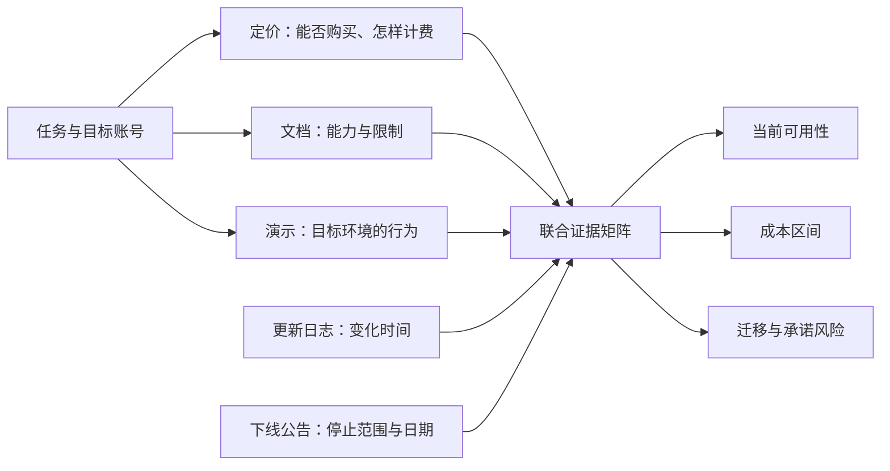

# 竞品定价、文档、演示、更新日志与下线功能

分析一个持续变化的产品，需要把定价、能力文档、演示观察、更新日志和下线公告放进同一条时间线。五类材料证明的事情不同：只有联合证据才能回答“谁能购买、能用什么、按什么计费、当前是否可用、未来是否仍可依赖”。

## 一、五类材料的证明边界

| 材料 | 主要证明 | 不能单独证明 |
| --- | --- | --- |
| 定价与套餐页 | 公开包装、标价、计费单位、公开限制 | 企业合同总价、所有附加费、实际效果 |
| 产品文档 | 官方描述的前置条件、规则、限制和配置 | 所有账号已获得能力、真实规模性能 |
| 演示、试用或截图 | 指定账号、数据、版本和时间下的可见行为 | 普遍可用、稳定性、服务承诺 |
| 更新日志或发布说明 | 提供方在某日宣称新增、变更或修复 | 用户已采用、缺陷全部解决、长期保留 |
| 下线公告 | 停止新增、弃用、停止服务或删除的范围与日期 | 未明确说明的内部原因、迁移一定无损 |

这五类证据不能互相替代。营销页写“支持代码审查”，仍需文档确认支持的计划、仓库、权限和计费；试用中成功一次，仍需确认正式套餐和生产限制；更新日志写“一般可用”，也不等于服务永不变更。

## 二、能力、可获得性与承诺是三件事

### 能力

能力是产品在某些条件下可以执行的动作，例如生成建议、调用模型、导出报告或运行代理。描述能力必须附带输入、输出、权限、平台、规模和失败状态。

### 可获得性

可获得性回答目标用户当前能否拿到能力，取决于：

- 地区与账号资格；
- 新购是否开放；
- 套餐、附加包和席位；
- 管理员策略；
- 客户端与最低版本；
- 灰度、预览或候补名单；
- 用量配额、预算和速率限制。

“文档里存在”不保证目标账号可见。“已一般可用”也可能仍受计划、策略或地区限制。

### 承诺

承诺是提供方在合同、服务条款、SLA、弃用政策或正式公告中承担的持续责任。产品文案和演示通常不是服务等级承诺；预览能力可能变更或移除；公开路线图表示计划而非保证。

分析时至少区分：

1. **已文档化能力**：官方页面描述当前规则；
2. **已观察行为**：目标环境中实际发生；
3. **合同承诺**：正式条款覆盖的责任；
4. **分析者推断**：根据变化节奏推测投入方向；
5. **待验证假设**：真实业务中可能产生的效果。

## 三、定价不是一个数字，而是一组函数

### 1. 固定观察条件

记录价格时，至少保存：

- 观察日期与页面版本；
- 购买主体和资格；
- 国家或地区；
- 币种；
- 是否含税；
- 月付、年付或承诺期；
- 计划名称；
- 计费单位；
- 包含量；
- 超额单价；
- 最低消费与最低席位；
- 免费层、试用和促销条件；
- 取消、退款和降级条件。

未固定这些条件时，“每月 10 美元”无法与另一个产品比较。

### 2. 识别计费单位

常见计费单位包括：

- 每用户或每席位；
- 每活跃用户；
- 每请求、调用或任务；
- 每输入、输出或缓存 token；
- 每 GB 存储或传输；
- 每执行分钟、计算时长或构建分钟；
- 每交易金额或成功交易；
- 分层用量；
- 基础订阅加用量；
- 企业合同的最低承诺。

席位价格解释组织规模，用量价格解释行为规模。两者叠加时，要把固定成本和变量成本分开。

### 3. 建立总成本公式

一个订阅加用量产品可写为：

```text
月度可见成本
= 可计费席位 × 席位单价
+ 超出包含量的用量 × 超额单价
+ 关联基础设施用量
+ 税费
+ 明示附加服务
```

真实总拥有成本还包括实施、数据迁移、管理员、培训、人工复核、失败恢复、审计、退出和替代供应商成本。公开定价页通常不能提供这些内部数字，应由自己的任务数据补齐。

### 4. 计算三种负载

不要只算平均月：

- **典型负载**：正常月份的席位和用量；
- **峰值负载**：发布、迁移或集中交付月份；
- **失败负载**：重试、重复生成、人工复核和降级导致的额外成本。

如果模型、推理级别或上下文长度改变单次用量，成本模型应按实际调用日志分段，不能用一个平均单价覆盖全部模型。

## 四、能力文档的逐项核对

阅读文档时，从用户任务反向提取：

### 前置条件

- 需要哪个计划、账号和组织类型；
- 管理员必须启用哪些策略；
- 支持哪些客户端、浏览器、IDE 或 API 版本；
- 是否需要额外存储、运行器、密钥或第三方账号。

### 输入与输出

- 接受哪些文件、数据类型、大小和编码；
- 输出是建议、确定性结果还是概率性生成；
- 是否包含来源、日志、版本和可追踪 ID；
- 输出如何导出、删除和纠错。

### 限制与失败

- 配额、速率、并发和上下文限制；
- 权限不足和策略禁用时的行为；
- 网络、供应商或模型不可用时如何降级；
- 预览能力是否可能随时变化；
- 支持渠道与问题恢复范围。

### 数据与安全

- 数据发送给谁；
- 保存多长时间；
- 是否用于训练或评估；
- 组织策略能否控制；
- 审计日志和区域限制；
- 删除、导出和法律请求流程。

分析者只能写文档明确说明的内容。页面没有写最大规模时，不能根据一次小样本演示猜测上限。

## 五、演示只证明指定条件下的一次观察

### 1. 建立演示协议

演示前固定：

- 账号、计划和组织策略；
- 客户端、版本、操作系统和地区；
- 输入数据、规模和敏感级别；
- 任务与完成标准；
- 允许的人工干预；
- 网络和依赖；
- 开始、结束时间；
- 预期错误与恢复方法。

演示数据应覆盖正常、空输入、权限不足、超限、失败和恢复。只演示理想路径无法验证生产可用性。

### 2. 保存可观察结果

记录：

- 实际输入与输出；
- 请求或任务 ID；
- 响应时间和完成状态；
- 错误文本；
- 权限提示；
- 用量记录；
- 是否需要人工修正；
- 重新登录、刷新或重试后的状态。

截图只能佐证界面状态。涉及生成式输出时，还要保存输入、选择的模型类别、结构校验、人工评估标准和失败样本。

### 3. 区分供应商演示和亲自验证

供应商演示通常使用准备好的数据、权限和理想路径。它可以证明“提供方展示过该行为”。亲自试用能证明“目标账号在观察日完成过该任务”。两者都不能证明 SLA、所有数据规模或未来可用。

若无法获得试用账号，正确状态是“未验证”，不是根据视频补写观察结果。

## 六、更新日志是一条事件记录，不是当前真相

更新日志应提取：

- 事件日期；
- 变化类型：预览、一般可用、修复、计费变更、弃用或下线；
- 影响对象：计划、客户端、API、模型或地区；
- 是否需要管理员动作；
- 生效日与迁移截止日；
- 对应文档和当前状态。

常见时间差包括：

- 公告日早于实际开放日；
- 分批发布导致不同账号不同步；
- 文档更新晚于产品变化；
- 一般可用后仍需策略启用；
- 修复发布后客户端尚未升级；
- 新能力上线后旧能力进入弃用。

因此，每条日志都要再回到当前文档和目标账号验证。历史日志适合解释变化时间，不应覆盖当前状态。

## 七、下线不是一个瞬间，而是生命周期

### 1. 术语可能不同

不同提供方会使用 `deprecated`、`retired`、`sunset`、`end of support`、`end of sale`、`end of life`。这些词没有跨供应商统一含义，必须阅读该公告给出的实际动作。

### 2. 至少记录五个日期

- 宣布日期；
- 停止新购或停止创建日期；
- 弃用或开始迁移日期；
- 破坏性演练或 brownout 日期；
- 完全停止服务和数据处理日期。

如果公告只给一个日期，其余保持未知。

### 3. 评估影响面

逐项检查：

- UI、API、SDK、模型和 Marketplace 条目是否同时停止；
- 现有客户与新客户是否不同；
- 哪些请求会返回什么错误；
- 已保存配置、历史结果和日志是否仍可访问；
- 数据导出格式与截止日；
- 推荐替代是否功能等价；
- 身份、权限、模型、提示、评估和账单如何迁移；
- 回滚窗口、双跑成本和负责人。

“提供了替代方案”不证明迁移无成本。需要在相同任务与数据上重新验证质量、性能、权限、费用和合规。

### 4. 不猜下线原因

只有官方明确说明的原因可写成事实。根据发布频率、价格或竞争格局得出的解释应标为推断。产品研究通常不需要知道内部原因才能做出迁移决策；截止日期和影响范围更重要。

## 八、建立联合证据矩阵

每个待比较能力占一行：

| 字段 | 记录内容 |
| --- | --- |
| 任务 | 用户实际要完成的结果 |
| 计划与资格 | 谁可以获得 |
| 定价 | 币种、周期、计费单位、包含量和超额 |
| 文档能力 | 前置、输入、输出、限制、失败 |
| 演示观察 | 账号、版本、数据、结果和错误 |
| 发布事件 | 公告日、GA 状态和需要的动作 |
| 生命周期 | 弃用、停止新建、brownout、完全下线 |
| 承诺 | 合同、SLA 或弃用政策是否覆盖 |
| 证据状态 | 事实、观察、推断或假设 |
| 决策 | 采用、试验、等待、迁移或拒绝 |

证据强度不是简单分数。定价事实不能增强性能主张；演示成功不能增强长期承诺。每个主张只能由同类型证据支持。



## 九、完整案例：12 人团队选择 GitHub AI 开发路径

### 1. 决策与证据输入

观察日期为 2026-07-17。一个 12 人开发团队准备为代码协作增加 AI 能力，需要判断：新工作流是否应依赖 GitHub Models，或先验证 GitHub Copilot。

公开证据如下。

**定价与套餐事实**：GitHub 的 Copilot 计划页在观察日列出 Copilot Business 为每授予席位每月 19 美元，Copilot Enterprise 为每授予席位每月 39 美元；各计划包含不同的 AI credits 配额。计划页同时说明具体功能因计划而异。

**用量事实**：GitHub 的模型与定价文档说明交互消耗输入、输出和缓存 token，并转换为 AI credits；1 AI credit 等于 0.01 美元。超出计划包含量后的费用取决于模型和 token。代码审查还可能同时消耗 AI credits 与 GitHub Actions 分钟。

**能力事实**：支持模型文档列出不同模型、发布状态、支持的 Copilot 表面、计划和退役历史。模型是否出现还会受计划、客户端和组织策略影响。

**发布事实**：GitHub Changelog 于 2026-06-17 宣布 GitHub Copilot app 一般可用，并列出从 issue、pull request 或提示创建会话、使用分支和 worktree 等能力；Business 或 Enterprise 用户还需组织启用 Copilot CLI 策略。

**下线事实**：GitHub 于 2026-07-01 宣布 GitHub Models 将在 2026-07-30 完全停止，范围包括 playground、model catalog、inference API 和 BYOK。公告列出 2026-07-16 与 2026-07-23 的短时 brownout，并指出停止后所有客户都受影响。

**缺失证据**：团队尚未获得目标组织中的试用记录，没有验证私有仓库、组织策略、代码审查、模型选择和失败恢复，也没有读取具体合同、税费和数据处理条款。

### 2. 第一步：阻止错误合并

GitHub Models 与 GitHub Copilot 是不同产品路径。不能因为两者都提供模型访问，就把 GitHub Models 的下线日期解释为 Copilot 下线；也不能把公告推荐 Copilot 理解为功能、API 和成本完全等价。

联合矩阵先写成：

| 判断 | GitHub Models | GitHub Copilot |
| --- | --- | --- |
| 新依赖生命周期 | 2026-07-30 完全停止 | 当前有计划与文档，长期承诺待合同确认 |
| API 等价 | 不适用，现路径将停止 | 未证明提供相同推理 API |
| 组织协作能力 | 不再作为新方案验证 | 文档和发布说明提供候选能力 |
| 目标账号实测 | 未验证 | 未验证 |
| 当前决策 | 拒绝作为新生产依赖 | 进入受控试验 |

### 3. 第二步：计算可见成本下界

若团队符合 Copilot Business 购买条件，并为 12 人全部授予席位，则公开席位费下界为：

```text
12 席位 × 19 美元/席位/月 = 228 美元/月
```

这个数不是总价，因为尚缺：

- 计划包含的 AI credits 与实际消耗；
- 超额 token 对应的模型单价；
- 代码审查产生的 Actions 分钟；
- 税费、币种转换和合同条件；
- 实施、策略管理、培训与人工复核；
- 若部分成员无需席位，实际授予数可能低于 12。

总成本模型写为：

```text
月成本
= 已授予席位 × 19 美元
+ max(0, 实际 AI credits - 计划包含量) × 0.01 美元
+ 额外 GitHub Actions 分钟费用
+ 税费与内部运营成本
```

实际模型价格和包含量必须在购买日重新读取官方页面，并用团队用量报告填入，不能把观察日数字永久写入预算。

### 4. 第三步：把文档能力转换成试验条件

团队选择三个真实任务：

1. 从一个已批准的 issue 创建隔离工作分支并生成可审查 diff；
2. 对一个固定 pull request 执行代码审查；
3. 在受控仓库中使用两个允许模型完成同一修复。

每个任务记录：

- 计划和授予席位；
- 组织策略；
- 客户端及版本；
- 仓库权限；
- 选择模型；
- 输入上下文；
- AI credits、Actions 分钟和完成时间；
- diff 正确性、测试、安全检查和人工返工；
- 权限不足、模型不可用和预算耗尽时的错误。

没有这些记录前，证据状态保持“文档化但未在目标环境验证”。

### 5. 第四步：处理下线时间线

在观察日 2026-07-17：

- 7 月 16 日 brownout 已经过；
- 7 月 23 日 brownout 尚未发生；
- 7 月 30 日完全停止尚未发生。

团队不得在剩余窗口中建立新的 GitHub Models 生产依赖。若已有依赖，应立即：

1. 清点 playground、catalog、API 和 BYOK 的使用；
2. 保存请求协议、模型、评估集和预算基线；
3. 为 7 月 23 日 brownout 验证失败处理；
4. 在替代服务上运行相同评估集；
5. 验证身份、密钥、速率、数据处理和费用；
6. 在 7 月 30 日前切换并删除无用密钥；
7. 保留回滚边界，但不把即将关闭的服务当作长期回滚目标。

### 6. 输出

**事实**：GitHub Models 的完整服务范围计划于 2026-07-30 停止；Copilot 在观察日有公开计划、模型与计费文档；12 个 Business 席位的公开基础费用按页面价格计算为 228 美元/月。

**推断**：GitHub Models 的剩余生命周期不足以支持新的生产依赖；Copilot 可能覆盖团队的代码协作任务，但并非 GitHub Models 推理 API 的等价替代。

**假设**：在组织策略允许、用量预算明确且人工审查保留的前提下，Copilot 可以降低三个选定任务的处理时间，而不提高缺陷和安全风险。

**决策**：拒绝把 GitHub Models 用于新依赖；为 Copilot 开启限定仓库、限定席位和限定预算的试验；未验证前不签署效果承诺。

**未支持主张**：Copilot 一定更便宜；所有模型对全部计划可用；一般可用等于 SLA；供应商演示能代表私有仓库；推荐替代能无损迁移现有 API。

### 7. 验证

试验至少运行两个正常任务和一个失败任务：

1. 核对购买资格、计划、税费、包含量与预算控制；
2. 在目标组织确认策略、席位和模型可见性；
3. 保存相同任务的人工基线；
4. 用固定测试、静态检查和人工审查验证 diff；
5. 从账单或用量报告读取 credits 与 Actions 分钟；
6. 禁用一个模型或耗尽测试预算，观察错误与恢复；
7. 检查取消席位、导出使用记录和退出流程；
8. 把实测结果与文档逐项比对，记录不一致。

验收条件由团队预先定义，例如：任务成功率不低于人工基线，严重缺陷为零，人工返工时间下降，峰值成本在预算内，禁用后可回到普通 Git 流程。

### 8. 失败分支

若目标组织无法购买或管理员策略禁止所需能力，则“计划页存在”不改变不可获得事实；决策改为等待或比较替代方案。

若试验显示代码审查的 Actions 分钟与 AI credits 使峰值成本超预算，应限制触发范围、选择不同模型或停止该任务，而不是只看席位费。

若模型在试验期间进入退役计划，必须用推荐替代重新运行评估；历史成功率不能直接继承。

若生成 diff 在功能测试通过但安全审查失败，不能用平均成功率掩盖高严重度错误；保留人工审查或停止自动提交。

若下线替代缺少 API、数据区域或身份能力，则迁移方案失败。团队应选择另一供应商、降级到非 AI 工作流或缩小功能，而不是在截止日后依赖未承诺兼容。

## 十、个人学习者的非访谈路径

个人可以在不访谈用户、不接触内部销售材料的情况下完成一次产品证据审计：

1. 选择自己每天真实执行的任务；
2. 保存观察日的定价、文档、更新日志和下线公告；
3. 用自己的合规测试数据运行免费层或试用；
4. 记录正常、权限、超限、失败和恢复；
5. 按典型、峰值和失败负载计算成本；
6. 与现有脚本、手工流程或不使用软件的方式比较；
7. 把事实、观察、推断和假设分开；
8. 设置退出条件，例如费用上限、模型退役或导出不可用。

非软件替代也要进入比较：继续人工审查、减少任务范围、使用现有编辑器和 Git 命令，可能比增加一个持续变化的依赖更合适。

## 十一、检查表与练习

### 证据检查

- [ ] 观察日期、地区、币种、税费和周期明确。
- [ ] 席位、用量、token、存储和关联基础设施分开。
- [ ] 文档能力包含计划、权限、客户端和限制。
- [ ] 未亲测能力保持“未验证”。
- [ ] 更新日志已与当前文档和目标账号核对。
- [ ] 下线的宣布、停止新建、brownout 和完全停止日期分开。
- [ ] 推荐替代没有默认写成功能等价。
- [ ] 能力、可获得性和合同承诺分开。
- [ ] 事实、观察、推断和假设分开。
- [ ] 有明确的退出和非软件降级路径。

### 练习

选择一个有订阅和用量计费的软件能力，提交一份联合证据包：

1. 一张固定地区、币种和观察日的套餐表；
2. 典型、峰值和失败负载的成本公式；
3. 一项文档化能力的前置、输入、输出和限制；
4. 一个包含正常、权限不足、超限和恢复的演示协议；
5. 两条更新日志组成的状态时间线；
6. 一项已弃用或下线能力的迁移表；
7. 三条事实、两条推断和一个可推翻假设；
8. 一个不购买软件也能完成任务的替代方案。

完成标准：其他读者能复算费用；每项能力都能指出证据类型；任何未观察结果都没有伪装成实测；至少一个失败分支会改变采用、预算或迁移决策。

## 来源

- [GitHub Docs：Plans for GitHub Copilot](https://docs.github.com/en/copilot/get-started/plans)（访问日期：2026-07-17）
- [GitHub Docs：Models and pricing for GitHub Copilot](https://docs.github.com/en/copilot/reference/copilot-billing/models-and-pricing)（访问日期：2026-07-17）
- [GitHub Docs：Supported AI models in GitHub Copilot](https://docs.github.com/en/copilot/reference/ai-models/supported-models)（访问日期：2026-07-17）
- [GitHub Changelog：GitHub Copilot app generally available](https://github.blog/changelog/2026-06-17-github-copilot-app-generally-available/)（访问日期：2026-07-17）
- [GitHub Changelog：GitHub Models is being fully retired on July 30, 2026](https://github.blog/changelog/2026-07-01-github-models-is-being-fully-retired-on-july-30-2026/)（访问日期：2026-07-17）
