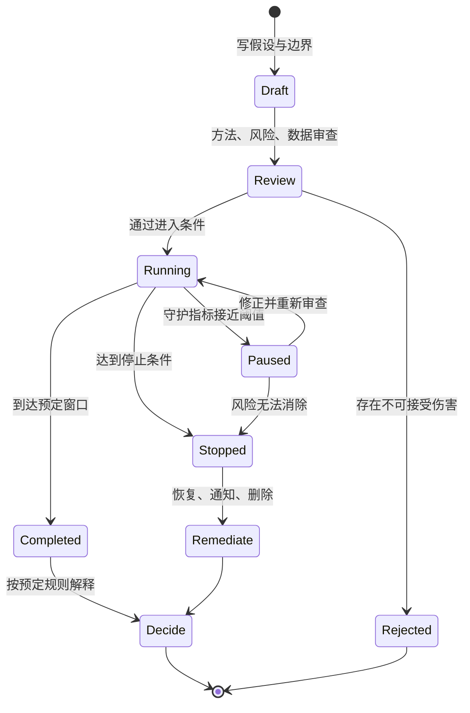

# 低成本验证：假门、礼宾服务、原型与手工实验

低成本验证是在投入完整产品建设之前，用范围受控、结果可观察的实验检验一个明确假设；“低成本”只指实现和试错成本较低，不表示可以降低真实性、隐私或安全要求。

## 从待验证假设开始

产品设想通常同时包含多种不确定性：目标人群是否遇到问题、是否会采取行动、流程是否可理解、人工交付能否产生结果、技术是否可实现、长期使用是否成立。一次实验必须选择其中一个主要问题，否则一个结果会被解释成多种结论。

可验证假设至少包含五部分：

| 部分 | 要回答的问题 | 示例 |
| --- | --- | --- |
| 对象 | 哪类人在什么条件下进入实验 | 最近 30 天内手工整理过多份报表的工作区管理员 |
| 刺激 | 实验具体呈现或提供什么 | “合并导出”入口与明确的未开放说明 |
| 行为 | 记录什么可观察动作 | 看见入口后主动点击，并在说明页选择加入通知 |
| 窗口 | 行为必须在何时发生 | 首次曝光后的 7 天内 |
| 判定 | 什么结果支持、削弱或停止假设 | 去重点击率达到阈值且投诉率不越界 |

“用户需要自动报表”不是完整假设，因为没有对象、刺激、行为和判定条件。“在两周内，至少 12% 的合格管理员点击合并导出入口”仍只检验入口所表达价值引发的行动，不能直接证明持续使用、付费或交付可行。

先把陈述分成三类：

- **事实**：实验前已经直接观察或由可靠记录确认的内容，例如过去四周有 86 个工作区分别导出三次以上。
- **推断**：对事实的解释，例如重复导出可能意味着合并需求。推断必须保留其他解释，如审计要求本来就要求分批导出。
- **假设**：尚待检验的可反驳陈述，例如提供合并入口会使管理员减少手工拼表。

实验结果只能改变与其测量对象相连的假设。点击假门可以更新“信息与入口能否促成尝试”，礼宾交付可以更新“结果是否有价值”，技术原型可以更新“关键机制能否实现”；三者不能互相代替。

## 四种方法分别能回答什么

### 假门：观察真实入口上的尝试

假门是在真实或接近真实的使用环境中展示尚未交付的能力，并记录合格对象是否尝试进入。它适合检验入口发现、价值表达和初步行动，不适合检验完成率、结果质量、可靠性或留存。

一个可接受的假门应具备：

1. 不虚构已经存在的能力、性能、价格、稀缺性或用户数量。
2. 点击后在用户作出付款、上传敏感信息或改变业务状态之前，清楚说明能力尚未开放。
3. 提供无损退出路径，返回原任务时不丢失输入和进度。
4. 只收集判定假设所必需的数据；联系方式是额外处理，不是默认必需字段。
5. 设定投诉、误操作和任务中断守护指标，达到阈值立即停止。

假门的不可逆成本包括付款、对外承诺、数据删除、正式申请提交、信用影响、健康与安全风险、泄露敏感信息以及无法恢复的工作进度。只要实验可能触发此类成本，就不能把“事后解释”当作补救，应改用明确标识的概念入口、静态原型或受控礼宾流程。

### 礼宾服务：先人工交付完整结果

礼宾验证由人临时执行未来产品可能自动完成的步骤，但参与者知道服务范围、处理方式与人工参与。它检验的是目标结果是否有价值、输入是否足够、异常是否可处理，以及交付流程中真正昂贵的环节。

礼宾服务必须记录每一单的：输入质量、人工步骤、处理时间、等待时间、异常类型、交付结果、复核结果和退出方式。若只记录“用户满意”，就无法判断规模扩大后成本是否可承受。

礼宾结果不能证明自动化已经可行。人工可能利用未记录的背景知识、临时沟通或高成本判断完成任务。每次人工介入都应标明未来计划：保留人工、规则化、模型辅助，或明确不自动化。

### 原型：检验结构、流程和理解

原型可以从纸面流程、可点击线框到带有限数据的代码原型。保真度按待验证风险选择：测信息层级不需要真实后端；测跨页面状态恢复需要可交互状态；测技术吞吐则需要技术验证环境，而不是视觉原型。

原型中成功完成任务可以支持“参与者在给定环境中理解并操作该流程”，但不能证明：

- 生产代码安全、可维护或可承受真实流量；
- 数据权限、审计、计费和异常恢复已经成立；
- 用户愿意在真实风险与价格下采用；
- 一次完成会转化为长期留存。

原型使用虚构或最小化数据，界面明确标记测试环境。代码原型不直接复制到生产环境；其身份认证、授权、日志和错误处理通常没有达到生产要求。

### 手工验证：直接执行最小任务

手工验证不一定需要招募或访谈。个人学习者可以用公开数据、自己的真实任务、获得授权的工作样本或可重复基准，手工执行拟议流程，测量输入是否取得、规则是否稳定、输出是否可验收。

例如，先手工给 50 条公开 Issue 分类，可以发现类别是否互斥、判定需要哪些上下文、边界案例占比和每条处理时间。该结果支持分类机制设计，但不能外推私有仓库的数据分布。

## 实验契约：在结果出现前固定规则

低成本实验不是“上线看看”。开始前应形成一份可审计的实验契约：

```json
{
  "experiment_id": "combined-export-door-v1",
  "hypothesis": "合格管理员在真实导出任务中会主动尝试合并导出",
  "eligible_population": "过去30天至少完成3次分表导出的工作区管理员",
  "method": "fake_door",
  "primary_event": "combined_export_door_clicked",
  "denominator_event": "combined_export_door_eligible_viewed",
  "deduplication_key": "workspace_id",
  "window": "2026-07-20/2026-08-02",
  "support_threshold": ">= 12% unique workspaces click",
  "stop_thresholds": {
    "complaint_rate": ">= 1% of exposed workspaces",
    "task_abandonment_delta": ">= 3 percentage points",
    "any_payment_or_irreversible_change": "> 0"
  },
  "disclosure": "功能尚未开放；可返回继续当前导出，不会更改数据",
  "data_retention": "原始事件保留30天，聚合结果保留180天",
  "owner": "product-experiment-owner"
}
```

这份契约中的字段具有不同职责：

- `eligible_population` 决定结论可外推到谁；它不能在看到结果后为提高比例而修改。
- `primary_event` 是支持假设的行为；页面停留时间不能临时替代预定点击。
- `denominator_event` 记录真正有机会行动的对象；只报点击人数会隐藏曝光规模。
- `deduplication_key` 防止同一对象反复点击扩大结果；个人与工作区代表不同决策单位。
- `window` 固定季节、渠道和版本范围；长期运行而没有截止会增加选择性解读。
- `support_threshold` 是继续投入的最低证据，不是产品成功保证。
- `stop_thresholds` 优先于主要指标；守护越界时，即使点击高也要停止。
- `data_retention` 约束原始数据生命周期；实验结束不是无限保留的理由。

实验的完整状态如下：



“停止”不是实验失败后的编辑动作，而是实验设计的一部分。停止后要执行恢复：撤销入口、恢复任务状态、停止后续联系、处理已收集数据，并记录受影响范围。

## 伦理、知情与撤回

实验信息应在参与者需要作决定之前出现，并足以理解：谁在运行、真实提供什么、会记录什么、用于什么目的、保留多久、是否有人工作业、如何退出或撤回。说明文字不能藏在不易发现的位置，也不能用“测试”概括所有处理。

知情不等于所有实验都必须使用同一份同意书。合法处理基础取决于地区、组织和数据用途；涉及真实个人数据时需要按适用规则审查。若选择以同意为处理基础，就必须记录同意时展示的内容，并使撤回与给予同意同样容易，撤回后停止依赖该同意的处理。

最低风险控制包括：

- 未成年人、健康、金融、就业、公共权益等高风险场景不使用会造成误解的假门。
- 不把主服务访问权绑定到与任务无关的研究数据授权。
- 联系方式与行为事件分表存储，用实验随机标识关联，减少身份暴露。
- 对外部邮件设置明确用途、频率、退出链接和抑制名单。
- 礼宾人员只访问交付所需字段，敏感材料不得复制到个人设备或通用聊天工具。
- 撤回不惩罚参与者，不降低其原有服务质量。

## 完整案例：验证“合并导出”而不先开发

### 输入与已有证据

某报表工具准备评估“合并导出”。案例使用一组固定的、已去标识化的运营数据：

- 过去 30 天有 800 个活跃工作区，其中 160 个工作区完成过至少 3 次分表导出。
- 公开支持材料中有 18 条与合并、拼表或统一下载相关的记录；这是问题线索，不代表 18 个独立客户。
- 当前导出任务完成率为 91%，中位完成时间为 74 秒。
- 团队尚未确认不同表的字段冲突规则，也未确认大文件生成成本。

事实是重复导出和相关支持记录存在。推断是部分管理员正在手工合并。假设是合格管理员会在真实导出任务中尝试合并入口，并愿意提交一个非敏感示例供人工验证。

### 步骤一：拆成两个连续实验

第一阶段使用假门，只测尝试意向。入口仅对上述 160 个合格工作区显示；按钮文字为“合并为一个文件（试用申请）”，点击后立即说明功能尚未开放，不收费、不上传文件，并允许返回原导出。

第二阶段使用礼宾服务，只邀请第一阶段主动申请且再次确认处理范围的管理员。参与者上传脱敏样例；工作人员按固定规则合并，交付前由第二人复核，并记录人工时间和规则冲突。

这种顺序没有让所有曝光者交出数据，也没有把点击误当成结果价值。假门检验行动，礼宾检验交付。

### 步骤二：预注册判定与停止规则

第一阶段以工作区去重，固定两周：

- 支持假设：至少 20 个合格工作区点击，即点击率不低于 `20 / 160 = 12.5%`。
- 进入礼宾：至少 8 个工作区在说明后主动申请。
- 停止：任何收费或数据状态改变；投诉达到 2 个工作区；原导出完成率下降 3 个百分点；说明页返回原任务失败一次。

第二阶段最多处理 10 单：

- 结果验收：合并文件通过参与者预先给出的行数、列名和抽样核对规则。
- 成本边界：单次人工处理的中位数不超过 25 分钟。
- 停止：样例包含未声明的敏感数据；无法可靠删除；输出可能导致财务或合规决定却没有专业复核。

### 步骤三：运行与记录固定结果

案例数据设定为：160 个合格工作区全部正确记录曝光，24 个工作区点击，10 个申请礼宾，8 个提交合格样例。曝光到点击为 `24 / 160 = 15%`，点击到申请为 `10 / 24 ≈ 41.7%`。

8 单中有 6 单一次通过验收，2 单因同名字段含义不同需要补充规则；人工处理时间分别为 14、18、19、21、22、24、37、46 分钟，中位数为 `(21 + 22) / 2 = 21.5` 分钟。没有投诉、付款或原任务中断。

### 输出：一份受限的决策记录

```text
结论：入口行动假设获得支持；在当前合格工作区与两周窗口内，去重点击率为15%。
结论：标准样例可由人工交付，8单中6单一次验收通过，中位处理21.5分钟。
未证明：全部活跃用户需要该能力；自动合并可行；长期留存；付费意愿；大文件性能。
新增风险：同名字段语义冲突会导致错误合并，需要先定义冲突检测与人工确认。
决策：不直接建设完整自动化；先做字段冲突技术验证，并将礼宾扩大到另一个已定义样本窗口。
```

### 验证结果是否可信

先对账曝光事件与服务端符合条件的 160 个工作区，确认没有漏报；再检查同一工作区重复点击是否只计一次；抽查说明页是否在任何上传或联系字段之前出现；比较实验组与历史基线的原导出完成率；最后验证礼宾样例已经按期限删除。

若曝光只记录到 120 个工作区，分母不再是 160，也不能假设缺失的 40 个行为与已记录对象相同。应先修复采集或报告 `24 / 120` 的观测比例及其覆盖限制，不能声称全体点击率为 15%。

### 失败分支

若第一个工作区点击后无法返回原导出，立即停止入口、恢复页面并检查是否丢失任务输入；即使此前点击率很高，也不能继续收集。若礼宾样例出现身份证号等未声明敏感数据，停止处理、隔离并按数据处置流程删除或报告，不能为了完成样本量继续。

若点击率为 18% 但申请礼宾只有 1 个，证据支持“入口引起兴趣”，不支持“愿意提供输入以取得结果”。下一步应检查说明、交付成本和真实任务时机，而不是把 18% 写成需求验证成功。

## 如何选择最低充分方法

| 最大未知 | 优先方法 | 主要输出 | 不能推出 |
| --- | --- | --- | --- |
| 用户是否注意并尝试入口 | 透明假门 | 合格曝光到尝试比例 | 任务完成、持续使用 |
| 流程是否能理解和操作 | 原型任务 | 状态路径、错误和完成 | 生产可靠性、付费 |
| 结果本身是否有用 | 礼宾服务 | 可验收产物、人工成本 | 自动化可行性 |
| 规则和输入是否稳定 | 手工验证 | 边界案例、规则冲突 | 真实市场采用 |
| 技术机制是否成立 | 技术验证 | 性能、兼容性、失败数据 | 用户价值 |

问卷可以收集自报事实、偏好或约束，但问卷中的购买意愿仍是自报信号。等待名单增加了留下联系方式的行动成本，但仍不等于使用或付费。方法强度来自行为与待验证结论的对应关系，不来自名称。

## 常见失败与修正

### 只看行为数量，不看合格分母

“有 300 人点击”缺少曝光对象、去重规则和渠道。修正为：在固定窗口内，多少合格主体有机会行动，其中多少完成预定行为。

### 看到结果后更换阈值

结果为 9% 时把原定 12% 改成 8%，会让判定失去约束。可以记录 9% 并提出新假设，但下一轮必须重新固定规则。

### 把参与者投入当作免费资源

礼宾服务可能要求整理文件、等待和复核。实验成本必须包括参与者时间与风险；如果产品团队省下开发成本却把大量成本转移给参与者，就不是低成本验证。

### 用撤回掩盖已经发生的损害

撤回可以停止后续处理，不能撤销已经公开的数据、已经触发的付款或业务承诺。进入实验前就应排除不可逆动作。

### 将原型反馈升级为工程结论

视觉流程顺畅只说明给定原型下的操作结果。安全、性能、权限和异常恢复需要各自验证，不能由原型体验推断。

## 练习：设计一项可停止的验证

选择一个尚未开发的功能，只用自己的任务、公开数据或合法授权材料完成设计，不要求用户访谈。

交付物必须包括：

1. 一条包含对象、刺激、行为、窗口和判定的假设。
2. 事实、推断、假设各至少两条，并标出证据范围。
3. 假门、礼宾、原型或手工验证中的一种选择，以及为什么能回答该假设。
4. 完整实验契约：分母、去重、主要指标、守护指标、支持阈值和停止阈值。
5. 知情内容、退出与撤回路径、数据字段和删除期限。
6. 三种预设结果：支持、证据不足、守护越界；每种对应下一步。
7. 一个不可逆成本场景以及替代方法。

完成标准：另一名执行者只阅读契约即可复现实验；任何参与者都能在发生实质损失前退出；结果只能支持契约中列出的结论；停止后有明确恢复和数据处置动作。

## 来源

- [GOV.UK Service Manual：Making prototypes](https://www.gov.uk/service-manual/design/making-prototypes)（访问日期：2026-07-17）
- [GOV.UK：Test and Learn](https://www.gov.uk/government/publications/the-magenta-book/test-and-learn-html)（访问日期：2026-07-17）
- [US FTC：Advertising FAQs — A Guide for Small Business](https://www.ftc.gov/business-guidance/resources/advertising-faqs-guide-small-business)（访问日期：2026-07-17）
- [UK ICO：Consent](https://ico.org.uk/for-organisations/uk-gdpr-guidance-and-resources/lawful-basis/a-guide-to-lawful-basis/consent/)（访问日期：2026-07-17）
