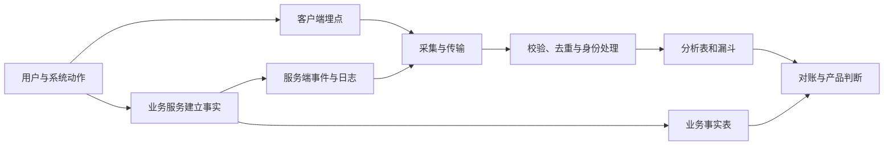

# 产品埋点与日志：事件模型、数据质量和证据边界

产品埋点与系统日志都是遥测：运行中的客户端、服务端或基础设施主动生成记录，用来观察行为和系统状态。遥测不是业务事实全集；它只包含被定义、执行、采集、传输、处理和保留成功的那部分记录。

## 三层数据必须分开

分析产品行为时常见三层对象：

1. **业务事实**：系统必须持久保存的业务状态，例如订单已付款、文件已生成、权限已授予。它由受控服务、事务和业务约束建立。
2. **遥测记录**：为观察行为与系统而发出的事件、日志、指标或追踪，例如点击付款、支付接口失败、请求延迟。
3. **分析视图**：遥测经过过滤、身份关联、去重、聚合和时间窗后得到的漏斗、趋势与分段。

客户端发出 `checkout_completed` 不应创建“订单已付款”事实。客户端可以被关闭、篡改或断网，事件也可能重复。付款状态应由授权的服务端流程与支付结果建立；遥测只观察该流程。

反方向也不成立：没有错误日志不证明请求成功。日志语句可能没有执行，采集器可能中断，字段可能被过滤，存储可能过期。任何用日志支持的结论都要同时说明观察覆盖。



这条链上任何环节都可能造成缺失或变形。产品分析首先确认数据是怎样生成的，再解释数字。

## 事件 Schema：把语义写成契约

事件 Schema 规定事件名、触发条件、字段、类型、允许值、身份、时间和版本。它使开发、测试和分析使用同一语义，而不是看到事件名后各自猜测。

一个可维护的事件通常包含：

| 字段 | 作用 | 质量要求 |
| --- | --- | --- |
| `event_id` | 单条事件的稳定标识 | 同一逻辑事件重试时保持不变，支持去重 |
| `event_name` | 事件类别 | 使用受控词表，不把动态对象拼进名称 |
| `schema_version` | 事件语义版本 | 破坏性变化升版本，保留迁移规则 |
| `occurred_at` | 源头认定的发生时间 | 使用明确时区；源时钟异常需要标记 |
| `observed_at` | 采集系统首次观察时间 | 用于计算到达延迟，不替代已知发生时间 |
| `actor_id` | 执行动作的分析主体 | 使用最小化、假名化标识；允许缺失时说明 |
| `session_id` | 一段会话的关联标识 | 会话边界由项目规则定义，不是自然属性 |
| `object_type/id` | 动作作用对象 | ID 不包含标题、邮箱等个人数据 |
| `result` | `success`、`failure`、`cancelled` 等结果 | 值域封闭；开始与完成使用不同事件或状态 |
| `source` | web、app、server、worker | 支持覆盖与对账分析 |
| `context` | 版本、环境、实验组等必要上下文 | 禁止任意自由文本和秘密信息 |

以下 JSON 是“导出请求完成”的最小示例记录，不是所有产品通用标准：

```json
{
  "event_id": "evt_01k0example000001",
  "event_name": "export_request_completed",
  "schema_version": 3,
  "occurred_at": "2026-07-21T08:15:31.240Z",
  "observed_at": "2026-07-21T08:15:32.019Z",
  "actor_id": "usr_pseudo_82ac",
  "session_id": "ses_9f10",
  "object": {
    "type": "export_request",
    "id": "exp_7b31"
  },
  "result": "success",
  "source": "export-worker",
  "context": {
    "app_version": "2026.07.3",
    "file_format": "csv",
    "size_bucket": "10mb_to_100mb"
  }
}
```

不记录精确文件名、查询内容、邮箱和下载 URL，因为分析完成率不需要这些值。`size_bucket` 比精确字节数降低细粒度暴露，同时保留规模分段能力；如果排障确实需要精确大小，应另行定义目的、访问范围与保留期。

## 事件命名与触发时机

事件名应表达稳定业务动作，例如 `export_request_started`、`export_request_completed`、`export_request_failed`。不要用 `button_3_clicked` 表示业务完成，也不要把对象 ID 拼成 `export_7b31_completed`，否则事件类别无法稳定聚合。

触发点决定事实强度：

- 点击处理器触发，只证明界面收到激活，不证明请求发出。
- 网络请求返回触发，只证明客户端收到响应，不证明后台异步工作完成。
- 服务端事务提交后触发，可以观察受控状态已写入，但事件发送仍可能失败。
- 异步工作器在产物写入并通过校验后触发，最接近“导出完成”。
- 用户成功下载需要单独可验证的交付事实，不能由文件生成代替。

一项任务可能需要开始、接受、处理、完成、交付、确认多个状态。不要让单个 `success` 覆盖全部生命周期。状态越精确，越能定位等待和失败，但事件数量也会增加；只记录对决策、运营或排障有明确用途的状态。

## 属性类型、缺失和版本

每个属性都需要定义类型、是否必需、允许值、缺失含义和弃用方式。空字符串、`null`、字段不存在和 `unknown` 不应随意混用：

- 字段不存在可能表示旧版本没有采集。
- `null` 可能表示已尝试取得但没有值。
- `unknown` 是一个显式分类值，表示源头无法判断。
- 空字符串通常是输入或转换错误，不应默认为合法未知值。

枚举新增值时，消费端必须能处理未知值，不能把所有新值归入失败。字段含义发生破坏性改变时提升 `schema_version`，分析中分版本计算或执行明确迁移。只改事件字典文字而继续同一时间序列，会制造虚假趋势。

Schema 注册与检查至少包括：事件名存在、必需字段齐全、类型正确、枚举合法、时间可解析、个人数据禁用字段未出现、事件大小不超限制。无效事件进入隔离队列并产生质量告警，不能静默丢弃后仍把结果当完整数据。

## 身份：人、设备、账号和组织不是同一主体

身份选择决定去重和漏斗含义：

- 匿名设备标识可以连接登录前行为，但清除存储、共享设备和多设备会造成拆分或错误合并。
- 账号标识适合登录后任务，但一个人可能有多个账号，服务账号也不是自然人。
- 组织或工作区标识适合组织采用，无法替代组织内角色分析。
- 请求或任务标识适合系统可靠性，不适合计算用户留存。

登录前匿名标识与登录后账号合并需要明确规则、合法目的和时点。不能为了分析方便建立超出用户预期的跨设备身份图。合并错误通常不可从聚合报表发现，因此要记录身份链接的来源、版本与置信范围。

用户退出或拒绝分析采集后，不应继续依靠原身份发送非必要遥测。业务必需的安全、计费和审计记录与产品分析是不同处理目的，需要分别定义权限和生命周期。

## 会话是分析规则，不是客观事实

会话把一段连续行为归为一个分析单元。常见规则使用不活动超时、日期边界或应用生命周期，但不同工具和项目默认值可能不同。会话结束后晚到的事件、跨午夜任务和后台应用都可能改变归属。

因此，会话契约至少写明：起始条件、不活动超时、最大时长、跨日规则、后台行为、身份改变时是否重开，以及离线事件按发生时间还是到达时间归属。

长期导出可能开始于一个会话、完成于另一个会话。此时用 `export_request_id` 关联生命周期比强行要求同一会话更可靠。会话用于理解一次访问，任务 ID 用于理解业务执行。

## 迟到、重复、乱序与漏报

遥测管线通常跨进程与网络运行。即使应用逻辑只执行一次，传输重试也可能产生重复；离线客户端会晚到；并发与缓冲会乱序；崩溃和阻断会漏报。

### 迟到事件

`occurred_at` 表示源头发生时间，`observed_at` 表示采集系统观察时间。二者差值是到达延迟。源头时间可信时，行为分析通常按发生时间归窗；运营告警可能按观察时间。两种时间不能混用。

分析应设数据成熟等待期和迟到策略。例如日报在次日 12:00 冻结，并允许 72 小时内回补；超过回补期的事件进入修订记录。若最近两天仍会变化，报表应显示未成熟状态。

### 重复事件

网络发送的成功确认可能丢失，生产者重试后接收端会收到同一逻辑事件多次。稳定 `event_id` 允许幂等去重。若每次重试生成新 ID，接收端无法区分真实重复动作与传输重复。

去重窗口必须大于合理最大重试或离线周期。只按“主体 + 事件名 + 同一秒”去重会误删真实连续行为，也可能保留跨秒重试。

### 乱序事件

完成事件可能比开始事件先到达分析仓库。漏斗计算应按 `occurred_at` 和任务标识排序，并允许已定义的迟到范围。不能因为存储插入顺序相反就判定状态机非法；同时也要检查源时钟是否异常。

### 漏报

漏报可能来自未触发代码、页面关闭、网络阻断、采集 SDK 禁用、权限选择、队列满、Schema 拒绝、处理失败或保留到期。没有单一过滤器能恢复所有缺失。

覆盖率需要独立分母。例如服务端有 10,000 个订单事实，订单完成遥测只有 9,700 个，则完成遥测相对业务事实覆盖率为 `97%`。剩余 3% 不能默认随机缺失；按版本、设备与地区检查是否集中，才能判断分析偏差。

## 日志、事件、指标与追踪的职责

日志记录离散事件和上下文；事件可视为具有稳定名称和结构的一类日志。指标是时间上的数值聚合，适合速率、计数和分布；追踪连接一次请求经过的多个处理段。四者可以关联，但不应互相冒充。

OpenTelemetry 日志数据模型区分发生时间 `Timestamp` 与观察时间 `ObservedTimestamp`，并提供 `TraceId`、`SpanId`、严重级别、主体内容、资源、作用域、属性和事件名等字段。使用这些概念有助于跨系统关联，但项目仍需定义业务事件语义。

错误日志至少包含稳定错误码、发生阶段、应用版本、环境、可关联追踪标识和安全的诊断属性。不要把完整请求体、访问令牌、Cookie、密码、健康资料或用户自由文本写入日志。错误消息可供人阅读，分析聚合应依靠稳定错误码。

站内搜索词和异常堆栈尤其容易包含个人数据。优先在源头删除不必要字段、分类或哈希受控值、限制访问并缩短保留，而不是先完整采集后再依赖查询人员自律。

## 数据最小化与目的限定

“以后也许有用”不是采集字段的具体目的。每个字段应绑定一个当前用途、访问角色、保留期限和删除方式。若用聚合类别即可作决策，就不采集原始自由文本；若只需工作区计数，就不保留可识别个人的长期轨迹。

一份字段审查表可以包含：

| 字段 | 决策用途 | 是否必需 | 更低粒度替代 | 访问者 | 保留期 |
| --- | --- | --- | --- | --- | --- |
| 精确文件名 | 无 | 否 | 不采集 | 无 | 无 |
| 文件大小 | 识别大文件失败 | 是 | 大小区间 | 产品分析、可靠性 | 90 天 |
| 工作区标识 | 工作区级完成率 | 是 | 假名标识 | 限定分析角色 | 180 天 |
| 错误堆栈 | 工程排障 | 条件必需 | 移除请求数据后的堆栈 | 值班工程师 | 14 天 |
| 搜索原词 | 主题发现 | 通常否 | 端侧分类或脱敏短期表 | 专门授权人员 | 7 天 |

保留期到达后要验证真实删除，包括分析仓库、日志索引、导出文件和缓存；备份删除按既定生命周期处理。关闭报表不等于删除底层数据。

## 数据质量是一组可测指标

“埋点已上线”不是质量结论。至少监控以下维度：

- **完整性**：必需字段存在率、相对业务事实覆盖率。
- **有效性**：类型、枚举、时间和 Schema 通过率。
- **唯一性**：相同 `event_id` 的重复率及去重后差异。
- **及时性**：发生到观察的延迟分布、超过成熟期比例。
- **一致性**：客户端、服务端、业务表之间的可解释差异。
- **连续性**：按版本、平台、地区观察事件量是否异常中断。

质量指标同样需要分母。例如“Schema 错误率”为被校验事件中未通过的事件数，而不是所有真实行为；采集前已丢失的数据不在这个分母内。每个质量指标都只覆盖管线的一段。

## 完整案例：分析结账漏斗而不把日志当订单事实

### 输入与证据

一个电商结账流程要定位“付款后未见确认页”的问题。固定 UTC 一天内的数据如下：

- 业务订单表有 1,000 个进入结账的唯一 `checkout_id`；
- 其中 800 个创建了支付尝试，760 个由服务端确认付款成功；
- 客户端收到 930 个 `checkout_page_viewed` 事件，含 20 个重复 `event_id`；
- 客户端收到 690 个去重 `confirmation_page_viewed`；
- 服务端产生 750 个 `payment_succeeded` 遥测事件，去重后 744 个；
- 日志管线有 12 个 Schema 拒绝，均来自旧版应用；
- 95% 事件在 5 分钟内到达，最晚合法离线事件延迟 19 小时。

业务表是付款事实来源。客户端确认页事件只观察页面是否被记录为可见，服务端成功事件也只是对业务事实的遥测覆盖。

### 步骤一：定义分析主体和状态

主体使用 `checkout_id`，因为目标是一次结账任务，不是用户留存。状态依次为：结账开始、支付尝试、付款事实成功、确认页可见。付款事实后可能因浏览器关闭、网络失败或埋点丢失而没有确认页事件。

分析窗口按业务发生时间归入 UTC 当天，等待 24 小时数据成熟后冻结；超过 24 小时的回补进入修订版。重复按稳定 `event_id` 去除，任务状态按 `checkout_id` 关联。

### 步骤二：先检查遥测质量

客户端结账页事件去重后为 `930 - 20 = 910`，相对 1,000 个业务结账事实的观测覆盖率为 91%。这意味着客户端起点不能作为全量分母。

服务端付款成功遥测相对 760 个付款事实的覆盖率为 `744 / 760 ≈ 97.9%`。原始 750 与去重 744 的差为 6 个传输重复。12 个 Schema 拒绝集中在旧版，缺失不是随机分布。

因此，付款完成率使用业务表：`760 / 1,000 = 76%`。确认页可见率以付款成功事实为分母：`690 / 760 ≈ 90.8%`。不能使用 `690 / 744` 而忽略未被服务端遥测覆盖的成功付款。

### 步骤三：建立事实与遥测对账表

```text
结账事实总数                         1000
支付尝试事实                          800
付款成功事实                          760
客户端结账页可见（去重）              910
服务端付款成功遥测（去重）            744
客户端确认页可见（去重）              690
付款成功但未观察到确认页               70
```

“70 个付款成功但未观察到确认页”是事实与遥测的差集，不等于 70 人都看到了错误。可能包含页面未打开、事件被拒绝、网络中断、同意范围不同或身份关联失败。

### 步骤四：用日志和追踪缩小失败位置

对这 70 个 `checkout_id` 只在授权环境中关联安全追踪标识，按应用版本、平台、响应码和支付后重定向阶段分段。日志查询使用稳定错误码，不读取支付凭证或完整请求体。

若 42 个集中在旧版应用，且其中 12 个对应已知 Schema 拒绝，则可以形成两个独立问题：旧版确认页流程可能失败；旧版事件也存在采集缺陷。后者会放大表面缺失，但不能解释全部 70 个。

### 输出：可行动但受限的结论

```text
事实：1000个结账任务中760个付款成功，业务完成率76%。
事实：760个成功付款中690个观察到确认页，观测比例约90.8%。
事实：付款成功遥测覆盖744/760，旧版存在集中Schema拒绝。
推断：付款后确认链路与遥测链路都存在问题，旧版风险更高。
假设：旧版支付后重定向失败是部分未见确认页的原因；修复后旧版确认页观测率应提高。
不能推出：剩余70个任务全部经历用户可见错误；没有日志的任务必然成功；未同意遥测者失败。
决策：先修复旧版Schema与重定向，发布后用业务事实分母和版本分段重新观察完整一天。
```

### 验证修复

在测试环境覆盖成功、拒付、用户取消、支付成功后断网、页面关闭、重复回调和离线晚到。每个场景检查业务状态、事件数量、`event_id`、发生与观察时间、追踪关联和敏感字段。生产发布采用小范围版本分段，确认业务付款数不受影响且遥测覆盖恢复。

用已知 100 条合成结账记录端到端执行：预期业务事实 100 条，服务端成功遥测 100 条，重放其中 10 条后去重仍为 100，延迟 5 条后按发生时间仍归入正确窗口。任何对账失败都先处理数据质量，不解释产品转化。

### 失败分支一：身份关联错误

若匿名会话在登录后被错误合并到另一个账号，确认页事件可能配到错误 `checkout_id`。立即停止用户级漏斗，改用服务端任务 ID 对账，修复身份规则并评估受影响窗口；不能用聚合总量相近证明关联正确。

### 失败分支二：事件晚到超出冻结期

若移动端离线事件在 48 小时后大量到达，而报表 24 小时冻结，则最近一天确认率被低估。报告原值和修订值，扩大预定成熟期或把最新窗口标为暂定；不能只在指标变好时回补。

### 失败分支三：日志数量下降

发布后错误日志下降但业务失败未下降，应优先怀疑日志采集、错误码变更或过滤规则。用业务失败事实、采集器健康和合成错误检查覆盖；在日志链恢复前，不得宣称体验改善。

## 调试与验收路径

### 开发阶段

1. 按 Schema 构造有效与无效事件，验证拒绝原因可见。
2. 对每个事件检查触发时机，确保开始、完成和失败不混用。
3. 搜索敏感键名和值，确认令牌、Cookie、邮箱和自由文本不会进入载荷。
4. 断网后恢复，观察重试是否保持 `event_id`。
5. 改变设备时钟，验证异常时间标记和接收端策略。

### 发布阶段

1. 按应用版本比较事件覆盖和 Schema 通过率。
2. 用服务端或业务事实对账关键完成事件。
3. 监控重复率、到达延迟与隔离队列。
4. 检查事件量突变是否来自流量、发布还是采集变化。
5. 确认数据目录、访问权限、保留和删除作业已经生效。

### 分析阶段

1. 冻结事件字典、Schema 版本、身份与会话规则。
2. 写明发生时间、观察时间和成熟期。
3. 先出质量报告，再计算产品指标。
4. 将事实、推断、假设和不能推出的结论分栏。
5. 对重要结论建立至少一个独立事实源或失败注入检查。

## 常见错误与修正

### 用页面事件代替业务完成

修正为：业务不变量由受控服务建立，页面事件只表示界面行为。关键漏斗用业务事实校准。

### 默认事件按到达顺序发生

修正为：保留发生与观察时间，用任务标识关联，明确迟到和乱序策略。存储顺序只表示写入顺序。

### 把缺失值统一填零

缺失可能代表旧版本未采集、未授权、未适用或管线失败。为不同原因建立显式状态；零表示真实测得为零，不能代替未知。

### 在日志中存完整上下文

完整请求体提高泄露和滥用风险，也会造成无界字段。改为稳定错误码、受控属性、追踪标识和最少诊断信息；需要临时深度诊断时另设审批、范围和短保留期。

### 认为聚合数字相等就完成对账

两边各 1,000 条可能由不同对象构成。对账同时检查总量、稳定 ID 差集、版本分布和时间延迟。

## 练习：为一个异步任务设计可审计遥测

选择文件导出、消息发送、订单处理或模型任务之一，建立从业务事实到分析视图的完整方案。

交付物包括：

1. 业务状态机以及哪个受控组件建立每个事实。
2. 至少四个事件的 Schema：名称、触发点、字段、类型、枚举、版本和禁止字段。
3. 人、账号、组织、会话和任务 ID 的职责边界。
4. 发生时间、观察时间、成熟期、迟到回补和乱序规则。
5. 稳定事件 ID 与重复重放测试。
6. 一个业务事实对账表，包含完整性、有效性、唯一性和及时性指标。
7. 数据最小化表：用途、替代粒度、权限、保留和删除。
8. 三个失败注入：断网重试、Schema 拒绝、采集器中断；写出预期观测。
9. 一份事实、推断、假设、不能推出四栏的分析输出。

完成标准：业务结果不依赖遥测建立；同一逻辑事件重试不会重复计数；晚到事件有稳定归窗规则；日志缺失不会被解释为成功；敏感字段在进入管线前被排除；另一名分析者能从契约复算指标。

## 来源

- [OpenTelemetry Specification：Logs Data Model](https://opentelemetry.io/docs/specs/otel/logs/data-model/)（访问日期：2026-07-17）
- [OpenTelemetry：Signals](https://opentelemetry.io/docs/concepts/signals/)（访问日期：2026-07-17）
- [Google Analytics Help：Recommended events](https://support.google.com/analytics/answer/9267735)（访问日期：2026-07-17）
- [UK ICO：A guide to the data protection principles](https://ico.org.uk/for-organisations/uk-gdpr-guidance-and-resources/data-protection-01-principles/a-guide-to-the-data-protection-01-principles/)（访问日期：2026-07-17）
