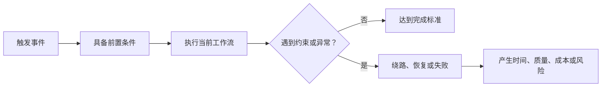

# 目标用户与使用场景

目标用户不是“可能使用产品的所有人”，而是在当前产品决策中共享关键任务、约束、风险或成功标准的一组角色；使用场景是这组角色在特定触发、环境和限制下完成任务的完整上下文。

## 前置知识与能力边界

开始前应先掌握：

- [用户、客户与角色](../00-foundations/02-user-customer-roles.md)；
- [目标、场景、痛点、需求、方案与功能](../00-foundations/03-goal-scenario-pain-need-solution-feature.md)；
- [JTBD、当前工作流与替代方案](../02-problem-evidence/13-jtbd-current-workflow-alternatives.md)；
- [频率、严重度、影响范围与证据可信度](../02-problem-evidence/14-frequency-severity-reach-confidence.md)。

本知识点解决两个决策问题：需求优先服务谁，以及需求在哪些条件下成立。它不直接决定界面方案，也不等于市场规模分析、画像制作或权限设计。

## 1. 目标用户的严格定义

一个可用于需求决策的目标用户分组必须同时具备：

1. 可识别：能够通过角色、行为、账户关系、任务或约束判断某个人是否属于该组；
2. 与决策相关：分组差异会改变问题严重度、成功标准、风险或方案；
3. 可获得证据：能找到行为、流程、数据、公开材料或低成本实验支持；
4. 有明确边界：知道哪些相似角色不在本轮范围内；
5. 可执行：工程、交互、运营和数据能把分组转化为规则、流程或指标。

“18–35 岁年轻人”“所有中小企业”“追求效率的人”通常不能直接指导需求。这些描述没有说明任务、触发、权限、频率和失败代价。

### 1.1 六种容易混淆的身份

| 身份 | 决策责任 | 账单导出 SaaS 示例 |
|---|---|---|
| 使用者 | 实际操作功能 | 财务专员 |
| 受益者 | 获得任务结果 | 财务主管、公司 |
| 客户 | 与供应方建立交易关系 | 签约企业 |
| 购买者 | 支付或控制预算 | 财务负责人 |
| 决策者 | 决定采购或续约 | CFO、采购委员会 |
| 管理员 | 配置账户、权限和策略 | IT 管理员 |

这些身份可以落在同一人身上，也可以完全分离。B2B 产品若只写“企业用户”，会遗漏审批、权限、采购和实际操作之间的冲突。

### 1.2 分组变量的优先级

优先使用会改变方案的变量：

- 任务：核对、审批、配置、查看、导出或恢复；
- 权限：只能查看、可编辑、可审批或可管理；
- 频率：每天多次、每月一次或一次性迁移；
- 数据规模：10 条、1 万条或跨多个组织；
- 错误代价：可撤销、影响账务、触发合规风险；
- 环境：桌面办公、移动现场、弱网或共享设备；
- 熟练度：首次使用、偶尔使用、专业高频使用；
- 组织关系：单人、团队协作、多租户或外部合作方。

年龄、地区、行业和公司规模只有在它们能解释上述差异时才进入分组。例如地区会改变税制与数据驻留要求，此时地区是有效约束；若只是为了让画像显得具体，则没有决策价值。

## 2. 使用场景的组成

完整场景不是一句“用户想导出账单”，而是以下字段的组合：

| 字段 | 要回答的问题 | 可观察证据 |
|---|---|---|
| 角色 | 谁执行，谁承担结果 | 权限表、岗位流程、账户记录 |
| 触发 | 为什么现在开始 | 截止日期、事件、通知、异常 |
| 目标 | 完成后得到什么进展 | 任务结果、交付物、业务结果 |
| 当前做法 | 现在怎样完成 | 操作日志、工作流、替代工具 |
| 前置条件 | 开始前必须具备什么 | 登录、数据、授权、依赖系统 |
| 环境 | 在什么设备和组织条件下 | 桌面、移动、弱网、时区、协作 |
| 约束 | 哪些限制不能忽略 | 时间、权限、法规、预算、技能 |
| 完成标准 | 怎样判断任务完成 | 文件生成、审批通过、对账一致 |
| 失败代价 | 失败造成什么后果 | 重工、损失、延误、合规风险 |
| 频率与规模 | 多久发生、处理多少对象 | 事件数、用户数、数据量 |

这些字段存在因果关系：触发使任务开始，前置条件决定能否进入，当前做法暴露成本，约束限制方案空间，完成标准定义验收，失败代价影响优先级和安全设计。



## 3. 从证据建立分组

### 3.1 先建立“任务—差异”表

不要先为角色取名字。先列出真实任务，再检查哪些差异会改变决策。

| 观察对象 | 核心任务 | 权限 | 频率 | 数据量 | 错误代价 |
|---|---|---|---|---|---|
| A | 月末批量核对 | 查看、导出 | 每月 | 5 万行 | 延误结账 |
| B | 查询单笔退款 | 查看 | 每天 | 1–5 条 | 客服响应慢 |
| C | 配置导出字段 | 管理 | 每季度 | 20 个字段 | 全团队数据错误 |

A、B 都可能叫“财务人员”，但任务、频率和数据规模不同，适合分成不同场景。A 与另一个行业的月末核对人员反而可能共享同一方案边界。

### 3.2 证据强度

可使用个人能够取得的材料，不要求先做访谈：

1. 直接行为：任务日志、产品埋点、错误日志、搜索词和导出记录；
2. 现行流程：操作手册、权限文档、工单、表格模板和审计要求；
3. 公开材料：帮助中心、Issue、评论、状态页、竞品文档和更新日志；
4. 主动实验：原型任务、假门、等待名单、问卷或小范围发布；
5. 推断：由多项证据支持但尚未直接验证的解释。

记录时把事实、推断和假设分开：

```text
事实：过去 90 天，63% 的导出发生在每月最后 3 个工作日。
事实：大于 20,000 行的导出失败率为 8.4%。
推断：月末批量核对是主要高风险场景。
假设：异步导出和完成通知可降低重复提交与失败。
待验证：用户能否接受 2 分钟内异步完成，而非立即下载。
```

### 3.3 判断是否需要拆分用户组

只有出现下列差异时拆分：

- 成功标准不同；
- 核心流程或权限不同；
- 问题频率、严重度或影响范围显著不同；
- 失败代价或合规约束不同；
- 需要互相冲突的方案；
- 指标不能用同一口径解释。

如果两个角色只是职位名称不同，但任务、约束和完成标准相同，应合并。过度分组会产生大量无法维护的画像和碎片化需求。

## 4. 应用案例一：月度账单导出

### 4.1 输入证据

- 过去 3 个月共有 2,400 次导出，1,510 次集中在月末；
- 20,000 行以上导出平均等待 74 秒，失败率 8.4%；
- 失败后 62% 的请求在 5 分钟内被重复提交；
- 权限文档显示财务专员能导出，管理员能配置字段；
- 工单中“下载没有反应”和“同一账单重复文件”重复出现。

### 4.2 候选分组

| 候选组 | 场景 | 是否本轮目标 | 理由 |
|---|---|---|---|
| 月末核对专员 | 批量导出并对账 | 是 | 高频集中、失败代价高、证据充分 |
| 客服人员 | 查询单笔账单 | 否 | 不需要批量导出，可用详情查询 |
| 系统管理员 | 配置字段 | 次级 | 影响配置，但不是本轮性能问题主体 |
| 企业负责人 | 查看汇总 | 否 | 需要报表而非原始文件 |

### 4.3 场景定义

```text
目标用户：拥有账单查看与导出权限的财务专员。
触发：月末结账，需要在当日完成平台账单与内部账本核对。
当前做法：筛选月份 → 点击导出 → 等待同步生成 → 下载 → 表格核对。
前置条件：账单已结算，用户有目标组织权限，筛选条件已确定。
环境：桌面浏览器；可能同时处理多个组织；月末请求集中。
约束：文件包含敏感财务数据；同一条件不能生成相互矛盾的快照。
完成标准：获得包含选定范围、生成时间和数据版本的完整文件。
失败代价：延迟结账、重复文件、人工比对错误或数据泄露。
```

### 4.4 由场景推导需求边界

场景支持：异步任务、进度状态、幂等提交、完成通知、权限复核、过期下载链接和数据快照标识。

场景不支持：自定义报表编辑器、移动端复杂表格、无限期保存导出文件。它们可能有价值，但不由当前证据推出。

### 4.5 验证

发布前用历史数据回放 1 万、5 万、20 万行三种规模；验证重复点击只创建一个逻辑任务；使用无权限账号访问下载链接应得到拒绝；跨月数据更新时文件必须带快照时间。灰度后比较大文件失败率、重复提交率、任务完成时间和下载成功率。

### 4.6 失败分支

如果异步导出成功率提高，但 40% 的用户在通知前重复创建新任务，说明状态反馈或任务可发现性仍有问题。此时不能只继续扩容；应检查任务列表、进度文案和通知到达率。

## 5. 应用案例二：团队审批功能

### 5.1 初始错误定义

“团队用户需要批量审批”把使用者、审批者和管理员混在一起，也没有说明何时批量、哪些对象可同时审批、错误后如何恢复。

### 5.2 证据与角色

- 普通成员提交费用；
- 直属主管审批本部门且单次通常少于 10 条；
- 财务复核跨部门费用，月末可能一次处理 300 条；
- 管理员配置审批规则但不处理费用；
- 合规要求高风险费用逐条确认并记录理由。

### 5.3 分组决策

“直属主管”和“财务复核员”都能审批，但批量规模、权限范围与失败代价不同。批量审批的首要目标用户是财务复核员；主管仍使用逐条或小批量流程。高风险费用从批量操作中排除。

### 5.4 完整场景

```text
当财务复核员在月末关闭账期前处理大量低风险费用时，
需要在跨部门数据中筛选规则一致的记录并批量审批，
同时确认自己仍拥有每条记录的权限，
系统必须逐条返回结果并保留审计证据，
不能把部分失败显示为整体成功。
```

### 5.5 方案取舍

| 方案 | 适用条件 | 成本与风险 |
|---|---|---|
| 全选后一次提交 | 对象同质、权限稳定 | 易误选；需要二次确认和逐条结果 |
| 按筛选条件后台处理 | 数据量大、处理较慢 | 筛选快照、取消和恢复更复杂 |
| 规则自动审批 | 规则稳定且可审计 | 错误影响范围大，需要灰度与守护指标 |

目标用户与场景限定后，当前可先实现“显式选择 + 低风险对象 + 逐条结果”。自动审批需要独立证据和风险评估。

### 5.6 失败注入

测试 100 条中 7 条权限在提交前撤销、3 条已被他人审批、2 条后端超时。结果页必须显示 88 条成功和 12 条未成功的具体原因；重试只提交仍可处理的失败项，不能重复审批成功项。

## 6. 方案比较中的使用方式

目标用户和场景不是 PRD 的装饰字段，而是方案比较的输入。

| 决策 | 场景提供的约束 |
|---|---|
| 页面还是后台任务 | 时长、数据量、中断与恢复 |
| 桌面还是移动优先 | 使用环境、设备和输入方式 |
| 默认值 | 高频路径、错误代价与可逆性 |
| 权限模型 | 角色、资源范围与操作风险 |
| 同步还是异步 | 完成时间、反馈与失败恢复 |
| 指标 | 任务完成标准和负面影响 |

同一功能在不同场景可能需要不同方案。现场巡检人员弱网拍照上传，需要离线队列和恢复；办公室管理员批量上传配置，需要预览、校验和审计。不能用一套“上传组件”掩盖任务差异。

## 7. 调试需求定义

当团队对目标用户存在争议时，按顺序检查：

1. 是否把购买者、使用者、管理员混为一组；
2. 分组差异是否真的改变方案；
3. 场景是否包含触发、当前做法、约束和完成标准；
4. 每个结论是否有证据，还是仅有职位标签；
5. 是否只研究正常流程而遗漏权限、失败和恢复；
6. 是否把“想要某功能”误写为用户问题；
7. 是否存在未被当前分组解释的反例；
8. 数据口径是否把同一用户、组织或事件重复计算。

### 可观测信号

- 不同角色在同一步骤的完成率和错误率；
- 任务频率、数据规模与耗时分布；
- 权限拒绝、取消、重试和人工绕路；
- 目标用户覆盖率与非目标用户误用率；
- 成功指标与守护指标的分组差异。

只看平均值可能隐藏关键场景。整体导出成功率 98%，不代表月末大文件成功率足够；应按角色、规模、时间窗和版本分段。

## 8. 常见失败模式

### 8.1 用人物故事替代证据

姓名、头像、爱好不能证明任务存在。保留会改变产品决策的行为和约束，其余删除。

### 8.2 先决定方案再寻找用户

“AI 自动审批的目标用户是谁”已经锁定方案。应先定义审批任务、成本和风险，再比较规则、批量操作或模型辅助。

### 8.3 目标用户无限扩张

为了扩大市场把所有相邻角色加入范围，会制造冲突的成功标准。使用主目标、次目标和明确非目标控制边界。

### 8.4 把高频等同于高价值

低频的合规申报失败代价可能远高于日常查看。频率必须与严重度、影响范围和战略目标共同判断。

### 8.5 忽略现有替代方案

用户没有使用本产品，不等于没有完成任务。表格、邮件、人工服务、竞品和不做都可能是替代方案；新方案必须解释转换成本。

### 8.6 分组进入敏感属性风险

不得为了个性化无目的收集敏感属性。需要判断合法目的、最小数据、权限、保留期和删除方式。影响资格、价格或机会的自动决策还需要独立合规与公平性审查。

## 9. 与其他模块的集成

- 需求优先级：目标组决定 Reach 的分母和 Impact 的含义；
- 交互设计：场景决定入口、状态、设备、默认值和恢复路径；
- 工程：角色与资源边界转化为服务端授权，不只隐藏按钮；
- 数据：事件必须包含合法且必要的角色/组织维度，避免直接上报敏感信息；
- 商业：购买者、使用者和决策者分离时，需要不同价值证明；
- 运营：高风险场景必须有支持、回滚和人工接管路径。

## 10. 可复用输出模板

```markdown
## 目标用户
- 主目标角色：
- 次目标角色：
- 明确非目标：
- 分组依据：任务 / 权限 / 频率 / 规模 / 风险：
- 证据及日期：

## 使用场景
- 触发：
- 用户目标：
- 当前做法与替代方案：
- 前置条件：
- 环境与协作关系：
- 约束：
- 完成标准：
- 失败代价：
- 频率与规模：

## 决策影响
- 由场景支持的需求：
- 不由当前证据支持的需求：
- 需要验证的假设：
- 成功指标：
- 守护指标：
```

## 11. 综合练习：定义批量导入的目标用户

选择一个具有批量导入能力的产品，完成：

1. 收集至少三类证据，包括真实使用记录或公开行为材料；
2. 列出使用者、受益者、购买者、决策者和管理员；
3. 建立不少于三个候选场景的任务—差异表；
4. 选定一个主目标场景，并写出两个明确非目标；
5. 推导同步/异步、权限、校验、失败恢复和审计边界；
6. 设计一个包含部分失败的验证；
7. 定义分组后的成功指标和守护指标；
8. 寻找一个无法被当前分组解释的反例并修订。

验收标准：其他人只读文档就能判断谁在什么条件下完成什么任务、哪些需求由证据推出、哪些被排除、如何验证；工程能据此识别授权与数据边界，交互能画出正常和失败流程，数据能定义可计算指标。

## 来源

- [GOV.UK Service Manual：Start by learning user needs](https://www.gov.uk/service-manual/user-research/start-by-learning-user-needs)（访问日期：2026-07-17）
- [GOV.UK Service Manual：Understanding users and their needs](https://www.gov.uk/service-manual/service-standard/point-1-understand-user-needs)（访问日期：2026-07-17）
- [GOV.UK Service Manual：Using data to improve your service](https://www.gov.uk/service-manual/measuring-success/using-data-to-improve-your-service-an-introduction)（访问日期：2026-07-17）
- [W3C WAI：Involving Users in Evaluating Web Accessibility](https://www.w3.org/WAI/test-evaluate/involving-users/)（访问日期：2026-07-17）
